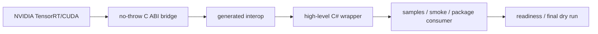

# TensorRtSharp4.0：把 TensorRT 和 CUDA 带进 .NET 工程化部署

> 文章类型：技术宣发长文
> 适合发布：微信公众号、技术博客、项目主页
> 配图建议：项目四层架构图、package/readiness 证据链截图、samples/smoke 目录结构截图
> 发布摘要：介绍 TensorRtSharp4.0 如何把 TensorRT/CUDA、C ABI bridge、高层 C# wrapper、NuGet runtime package 和 release evidence 串成一条可审计的 .NET GPU 推理工程链路。
> 公众号封面建议：深色 IDE 背景上叠加 `.NET`、`TensorRT`、`CUDA` 三段流程和一个小型 evidence checklist，避免使用 NVIDIA 官方标志作为主视觉。

## 为什么要做这个项目

很多 .NET 团队已经把业务系统、数据处理、桌面工具或服务端 API 建在 C# 上，但一旦进入 TensorRT 和 CUDA 部署，就经常被迫切到 C++ 或 Python。真正困难的地方不只是调用一个函数，而是把 engine build、runtime deserialize、tensor binding、CUDA memory、native assets、NuGet 分发和排障证据放进同一条工程链路。

TensorRtSharp4.0 的目标，就是让 .NET 用户可以用更稳定的对象模型使用 TensorRT/CUDA，同时保留 native ABI 的安全边界。它不是把 NVIDIA C++ API 逐个裸露给 C#，而是通过 C ABI bridge、generated interop、高层 wrapper、smoke/package gates 四层结构，把“能编译”“能打包”“能被消费”“能诊断失败”变成可审计的事实。

## 一句话定位

TensorRtSharp4.0 是一个面向 .NET 的 TensorRT/CUDA bridge 和高层封装项目，重点解决三类问题：

- 让 C# 项目可以构建、加载和执行 TensorRT engine。
- 让 CUDA memory、stream、event 等基础能力有托管封装。
- 让 NuGet/runtime package、native asset copy、package consumer 和 release readiness 有可复现证据。

## 项目架构

项目可以理解成四层：



| 层级 | 目录 | 作用 |
| --- | --- | --- |
| Native bridge | `native/` | 用 no-throw C ABI 包住 TensorRT/CUDA，避免 C++ ABI 直接泄漏到 C#。 |
| Generated interop | `src/*/Internal/Interop/Generated` | 从 manifest 生成 P/Invoke 入口和 catalog。 |
| High-level wrapper | `src/JYPPX.TensorRtSharp`、`src/JYPPX.CudaSharp` | 面向用户的 C# 类型、枚举、生命周期管理和诊断 API。 |
| Evidence gates | `smoke/`、`samples/`、`eng/`、`artifacts/` | 用构建、smoke、package consumer、readiness 证明功能边界。 |

这四层必须一起成立，才适合把一个能力称为“用户可用”。只有 manifest row 或 native entrypoint，并不代表 public wrapper 已经安全可用。

## 当前已经能做什么

当前更适合作为入门体验的路径包括：

1. `samples/Inference/01.Bindings`
   - 构建一个最小 identity network。
   - 设置 tensor address。
   - enqueue 并读取输出。

2. `samples/Inference/02.DynamicShapes`
   - 创建 optimization profile。
   - 设置 runtime shape。
   - 验证 dynamic batch 的输入输出。

3. `applications/OnnxToEngine`
   - 使用 ONNX parser。
   - 构建 serialized engine。
   - 反序列化并进行 round-trip。

4. `samples/Performance/01.MultiStream`
   - 使用 CUDA stream/event。
   - 演示跨 stream ordering。

5. `smoke/PluginRegistryInventorySmokeRunner`
   - 查询 plugin registry 是否存在。
   - 读取 creator count、name、version、namespace 等只读信息。

## 发布证据怎么看

TensorRtSharp4.0 不只看“源码能 build”。当前 release readiness 会汇总：

- managed package 是否生成。
- runtime package 是否存在。
- bridge package 是否可被 consumer 加载。
- native assets 是否复制到消费端输出目录。
- package consumer 是否 restore/build。
- local feed consumer 是否禁止 `ProjectReference`。
- runtime smoke 是否运行，或者被环境阻塞。
- real callback runtime proof 是否成立。

当前 `win-x64-trt11.0-cuda13.2-cudnn9.22` 的状态是一个很好的例子：

```text
overallStatus=ready-needs-manual-approval
packageConsumerSmokeStatus=blocked-by-cuda-driver
allowRuntimeSmokeBlocked=True
realCallbackRuntimeProof=False
```

这说明 package/readiness 证据已经可用，但当前机器的 CUDA driver/runtime 不兼容 CUDA 13.2 runtime smoke。这个状态不是 API 缺失，也不是 smoke passed；它是一个需要换兼容 GPU/driver 环境复测的外部环境边界。

## 真实边界同样重要

项目已经从“missing 接口清零”进入 deferred 边界提升阶段。这里有一个关键判断：

> manifest/source 100% 匹配，不等于 100% runtime 可用。

尤其是 callback、allocator、debug listener、borrowed pointer 和跨语言 ownership API，必须非常谨慎。当前只有在 full package consumer 输出 `InvocationCount>0` 且 `IsRealCallbackRuntimeProof=True` 后，才能把真实 callback runtime proof 写成完成。

## 用户应该从哪里开始

推荐顺序：

```powershell
dotnet build .\TensorRtSharp.sln -c Debug --no-restore
dotnet run --project .\samples\Inference\01.Bindings\InferenceBindings.csproj -c Debug
dotnet run --project .\samples\Inference\02.DynamicShapes\DynamicShape.csproj -c Debug
dotnet run --project .\applications\OnnxToEngine\OnnxToEngine.csproj -c Debug
```

如果你在评估 NuGet/runtime package，则优先看：

```powershell
pwsh -NoProfile -ExecutionPolicy Bypass -File .\eng\Test-PackageConsumer.ps1 `
  -RuntimePackageKey win-x64-trt11.0-cuda13.2-cudnn9.22 `
  -RunSmoke `
  -AllowSmokeFailure
```

输出重点不是只看 passed，而是看 native assets、smoke classification、diagnostic 和 real callback proof 字段。

## 常见误区

- 不要把 `readiness blockers: 0` 理解为所有 GPU runtime smoke 已通过。
- 不要把 `blocked-by-cuda-driver` 写成 smoke passed。
- 不要把 dependency probe 写成 runtime execution proof。
- 不要把 callback design gate 写成真实 callback proof。
- 不要把 Linux handoff/template 写成 Linux runner proof。

## 适合哪些团队

TensorRtSharp4.0 适合：

- 已经以 .NET 为主栈，又需要 TensorRT/CUDA 部署的团队。
- 希望通过 NuGet/runtime package 分发 native dependency 的团队。
- 希望把 GPU 推理能力纳入 CI、smoke、release readiness 的工程团队。
- 需要明确排障路径的团队，例如 DLL missing、application control、CUDA error 35、driver/runtime mismatch。

## 总结

TensorRtSharp4.0 的价值不只是“C# 调 TensorRT”。它真正要解决的是工程化部署：ABI 边界、对象生命周期、跨版本 guard、NuGet 包、native assets、smoke、readiness、release owner 决策和真实 proof。这个方向比单纯包一层 P/Invoke 更慢，但更适合长期维护和发布。

如果你正在评估这个项目，建议先从不依赖外部模型资产的三个样例开始：`InferenceBindings`、`DynamicShape`、`OnnxToEngine`。它们能最快暴露本机 TensorRT/CUDA 依赖、driver/runtime 兼容性和 package consumer evidence 的真实状态。

下一篇可以继续读：

- [NuGet 消费端验证全流程](nuget-package-consumer-validation-flow.md)
- [最终发布 Dry Run](final-release-dry-run.md)
- [Linux Runner Evidence Record Schema](linux-runner-evidence-record-schema.md)
