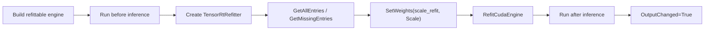

# Refit Weights 博客版：结构不变时如何更新 TensorRT 权重

> 文章类型：高级主题长文
> 适合发布：微信公众号、技术博客、模型部署调优文章
> 配图建议：engine 固定拓扑、refitter 枚举可替换权重、设置新 scale weights、再次执行 inference 的闭环图。
> 发布摘要：基于 `smoke/RefitWeightsSmokeRunner` 说明 TensorRtSharp4.0 如何在 engine 结构固定时使用 TensorRT refitter 更新权重，并用 before/after 输出验证 refit 路径。

## Refit 解决什么问题

有些场景下，模型拓扑不变，只需要替换少量权重。例如同一网络结构下做 A/B 权重测试，或者验证某个 refit role 是否能被 TensorRT 接受。Refit 的好处是不用重新 parser/build 整个 network；限制是它不能改变 layer 拓扑、tensor rank、shape 或 dtype 语义。

## Smoke 里的最小网络

`RefitWeightsSmokeRunner` 构建一个 scale network：

```text
input -> Scale(layer=scale_refit) -> output
```

初始 scale 为 `1.0`，refit 后 scale 为 `2.0`。因此同一组输入在 refit 前后应分别匹配：

```text
Before = input
After = input * 2
```



## 运行命令

```powershell
dotnet build .\TensorRtSharp.sln -c Debug --no-restore /p:UseSharedCompilation=false
$env:JYPPX_ENABLE_DEVELOPMENT_PROBING = "1"
dotnet .\smoke\RefitWeightsSmokeRunner\bin\Debug\net8.0\RefitWeightsSmokeRunner.dll --tensor-rt-line 10
```

如果只想检查 native dependency：

```powershell
dotnet run --project .\smoke\RefitWeightsSmokeRunner\RefitWeightsSmokeRunner.csproj -- --dependency-probe-only --tensor-rt-line 10
```

## 关键 evidence

```text
Engine Refittable=True
RefitEntries All=... Missing=...
RefitWeights Set=True Refit=True Before=[...] After=[...] OutputChanged=True
```

这些输出证明 refitter 找到了可替换 entry、成功设置权重并完成 refit，且 inference 输出发生预期变化。

## 诊断能力

runner 还会探测：

- refitter error recorder snapshot。
- missing/all named weights。
- engine inspector layer information。
- logger/error recorder presence。

这些都是 copied diagnostics，不暴露 TensorRT 内部 error recorder pointer。

## 边界

Refit ready 不等于所有模型都支持 refit。真实模型还需要：

- engine 构建时启用 refit flag。
- 目标 layer/role 被 TensorRT 标记为可 refit。
- 权重 shape/dtype 与原始 role 匹配。
- 自己的 sample 或 package consumer evidence。

它也不证明 callback runtime proof、Linux runner proof 或 CUDA 13.2 runtime smoke passed。

## CTA

如果你要把 refit 用在真实模型上，先用本文 smoke 验证 refitter 路径，再为目标模型记录可 refit entry、权重来源、更新前后校验和和 inference 输出差异。

## 第二批正文门禁

### 适用读者

本文适合需要解释 TensorRT refitter 能力边界的部署工程师，也适合准备把 refit smoke 扩展成真实模型教程的维护者。

### 解决问题

Refit 的常见误区是把“能枚举 refittable weights”理解为“任意模型都能安全热替换”。本文解决如何用最小 scale network 证明 refitter API 可达、如何用 before/after 输出证明权重变化生效、如何保留真实模型 proof 边界。

### 核心思路

核心思路是把 refit 拆成三段：构建 refittable engine、枚举和设置新 weights、重新执行 inference 并比较 before/after。只有第三段在真实兼容主机上产生可验证输出，才可能成为 runtime proof 的一部分。

### 操作路径

运行 `smoke/RefitWeightsSmokeRunner`，记录初始输出、refit 后输出、refitter entry、role、dtype、count 和 layer name。真实模型场景还必须保存 stdout/stderr summary、engine hash、host metadata 和 validator 结果。

### 边界说明

build-only、dry-run、template、local feed、ProjectReference、direct `.nupkg`、TensorRtExec report、YoloVision matrix、OnnxToEngine report、readonly diagnostics 都不是 runtime proof。没有真实模型 proof 输入时，本文保持为高级主题教程，不升级为 release close evidence。

### 下一步

下一步可以扩展一篇真实模型 refit 教程：选择许可证清晰的小模型，记录模型来源、权重来源、输入资产和输出对比。
