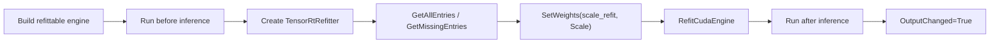
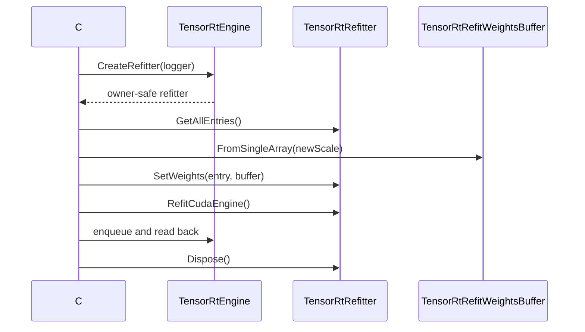

# Refit Weights 博客版：结构不变时如何更新 TensorRT 权重

> 文章类型：高级主题长文
> 适合发布：微信公众号、技术博客、模型部署调优文章
> 配图建议：engine 固定拓扑、refitter 枚举可替换权重、设置新 scale weights、再次执行 inference 的闭环图。
> 发布摘要：基于 `smoke/RefitWeightsSmokeRunner` 说明 TensorRtSharp4.0 如何在 engine 结构固定时使用 TensorRT refitter 更新权重，并用 before/after 输出验证 refit 路径。

## Refit 解决什么问题

有些场景下，模型拓扑不变，只需要替换少量权重。例如同一网络结构下做 A/B 权重测试，或者验证某个 refit role 是否能被 TensorRT 接受。Refit 的好处是不用重新 parser/build 整个 network；限制是它不能改变 layer 拓扑、tensor rank、shape 或 dtype 语义。

## Smoke 里的最小网络

`RefitWeightsSmokeRunner` 构建一个 scale network：

```text
input -> Scale(layer=scale_refit) -> output
```

初始 scale 为 `1.0`，refit 后 scale 为 `2.0`。因此同一组输入在 refit 前后应分别匹配：

```text
Before = input
After = input * 2
```



## 运行命令

```powershell
dotnet build .\TensorRtSharp.sln -c Debug --no-restore /p:UseSharedCompilation=false
$env:JYPPX_ENABLE_DEVELOPMENT_PROBING = "1"
dotnet .\smoke\RefitWeightsSmokeRunner\bin\Debug\net8.0\RefitWeightsSmokeRunner.dll --tensor-rt-line 10
```

如果只想检查 native dependency：

```powershell
dotnet run --project .\smoke\RefitWeightsSmokeRunner\RefitWeightsSmokeRunner.csproj -- --dependency-probe-only --tensor-rt-line 10
```

## 关键 evidence

```text
Engine Refittable=True
RefitEntries All=... Missing=...
RefitWeights Set=True Refit=True Before=[...] After=[...] OutputChanged=True
```

这些输出证明 refitter 找到了可替换 entry、成功设置权重并完成 refit，且 inference 输出发生预期变化。

## 诊断能力

runner 还会探测：

- refitter error recorder snapshot。
- missing/all named weights。
- engine inspector layer information。
- logger/error recorder presence。

这些都是 copied diagnostics，不暴露 TensorRT 内部 error recorder pointer。

## 边界

Refit ready 不等于所有模型都支持 refit。真实模型还需要：

- engine 构建时启用 refit flag。
- 目标 layer/role 被 TensorRT 标记为可 refit。
- 权重 shape/dtype 与原始 role 匹配。
- 自己的 sample 或 package consumer evidence。

它也不证明 callback runtime proof、Linux runner proof 或 CUDA 13.2 runtime smoke passed。

## CTA

如果你要把 refit 用在真实模型上，先用本文 smoke 验证 refitter 路径，再为目标模型记录可 refit entry、权重来源、更新前后校验和和 inference 输出差异。

## 第二批正文门禁

### 适用读者

本文适合需要解释 TensorRT refitter 能力边界的部署工程师，也适合准备把 refit smoke 扩展成真实模型教程的维护者。

### 解决问题

Refit 的常见误区是把“能枚举 refittable weights”理解为“任意模型都能安全热替换”。本文解决如何用最小 scale network 证明 refitter API 可达、如何用 before/after 输出证明权重变化生效、如何保留真实模型 proof 边界。

### 核心思路

核心思路是把 refit 拆成三段：构建 refittable engine、枚举和设置新 weights、重新执行 inference 并比较 before/after。只有第三段在真实兼容主机上产生可验证输出，才可能成为 runtime proof 的一部分。

### 操作路径

运行 `smoke/RefitWeightsSmokeRunner`，记录初始输出、refit 后输出、refitter entry、role、dtype、count 和 layer name。真实模型场景还必须保存 stdout/stderr summary、engine hash、host metadata 和 validator 结果。

### 边界说明

build-only、dry-run、template、local feed、ProjectReference、direct `.nupkg`、TensorRtExec report、YoloVision matrix、OnnxToEngine report、readonly diagnostics 都不是 runtime proof。没有真实模型 proof 输入时，本文保持为高级主题教程，不升级为 release close evidence。

### 下一步

下一步可以扩展一篇真实模型 refit 教程：选择许可证清晰的小模型，记录模型来源、权重来源、输入资产和输出对比。

## 从对象生命周期看 Refit

Refit 不是在原 network 上继续编辑，而是围绕已经构建好的 engine 创建一个短生命周期 refitter。
`TensorRtEngine` 必须比 `TensorRtRefitter` 活得更久，新权重缓冲区至少覆盖 `SetWeights` 调用，执行上下文则应在
refit 完成后重新用于校验。仓库把这条顺序写进 `src/JYPPX.TensorRtSharp/Refit/TensorRtRefitter.cs` 和
`smoke/RefitWeightsSmokeRunner/Program.cs`，用户无需保存原生 refitter 指针。



这里有三个容易忽略的约束：

1. `GetAllEntries()` 返回复制后的 `TensorRtRefitEntry` 列表，entry 的 layer name 与 role 是查找键，不是 borrowed pointer。
2. `SetWeights(TensorRtRefitEntry, TensorRtRefitWeightsBuffer)` 会复用 entry 中的名称与 role，但不会替调用者猜测 dtype 或元素个数。
3. `RefitCudaEngine()` 返回 true 只表示 TensorRT 接受了本次 refit；最终仍要用相同输入执行前后对比。

## 一步步读最小案例

runner 在 build config 上启用 refit，再创建名为 `scale_refit` 的 scale layer。第一次执行得到 `before`，随后：

```csharp
using TensorRtRefitter refitter = engine.CreateRefitter(logger);
IReadOnlyList<TensorRtRefitEntry> allEntries = refitter.GetAllEntries();
IReadOnlyList<TensorRtRefitEntry> missingEntries = refitter.GetMissingEntries();

TensorRtRefitEntry scaleEntry = allEntries.Single(entry =>
    entry.LayerName == "scale_refit" &&
    entry.Role == TensorRtWeightsRole.Scale);

using TensorRtRefitWeightsBuffer scaleWeights =
    TensorRtRefitWeightsBuffer.FromSingleArray(new[] { 2.0f });
bool weightsSet = refitter.SetWeights(scaleEntry, scaleWeights);
bool refitted = refitter.RefitCudaEngine();
```

这段示例刻意先枚举、再选择，不把 layer name 或 role 当成猜测值。真实模型中同名 entry、不同 role、动态范围和
plugin-owned weights 都可能使选择更复杂；应把完整 entry 列表保存到报告，再由模型 owner 确认目标。

## 可复核运行目录

源码和日志都留在 E 盘，避免把运行资产散落到系统盘：

```powershell
$repo = "E:\GitSpace\TensorRT-CSharp-API-4.0\TensorRtSharp4.0"
$case = "E:\TensorRtSharpAssets\cases\refit-scale-smoke"
New-Item -ItemType Directory -Force -Path "$case\logs" | Out-Null
Set-Location $repo

dotnet build .\smoke\RefitWeightsSmokeRunner\RefitWeightsSmokeRunner.csproj `
  -c Debug --no-restore --nologo
$env:JYPPX_ENABLE_DEVELOPMENT_PROBING = "1"
dotnet .\smoke\RefitWeightsSmokeRunner\bin\Debug\net8.0\RefitWeightsSmokeRunner.dll `
  --tensor-rt-line 10 2>&1 | Tee-Object "$case\logs\trt10-refit.log"
```

TRT8、TRT10、TRT11 必须分别运行并分别保存日志，不能把 TRT10 的结果投影成其他 line 已通过。TRT11 还有
`TensorRtRefitter.RefitCudaEngineAsync(CudaStream)` 等受版本约束的控制面；本文的同步最小案例不据此宣称异步路径已验证。

## 输出逐项解释

| 输出 | 可以证明 | 不能证明 |
| --- | --- | --- |
| `Engine Refittable=True` | engine 带 refit 能力 | 任意权重都可替换 |
| `RefitEntries All=...` | copied entry 枚举可用 | entry 与业务目标匹配 |
| `Missing=0` | 当前必需 entry 已设置 | 输出数值正确 |
| `Set=True Refit=True` | set/refit 调用返回成功 | 真实模型精度不变 |
| `OutputChanged=True` | 最小案例 before/after 符合预期 | package consumer 已通过 |

如果输出含 `Skipped=True`，先读取同一行的 `Reason`。dependency probe、runtime adapter 不可用或 CUDA driver
不兼容都应保持 blocked/skipped 分类，不能改写成通过。`TryGetErrorRecorderSnapshot` 返回的 copied records 用于解释
失败，但 snapshot 自身不是成功证据。

## 真实模型接入清单

- 记录原始 model/engine SHA256、TensorRT line、CUDA 版本、GPU 与 driver。
- 记录 engine 构建时的 refit flag，以及全部 `TensorRtRefitEntry`。
- 对新权重记录来源、许可证、dtype、shape、元素个数与 SHA256。
- 保存 `GetMissingEntries()` 的 before/after、`SetWeights` 与 refit 返回值。
- 使用同一输入分别执行 before/after，保存原始 tensor 和业务容差。
- 失败时保存 copied error recorder、stdout/stderr 与退出码。
- 在 clean package consumer 中重跑后，才讨论 package-consumer-runtime proof。

## 常见失败定位

**找不到 entry**：确认 engine 构建时启用了 refit，并核对 layer name/role；ONNX 节点名不一定等于 TensorRT layer name。

**`SetWeights` 返回 false**：优先检查 dtype、元素数和 role，随后查看 `TensorRtRefitterDiagnosticSnapshot`，不要反复尝试不匹配的裸缓冲区。

**refit 成功但输出不变**：确认替换的是实际参与输出的 entry、输入不全为零，并核对 after inference 使用的是同一个 engine。

**本机通过、consumer 失败**：比对 runtime package key、TensorRT/CUDA DLL 来源、架构和 probing 路径，再运行
`eng/Test-PackageConsumer.ps1`。本地 ProjectReference 结果不能替代 clean consumer。

## 发布边界与延伸阅读

本文证明的是仓库最小 refit 使用路径和证据采集方法，不执行发布，也不批准 release close。当前仍保持
`performsPublish=false`、`canPublishPublicly=false`、`canCloseReleaseIssue=false`。

继续阅读：[Refit 基础指南](refit-weights-guide.md)、[TensorRT 对象模型](tensorrt-object-model.md) 与
[Package consumer runtime proof 手册](package-consumer-runtime-proof-playbook.md)。
