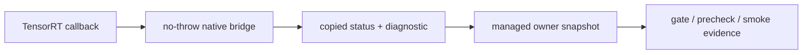

# Callback 与 Allocator 边界指南

本文解释为什么 TensorRtSharp4.0 对 callback、allocator、DebugListener 和 OutputAllocator 采取分阶段提升策略。目标是让用户知道哪些能力可以安全使用，哪些仍是 design gate、precheck 或 schema，而不是 runtime proof。

## 为什么谨慎

TensorRT callback 类接口通常跨越三个边界：

- TensorRT native object 生命周期。
- C ABI no-throw bridge。
- C# delegate、GC、pinning 和 dispose/drain 状态机。

如果直接把 native callback owner 或 borrowed tensor/output buffer pointer 暴露给 public API，用户很容易遇到悬空指针、重复释放、异常跨 ABI、in-flight callback dispose 等问题。

## 当前可安全引用的证据

当前仓库中有大量 callback/allocator 相关类型，但它们多数是：

- owner design gate。
- attach/detach design gate。
- borrowed pointer safety gate。
- native no-throw vtable scaffold。
- runtime proof precheck。
- real callback evidence schema。

它们的共同点是复制诊断状态，不把 native pointer 交给用户，也不声称真实 TensorRT runtime 已经触发 callback。

## 真实 proof 的唯一晋级条件

真实 callback runtime proof 必须来自 full package consumer smoke，并满足：

- `EvidenceKind=real-callback-runtime`
- `RuntimeEvidenceKind=real-callback-runtime`
- `RealCallbackRuntime=True`
- `IsRealCallbackRuntimeProof=True`
- `InvocationCount>0`
- `FailureCount=0`
- `InFlightCallbackCount=0`
- full package consumer report 可追溯

如果 `InvocationCount=0`，即使 attach 尝试发生，也只能是 attempted/no-invocation 或 blocked 状态。

## 不要误读

以下状态都不是 proof：

- schema-ready。
- precheck ready。
- design gate ready。
- native vtable install preflight。
- dependency probe。
- package restore/build/native-copy。
- `blocked-by-cuda-driver`。
- `InvocationCount=0`。

## 用户应该怎么做

普通用户当前建议使用：

- logger、builder、config、network、runtime、engine、execution context 等稳定 wrapper。
- Plugin Inventory 只读 API。
- package consumer 和 smoke runner 检查部署环境。
- callback/allocator gate 文档作为风险边界说明。

需要 callback/allocator 真实 runtime 行为的用户，应等待对应 full package consumer proof 完成，或在受控分支中提供完整 native owner、no-throw vtable、detach-before-release、borrowed pointer copy-out 和 `InvocationCount>0` evidence。
## 统一 Readiness Snapshot

`TensorRtCallbackAllocatorReadinessSnapshot` 是 callback / allocator 安全面的统一 managed readiness 汇总。它消费已有的 `TensorRtAllocatorLedgerSafetyGateResult`、`TensorRtOutputAllocatorRuntimeProofPrecheckResult` 和 `TensorRtDebugListenerRuntimeProofPrecheckResult`，只聚合已经复制到 C# 的 gate / precheck 证据，不调用 TensorRT，不接管 native owner，也不暴露 `IntPtr` / `nint`。

该 snapshot 解决的问题是：用户和发布门禁可以一次性看到 logger、profiler、progress monitor、allocator owner dry-run、allocator ledger safety gate、OutputAllocator owner/precheck、DebugListener owner/no-throw/precheck 的 managed readiness 状态。它的 `IsPublishSafeForManagedCallbacks` 只表示 managed wrapper 与 pointer-free gate 具备发布安全性；`IsRuntimeInvocationProofComplete` 才表示真实 runtime invocation proof 是否完成。

当前阶段必须保持边界清晰：`TensorRtCallbackAllocatorReadinessSnapshot` 的 `RealCallbackRuntime` 与 `IsRealCallbackRuntimeProof` 仍为 `false`，`RuntimeProofBlocked` 和 `BlockedReasonCount` 用来解释为什么真实 TensorRT callback runtime proof 仍未完成。它不能作为真实 TensorRT callback runtime proof，也不能替代 package consumer 在兼容主机上触发 allocator、output allocator 或 debug listener callback 的证据。

## ExecutionContext Safe-Control Summary

`TensorRtExecutionContextCallbackAllocatorSafeControlSummary` 是面向单个 output tensor 的高层 C# 摘要。它调用 `GetCallbackAllocatorSafeControlSummary(outputTensorName)` 聚合 output allocator、temporary-storage allocator 与 debug listener 的 copied metadata only 查询结果，并把 `CopiedInterfaceInfoCount`、`DiagnosticCount`、`PointerFreeSurfaceReady`、`CallbackInvocationAttempted=False` 和 `IsRuntimeInvocationProofComplete=False` 放在同一个 pointer-free 对象里。

这个 summary 的作用是减少 smoke 与 package consumer 反复读取多个低层方法的成本：它只读现有 `TryGetOutputAllocatorInterfaceInfo`、`TryGetTemporaryStorageAllocatorInterfaceInfo`、`TryGetDebugListenerInterfaceInfo` 和 `GetCallbackStateSnapshot` 的 copy-out 结果。它不会暴露或拥有 borrowed pointer，不会执行 callback invocation，也不能作为真实 TensorRT callback runtime proof。

## Callback Owner Closure Matrix

`TensorRtCallbackOwnerClosureMatrix` / `TensorRtCallbackOwnerClosureMatrixResult` 是比 managed readiness 更细的一层 owner 闭环矩阵。它把 `GpuAllocator`、`GpuAsyncAllocator`、`OutputAllocator`、`DebugListener` 和 `StreamReaderWriter` 放到同一张 pointer-free 表中，逐列记录 managed owner state、SafeHandle/GCHandle keep-alive、native noncopyable owner storage、create/destroy 对称性、attach/detach/clear、detach-before-release、no-throw destructor、no-throw vtable、exception-to-status、in-flight accounting、borrowed pointer escape blocker、opt-in runtime smoke readiness 和 package-consumer proof requirement。

该矩阵输出 `RuntimeEvidenceKind=closure-matrix`、`RealCallbackRuntime=False`、`IsRealCallbackRuntimeProof=False`、`PackageConsumerRuntimeProofRequired`、`PackageConsumerRuntimeProofReady`、`RuntimeProofBlocked` 和 `DeferredRowsStillRequired`。它用于减少重复翻阅单个 gate 文件，但不能作为真实 TensorRT callback runtime proof。
