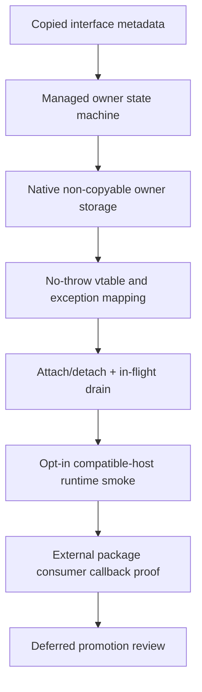
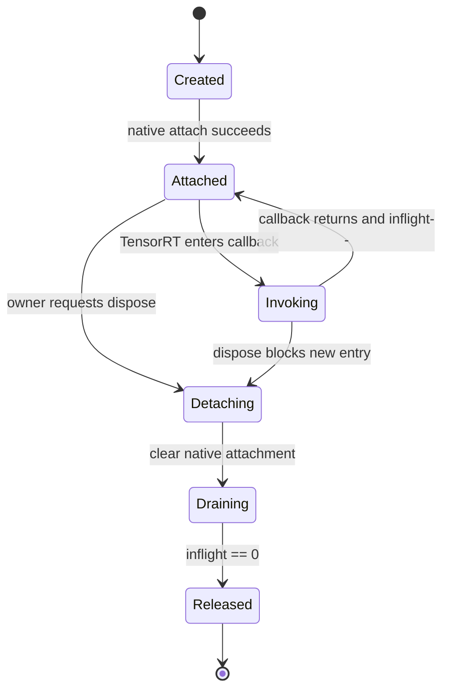

# Callback 与 Allocator 安全桥接路线：从 Pointer-Free Readiness 到真实 Runtime Proof

## 写在前面

TensorRT callback 不是普通的 P/Invoke 函数。

普通函数调用在返回后通常结束跨语言关系；callback 会把一个可长期存活的对象、vtable、managed delegate、线程切换、borrowed pointer 和释放顺序同时带入 native runtime。任何一个生命周期环节模糊，都可能表现为随机崩溃、double free、回调进入已释放 delegate、异常穿过 C ABI，或者 device memory 在仍被 TensorRT 使用时提前释放。

因此 TensorRtSharp4.0 不以“manifest 里有入口”作为 callback 完成标准。本文给出从 copied metadata、managed owner、native no-throw vtable、attach/detach、in-flight accounting 到真实 package consumer invocation proof 的完整路线，并说明为什么 direct callback rows 当前仍必须保留 deferred history。

## 适用读者

- 设计 C++/C# callback bridge 的维护者。
- 审核 allocator、output allocator、debug listener 或 stream reader/writer 生命周期的 reviewer。
- 需要理解 managed readiness 与 real callback runtime proof 差异的 release owner。
- 排查 callback dispose、native vtable、device pointer 和 stream ordering 问题的工程师。

## 解决问题

本文解决：

1. callback 为什么不能直接暴露 `IntPtr`/nint。
2. 当前仓库已有哪几层安全组件。
3. 五个 callback family 分别缺什么。
4. TRT8/TRT10/TRT11 应如何独立 guard。
5. native/managed owner 如何建立对称生命周期。
6. 真实 callback invocation proof 要记录哪些字段。
7. 哪些 evidence 只能保持 managed readiness，不能移除 deferred。

## 背景与场景

TensorRT callback family 包括：

- `IGpuAllocator`；
- `IGpuAsyncAllocator`；
- `IOutputAllocator`；
- `IDebugListener`；
- `IStreamReader` / `IStreamReaderV2` / `IStreamWriter`；
- logger、profiler、progress monitor 等已采用独立受控 wrapper 的 callback。

这些 family 的共同难点不是“能否声明一个 delegate”，而是 runtime 是否在 owner 存活期间真实调用它，以及 callback 返回后 native/managed/device 状态是否仍满足 TensorRT 合同。

## 当前结论

当前 pointer-free managed readiness 已经形成多个可调用诊断面，但 real callback runtime proof 仍未闭环：

- closure matrix 有 5 个 family；
- closure-ready family 当前为 0；
- runtime-proof-attempt-ready family 当前为 0；
- package-consumer-runtime-proof-ready family 当前为 0；
- execution pack 仍缺 14 类 owner 输入；
- `DeferredRowsStillRequired=true`；
- callback execution pack 保持 `blocked-owner-action-required`。

这个结论并不表示所有 callback 代码都是空白。它表示“安全组件存在”与“真实 TensorRT runtime invocation 已证明”之间仍有未完成的列。

## 六层证据模型



任何一层缺失都不能跳到 H。

### 各层能证明什么

| 层 | 能证明 | 不能证明 |
| --- | --- | --- |
| copied metadata | interface/version/diagnostic 可安全复制 | callback 已安装 |
| managed owner | delegate/状态/释放逻辑可审计 | native vtable 正确 |
| native owner | storage/create/destroy 对称 | TensorRT 已调用 |
| no-throw vtable | exception 不穿 ABI | device pointer ownership 正确 |
| attach/detach | lifecycle ordering 可控 | runtime invocation 已发生 |
| runtime smoke | 指定 callback 在兼容主机被调用 | package consumer route 成立 |
| package proof | 指定 package/key/host callback 闭环 | 所有版本/family 都已完成 |

## 为什么 Public API 不暴露裸指针

以下 API 形状不可接受：

```csharp
// 仅用于说明禁止形状，不是仓库 API。
public IntPtr Alloc(ulong size);
public void InstallCallback(IntPtr callback);
public nint DebugTensor { get; }
```

问题包括：

- 调用方不知道谁释放；
- device/host/borrowed pointer 语义丢失；
- 无法阻止 owner dispose 后继续调用；
- 无法表达 stream 关联和 in-flight 状态；
- SafeHandle 也不能自动解决 borrowed/device pointer 所有权。

公开面应返回 copied scalar/string/array、owner-scoped token、只读 snapshot 或有明确 dispose 语义的高层 owner。

## 当前代码与文件入口

### Pointer-free aggregation

- `src/JYPPX.TensorRtSharp/Callbacks/MemoryAllocation/TensorRtCallbackAllocatorReadiness.cs`
- `src/JYPPX.TensorRtSharp/Execution/TensorRtExecutionContextCallbackAllocatorSafeControlSummary.cs`
- `src/JYPPX.TensorRtSharp/Callbacks/Core/TensorRtCallbackOwnerClosureMatrix.cs`：只保留五个 family 的 Evaluate 顺序。
- `src/JYPPX.TensorRtSharp/Callbacks/Core/TensorRtCallbackOwnerClosureMatrix.Allocators.cs`
- `src/JYPPX.TensorRtSharp/Callbacks/Core/TensorRtCallbackOwnerClosureMatrix.OutputDebug.cs`
- `src/JYPPX.TensorRtSharp/Callbacks/Core/TensorRtCallbackOwnerClosureMatrix.StreamIo.cs`
- `src/JYPPX.TensorRtSharp/Callbacks/Core/TensorRtCallbackOwnerClosureMatrix.RowConstruction.cs`
- `src/JYPPX.TensorRtSharp/Callbacks/Core/TensorRtCallbackOwnerClosureMatrix.Blockers.cs`
- `src/JYPPX.TensorRtSharp/Callbacks/Core/TensorRtCallbackOwnerClosureMatrixRow.cs` 与 `TensorRtCallbackOwnerClosureMatrixResult.cs`
- `src/JYPPX.TensorRtSharp/Execution/TensorRtExecutionContext.Readiness.cs`

### Owner and precheck

- `src/JYPPX.TensorRtSharp/Callbacks/MemoryAllocation/TensorRtAllocatorCallbackOwner.cs`：只保留 owner state、constructor 与 properties。
- `src/JYPPX.TensorRtSharp/Callbacks/MemoryAllocation/TensorRtAllocatorCallbackOwner.Lifecycle.cs`
- `src/JYPPX.TensorRtSharp/Callbacks/MemoryAllocation/TensorRtAllocatorCallbackOwner.ManagedDryRun.cs`
- `src/JYPPX.TensorRtSharp/Callbacks/MemoryAllocation/TensorRtAllocatorCallbackOwner.NativeDryRun.cs`
- `src/JYPPX.TensorRtSharp/Callbacks/MemoryAllocation/TensorRtAllocatorCallbackOwner.StateLedger.cs`
- `src/JYPPX.TensorRtSharp/Callbacks/MemoryAllocation/TensorRtAllocatorCallbackOwner.InternalPrototype.cs`
- `src/JYPPX.TensorRtSharp/Callbacks/MemoryAllocation/TensorRtAllocatorCallbackOwner.ResultMapping.cs`
- `src/JYPPX.TensorRtSharp/Callbacks/MemoryAllocation/TensorRtAllocatorDryRunRequest.cs` 与同目录的 result/snapshot/delegate model 文件。
- `src/JYPPX.TensorRtSharp/Callbacks/MemoryAllocation/TensorRtAllocatorLedgerSafetyGate.cs` 与
  `TensorRtAllocatorLedgerSafetyGateResult.cs`
- `src/JYPPX.TensorRtSharp/Callbacks/MemoryAllocation/TensorRtAllocatorInterfaceInfoDesignGate.cs` 与
  `TensorRtAllocatorInterfaceInfoDesignGateResult.cs`
- `src/JYPPX.TensorRtSharp/Callbacks/MemoryAllocation/TensorRtOutputAllocatorCallbackOwner.cs`：只保留 owner state、constructor 与 properties。
- `src/JYPPX.TensorRtSharp/Callbacks/MemoryAllocation/TensorRtOutputAllocatorCallbackOwner.DesignDiagnostic.cs`
- `src/JYPPX.TensorRtSharp/Callbacks/MemoryAllocation/TensorRtOutputAllocatorCallbackOwner.Snapshots.cs`
- `src/JYPPX.TensorRtSharp/Callbacks/MemoryAllocation/TensorRtOutputAllocatorCallbackOwner.Lifecycle.cs`
- `src/JYPPX.TensorRtSharp/Callbacks/MemoryAllocation/TensorRtOutputAllocatorCallbackRequest.cs` 与
  `TensorRtOutputAllocatorCallbackOwnerSnapshot.cs`
- `src/JYPPX.TensorRtSharp/Callbacks/MemoryAllocation/TensorRtOutputAllocatorRuntimeGate.cs` 与其 `Entries`、`Snapshots`、
  `Lifecycle`、`Invocation`、`Trampoline`、`Formatting` partial 及 internal request/result model。
- `src/JYPPX.TensorRtSharp/Callbacks/MemoryAllocation/TensorRtOutputAllocatorRuntimeProofPrecheck.cs` 与
  `TensorRtOutputAllocatorRuntimeProofPrecheckResult.cs`
- `src/JYPPX.TensorRtSharp/Callbacks/MemoryAllocation/TensorRtOutputAllocatorAttachDetachDesignGate.cs` 与
  `TensorRtOutputAllocatorAttachDetachDesignGateResult.cs`
- `src/JYPPX.TensorRtSharp/Callbacks/MemoryAllocation/TensorRtOutputBufferOwnershipSafetyGate.cs` 与
  `TensorRtOutputBufferOwnershipSafetyGateResult.cs`
- `src/JYPPX.TensorRtSharp/Callbacks/Debugging/TensorRtDebugListenerCallbackOwner.cs`：只保留 owner state、constructor 与 properties。
- `src/JYPPX.TensorRtSharp/Callbacks/Debugging/TensorRtDebugListenerCallbackOwner.DesignDiagnostic.cs`
- `src/JYPPX.TensorRtSharp/Callbacks/Debugging/TensorRtDebugListenerCallbackOwner.Snapshots.cs`
- `src/JYPPX.TensorRtSharp/Callbacks/Debugging/TensorRtDebugListenerCallbackOwner.Lifecycle.cs`
- `src/JYPPX.TensorRtSharp/Callbacks/Debugging/TensorRtDebugListenerCallbackOwner.Trampoline.cs`
- `src/JYPPX.TensorRtSharp/Callbacks/Debugging/TensorRtDebugListenerCallbackOwner.ShapeFormatting.cs`
- `src/JYPPX.TensorRtSharp/Callbacks/Debugging/TensorRtDebugListenerCallbackRequest.cs` 与
  `TensorRtDebugListenerCallbackOwnerSnapshot.cs`
- `src/JYPPX.TensorRtSharp/Callbacks/Debugging/TensorRtDebugListenerCallbackProofGapReport.cs`
- `src/JYPPX.TensorRtSharp/Callbacks/Debugging/TensorRtDebugListenerCallbackProofGapReportResult.cs`
- `src/JYPPX.TensorRtSharp/Callbacks/Debugging/TensorRtDebugListenerRuntimeProofPrecheck.cs` 与其
  `DesignPrerequisites`、`NativeAttachDesign`、`OwnerLifecycle`、`RuntimeScaffold`、`FinalRuntimeGates` partial。
- `src/JYPPX.TensorRtSharp/Callbacks/Debugging/TensorRtDebugListenerRuntimeProofPrecheckResult.cs`

这些文件只做职责归类。16 个 precheck `Evaluate` overload、closure matrix 的 5 个 family row 顺序、
`Dispose -> callback drain -> GCHandle/delegate release` 顺序、pointer-free marker 和 real-runtime non-proof 分类均保持不变；
源码 evidence consumer 必须读取完整文件集，不能再把 core 单文件当作完整实现。

OutputAllocator 的 synthetic notify/reallocate runtime gate 与 native ledger dry-run 仍只是 design evidence；拆分不会把它们
升级为 TensorRT 已调用 `IOutputAllocator::notifyShape` / `reallocateOutput` 的 runtime proof，也不会解除对应 deferred rows。

### DebugListener native/runtime scaffolding

- `src/JYPPX.TensorRtSharp/Callbacks/Debugging/TensorRtDebugListenerNativeNoThrowVTableDesignGate.cs`
- `src/JYPPX.TensorRtSharp/Callbacks/Debugging/TensorRtDebugListenerNativeNoThrowVTableDesignGateResult.cs`
- `src/JYPPX.TensorRtSharp/Callbacks/Debugging/TensorRtDebugListenerNativeNoThrowVTableScaffoldGate.cs`
- `src/JYPPX.TensorRtSharp/Callbacks/Debugging/TensorRtDebugListenerNativeNoThrowVTableScaffoldGateResult.cs`
- `src/JYPPX.TensorRtSharp/Callbacks/Debugging/TensorRtDebugListenerNativeNoThrowDestructor.cs`
- `src/JYPPX.TensorRtSharp/Callbacks/Debugging/TensorRtDebugListenerNativeNoThrowDestructorResult.cs`
- `src/JYPPX.TensorRtSharp/Callbacks/Debugging/TensorRtDebugListenerNativeOwnerNonCopyableStorage.cs`
- `src/JYPPX.TensorRtSharp/Callbacks/Debugging/TensorRtDebugListenerNativeOwnerNonCopyableStorageResult.cs`
- `src/JYPPX.TensorRtSharp/Callbacks/Debugging/TensorRtDebugListenerBorrowedTensorSafetyGate.cs`
- `src/JYPPX.TensorRtSharp/Callbacks/Debugging/TensorRtDebugListenerBorrowedTensorSafetyGateResult.cs`
- `src/JYPPX.TensorRtSharp/Callbacks/Debugging/TensorRtDebugListenerNativeAttachBridgeShapeGate.cs`
- `src/JYPPX.TensorRtSharp/Callbacks/Debugging/TensorRtDebugListenerNativeAttachBridgeShapeGateResult.cs`
- `src/JYPPX.TensorRtSharp/Callbacks/Debugging/TensorRtDebugListenerInFlightAccountingGate.cs`
- `src/JYPPX.TensorRtSharp/Callbacks/Debugging/TensorRtDebugListenerInFlightAccountingGateResult.cs`
- `src/JYPPX.TensorRtSharp/Callbacks/Debugging/TensorRtDebugListenerNativeAttachEntryMinimalSafety.cs`
- `src/JYPPX.TensorRtSharp/Callbacks/Debugging/TensorRtDebugListenerNativeAttachEntryMinimalSafetyResult.cs`
- `src/JYPPX.TensorRtSharp/Callbacks/Debugging/TensorRtDebugListenerNativeAttachEntryRuntimeScaffold.cs`
- `src/JYPPX.TensorRtSharp/Callbacks/Debugging/TensorRtDebugListenerNativeAttachEntryRuntimeScaffoldResult.cs`
- `src/JYPPX.TensorRtSharp/Callbacks/Debugging/TensorRtDebugListenerAttachVTableSafetyGate.cs`
- `src/JYPPX.TensorRtSharp/Callbacks/Debugging/TensorRtDebugListenerAttachVTableSafetyGateResult.cs`
- `src/JYPPX.TensorRtSharp/Callbacks/Debugging/TensorRtDebugListenerNativeAttachEntryDesignGate.cs`
- `src/JYPPX.TensorRtSharp/Callbacks/Debugging/TensorRtDebugListenerNativeAttachEntryDesignGateResult.cs`
- `src/JYPPX.TensorRtSharp/Callbacks/Debugging/TensorRtDebugListenerNativeOwnerAddressDesignGate.cs`
- `src/JYPPX.TensorRtSharp/Callbacks/Debugging/TensorRtDebugListenerNativeOwnerAddressDesignGateResult.cs`
- `src/JYPPX.TensorRtSharp/Callbacks/Debugging/TensorRtDebugListenerNativeOwnerVTableInstallExperiment.cs`
- `src/JYPPX.TensorRtSharp/Callbacks/Debugging/TensorRtDebugListenerNativeOwnerVTableInstallExperimentResult.cs`
- `src/JYPPX.TensorRtSharp/Callbacks/Debugging/TensorRtDebugListenerNativeDetachBeforeReleaseDesignGate.cs`
- `src/JYPPX.TensorRtSharp/Callbacks/Debugging/TensorRtDebugListenerNativeDetachBeforeReleaseDesignGateResult.cs`
- `src/JYPPX.TensorRtSharp/Callbacks/Debugging/TensorRtDebugListenerNativeVTableInstallPreflight.cs`
- `src/JYPPX.TensorRtSharp/Callbacks/Debugging/TensorRtDebugListenerNativeVTableInstallPreflightResult.cs`
- `src/JYPPX.TensorRtSharp/Callbacks/Debugging/TensorRtDebugListenerProcessDebugTensorCallbackTrampoline.cs`
- `src/JYPPX.TensorRtSharp/Callbacks/Debugging/TensorRtDebugTensorMetadataSnapshot.cs`
- `src/JYPPX.TensorRtSharp/Callbacks/Debugging/TensorRtDebugListenerProcessDebugTensorCallbackTrampolineResult.cs`
- `src/JYPPX.TensorRtSharp/Callbacks/Debugging/TensorRtDebugListenerNoThrowVTableCallbackStub.cs`
- `src/JYPPX.TensorRtSharp/Callbacks/Debugging/TensorRtDebugListenerNoThrowVTableCallbackStubResult.cs`
- `src/JYPPX.TensorRtSharp/Callbacks/Debugging/TensorRtDebugListenerRuntimeProofAttemptPreflight.cs`
- `src/JYPPX.TensorRtSharp/Callbacks/Debugging/TensorRtDebugListenerRuntimeProofAttemptPreflightResult.cs`
- `src/JYPPX.TensorRtSharp/Callbacks/Debugging/TensorRtDebugListenerRealNonNullAttachRuntimeSmoke.cs`
- `src/JYPPX.TensorRtSharp/Callbacks/Debugging/TensorRtDebugListenerRealNonNullAttachRuntimeSmokeResult.cs`
- `src/JYPPX.TensorRtSharp/Callbacks/Debugging/TensorRtDebugListenerRealCallbackRuntimeProof.cs`
- `src/JYPPX.TensorRtSharp/Callbacks/Debugging/TensorRtDebugListenerRealCallbackRuntimeProofResult.cs`
- `src/JYPPX.TensorRtSharp/Callbacks/Debugging/TensorRtDebugListenerBorrowedDebugTensorMetadataRuntimeGate.cs`
- `src/JYPPX.TensorRtSharp/Callbacks/Debugging/TensorRtDebugListenerBorrowedDebugTensorMetadataRuntimeGateResult.cs`

### Smoke and proof pack

- `smoke/CallbackAllocatorSafeControlsSmokeRunner`
- `eng/Export-CallbackRuntimeProofExecutionPack.ps1`
- `eng/Test-CallbackRuntimeProofExecutionPack.ps1`
- `artifacts/final-release/callback-runtime-proof-execution-pack.json`
- `docs/articles/zh-cn/real-callback-runtime-evidence-schema.md`

## Managed Readiness 聚合

`TensorRtCallbackAllocatorReadinessSnapshot` 聚合 logger、profiler、progress monitor、allocator ledger、OutputAllocator precheck 和 DebugListener precheck 的 copied evidence。

关键字段包括：

- `IsPublishSafeForManagedCallbacks`；
- `IsRuntimeInvocationProofComplete`；
- `BlockedReasonCount`；
- `RuntimeProofBlocked`；
- `RealCallbackInvocationProofReady`。

它的价值是给高层 wrapper、smoke 和 package consumer 一个统一摘要。它不 attach callback，不创建 native vtable，不证明 TensorRT 已调用 allocator/output/debug listener。

典型 marker：

```text
CallbackAllocatorReadinessSnapshot=managed-readiness
```

这个 marker 必须保持 non-proof 语义。

## ExecutionContext Safe-Control Summary

`TensorRtExecutionContextCallbackAllocatorSafeControlSummary` 通过：

```csharp
context.GetCallbackAllocatorSafeControlSummary(outputTensorName)
```

聚合 output allocator、temporary-storage allocator 和 debug listener 的 copied interface-info availability、diagnostic 和 `CopiedInterfaceInfoCount`。

它明确：

- copied metadata only；
- borrowed pointer not exposed/owned；
- no callback invocation；
- not runtime proof。

这是用户可调用的只读诊断 API，不是 callback trampoline。

## Callback Owner Closure Matrix

`TensorRtCallbackOwnerClosureMatrixResult` 把每个 family 的闭环列展开：

- managed owner state；
- SafeHandle/GCHandle keep-alive；
- native non-copyable storage；
- create/destroy symmetry；
- attach/detach/clear；
- detach before release；
- no-throw destructor/vtable；
- managed exception capture；
- exception-to-status mapping；
- in-flight callback accounting；
- borrowed pointer escape blocker；
- opt-in runtime smoke；
- package consumer runtime proof；
- deferred rows still required。

`RuntimeEvidenceKind=closure-matrix` 只是排工和审计证据，不能作为真实 TensorRT callback runtime proof。

## 五个 Family 当前差距

### 1. GpuAllocator

方法：

- `IGpuAllocator::allocate`；
- `IGpuAllocator::free` / `deallocate`；
- `IGpuAllocator::reallocate`。

当前已有 managed owner prototype、ledger safety gate、pointer-free snapshot 和 dispose diagnostics。

仍需：

- TRT8/TRT10/TRT11 line-specific `setGpuAllocator` attach/detach；
- native no-throw vtable；
- managed exception -> bridge status mapping；
- device pointer ledger；
- allocation/free/reallocate size/alignment contract；
- in-flight callback drain；
- real package consumer invocation proof。

device pointer 不能返回给普通 public API。native owner 必须记录内部 token/size/alignment/operation，并在 copied snapshot 中返回统计。

### 2. GpuAsyncAllocator

方法：

- `IGpuAsyncAllocator::allocateAsync`；
- `IGpuAsyncAllocator::deallocateAsync`。

它比同步 allocator 多出 CUDA stream lifetime 和 ordering：

- stream handle 是 borrowed 还是 owner-bound；
- callback 返回时 allocation 是否可立即使用；
- deallocateAsync 与 enqueue 顺序；
- owner dispose 时如何同步/拒绝新调用；
- TRT10/TRT11 API 差异。

在 stream lifetime 未闭环前，不得仅复用同步 allocator trampoline。

### 3. OutputAllocator

方法：

- `IOutputAllocator::notifyShape`；
- `IOutputAllocator::reallocateOutput`。

当前已有：

- `TensorRtOutputAllocatorCallbackOwner`；
- attach/detach design gate；
- runtime proof precheck；
- copied owner snapshot；
- pointer escape blocker。

仍需：

- native stable owner；
- no-throw vtable；
- output tensor name copied into owner storage；
- current memory/device pointer ledger；
- requested size/alignment validation；
- dynamic shape notification ordering；
- null/failure result mapping；
- real notifyShape/reallocateOutput invocation log。

`notifyShape` 不返回 memory，但仍可能与 reallocation 并发或交错。两个 callback 必须共享 owner state machine。

### 4. DebugListener

方法：

- `IDebugListener::processDebugTensor`。

仓库已建立较多专门组件：

- non-copyable native owner/lifecycle gate；
- no-throw destructor/vtable scaffold；
- managed exception capture/status mapping；
- in-flight accounting；
- `TensorRtDebugListenerProcessDebugTensorCallbackTrampoline`；
- `TensorRtDebugListenerRealCallbackRuntimeProof` 数据模型。

仍不能直接宣布完成，因为 closure 还要求：

- non-null attach 在目标 TensorRT line 真正启用；
- TensorRT runtime 真实触发 `processDebugTensor`；
- invocation count 大于 0；
- borrowed debug tensor pointer 不逃逸；
- callback 返回前 copied metadata 完成；
- detach/clear + in-flight drain + release 顺序真实执行；
- full package consumer proof。

类名包含 `RealCallbackRuntimeProof` 只是实现 proof model，不代表当前已有有效 proof instance。

### 5. StreamReaderWriter

方法：

- `IStreamReader::read`；
- `IStreamReaderV2::read`；
- `IStreamReaderV2::seek`；
- `IStreamWriter::write`。

仍需：

- managed stream owner；
- native create/destroy；
- no-throw read/seek/write vtable；
- size/offset/seek origin 校验；
- partial read/write contract；
- exception-to-status mapping；
- in-flight accounting；
- owner-scoped metadata copy；
- deserialize/serialize runtime proof。

不能把任意 `Stream` 直接固定后跨 runtime 长期保存，而不定义 dispose 与并发行为。

## 跨版本策略

| Family | TRT8 | TRT10 | TRT11 | 版本边界重点 |
| --- | --- | --- | --- | --- |
| GpuAllocator | 支持 family，需独立 attach | 支持 | 支持 | 方法名/allocator attachment owner |
| GpuAsyncAllocator | 不宣称同等支持 | 支持 | 支持 | stream lifetime/API line guard |
| OutputAllocator | 支持相关接口 | 支持 | 支持 | execution context attach/clear |
| DebugListener | 不宣称 TRT10/11 同形入口 | 支持 | 支持 | debug tensor API/version guard |
| StreamReaderWriter | 按 vendor header 审计 | reader/writer 差异 | reader/writer 差异 | deserialize/serialize API line |

每个 line 都必须同时核对：

1. vendor header；
2. import library/DLL symbol 或 virtual interface availability；
3. manifest version guard；
4. native source compile guard；
5. generated interop entry；
6. managed route；
7. smoke capability marker。

不能用 `#if TRT_VERSION >= 10000` 粗略覆盖所有 family。

## Owner 生命周期状态机



必须定义：

- attach 失败是否回滚；
- callback 入场如何增加 in-flight；
- dispose 后新 callback 如何拒绝；
- callback 内抛异常如何捕获；
- detach 是否可能重入；
- release hook 顺序；
- finalizer 是否只能做 no-throw fallback；
- process exit 时如何避免进入已卸载 runtime。

## Native Bridge 规则

### No-throw C ABI

所有 native entry 与 virtual callback 都必须 catch：

- `std::exception`；
- unknown C++ exception；
- 平台可控的 structured exception 边界（按仓库既有策略）。

异常转换为 bridge status/captured diagnostic，不得穿过 C ABI 或 TensorRT vtable。

### Non-copyable Owner

native callback owner 应删除 copy/move，避免多个 wrapper 指向同一 vtable/storage 却各自释放。

### 对称 Create/Destroy

每个成功 create 必须只有一条 destroy ownership path；attach 失败也要正确释放。

### Borrowed Pointer

callback 参数中的 tensor/device/stream pointer 默认 borrowed。允许：

- 在 callback 内验证；
- 复制 scalar/shape/name；
- 记录不透明内部 token 用于 owner ledger。

不允许：

- 暴露到 public API；
- callback 返回后由 managed 任意访问；
- 让 GC/finalizer 推断 native lifetime。

## Managed Bridge 规则

- delegate 必须由 owner 强引用保持；
- GCHandle/SafeHandle 只解决 managed/native identity，不替代 device ownership；
- managed exception 必须捕获并转成稳定 status；
- callback body 避免阻塞和未知重入；
- dispose 必须可重复且不抛出跨 finalizer 异常；
- snapshot 只能复制诊断，不返回 native handle；
- cancellation/timeout 不能在 callback 正执行时强制释放 owner。

## 实施顺序

### Gate A：接口存在性

审计 vendor header、line guard 和实际可链接/可调用入口。没有真实接口就保持 deferred。

### Gate B：Pointer-free Public Contract

先定义 request/result/snapshot 和 owner，不把 `IntPtr` 当临时 API。

### Gate C：Managed Dry-run

验证 state machine、exception capture、dispose、in-flight counter 和 borrowed escape blocker。

dry-run 不是 runtime proof。

### Gate D：Native Owner/VTable

实现 no-throw non-copyable owner、对称 create/destroy、attach/detach/clear 和 status mapping。

### Gate E：Opt-in Runtime Smoke

只在兼容主机、显式 opt-in 下执行。日志必须包含 callback scenario、invocation marker/count、status、detach/release 和 host metadata。

### Gate F：Package Consumer Proof

在仓库外 clean consumer 中使用真实 package/runtime key 重跑，保存 package hash 和日志 hash。

### Gate G：Deferred Promotion Review

只有前六个 gate 全部通过，才审查 manifest alias 与 deferred-history 合并。旧 deferred manifest 不删除。

## Smoke 输出合同

`CallbackAllocatorSafeControlsSmokeRunner` 当前输出多层 marker：

```text
CallbackAllocatorSafeControlSummary=...
CallbackAllocatorReadinessSnapshot=...
CallbackOwnerClosureMatrix=...
```

真实 callback runtime proof 还必须新增或绑定：

```text
CallbackScenario=<family-and-case>
InvocationMarker=<runtime-generated-marker>
InvocationCount=<greater-than-zero>
RealCallbackRuntime=True
IsRealCallbackRuntimeProof=True
DetachCompleted=True
InFlightCallbackCount=0
```

这些 marker 必须来自真实 runtime log 和 validator，不能从本文复制。

## Execution Pack

生成当前 owner execution pack：

```powershell
pwsh -NoProfile -ExecutionPolicy Bypass -File `
  .\eng\Export-CallbackRuntimeProofExecutionPack.ps1 `
  -RuntimePackageKey win-x64-trt11.0-cuda13.2-cudnn9.22
```

验证 pack 的非晋级边界：

```powershell
pwsh -NoProfile -ExecutionPolicy Bypass -File `
  .\eng\Test-CallbackRuntimeProofExecutionPack.ps1 `
  -PackPath .\artifacts\final-release\callback-runtime-proof-execution-pack.json
```

当前 pack 的 `performsRuntimeExecution=false`，缺少：

- compatible host；
- runtime package key 的真实执行；
- callback scenario；
- repository-external consumer root；
- runtime smoke command/log/hash；
- invocation marker；
- invocation count > 0；
- real proof validator evidence；
- stdout/stderr summary；
- host metadata；
- owner review。

pack 是 runbook，不是 proof。

## Real Callback Evidence Schema

权威 schema 文档：

```text
docs/articles/zh-cn/real-callback-runtime-evidence-schema.md
```

真实 record 至少包含：

| 字段组 | 关键字段 |
| --- | --- |
| identity | callback family/scenario、TensorRT line、runtime key |
| owner | owner id/state、attach/detach/release timestamps |
| invocation | marker、count、failure count、in-flight max/final |
| memory | allocation/deallocation/reallocation ledger 或 copied tensor metadata |
| exception | managed exception count、native status mapping、stderr summary |
| package | managed/runtime id/version/SHA256、clean consumer |
| host | OS/GPU/driver/CUDA/TensorRT/cuDNN |
| logs | command、exit code、stdout/stderr、log path/SHA256 |
| proof | RealCallbackRuntime、IsRealCallbackRuntimeProof、validator state |

不同 family 还要增加专属字段；不能只用统一 `InvocationCount` 隐藏 memory/stream/tensor 语义。

## Family 专属 Runtime Case

### GpuAllocator Case

最小网络构建/运行应触发 allocate + free，对每个 allocation token 记录 size/alignment，最终 outstanding count 为 0。若 runtime 可能缓存 allocation，要定义 case 结束与 runtime destroy 的边界。

### GpuAsyncAllocator Case

记录 stream identity、allocateAsync/deallocateAsync ordering、synchronization 和 owner release。不能只触发同步 fallback。

### OutputAllocator Case

使用 data-dependent/dynamic output，证明 `notifyShape` 与 `reallocateOutput` 真实进入；记录 shape、requested/current size、alignment 和 result status。

### DebugListener Case

启用明确 debug tensor，证明 runtime 触发 `processDebugTensor`；只复制 name/shape/type/metadata，不让 borrowed tensor pointer 逃逸。

### StreamReaderWriter Case

对 serialize/deserialize 输入执行 read/seek/write，覆盖 partial operation、EOF/error 和 dispose ordering。

## 失败注入

真实实现不仅要测试成功，还要测试受控失败：

- managed delegate 抛异常；
- invalid alignment；
- allocation 返回失败；
- output tensor name/shape invalid；
- debug listener consumer 拒绝数据；
- stream read short/EOF；
- dispose 与 callback 并发；
- attach 后 runtime 初始化失败；
- detach 期间 callback 进入。

预期结果必须是稳定 bridge status/captured diagnostic，而不是进程崩溃或异常越过 ABI。

## 质量门禁

### Source gate

- manifest 与 version guard 一致；
- native owner non-copyable；
- destructor/vtable no-throw；
- public surface 无 raw pointer；
- generated interop entry 存在；
- deferred history 保留。

### Managed gate

- owner state machine 单元测试；
- dispose/idempotency/concurrency；
- exception capture/status mapping；
- snapshot copied-only；
- no public IntPtr/nint/UIntPtr。

### Runtime gate

- compatible host；
- opt-in smoke；
- invocation count > 0；
- family-specific ledger；
- detach/release/in-flight=0；
- real logs/hash。

### Package gate

- repository-external clean consumer；
- no ProjectReference/local feed/direct package shortcut；
- package id/version/hash；
- exact runtime key；
- strict callback proof validator。

## 常见错误

### “Managed owner test 通过，所以 callback 完成”

错误。managed owner test 只证明 state machine，不证明 native vtable 或 TensorRT invocation。

### “Interface-info 可以读取，所以 callback 已 attach”

错误。copied interface info 是 query evidence。

### “类名里有 RuntimeProof，所以 proof 存在”

错误。proof model/schema 可以先于真实 proof instance 存在。

### “SmokeResult=passed 就够了”

错误。必须看到 family-specific invocation marker/count、owner lifecycle、package/hash/host 和 validator。

### “SafeHandle 能管理 device pointer”

错误。SafeHandle 管理一个 release contract；borrowed/device pointer 是否可释放由 TensorRT/CUDA contract 决定。

### “失败时吞掉异常返回 null 即可”

错误。需要稳定 status、captured diagnostic、failure count 和 owner-safe cleanup。

### “删掉 deferred manifest 就能提高 coverage”

禁止。promotion 通过真实实现 alias 合并 deferred history，不能删除历史记录改变统计。

## 边界说明

以下均不能替代 real callback runtime proof：

- design gate；
- managed-readiness；
- `TensorRtCallbackAllocatorReadinessSnapshot`；
- `TensorRtExecutionContextCallbackAllocatorSafeControlSummary`；
- closure matrix；
- precheck-only；
- dry-run-only；
- schema-only；
- build-only；
- parse-only；
- template/runbook/execution pack；
- readonly diagnostics；
- dependency-probe-only；
- local feed；
- ProjectReference；
- direct `.nupkg`；
- blocked-by-cuda-driver；
- source/manifest coverage；
- callback 类或 trampoline 源码存在。

`package-consumer-runtime` 也必须包含 callback-specific invocation proof，普通 identity smoke 不能自动证明 callback family。
`real-model-runtime` 证明指定模型样例真实运行，同样不能替代 allocator/debug listener 的 invocation、owner lifecycle 与 in-flight 归零证据。

## 对外表述

可以说：

- 项目已有 pointer-free managed readiness、owner gate、safe-control summary 和 family closure matrix；
- DebugListener 等路径已有 no-throw/trampoline/proof model 组件；
- direct callback rows 在真实 invocation/package proof 前继续 deferred；
- 当前 execution pack 仍需要 compatible host 和 owner 输入。

不能说：

- 所有 callback 已完成；
- managed readiness 等于 runtime proof；
- callback source 存在等于 TensorRT 已调用；
- blocked/skipped smoke 等于 passed。

## 发布前 Checklist

- [ ] vendor header/symbol/virtual interface 已按 TRT8/10/11 审计。
- [ ] public API 不暴露 IntPtr/nint/UIntPtr/device pointer。
- [ ] managed owner 强引用 delegate 并有明确 dispose。
- [ ] native owner non-copyable，create/destroy 对称。
- [ ] vtable/destructor/C ABI 全部 no-throw。
- [ ] managed exception 转稳定 bridge status。
- [ ] attach/detach/clear 可控且失败可回滚。
- [ ] dispose 阻止新 entry，并等待 in-flight 归零。
- [ ] borrowed pointer 未逃逸。
- [ ] family-specific memory/tensor/stream ledger 完整。
- [ ] compatible host opt-in smoke 真实触发 callback。
- [ ] invocation marker/count 来自真实日志。
- [ ] repository-external package consumer 通过。
- [ ] package/log hash、host metadata、stdout/stderr 可复核。
- [ ] deferred history 未删除。
- [ ] strict validator 通过后才进入 promotion review。

## 下一步

下一批 callback 实现不应一次横跨五个 family。优先选择一个已有 owner/lifecycle 组件最多、vendor contract 清晰、能构造确定性 runtime case 的 family，完成 native vtable、attach/detach、failure injection、compatible-host smoke 和 package proof的完整闭环；其余 family 继续保留 deferred。当前 closure matrix 会直接显示下一列缺口，避免继续只增加 managed-only gate 字段。

DebugListener native attach/no-throw preflight 与 native owner stable identity 也遵循同一文件职责边界：evaluator 文件只保留评估和 blocker 聚合，*Result.cs 文件保留 pointer-free 结果属性与诊断。该 source split 只改善可维护性，不改变 ABI、生命周期顺序、evidence classification 或任何 deferred row。

同样，attach/detach design gate 与 exception/status mapping gate 的 evaluator/result 也已分别归入同名文件。该归类不启用 non-null attach，不提升 exception mapping 为 runtime proof。
