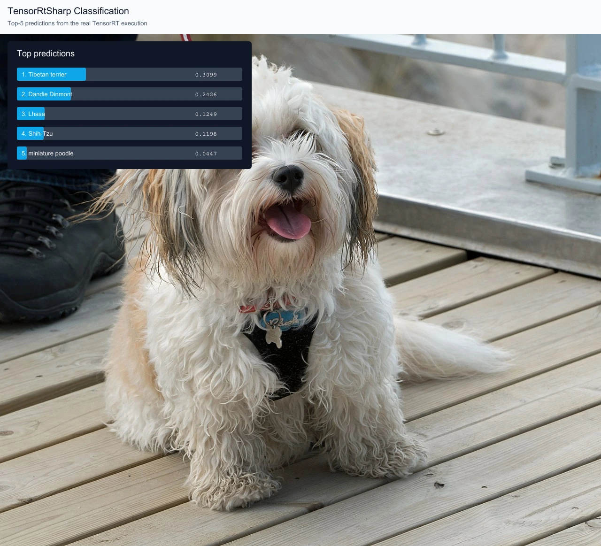
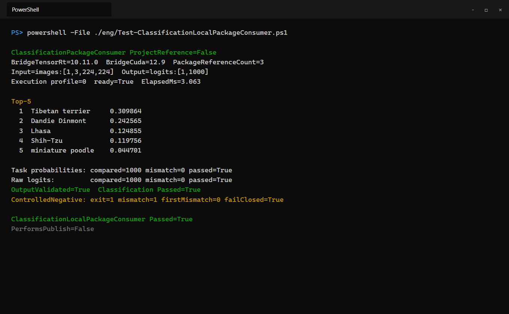

# Classification 本地包消费实战：C#、TensorRT 与 ResNet18 Top-5 分类

这篇文章从空白环境开始，完整演示如何获取 TorchVision ResNet18、转换为 ONNX、把模型暂存在 Git 仓库外、生成 C# 预处理 tensor、建立独立 ONNX Runtime 参考，并让仓库外项目只通过三个本地候选包执行真实 TensorRT 推理。最终结果不是模板日志，而是原图上的 Top-5 叠加图和同次运行输出的终端截图。

## 本文使用的项目与库

本文使用 TensorRtSharp4.0 仓库中的 `samples/Classification`。这个样例负责图片预处理、TensorRT engine 构建与执行、Softmax、Top-K、结构化 JSON、独立参考比较和 SVG 结果图导出。

主要组件如下：

| 组件 | 本文中的职责 |
| --- | --- |
| `JYPPX.TensorRtSharp` | 解析 ONNX、构建 engine、绑定 tensor 并执行推理 |
| `JYPPX.CudaSharp` | 提供 CUDA 设备、内存和 stream 基础能力 |
| `samples/Classification` | 完成图片预处理、Softmax、Top-5、结果 JSON 和可视化 |
| `samples/Classification.PackageConsumer` | 只通过 managed、Classification 和 bridge-only 三个 `PackageReference` 调用同一命令入口 |
| TorchVision `v0.25.0` | 提供 ResNet18 网络定义、权重和 ImageNet-1K 标签 |
| ONNX Runtime CPU | 对同一个 C# float32 输入 tensor 生成独立参考 |
| TensorRT `10.11` | 本文实际运行使用的推理后端 |

运行前需要安装 .NET 8 SDK、与本机 GPU 匹配的 CUDA 和 TensorRT，并按仓库构建说明生成 `jyppxtrtbridge.dll`。CUDA、cuDNN、TensorRT 和 NVRTC 都由用户自行安装，不进入源码包、NuGet 包或 GitHub Release。

## 模型获取与许可证

本文固定使用 TorchVision ResNet18 `IMAGENET1K_V1`：

- 权重地址：`https://download.pytorch.org/models/resnet18-f37072fd.pth`
- TorchVision tag：`v0.25.0`
- 固定 commit：`8ac84ee75afb1c327902156b5336f56ad63b7e2f`
- 权重 SHA256：`f37072fd47e89c5e827621c5baffa7500819f7896bbacec160b1a16c560e07ec`
- TorchVision 源码许可证：BSD-3-Clause

仓库提供固定来源和哈希校验的获取入口：

```powershell
pwsh -NoProfile -ExecutionPolicy Bypass `
  -File ./eng/Acquire-TorchVisionResNet18OfficialAssets.ps1 `
  -AllowDownload -ExportOnnx -PythonPath python
```

测试图片使用 Wikimedia Commons 上的 `Dog at Norre Vorupor Strand`：

- 说明页：`https://commons.wikimedia.org/wiki/File:Dog_at_N%C3%B8rre_Vorup%C3%B8r_Strand.jpg`
- 下载地址：`https://upload.wikimedia.org/wikipedia/commons/thumb/0/0d/Dog_at_N%C3%B8rre_Vorup%C3%B8r_Strand.jpg/1280px-Dog_at_N%C3%B8rre_Vorup%C3%B8r_Strand.jpg`
- 许可证：CC0 1.0
- 本文下载文件 SHA256：`e678ecf8dab63da112812ada0553d72d46033e4e9ea3b568bf0e53d92e1d6910`

模型权重只用于本地转换和验证，当前没有模型再分发授权，因此不得提交到 Git、上传 GitHub Packages 或附加到 Release。CC0 图片允许公开再分发，文章中的结果图可以保留原图。

## ONNX 转换与暂存

获取脚本内部使用下面的固定转换命令。这里保留完整命令，便于不使用 PowerShell 获取器时复现：

```text
python eng/Export-ClassificationResNet18Onnx.py --weights <downloads>/resnet18-f37072fd.pth --onnx <models>/resnet18-imagenet1k-v1.onnx --labels <models>/imagenet1k.names --report <models>/resnet18-onnx-export.json
```

转换环境为 PyTorch `2.10.0+cpu`、TorchVision `0.25.0+cpu`、ONNX opset 17。转换后的模型统一暂存在仓库外的：

```text
models/Classification/resnet18-torchvision-v0.25.0/resnet18-imagenet1k-v1.onnx
```

固定 ONNX 长度为 `46,748,553` bytes，SHA256 为：

```text
ead3558569edd88aa73a4eb46acbe6c38dee113933234547f04a0f6e48169903
```

模型合同是 `images:float32[1,3,224,224] -> logits:float32[1,1000]`。输入采用 RGB、NCHW、短边缩放到 256、中心裁剪 224 x 224、scale `1/255`、ImageNet mean/std；输出 logits 再执行 Softmax 和稳定 Top-5 排序。

## 创建本地包消费项目

项目仍处于第一版开发收尾阶段，本文不从 NuGet.org 或 GitHub Packages 安装 4.0 包，也不会执行任何发布命令。验证脚本先在本机生成候选包，再把下面的模板复制到仓库外隔离目录：

```text
samples/Classification.PackageConsumer
```

模板只有三个 `PackageReference`：`JYPPX.TensorRT.CSharp.API`、`JYPPX.TensorRT.CSharp.API.Classification` 和当前运行时键对应的 bridge-only 包。脚本清空远程源、使用隔离 NuGet 缓存，并检查 restore graph 中 `ProjectReference=0`、直接程序集引用为 0。bridge-only 包只含 `jyppxtrtbridge.dll`；CUDA、cuDNN 和 TensorRT 继续从用户安装目录加载。

先定义工作目录，正文后续命令都使用变量，避免绑定某台机器的盘符：

```powershell
$RepoRoot = (Resolve-Path .).Path
$WorkspaceRoot = Split-Path -Parent $RepoRoot
$ModelRoot = Join-Path $WorkspaceRoot 'models/Classification/resnet18-torchvision-v0.25.0'
$CaseRoot = Join-Path $WorkspaceRoot 'downloads/article-assets/classification-resnet18'
$ImageJpeg = Join-Path $CaseRoot 'dog.jpg'
$ImageBmp = Join-Path $CaseRoot 'dog.bmp'
New-Item -ItemType Directory -Force -Path $CaseRoot | Out-Null
```

下载 CC0 图片，并转换为样例原生支持的 24-bit BMP：

```powershell
Invoke-WebRequest `
  'https://upload.wikimedia.org/wikipedia/commons/thumb/0/0d/Dog_at_N%C3%B8rre_Vorup%C3%B8r_Strand.jpg/1280px-Dog_at_N%C3%B8rre_Vorup%C3%B8r_Strand.jpg' `
  -OutFile $ImageJpeg

Add-Type -AssemblyName System.Drawing
$source = [Drawing.Image]::FromFile($ImageJpeg)
$bitmap = [Drawing.Bitmap]::new($source.Width, $source.Height, [Drawing.Imaging.PixelFormat]::Format24bppRgb)
$graphics = [Drawing.Graphics]::FromImage($bitmap)
$graphics.DrawImage($source, 0, 0, $source.Width, $source.Height)
$bitmap.Save($ImageBmp, [Drawing.Imaging.ImageFormat]::Bmp)
$graphics.Dispose(); $bitmap.Dispose(); $source.Dispose()
```

## 编写程序入口

Classification 扩展包公开 `ClassificationCommand.Run(string[])`，原来的 `Main(string[])` 仍委托给它，命令参数和退出码保持不变。包消费者的完整入口只有下面几行：

```csharp
Console.WriteLine("ClassificationPackageConsumer ProjectReference=False");
TensorRtEnvironmentSnapshot snapshot = TensorRtEnvironmentProbe.GetCurrent();
Console.WriteLine($"BridgeTensorRt={snapshot.BuildInfo.TensorRtVersion}");
return ClassificationCommand.Run(args);
```

命令执行器内部主流程可以概括为下面五步：

```csharp
ClassificationImagePreprocessResult? preprocess = TryPreprocessImage(args);
OnnxSampleResult result = TensorRtOnnxSample.RunSingleFloatInputOutput(options);

float[] probabilities = ClassificationOutputProcessor.Transform(
    result.OutputValues,
    ClassificationScoreTransform.Softmax);
IReadOnlyList<ClassificationPrediction> top5 =
    ClassificationOutputProcessor.GetTopK(probabilities, labels, 5);

ClassificationOutputReportWriter.Write(
    outputJsonPath, options, result, preprocess, labelsPath, labelsSha256,
    labels.Count, transform, probabilities, top5, referenceContext, validation);

ClassificationVisualizationWriter.Write(
    visualizationPath, visualizationBackgroundPath, preprocess!, top5);
```

图片预处理结果会保存 source/tensor SHA256 和完整语义合同。可视化写入器只接受与预处理源图同尺寸的 JPEG、PNG 或 BMP 背景；尺寸不一致、没有真实图片输入或 Top-K 为空都会直接失败，防止把结果贴到错误图片上。

## 编译并运行

先生成 managed 主包和 Classification 扩展包；这里只写入本地目录，不上传任何 feed：

```powershell
dotnet pack ./pack/JYPPX.TensorRT.CSharp.API/JYPPX.TensorRT.CSharp.API.csproj `
  -c Release -o ./artifacts/classification-package-consumer/managed `
  -p:JYPPXPackageVersion=4.0.0

dotnet pack ./samples/Classification/Classification.csproj `
  -c Release -o ./artifacts/classification-package-consumer/classification `
  -p:JYPPXPackageVersion=4.0.0
```

bridge-only 候选包由仓库的 runtime-split 构建流程生成。本文选择
`win-x64-trt10.11-cuda12.9-cudnn9.22`；对应包内的 native 目录必须只有 `jyppxtrtbridge.dll`。设置本机 TensorRT 根目录，CUDA 和 cuDNN 则由运行时根目录解析器按运行时键检查：

```powershell
$env:TENSORRT_PATH = '<TensorRT-root>'
```

第一次运行源码样例只用于让 C# 写出权威预处理 tensor，以便独立框架使用完全相同的输入；这一步不替代最终三包验证：

```powershell
$App = './samples/Classification/bin/Release/net8.0/Classification.dll'
$InputTensor = Join-Path $CaseRoot 'classification-input.fp32.bin'

dotnet $App `
  --model (Join-Path $ModelRoot 'resnet18-imagenet1k-v1.onnx') `
  --labels (Join-Path $ModelRoot 'imagenet1k.names') `
  --image $ImageBmp --preprocessed-output $InputTensor `
  --input-shape 1x3x224x224 --tensor-rt-line 10 `
  --image-resize shorter-side-center-crop --resize-shorter-side 256 `
  --tensor-layout NCHW --color-order RGB --scale 0.00392156862745098 `
  --mean 0.485,0.456,0.406 --std 0.229,0.224,0.225 `
  --score-transform softmax --top-k 5 --noTF32
```

为这个精确 tensor 生成独立参考：

```powershell
$InputSha = (Get-FileHash $InputTensor -Algorithm SHA256).Hash.ToLowerInvariant()
$ReferenceRoot = Join-Path $CaseRoot 'reference'

python ./eng/Invoke-ClassificationResNet18Reference.py `
  --weights (Join-Path $WorkspaceRoot 'downloads/resnet18-torchvision-v0.25.0/source/resnet18-f37072fd.pth') `
  --onnx (Join-Path $ModelRoot 'resnet18-imagenet1k-v1.onnx') `
  --labels (Join-Path $ModelRoot 'imagenet1k.names') `
  --input-tensor $InputTensor --output-directory $ReferenceRoot `
  --expected-input-sha256 $InputSha
```

生成独立参考后，执行仓库外三包消费者。脚本会重新从 BMP 生成 C# tensor、比较任务概率与原始 logits、写结果图，然后把参考值索引 0 增加 `0.125` 再执行一次负例：

```powershell
pwsh -NoProfile -ExecutionPolicy Bypass `
  -File ./eng/Test-ClassificationLocalPackageConsumer.ps1 `
  -RuntimePackageKey win-x64-trt10.11-cuda12.9-cudnn9.22
```

脚本默认从外层 `models/Classification/resnet18-torchvision-v0.25.0` 读取 ONNX 和 labels，从外层 `downloads` 读取固定 CC0 图片与独立参考。也可以通过 `-ModelPath`、`-LabelsPath`、`-ImagePath`、`-TaskReferencePath` 和 `-RawReferencePath` 显式覆盖；模型仍不得复制进仓库。

## 已验证结果

本文实跑环境为 Windows 11、NVIDIA GeForce RTX 3060 Laptop GPU、CUDA 12.9、TensorRT 10.11。24-bit BMP 和同图 PPM 得到的 C# 输入 tensor 完全一致，SHA256 为 `43de394443f6fc3ccfd08cd9df61ee645ee5c51d1954c52267c221a438252f9e`。

独立参考先比较 PyTorch 与 ONNX Runtime，1000 个 logits 的最大绝对误差为 `1.049041748046875e-05`，argmax 一致。TensorRT 再与 ONNX Runtime 比较：

| 项目 | 比较值数 | mismatch | 最大绝对误差 |
| --- | ---: | ---: | ---: |
| Softmax 任务概率 | 1000 | 0 | `3.87e-7` |
| 原始 logits | 1000 | 0 | `6.68e-6` |

最终 Top-5 为：Tibetan terrier `0.309864`、Dandie Dinmont `0.242565`、Lhasa `0.124855`、Shih-Tzu `0.119756`、miniature poodle `0.044701`。本次 TensorRT enqueue 记录为 `3.063 ms`，程序结束于 `OutputValidated=True` 和 `Classification Passed=True`。受控负例返回 `exit 1`、`mismatch 1`、`firstMismatch 0`，说明参考值错误时会失败关闭。





终端截图来自本次真实运行的 stdout，只移除了机器路径并压缩成长短适合窗口展示的字段，包引用数、shape、耗时、Top-5、比较数量、负例和通过状态均未修改。两张图都来自同一次真实 TensorRT 执行：结果图使用同一个 CC0 输入和同一套 Classification 可视化写入器生成；为避免仓库保存两份内容相同的大图，源码运行与三包运行复用这张 Top-5 图。

## 复查与边界

复查时至少确认：

```powershell
Get-FileHash (Join-Path $ModelRoot 'resnet18-imagenet1k-v1.onnx') -Algorithm SHA256
Get-FileHash $InputTensor -Algorithm SHA256
pwsh -NoProfile -ExecutionPolicy Bypass -File ./eng/Test-ClassificationLocalPackageConsumer.ps1
```

结构化结果保存在 `samples/assets/classification-resnet18-local-package-consumer-runtime-evidence.json`。本文证明的是固定 ResNet18、固定 CC0 图片、固定预处理和 TensorRT 10.11 的本地 `PackageReference` 三包消费主路径，以及任务概率和原始 logits 的 fail-closed 对照。它不证明 ImageNet 整体精度，也不是公开 feed、post-publish、Owner release acceptance、Tag 或 GitHub Release 证明。

模型文件继续只放在外层 `models` 目录，不上传 GitHub；CUDA、cuDNN、TensorRT 和 NVRTC 继续由用户安装。本文内容完整不等于已授权公开发布，更不会触发包、Release 或版本发布。
