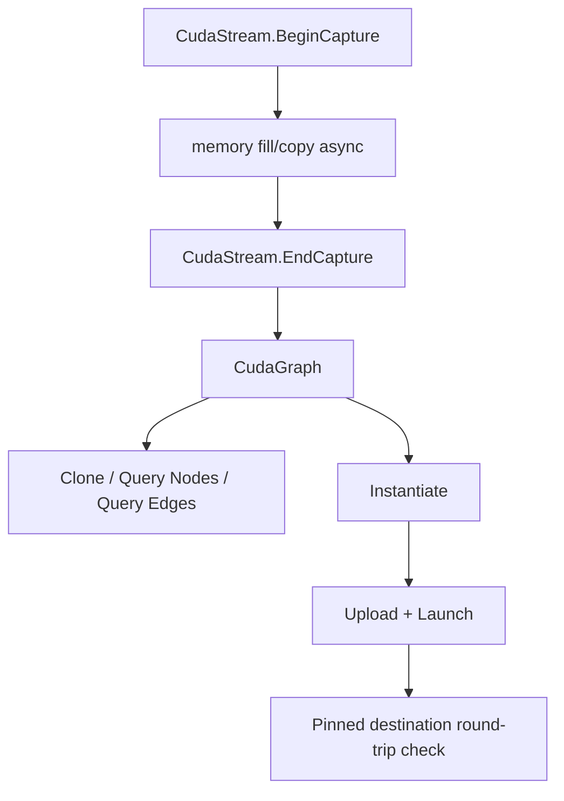
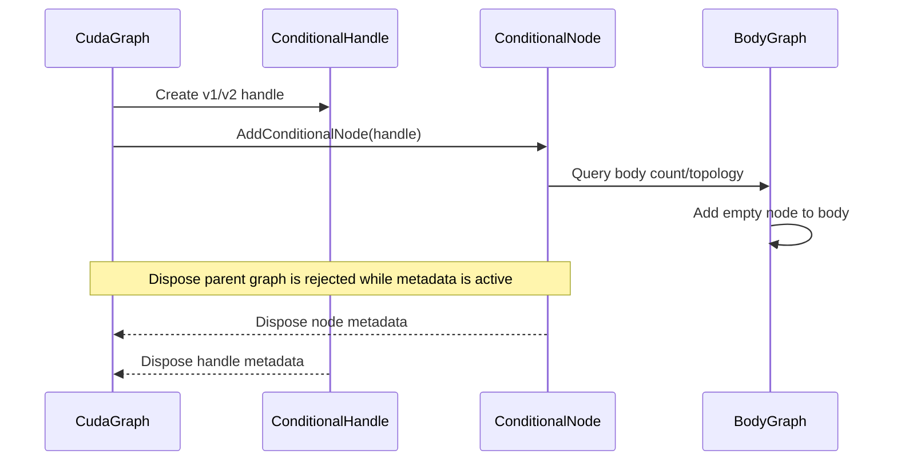
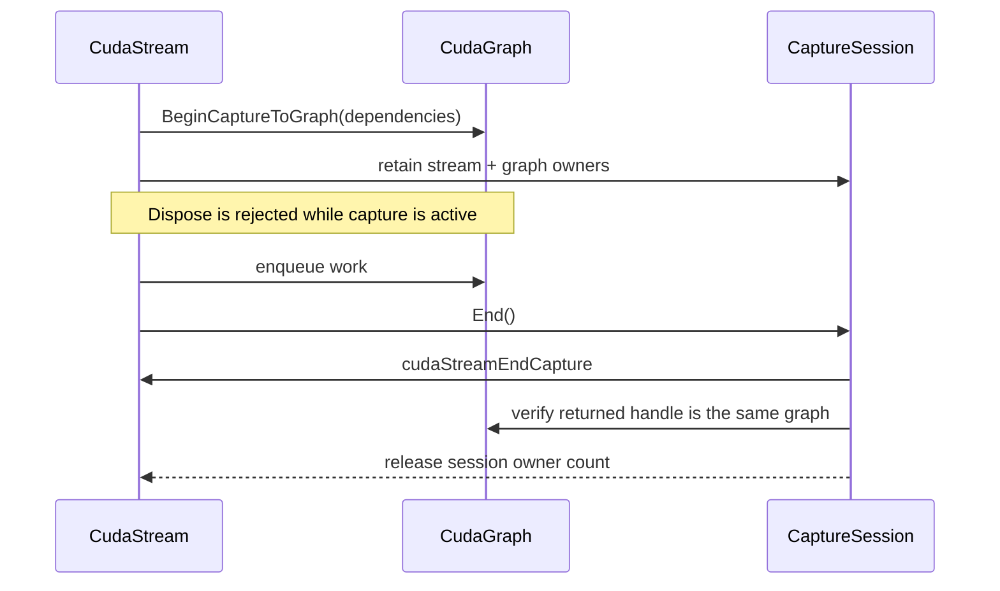

# CUDA Graph 当前能力与边界

本文介绍 TensorRtSharp4.0 当前 CUDA Graph wrapper 覆盖的能力，以及哪些行为仍应通过 smoke 和环境证据来判断。

## 当前可用能力

`CudaGraphSmokeRunner` 覆盖了以下能力：

- stream capture 到 graph。
- `CudaStream.BeginCaptureToGraph` 将 capture 写入已有 `CudaGraph`，并通过
  `CudaStreamCaptureToGraphSession` 保持 stream/graph owner 在 End 前有效。
- graph instantiate、upload、launch。
- graph clone。
- node/root/edge 查询。
- dependency 和 dependent 查询。
- edge data 查询、remove、restore。
- debug DOT 导出。
- event record/wait nodes。
- 1D memcpy nodes。
- memset node 参数读取和更新。
- graph memory info、trim 和 high watermark reset。
- device graph memory summary：`CudaDevice.GetGraphMemorySummary(int)`、`CudaDevice.CurrentGraphMemorySummary` 与 `CudaDeviceGraphMemoryInfo.ToSummary()` 将 `UsedMemoryCurrent`、`UsedMemoryHigh`、`ReservedMemoryCurrent`、`ReservedMemoryHigh` 四个 `cudaDeviceGetGraphMemAttribute` copied scalar 统一为 `CudaDeviceGraphMemorySummary`。
- conditional graph：`CudaGraph.AddConditionalNode` 可创建 IF/WHILE/IF_CASE 条件节点；
  `CudaGraphConditionalHandle` 与 `CudaGraphConditionalNode` 由 bridge 维护关联
  metadata，并提供 body topology 查询和 body-local empty-node 插入，不把 child
  graph 裸句柄交给 C#。

这些 API 的核心目标是让用户能在 C# 中描述、检查和执行常见 graph 拓扑，而不需要直接处理 CUDA driver/runtime 的裸句柄。

## Smoke Runner

运行：

```powershell
dotnet run --project .\smoke\CudaGraphSmokeRunner\CudaGraphSmokeRunner.csproj
```

成功时预期看到：

```text
CudaGraphCaptureRoundTrip=True
CudaGraphCapturedTopology ...
CudaGraphManualTopology ...
CudaGraphMemory ...
```

如果 CUDA runtime 不可用，runner 会输出：

```text
Skipped=True Reason=CudaException:...
```

这类 skip 是环境证据，不是 API proof，也不是接口缺失。

## 能力图



条件节点使用独立的 owner 约束路径：



已有 graph 的 capture 使用另一条生命周期路径：



## Debug DOT

`CudaGraph.ExportDebugDot` 可把图导出为 DOT 文件。Smoke 会检查文件存在、非空并包含 `digraph` 标记。该文件适合放进文章或 issue 作为拓扑截图来源；如果要对外发布，可以用 Graphviz 渲染为 PNG。

示例：

```powershell
dot -Tpng graph.dot -o graph.png
```

## 边界

- CUDA Graph smoke 证明 wrapper 能在当前 CUDA runtime 上完成 graph round-trip。
- 它不证明 TensorRT engine enqueue 已经使用 graph capture。
- 它不证明所有 kernel node attribute 都适用于所有 CUDA 版本。
- `BeginCaptureToGraph` 只在 `CUDART_VERSION >= 12030` 映射到 vendor API；CUDA
  11.x/12.1 不会伪造该入口。`ToGraph=True` 是当前兼容主机上的 source-tree
  smoke 结果，不是 clean package-consumer runtime proof。
- conditional graph 的 v1 handle 在 CUDA 12.3/12.9/13.2 可用，v2 handle
  需要 CUDA 13.2；CUDA 12.9 smoke 已覆盖 IF node、两个 body、body topology、
  default value、instantiate/launch 和 active-owner dispose rejection。CUDA
  13.2 本机 smoke 在 `cudaRuntimeGetVersion` 处受 driver/runtime error 35
  阻断，因此只记录 native build/host boundary，不宣称 13.2 runtime proof。
- conditional body graph 仍是 bridge-internal metadata；body capture、kernel/raw
  pointer node、外部资源和 callback 继续 deferred。generic owner-scoped node
  destroy 不接管 conditional node，parent graph 也不能在 metadata wrapper 存活
  时释放。
- `CudaDeviceGraphMemorySummary` 是 pointer-free copied readonly summary，`RuntimeEvidenceKind=copied-readonly-summary`，不能晋级 runtime proof，也不能删除 deferred history。
- 它不替代 package consumer 的 native asset copy 证据。

如果当前机器返回 CUDA error 35，应先处理 driver/runtime 兼容性，不要修改 graph API 来绕过环境问题。
