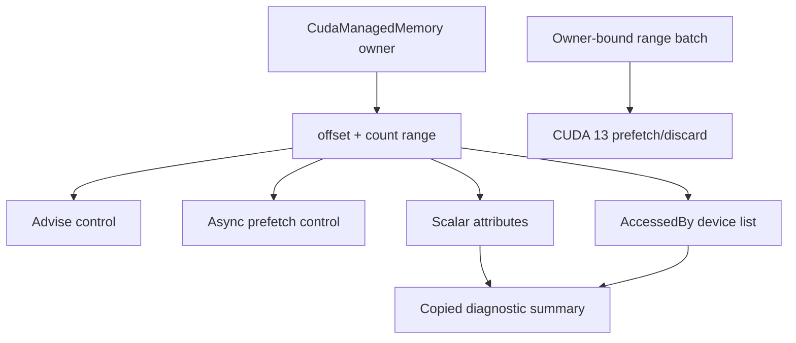
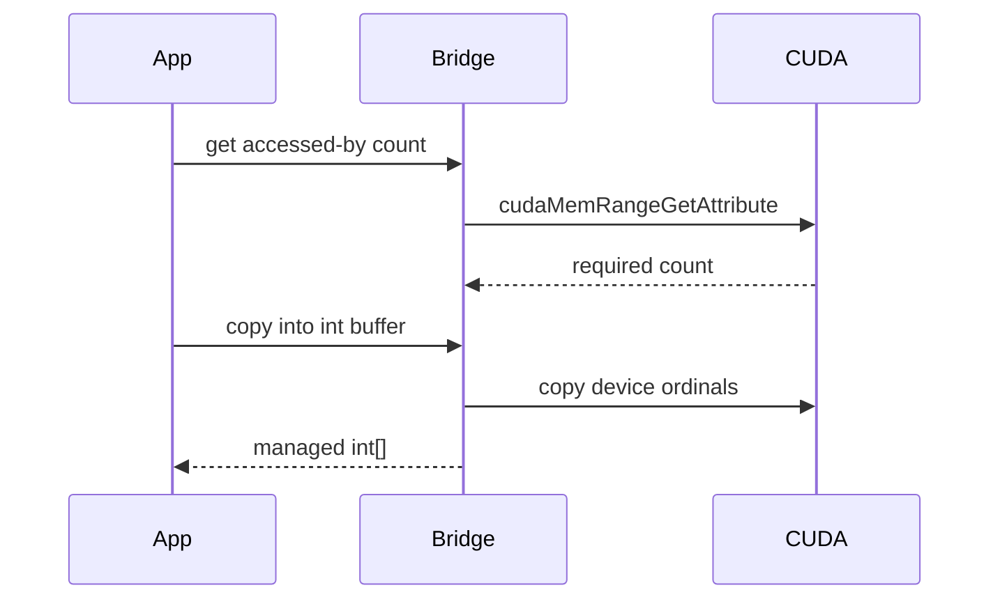

# CUDA Memory Range APIs：查询、Advice、Prefetch 与批量操作

CUDA managed memory 可以按 byte range 设置 advice、异步 prefetch，并查询 read-mostly、preferred location、
last prefetch location 和 accessed-by devices。原生 API 既有 scalar 输出，也有变长 device list，还在 CUDA
12.3/13 中引入 location V2 和 batch 操作。

TensorRtSharp4.0 将这些接口封装为 owner-bound range、copied scalar snapshot、count/copy array 和强类型
location，避免 public API 暴露 allocation pointer。本文给出可执行用法、版本边界和 smoke 解释。

## 适用读者

- 使用 `CudaManagedMemory` 调优 page placement 的开发者。
- 需要记录 managed memory 状态但不希望暴露 device pointer 的诊断工具作者。
- 排查 advice/prefetch 在不同 CUDA runtime 上不支持或无效的问题的维护者。
- 为 CUDA 12.3/13 memory API 增加跨版本 wrapper 的贡献者。

## 能力地图



这些 API 适用于 managed memory。虽然基础方法位于 `CudaMemory` 以复用 owner/handle 逻辑，普通 device
allocation 对 managed range 查询可能由 CUDA 返回错误；教程应使用 `CudaManagedMemory`。

## 权威实现路径

- Public allocation/control：`src/JYPPX.CudaSharp/Memory/CudaMemory.cs`
- Managed memory V2：`src/JYPPX.CudaSharp/Memory/CudaManagedMemory.cs`
- Attribute/snapshot：`src/JYPPX.CudaSharp/Memory/CudaMemoryRangeAttribute.cs`
- Strongly typed location：`src/JYPPX.CudaSharp/Memory/CudaMemoryLocation.cs`
- CUDA 13 batch owner：`src/JYPPX.CudaSharp/Memory/CudaManagedMemoryBatch.cs`
- Interop：`src/JYPPX.CudaSharp/Internal/Interop/Memory/NativeCudaApi.MemoryRange.cs`

对应 manifest：

- `native/manifests/cuda/cuda-forty-second-batch-memory-range-attributes.manifest.json`
- `native/manifests/cuda/cuda-forty-third-batch-memory-range-accessed-by.manifest.json`
- `native/manifests/cuda/cuda-forty-fifth-batch-memory-range-advice-prefetch.manifest.json`
- `native/manifests/cuda/cuda-fifty-fifth-batch-managed-memory-location-v2.manifest.json`
- `native/manifests/cuda/cuda-fifty-third-batch-managed-memory-batch.manifest.json`

## Range 的基本不变量

所有 offset/count 单位都是 byte：

```text
0 <= offset < allocation.SizeInBytes
0 < count <= allocation.SizeInBytes - offset
```

wrapper 在 native 调用前验证范围。count 为 0 不表示“整个 allocation”，而是非法 range；全量 overload 会
显式传 `offset=0, count=SizeInBytes`。

```csharp
const int byteCount = 4 * 1024 * 1024;
using var memory = new CudaManagedMemory(byteCount);

int firstHalfOffset = 0;
int firstHalfCount = byteCount / 2;
```

## Scalar Attribute

`CudaMemoryRangeAttribute` 当前包含：

| Attribute | 返回解释 | 版本注意 |
| --- | --- | --- |
| `ReadMostly` | 0/非 0 | range 内所有 page 是否 read-mostly |
| `PreferredLocation` | device/host ordinal 语义 | legacy location value |
| `AccessedBy` | 变长设备数组 | 不能走 scalar API |
| `LastPrefetchLocation` | 最近显式 prefetch 位置 | legacy location value |
| `PreferredLocationType` | `CudaMemoryLocationType` | CUDA 12.3+ |
| `PreferredLocationId` | device/NUMA id | CUDA 12.3+ |
| `LastPrefetchLocationType` | `CudaMemoryLocationType` | CUDA 12.3+ |
| `LastPrefetchLocationId` | device/NUMA id | CUDA 12.3+ |

查询单项：

```csharp
CudaMemoryRangeAttributeValue readMostly =
    memory.GetRangeAttribute(CudaMemoryRangeAttribute.ReadMostly);

Console.WriteLine($"ReadMostly raw={readMostly.RawValue} enabled={readMostly.IsEnabled}");
```

查询子范围：

```csharp
CudaMemoryRangeAttributeValue preferred = memory.GetRangeAttribute(
    CudaMemoryRangeAttribute.PreferredLocation,
    firstHalfOffset,
    firstHalfCount);
```

`RawValue` 始终保留 vendor 32-bit 值。只有与 attribute 对应时才使用 `IsEnabled` 或 `LocationType` 解释。

## 多 Attribute Copied Query

```csharp
CudaMemoryRangeAttributeValue[] values = memory.GetRangeAttributes(
    0,
    memory.SizeInBytes,
    CudaMemoryRangeAttribute.ReadMostly,
    CudaMemoryRangeAttribute.PreferredLocation,
    CudaMemoryRangeAttribute.LastPrefetchLocation);

foreach (CudaMemoryRangeAttributeValue value in values)
{
    Console.WriteLine(value);
}
```

托管层把 attribute IDs 和输出 structs 固定在调用期间，native 一次复制所有值，返回顺序与请求顺序一致。
空 attributes、未定义 enum 或 `AccessedBy` 会在进入 native 前拒绝。

## AccessedBy 为什么单独处理

CUDA 的 `AccessedBy` 是设备 ordinal 数组，不是一个 scalar。wrapper 使用 count/copy：

1. 查询 required device count。
2. 分配托管 int[]。
3. 调用 copy entry。
4. 若 buffer too small 且 required count 增长，扩容重试。
5. 返回精确长度数组。



用法：

```csharp
memory.Advise(
    CudaMemoryAdvice.SetAccessedBy,
    CudaDevice.Current);

int[] devices = memory.GetRangeAccessedByDevices();
Console.WriteLine(string.Join(",", devices));
```

空数组表示 CUDA 报告 0 个设备，不是 native pointer null。

## Advice 控制

legacy device-ordinal overload：

```csharp
memory.Advise(
    0,
    memory.SizeInBytes,
    CudaMemoryAdvice.SetReadMostly,
    CudaDevice.Current);

memory.Advise(
    CudaMemoryAdvice.SetPreferredLocation,
    CudaDevice.Current);
```

`CudaMemoryAdvice` 包括 set/unset read-mostly、preferred-location、accessed-by 等成对控制。wrapper 验证 enum
和 range，但是否被设备/runtime 接受仍由 CUDA status 决定。

Advice 是调优提示，不等同于把页面立即迁移，也不保证 kernel 性能一定提升。必须结合 workload、page fault、
NUMA 和真实 benchmark 评估。

## Prefetch 控制

```csharp
using var stream = new CudaStream(CudaStreamCreationFlags.NonBlocking);

memory.PrefetchAsync(
    0,
    memory.SizeInBytes,
    CudaDevice.Current,
    stream);
stream.Synchronize();
```

prefetch 异步入队。memory 和 stream 必须保持存活到同步点。调用返回不代表迁移已完成。

常用顺序：

1. host 写入 managed memory。
2. 设置 advice。
3. prefetch 到目标 device。
4. 在同 stream 或有依赖的 stream 上执行 GPU 工作。
5. 同步后再由 host 读取或释放。

## CUDA 12.3+ Strongly Typed Location

`CudaMemoryLocation` 避免用 magic int 混合 device、host 和 NUMA：

```csharp
CudaMemoryLocation device = CudaMemoryLocation.Device(CudaDevice.Current);
memory.Advise(CudaMemoryAdvice.SetPreferredLocation, device);
memory.PrefetchAsync(device, stream);
stream.Synchronize();
```

可选位置：

- `CudaMemoryLocation.Device(ordinal)`
- `CudaMemoryLocation.Host`
- `CudaMemoryLocation.HostNuma(id)`
- `CudaMemoryLocation.CurrentHostNuma`

`SetAccessedBy`/`UnsetAccessedBy` 只接受 device 或 host location；invalid kind/id 在 managed 层拒绝。旧 CUDA
runtime 不支持 V2 entry 时应记录 NotSupported/`CudaException`，不能静默改用含义不同的 destination。

## Copied Diagnostic Summary

```csharp
CudaMemoryRangeDiagnosticSummary summary = memory.GetRangeDiagnosticSummary(
    0,
    memory.SizeInBytes,
    adviceControlAttempted: true,
    prefetchControlAttempted: true,
    CudaMemoryRangeAttribute.ReadMostly,
    CudaMemoryRangeAttribute.PreferredLocation,
    CudaMemoryRangeAttribute.LastPrefetchLocation);

Console.WriteLine(summary);
```

字段：

| 字段 | 含义 |
| --- | --- |
| `RangeSizeInBytes` | 被查询范围 |
| `CopiedScalarAttributeCount` | 成功复制的 scalar 数 |
| `CopiedAccessedByDeviceCount` | copied device ordinal 数 |
| `AdviceControlAttempted` | 调用方声明此前尝试过 advice |
| `PrefetchControlAttempted` | 调用方声明此前尝试过 prefetch |
| `PointerFreeCopiedSummary` | 固定为 true |

这个 summary 故意固定：

- `IsRuntimeExecutionEvidence=false`
- `IsRuntimeExecutionProof=false`
- `CanPromoteRuntimeProof=false`
- `CanPromoteReleaseProof=false`
- `CanDeleteDeferredRecord=false`

它只是只读诊断投影。`AdviceControlAttempted=true` 也只表示调用方传入该上下文，不证明 kernel 或 inference
执行成功。

## CUDA 13 Owner-Bound Batch

CUDA 13 支持多个 managed range 的 batch prefetch/discard。项目不接受裸 pointer array，而是使用 owner-bound
struct：

```csharp
using var first = new CudaManagedMemory(4096);
using var second = new CudaManagedMemory(4096);
using var stream = new CudaStream();

var ranges = new[]
{
    new CudaManagedMemoryPrefetchRange(first, CudaDevice.Current),
    new CudaManagedMemoryPrefetchRange(second, 1024, 2048, CudaDevice.Current)
};

CudaManagedMemoryBatch.PrefetchAsync(ranges, stream);
stream.Synchronize();
```

可用操作：

- `CudaManagedMemoryBatch.PrefetchAsync`
- `CudaManagedMemoryBatch.DiscardAsync`
- `CudaManagedMemoryBatch.DiscardAndPrefetchAsync`

每个 `CudaManagedMemoryRange` 保存 `Memory` owner、offset、count；prefetch range 另存 destination device。调用
前复制并重新验证所有 range，stream 同步前所有 owner 必须存活。

Discard 会丢弃内容，不能在不了解数据生命周期时作为性能优化随意调用。

## 完整示例

```csharp
const int count = 4096;
using var stream = new CudaStream(CudaStreamCreationFlags.NonBlocking);
using var memory = new CudaManagedMemory(count);

memory.Fill(0);
memory.Advise(CudaMemoryAdvice.SetReadMostly, CudaDevice.Current);
memory.Advise(CudaMemoryAdvice.SetAccessedBy, CudaDevice.Current);
memory.PrefetchAsync(CudaDevice.Current, stream);
stream.Synchronize();

var attributes = memory.GetRangeAttributes(
    CudaMemoryRangeAttribute.ReadMostly,
    CudaMemoryRangeAttribute.PreferredLocation,
    CudaMemoryRangeAttribute.LastPrefetchLocation);
int[] accessedBy = memory.GetRangeAccessedByDevices();

Console.WriteLine(string.Join("; ", attributes.Select(value => value.ToString())));
Console.WriteLine($"AccessedBy=[{string.Join(",", accessedBy)}]");
```

实际应用应在 capability probe 后运行，并捕获 `CudaException` 记录 code/name/string。

## 仓库 Smoke

`smoke/CudaSmokeRunner/Program.cs` 覆盖 advice、prefetch、scalar attributes、accessed-by、V2 location 和 CUDA13
batch 的可用分支：

```powershell
dotnet run --project .\smoke\CudaSmokeRunner\CudaSmokeRunner.csproj `
  -c Debug --no-build
```

关键输出：

```text
ManagedMemoryAdvice=True
ManagedMemoryRangeAttributes ... MemoryRangeSummary=...
ManagedMemoryAccessedBy Count=<n> Devices=<ids>
ManagedMemoryLocationV2 ...
CudaManagedMemoryBatch ...
```

根据 runtime/device，某些分支可能输出 `Skipped Reason=...`。尤其 V2 和 batch 有版本门，不能把 controlled skip
写成通过。

## 版本与能力判断

| 能力 | 大致版本边界 | 验证方式 |
| --- | --- | --- |
| legacy advice/prefetch/range attributes | 较早 CUDA runtime | 实际 API status + smoke |
| location type/id attributes | CUDA 12.3+ | runtime version + V2 smoke |
| strongly typed location controls | CUDA 12.3+ | corresponding bridge entry + smoke |
| managed memory batch | CUDA 13 line | CUDA13 native build + batch smoke |

不要只比较 version integer 后假定 API 行为。bridge build line、generated entry、runtime symbol 和 device capability
都要一致。

## 参数校验与失败语义

托管层在 native 前拒绝：

- offset/count 越界或 count=0。
- attributes 为空、未定义或把 `AccessedBy` 当 scalar。
- null stream/owner/range list。
- batch list 为空。
- destination device 为负数。
- 非 canonical `CudaMemoryLocation`。

native 返回 CUDA error 时抛 `CudaException`。日志应记录 operation、range、attribute/advice、device/location、
runtime version 和错误文本，避免只输出“查询失败”。

## 常见问题

### PreferredLocation 返回负值

legacy CUDA 可能用特殊常量表达 CPU/invalid location。保留 `RawValue`，按当前 CUDA 定义解释，不要无条件
当 device ordinal。

### AccessedBy 传给 GetRangeAttribute 报错

这是预期的 managed guard。使用 `GetRangeAccessedByDevices`，因为结果是数组。

### Advice 成功但 Attribute 没变化

检查 range 完全覆盖、advice 的 set/unset 配对、runtime/device 支持和同步。CUDA attribute 通常要求整个
range page 状态一致；部分页面不同可能得到特定返回或错误。

### Prefetch 后是否可以立即释放 Memory

不可以。prefetch 异步排入 stream，先同步或用 event 建立完成依赖，再释放 owner。

### V2 API 在 CUDA12.1 失败

location V2 需要 CUDA 12.3+。保留 NotSupported/skip，并使用明确支持的 legacy API，不要宣称 V2 已验证。

### Batch 在 CUDA12 上能否自动循环降级

业务层可以显式选择逐 range legacy prefetch，但这不是“CUDA batch path 通过”。报告中要区分 native batch 与
fallback loop。

### Summary 为什么不能作为 Runtime Proof

它只统计 copied query 数量，并明确将所有 promotion flag 固定为 false。真正 proof 需要真实 workload、执行
日志、host metadata、exit 0 和 package/channel 边界。

## 证据分级

| 证据 | 证明 | 不证明 |
| --- | --- | --- |
| range guard tests | owner/offset/count 校验 | CUDA vendor 调用 |
| copied attribute query | 指定 range 元数据可复制 | page migration 完成 |
| advice accepted | CUDA 接受提示 | 性能改善 |
| prefetch + synchronize | 指定迁移操作完成 | inference 正确 |
| batch smoke | CUDA13 batch 路径通过 | CUDA12 fallback 同等 |
| source CudaSmoke | 当前源码/主机能力 | clean package consumer |

## 边界说明

memory range summary、attribute snapshot、dependency probe 和 capability check 都不是 runtime execution proof。
source smoke 也不等于 public package、real-model 或 post-publish proof。allocator callback 与这些 owner-safe range
controls 是不同领域。

若运行被 CUDA driver/runtime compatibility 阻塞，必须记录 `blocked-by-cuda-driver`，不能改写为 attribute、
prefetch 或 batch smoke passed。本文不发布，保持 `performsPublish=false`、`canPublishPublicly=false`、
`canCloseReleaseIssue=false`。

## 使用清单

- [ ] 使用 `CudaManagedMemory` owner，而不是裸 pointer。
- [ ] offset/count 以 byte 计算并在 allocation 范围内。
- [ ] scalar attributes 不包含 `AccessedBy`。
- [ ] accessed-by 通过 count/copy array 查询。
- [ ] advice、prefetch 与 query 的 range 完全一致。
- [ ] async prefetch/batch 后同步 stream 再释放 owner。
- [ ] V2 和 batch 按 CUDA runtime/bridge line 明确分类。
- [ ] summary promotion flags 保持 false。
- [ ] skip/NotSupported/driver blocker 没有写成 passed。
- [ ] source smoke 与 package/runtime proof 分开记录。

## 下一步

- [CUDA Memory Wrapper 入门](cuda-memory-wrapper.md)
- [CUDA Memory Wrapper 博客版](blog-cuda-memory-wrapper.md)
- [CUDA Stream/Event 多流教程](cuda-stream-event-multistream-tutorial.md)
- [CUDA Error 35 排查](cuda-error-35-troubleshooting.md)
