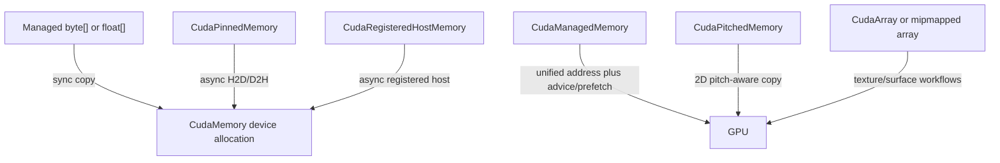
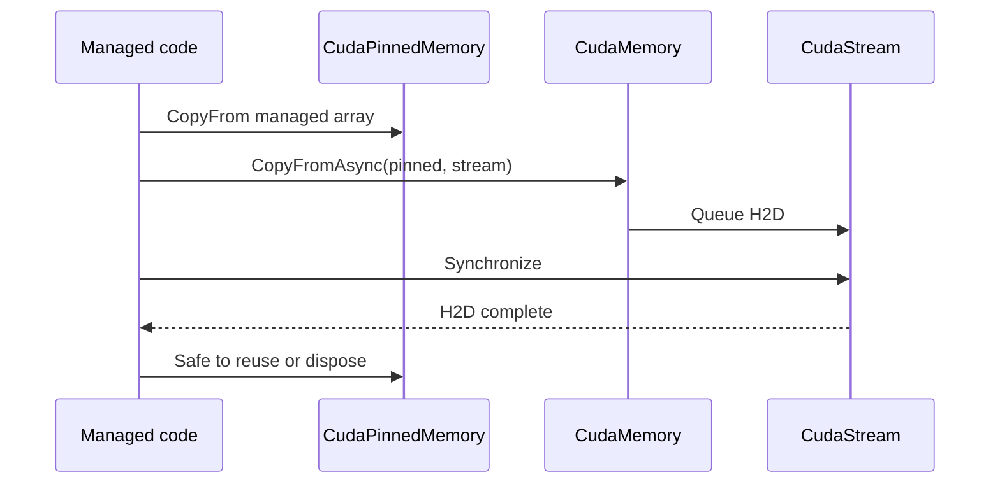

# CUDA Memory Wrapper 入门：从字节所有权到异步复制

CUDA memory API 的难点不只是 `cudaMalloc`。真正容易出错的是 allocation size、host/device 内存类型、
同步/异步复制、pinned buffer、stream 顺序、跨设备访问和释放时机。TensorRtSharp4.0 用 `CudaMemory`、
`CudaPinnedMemory`、`CudaManagedMemory`、`CudaPitchedMemory` 等 wrapper 表达这些语义，public API 不要求
用户管理裸 device pointer。

本文从最小同步 round-trip 开始，逐步进入 pinned async copy、stream/event 和多流顺序。

## 适用读者

- 第一次在 C# 中分配 CUDA device memory 的用户。
- 需要为 TensorRT input/output tensor 准备 device buffer 的开发者。
- 排查异步复制、过早释放或 byte count 错误的维护者。
- 为 CUDA bridge 添加 memory API 和 owner-safe wrapper 的贡献者。

## 内存类型地图



| Wrapper | Owner | 典型用途 |
| --- | --- | --- |
| `CudaMemory` | wrapper 拥有 device allocation | TensorRT I/O、通用 byte/float buffer |
| `CudaPinnedMemory` | wrapper 拥有 page-locked host allocation | 高吞吐异步 host/device copy |
| `CudaRegisteredHostMemory` | wrapper 管理 host registration | 已有 host buffer 的异步传输 |
| `CudaManagedMemory` | wrapper 拥有 unified memory | advice/prefetch、CPU/GPU 共享访问 |
| `CudaPitchedMemory` | wrapper 拥有 pitch allocation | 2D image/plane copy |
| `CudaArray` | wrapper 拥有 CUDA array | texture/surface resource |

不同 wrapper 不能仅按地址互换。它们的分配/释放 API、可用复制方式和同步要求不同。

## CudaMemory 的 Owner 模型

`CudaMemory` 实现位于 `src/JYPPX.CudaSharp/Memory/CudaMemory.cs`。构造函数验证 size 大于 0，通过 native bridge
分配 device memory，并将内部 `SafeCudaMemoryHandle` 保存在对象内。public 属性只公开：

- `SizeInBytes`
- `IsIpcImported`
- 复制、填充、range query 与 owner-safe control 方法

内部 handle 位于 `src/JYPPX.CudaSharp/Internal/Handles/SafeCudaMemoryHandle.cs`，不会成为用户 API。
`Dispose` 统一释放；重复使用 disposed wrapper 会由托管/native 状态检查拒绝。

## 最小同步 Round-Trip

```csharp
byte[] source = Enumerable.Range(0, 32)
    .Select(index => (byte)index)
    .ToArray();

using var device = new CudaMemory(source.Length);
device.CopyFrom(source);

byte[] destination = new byte[source.Length];
device.CopyTo(destination);

if (!source.SequenceEqual(destination))
{
    throw new InvalidOperationException("CUDA byte round-trip mismatch.");
}
```

同步 `CopyFrom(byte[])`/`CopyTo(byte[])` 在返回前完成相应 host transfer，适合小数据、初始化和教程。
wrapper 检查数组不为 null，且 byte count 不超过 allocation。

## Float 数据与字节数

`CudaMemory` 提供 float[] helper，但 allocation 的单位始终是 byte：

```csharp
float[] values = { 1.25f, -2.5f, 3.75f, 8.0f };
using var device = new CudaMemory(checked(values.Length * sizeof(float)));

device.CopyFrom(values);
float[] roundTrip = device.ToSingleArray(values.Length);
```

最常见错误是用元素数当 byte count。统一用 `checked(elementCount * sizeof(T))`，避免 overflow 和 silent
under-allocation。TensorRT tensor 还要把 dtype 与 shape element count 一起验证。

## Fill 与初始化

```csharp
using var device = new CudaMemory(4096);
device.Fill(0);
device.Fill(0x7F, 128);
```

`Fill(byte)` 对整个 allocation 执行 byte pattern memset。对 float buffer 填 0 安全地得到 `0.0f`；非零 byte
pattern 通常不是你期望的浮点常数。需要写入任意 float 时使用 `CopyFrom(float[])` 或 kernel。

## 为什么异步 Copy 需要 Pinned Host Memory

普通 managed array 会移动，也不一定 page-locked。异步 H2D/D2H 必须在 GPU 工作完成前保持 host address
稳定，因此项目要求 `CudaPinnedMemory` 或 registered host owner，而不是接受任意 `byte[] + stream`。



完整示例：

```csharp
const int byteCount = 4096;
byte[] source = Enumerable.Range(0, byteCount)
    .Select(index => (byte)(index % 251))
    .ToArray();

using var stream = new CudaStream(CudaStreamCreationFlags.NonBlocking);
using var hostSource = new CudaPinnedMemory(byteCount);
using var hostDestination = new CudaPinnedMemory(byteCount);
using var device = new CudaMemory(byteCount);

hostSource.CopyFrom(source);
device.CopyFromAsync(hostSource, byteCount, stream);
device.CopyToAsync(hostDestination, byteCount, stream);
stream.Synchronize();

byte[] destination = hostDestination.ToArray(byteCount);
if (!source.SequenceEqual(destination))
{
    throw new InvalidOperationException("Pinned async round-trip mismatch.");
}
```

在 `stream.Synchronize()` 前不能释放或复用三块 memory。using declaration 的作用域应覆盖同步点。

## Device-to-Device Copy

同设备同步复制：

```csharp
using var sourceDevice = new CudaMemory(1024);
using var destinationDevice = new CudaMemory(1024);

sourceDevice.Fill(0x5A);
sourceDevice.CopyTo(destinationDevice, 1024);
```

异步版本要求 stream：

```csharp
sourceDevice.CopyToAsync(destinationDevice, 1024, stream);
stream.Synchronize();
```

`CopyToAuto`/`CopyToAutoAsync` 使用 CUDA default copy kind，让 runtime 根据 pointer attributes 选择方向；
显式 H2D/D2H/D2D wrapper 更容易审计，auto copy 适合确实需要统一路径的工具层。

## Peer Copy 与 Device Scope

`CopyToPeer`/`CopyToPeerAsync` 要求 source/destination device ordinal。调用前检查 device count 和 peer access；
不要假设多 GPU 任意互通。

```csharp
if (CudaDevice.CanAccessPeer(sourceDeviceOrdinal, destinationDeviceOrdinal))
{
    source.CopyToPeerAsync(
        destination,
        sourceDeviceOrdinal,
        destinationDeviceOrdinal,
        count,
        stream);
    stream.Synchronize();
}
```

`CudaDeviceScope` 可在作用域内切换 current device 并恢复前值。allocation、stream 和 operation 的 device
归属仍需明确记录。

## Stream 与 Event：表达顺序

同一 stream 中操作按入队顺序执行。不同 stream 默认不能互相推断完成关系，需要 event：

```csharp
using var producer = new CudaStream(CudaStreamCreationFlags.NonBlocking);
using var consumer = new CudaStream(CudaStreamCreationFlags.NonBlocking);
using var ready = new CudaEvent();

sourceDevice.FillAsync(0x33, sourceDevice.SizeInBytes, producer);
ready.Record(producer);
consumer.WaitFor(ready);
sourceDevice.CopyToAsync(destinationDevice, sourceDevice.SizeInBytes, consumer);
consumer.Synchronize();
```

`samples/MultiStream/Program.cs` 展示两个独立 stream 和跨 stream event wait，并验证 host 输出。

## 测量操作耗时

`CudaStream.MeasureElapsedTime` 用 CUDA events 包裹 action：

```csharp
float elapsedMs = stream.MeasureElapsedTime(cudaStream =>
{
    device.FillAsync(0, cudaStream);
    device.CopyToAsync(hostDestination, cudaStream);
});
```

这测量指定 stream 的 GPU elapsed time，不是整个应用 wall-clock，也不包含所有 CPU preprocessing。

## Async Allocation 与 FreeAsync

支持 memory pool 的 runtime 可用：

```csharp
using var stream = new CudaStream();
using CudaMemory memory = CudaMemory.AllocateAsync(4096, stream);
memory.FillAsync(0, stream);
memory.FreeAsync(stream);
stream.Synchronize();
```

`FreeAsync` 将释放排入 stream，并使 wrapper 进入不能继续使用的状态。调用后不要再复制或读取该 memory。
若环境不支持 async allocator，记录 NotSupported/`CudaException`，不要降级后仍宣称 async path 通过。

## Pinned Memory 的 Flags

`CudaPinnedMemory` 可用 Default、Portable、Mapped 等 allocation flags。Mapped host memory 还涉及 device-visible
address；public 属性以地址数值用于诊断，不意味着用户可以绕开 wrapper 把它当无所有权指针长期保存。

Portable/mapped 能力依赖设备和 runtime。创建前读取 device attributes，失败时保留具体 CUDA error。

## Registered Host Memory

当应用已有 unmanaged/固定 host region 时，可使用 `CudaRegisteredHostMemory` 管理 `cudaHostRegister` 生命周期。
注册对象必须比所有异步 copy 活得久，解除注册前同步相关 stream。不要注册 GC 可移动数组后丢失 pin owner。

相关 overload 位于 `src/JYPPX.CudaSharp/Memory/CudaMemory.RegisteredHost.cs`。

## Pitched、Array 与二维数据

图像和二维 tensor 常有 pitch。`CudaPitchedMemory` 保存 width、height、pitch 和 allocation owner，提供 2D
copy；不能把 `width * height` 当成实际 device byte layout。每行有效宽度与 pitch padding 要分开。

CUDA array、mipmapped array、texture/surface 又有专用 descriptor 和 owner。基础 `CudaMemory` 适合线性 buffer，
不要为省一个 wrapper 把所有资源降为 address。

## Managed Memory

`CudaManagedMemory` 继承 `CudaMemory`，额外记录 attachment flags，并提供 advice/prefetch。它让 CPU/GPU 共享
统一地址空间，但 page migration 和并发访问仍需要性能/同步设计。

```csharp
using var managed = new CudaManagedMemory(4096);
managed.Advise(CudaMemoryAdvice.SetReadMostly, CudaDevice.Current);
managed.PrefetchAsync(CudaDevice.Current, stream);
stream.Synchronize();
```

CUDA 12.3+ 还有强类型 `CudaMemoryLocation` API，旧 runtime 不支持时应返回受控诊断。range query 和 batch
操作见 [CUDA Memory Range APIs](cuda-memory-range-apis.md)。

## 与 TensorRT InferenceBindings 的连接

`TensorRtExecutionContext.SetInputTensorAddress`/`SetOutputTensorAddress` 接受 `CudaMemory`，不要求业务层取得
device pointer。更高层的 `TensorRtInferenceBindings` 可以按 tensor metadata 分配和绑定 buffer。

```csharp
using var bindings = new TensorRtInferenceBindings(engine, context, profileIndex);
bindings.CopyInputFromHost("input", inputValues, runtimeShape)
        .AllocateDeviceBuffer("output", runtimeShape)
        .BindAll();
bindings.EnqueueAsync(stream, synchronize: true);
```

buffer owner 被 bindings 持有，仍需在读取输出前确保 stream 已完成。

## 环境探测

任何 memory smoke 前先读取环境：

```csharp
CudaEnvironmentSnapshot snapshot = CudaEnvironmentProbe.GetCurrent();
if (!snapshot.CudaRuntimeInfo.VendorDependencyAvailable)
{
    Console.WriteLine(snapshot.CudaRuntimeInfo.StatusMessage);
    return;
}
```

检查 device count、managed memory、unified addressing、host register、async engine count 等 capability。能力 false
时跳过对应分支，但整个测试不能因此无条件输出 passed。

## 仓库 Smoke

```powershell
dotnet run --project .\smoke\CudaSmokeRunner\CudaSmokeRunner.csproj `
  -c Debug --no-build
```

关注 memory 相关标记：

```text
RoundTrip=True
FloatRoundTrip=True
Fill=True
DeviceToDevice=True
MemcpyDefault Sync=True Async=True
PinnedAsyncRoundTrip=True
ManagedMemoryRoundTrip=True
```

某些设备不支持 managed/async pool 时会输出 `Skipped Reason=...`。只对真实执行且断言通过的标记做能力声明。

多流案例：

```powershell
dotnet run --project .\samples\MultiStream\MultiStream.csproj `
  -c Debug --no-build
```

预期 `IndependentStreams=True`、`CrossStreamWait=True` 和 `MultiStream Passed=True`。

## 参数与异常策略

wrapper 在进入 native 前检查：

- size 必须为正。
- offset/count 位于 allocation 内。
- source/destination capacity 足够。
- stream/host/device wrapper 不为 null。
- enum/flags 是允许值。
- disposed 或 async-freed owner 不再使用。

native CUDA status 转为 `CudaException`，保留 error code/name/string。捕获后若继续其它 CUDA 操作，要按场景读取/
清理 last error；不能吞掉错误后写成功日志。

## 常见问题

### CopyFrom 报范围错误

检查 allocation byte 数与数组 byte 数。float/int 等必须乘 `sizeof(T)`，dynamic shape 要在 runtime shape 确定后
计算。

### Async Copy 返回后数据未变化

异步 API 只完成入队。读取 host destination 前调用 stream/event synchronize，并保持 pinned memory 存活。

### 普通 byte[] 能否直接 Async Copy

不建议。使用 `CudaPinnedMemory` 或受控 registered host owner；这让稳定地址和生命周期可审查。

### 多 Stream 偶发读到旧数据

不同 stream 缺少 event dependency。producer record event，consumer wait event，最后同步 consumer。

### Dispose 时崩溃

通常是异步工作仍引用 memory/stream，或 imported/owned handle 语义混淆。先同步，再按 child-to-parent 顺序释放。

### CUDA error 35

当前 driver 不支持目标 CUDA runtime。记录 `blocked-by-cuda-driver`，不要归类为 memory wrapper 逻辑失败或
smoke passed。

### PointerAttributes 能否作为 Runtime Proof

不能。pointer metadata/capability probe 是只读诊断，不等于 copy/kernel/inference 已执行。

## 证据分级

| 证据 | 证明 | 不证明 |
| --- | --- | --- |
| owner/range unit tests | 托管校验正确 | CUDA runtime 已调用 |
| dependency probe | bridge/vendor runtime 可加载 | memory operation 成功 |
| sync round-trip | 指定 host/device copy 正确 | async path 正确 |
| pinned async round-trip | 指定 stream 与 pinned copy 正确 | 多 stream 顺序正确 |
| MultiStream pass | event dependency 案例通过 | TensorRT inference 通过 |
| source smoke | 当前源码/主机能力 | package consumer/post-publish |

## 边界说明

Memory wrapper ready 不等于 allocator callback proof ready。`CudaMemory` owner-safe allocation/copy 与 TensorRT
`IGpuAllocator` callback 是不同生命周期模型。source-tree CudaSmokeRunner 也不是 clean package consumer proof。

本文不执行发布，保持 `performsPublish=false`、`canPublishPublicly=false`、`canCloseReleaseIssue=false`。

## 使用清单

- [ ] allocation size 使用 byte 并执行 overflow check。
- [ ] 同步与异步 copy API 没有混淆。
- [ ] 异步 host buffer 使用 pinned/registered owner。
- [ ] memory、stream、event 在同步前保持存活。
- [ ] 多 stream 通过 event 建立依赖。
- [ ] peer copy 先检查 device/peer capability。
- [ ] managed/pitched/array 选择匹配真实资源形状。
- [ ] CUDA exception 与 skip/blocked 原因进入日志。
- [ ] public API 不暴露无语义 device pointer。
- [ ] source smoke 与 package/runtime proof 分开记录。

## 下一步

- [CUDA Memory Range APIs](cuda-memory-range-apis.md)
- [CUDA Stream/Event 多流教程](cuda-stream-event-multistream-tutorial.md)
- [MultiStream 样例](../../../samples/MultiStream/README.md)
- [TensorRT Inference Bindings](inference-bindings-tutorial.md)

## 第二批正文门禁

### 解决问题

本文解决的是 CUDA memory allocation、byte range、host/device copy、pinned async、stream ordering 和释放顺序的组合错误，
而不是把任意 CUDA 指针包装成一个看似简单的 `IntPtr`。

### 核心思路

核心思路是先确定 owner 与 memory kind，再确定同步或异步传输，最后用 event/stream 和 copied diagnostics 证明状态；
`CudaMemory`、`CudaPinnedMemory`、`CudaManagedMemory` 与 `CudaPitchedMemory` 的生命周期不能互相替代。

### 操作路径

先运行 `smoke/CudaSmokeRunner` 的 dependency probe 和 round-trip，再根据数据形状选择 memory wrapper，最后把 owner-safe
device buffer 交给 `TensorRtInferenceBindings`。外部模型或 package consumer 需要另存 engine、输入输出和环境证据。

### 边界说明

build-only、dry-run、template、local feed、ProjectReference、direct `.nupkg`、TensorRtExec report、YoloVision matrix、
OnnxToEngine report、readonly diagnostics 都不是 CUDA runtime proof，也不能替代 allocator callback proof 或 post-publish proof。
这些状态必须与 `source smoke`、`blocked-by-cuda-driver` 和真实 runtime invocation 分开记录。

### 下一步

下一步将 memory wrapper 与 dynamic shape、InferenceBindings、MultiStream 和真实模型输入 buffer 组合验证；若进入
`IGpuAllocator`、`IGpuAsyncAllocator` 或 `IOutputAllocator`，必须建立独立 owner ledger、no-throw callback 和 shutdown gate。
