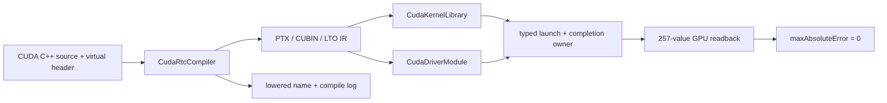

# 在 C# 中使用 TensorRtSharp4.0 动态编译并运行 CUDA Kernel

本文从 `samples/Cuda/01.RuntimeCompilation` 出发，演示如何在 C# 中调用 NVRTC 编译 CUDA C++ 源码，取得 PTX、CUBIN、LTO IR 和模板函数 lowered name，再分别通过 CUDA Runtime library 与 CUDA Driver module 启动同一个 `vector_add` kernel。最后读取 257 个结果并逐值校验，同时保留一次故意编译失败的真实日志。

本例面向需要在运行时生成或调整 CUDA kernel、但不希望在 C# public API 中操作裸 native handle 和参数指针的开发者。文中的命令只构建和运行当前源码，不创建 Tag、GitHub Release，也不发布任何包。

## 本文使用的项目与库

| 项目或库 | 作用 |
| --- | --- |
| `TensorRtSharp4.0` | 提供 CUDA/NVRTC 的 native bridge、owner 生命周期与 C# 高层 API。 |
| `JYPPX.CudaSharp` | 提供 `CudaRtcCompiler`、编译结果、内存、流、Runtime kernel 和 Driver module 封装。 |
| NVIDIA NVRTC | 把运行时提供的 CUDA C++ 源码编译成 PTX、CUBIN 或 LTO IR。 |
| CUDA Runtime / Driver | 加载编译产物、启动 kernel、同步并读回 GPU 结果。 |

`jyppxtrtbridge.dll` 只桥接项目自己的 ABI，不包含 NVRTC、CUDA、cuDNN 或 TensorRT。用户需要自行安装 CUDA Toolkit；不使用 RTC 的程序也不应因为机器缺少 NVRTC 而无法加载核心 bridge。



## 环境与依赖获取

本文实测使用 Windows 11、.NET SDK 10.0.301、NVIDIA GeForce RTX 3060 Laptop GPU、CUDA Toolkit 12.9 和 TensorRT 10.11。其他环境可以复用流程，但 bridge、CUDA 与 TensorRT 主版本必须匹配。

CUDA Toolkit 12.9 从 NVIDIA 官方 [CUDA 12.9 下载归档](https://developer.nvidia.com/cuda-12-9-0-download-archive) 安装。安装完成后，Windows `bin` 目录至少应包含：

- `nvrtc64_120_0.dll`；
- 与 Toolkit 小版本匹配的 `nvrtc-builtins64_129.dll`；
- CUDA Runtime 及其依赖。

不要单独复制一颗 NVRTC DLL 到项目输出目录。NVRTC 会按自身版本寻找匹配的 builtins；混用其他 Toolkit 的 DLL 会在编译前失败。项目提供的 smoke 脚本还会排除安装目录中的 `.alt.dll`，避免它错误查找 `nvrtc-builtins.alt*.dll`。

## 模型获取与 ONNX 转换

本案例不使用深度学习模型，也不读取或生成 ONNX。它编译的是文章后文给出的 CUDA C++ kernel 源码，因此外层 `models` 目录不需要新增任何文件，也不存在模型许可证、权重下载或 ONNX 转换步骤。

这是一个需要明确写出的“不适用”项：不能为了套用图像模型教程结构而虚构模型获取流程。需要验证 ONNX 解析、engine 构建或图像任务时，应改用 `OnnxToEngine`、`Classification` 或 `YoloVision` 示例。

## Kernel 与编译输入

示例通过虚拟头文件注入缩放系数，再编译一个普通 C linkage kernel 和一个模板 kernel：

```cpp
#include "scale.cuh"

extern "C" __global__ void vector_add(
    const float* left,
    const float* right,
    float* output,
    int count)
{
    int index = (int)(blockIdx.x * blockDim.x + threadIdx.x);
    if (index < count)
    {
        output[index] = (left[index] + right[index]) * SAMPLE_SCALE;
    }
}
```

C# 侧把源码、程序名、虚拟 header 和 name expression 组成不可变输入：

```csharp
var source = new CudaRtcProgramSource(
    sourceText,
    "runtime-compilation-sample.cu",
    new[] { new CudaRtcHeader("scale.cuh", "#define SAMPLE_SCALE 2.0f\n") },
    new[] { "&typed_identity<float>" });

var options = new CudaRtcCompileOptions(
    targetArchitecture: "compute_75",
    generateLineInfo: true);

CudaRtcCompilationResult result = CudaRtcCompiler.Compile(source, options);
if (!result.Success)
{
    throw new InvalidOperationException(result.Log);
}
```

返回的 artifact 是已经复制到 managed memory 的不可变字节，不依赖 `CudaRtcProgram` owner 继续存活。示例对相同输入连续编译两次并比较 PTX SHA256，防止选项、header 或源码在证据记录中悄悄变化。

## Runtime 与 Driver 两条启动路径

Runtime 路径使用 `CudaKernelLibrary.Load(ptx)`，Driver 路径使用 `CudaDriverModule.Load(ptx)`。两者都通过 typed arguments 传入三个 `CudaMemory` owner 和一个 `Int32`，public C# API 不暴露 `cudaKernel_t`、`CUmodule`、`CUfunction` 或参数指针数组。

```csharp
using CudaKernelLaunch launch = library.Launch(
    "vector_add",
    launchConfiguration,
    stream,
    CudaKernelArgument.FromDeviceMemory(left),
    CudaKernelArgument.FromDeviceMemory(right),
    CudaKernelArgument.FromDeviceMemory(output),
    CudaKernelArgument.FromInt32(elementCount));

launch.Synchronize();
float[] actual = output.ToSingleArray(elementCount);
```

示例还会在 `Synchronize()` 前主动释放 library/module、stream 和输入内存 owner。completion owner 必须保留这些租约，使异步 kernel 不会读到已释放资源。

## 编译并运行

从源码仓库根目录打开 PowerShell。先确认用户安装目录，再指向已经按当前 TensorRT/CUDA 版本构建的 bridge：

```powershell
$repoRoot = (Resolve-Path .).Path
$cudaRoot = $env:CUDA_PATH
$tensorRtRoot = $env:TENSORRT_PATH
$bridgePath = Join-Path $repoRoot `
  'build-out/win-x64-trt10-cuda12-release/bin/Release/jyppxtrtbridge.dll'
$nvrtcPath = Join-Path $cudaRoot 'bin/nvrtc64_120_0.dll'

if (-not (Test-Path $bridgePath)) { throw '请先构建匹配当前环境的 native bridge。' }
if (-not (Test-Path $nvrtcPath)) { throw '当前 CUDA Toolkit 未找到标准 NVRTC DLL。' }

$env:JYPPX_NATIVE_BRIDGE_PATH = $bridgePath
$env:JYPPX_NVRTC_LIBRARY = $nvrtcPath
$env:JYPPX_CUDA_ROOT = $cudaRoot
$env:JYPPX_TENSORRT_ROOT = $tensorRtRoot

dotnet build ./samples/Cuda/01.RuntimeCompilation/CudaRuntimeCompilation.csproj -c Debug
dotnet run --project ./samples/Cuda/01.RuntimeCompilation --no-build
```

也可以使用仓库脚本生成机器可读 smoke 记录：

```powershell
pwsh -NoProfile -ExecutionPolicy Bypass `
  -File ./eng/Invoke-CudaRtcLocalSmoke.ps1 `
  -BridgePath $bridgePath `
  -CudaRuntimeRoot $cudaRoot `
  -TensorRtRoot $tensorRtRoot `
  -CudaToolkitRoots $cudaRoot `
  -OutputPath ../work/cuda-rtc-local-smoke.json
```

## 已验证结果

下面是 Windows Terminal 直接执行示例后的真实窗口。终端截图来自本次真实运行的 stdout，只筛选了不含机器路径的能力、artifact、launch、readback 和退出码行，没有用手工指标卡代替程序结果。


本次实测结果：

| 检查 | 结果 |
| --- | --- |
| NVRTC capability | `available=True`，版本 `12.9` |
| PTX | 连续两次 SHA256 一致 |
| CUBIN | `4,200` bytes，目标 `sm_75` |
| LTO IR | `3,232` bytes，目标 `compute_75` |
| name expression | `&typed_identity<float>` 成功取得 lowered name |
| CUDA Runtime launch | load、launch、readback、correctness 全部为 `True` |
| CUDA Driver launch | module load、launch、readback、correctness 全部为 `True` |
| 数值校验 | 257 个 float，最大绝对误差 `0` |
| 两条路径输出 SHA256 | `65dc411b0750ae9b6543bccb381f21537d69c11802db9bb45a427c2db16aa5d1` |
| 受控错误 | `result=Compilation`，编译日志长度 `1,299` |
| 进程 | `ProcessExitCode=0` |

截图 SHA256 为 `32f9ecea8107e181f3b67fe7b19e7438b29b3c6bbfd6efaee25be448df4b7ec0`。完整运行日志 SHA256 为 `df11947880b40e472541c8dba1eed22b563da3c33e6cde17aae0390bc4281177`，轻量证据记录位于 `samples/assets/cuda-rtc-article-runtime-evidence.json`。

## 故意编译失败为什么必须保留

正常编译通过不能证明错误路径可用。示例还提交一段缺少参数声明的 kernel：

```csharp
var broken = new CudaRtcProgramSource(
    "extern \"C\" __global__ void intentionally_broken( {\n",
    "intentional-failure.cu");

CudaRtcCompilationResult failure = CudaRtcCompiler.Compile(broken, options);
```

预期是 `Success=False`、`ResultCode=Compilation` 且 `Log` 非空。依赖缺失、bridge ABI 错误和非法生命周期仍应通过明确异常或 capability diagnostic 报告，不能伪装成普通 CUDA 编译错误。

## 本地包消费检查

需要验证 bridge-only 包布局时，可以运行 `eng/Test-CudaRtcBridgePackageConsumer.ps1`。它会创建仓库外 consumer，清空远程源，确认没有 `ProjectReference`，并检查 `.Bridge` 包不包含 NVRTC 或 builtins。

这个流程只消费本地生成的候选包。当前项目尚未授权发布新包，因此文章不提供 `dotnet nuget push`、Tag 或 Release 命令，也不把 local feed 写成 NuGet.org 证明。

## 常见问题

### 为什么 capability 可用但编译提示找不到 builtins

先检查 `JYPPX_NVRTC_LIBRARY` 是否指向标准 `nvrtc64_*.dll`，不要指向同目录的 `.alt.dll`。然后确认匹配小版本的 `nvrtc-builtins` 位于同一 Toolkit 的标准目录中。

### 为什么 PTX 编译成功但 module 无法加载

当前驱动可能不支持该 Toolkit 生成的 PTX 版本。此时只能记录 compile-only 或 load-rejected，不能声称 kernel runtime 通过。降低 target architecture 也不能修复驱动/PTX ISA 不兼容。

### 为什么要同时跑 Runtime 和 Driver

CUDA 12.9 的 Runtime library 路径适合较新的 Toolkit；动态 Driver module 路径提供更直接的 module/function 语义。两条路径共享 typed argument 与 owner 约束，但必须分别验证，不能从其中一条成功推断另一条成功。

## 复查与边界

本次结果证明固定源码、CUDA Toolkit 12.9、本机驱动和当前 bridge 能完成 NVRTC compile、artifact copy、Runtime/Driver load、typed launch、GPU readback 与逐值校验。它不证明 Linux、其他 CUDA 版本、公开包或 post-publish consumer 已验证。

CUDA、NVRTC、cuDNN 和 TensorRT 继续由用户安装，不进入 Git、NuGet 或 GitHub Release。文章内容完整不等于获得发布授权；本次工作不会创建版本、Release 或发布包。
