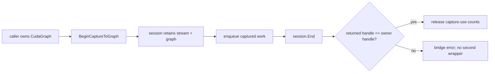
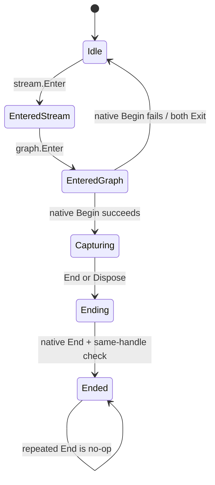

# CUDA Stream Capture To Graph 的 Owner 安全边界

`cudaStreamBeginCaptureToGraph` 的难点不是把一个函数签名翻译成 P/Invoke，
而是解释 capture 期间谁拥有 stream、谁拥有 graph，以及 `cudaStreamEndCapture`
返回的 graph 是否会制造第二个托管 owner。

## 选择范围

该入口从 CUDA 12.3 开始可用。本项目用独立的 `CUDART_VERSION >= 12030`
guard 连接 CUDA 12.3、12.9 和 13.2；CUDA 11.x 与 CUDA 12.1 仍保持
deferred，不通过生成器或 managed build 假装存在。

## Session 设计

```csharp
using CudaStreamCaptureToGraphSession session = stream.BeginCaptureToGraph(
    graph,
    Array.Empty<CudaGraphNodeDependency>(),
    CudaStreamCaptureMode.Relaxed);

// Enqueue work on stream while the session is active.
session.End();
```

开始时 session 增加 stream 和 graph 的 capture-use 计数。只要计数非零，
两个 wrapper 的 `Dispose()` 都会拒绝执行。结束时 native bridge 调用
`cudaStreamEndCapture`，验证 CUDA 返回的句柄仍然是传入的 graph，再释放计数。
因此 managed 层不会因为 End 产生第二个 graph wrapper。

dependency node token 和 edge data 只在同步 native call 内复制或 pin；它们不
会保存调用方数组地址。native helper 负责把 C++ 异常、分配失败和 Windows
SEH 转成 bridge status，异常不会跨 ABI。

## 证据与边界

TRT10/CUDA12.9 的 `CudaGraphSmokeRunner` 输出了 `ToGraph=True Nodes=1`，并
完成了后续 graph round trip。这个结果是当前兼容主机上的 source-tree
compatible-host smoke；它不是公开 NuGet 的 clean package-consumer runtime
proof，也不是 post-publish proof 或 release close approval。

对应候选审计见
`artifacts/interface-coverage/cuda-stream-capture-to-graph-candidate-audit.md`。

## 相邻的 Conditional Graph 边界

后续 conditional graph uplift 使用同一套 owner-first 原则，但不把 CUDA body
graph 句柄公开给托管层。`CudaGraphConditionalHandle` 和
`CudaGraphConditionalNode` 是 bridge-owned metadata wrapper；C# 只读取 body
数量、root/edge topology，并能向指定 body 添加 bridge-owned empty node。父图在
handle 或 node metadata wrapper 存活时拒绝 Dispose，generic node destroy 也不会
误接管 conditional node。

CUDA 12.9 smoke 已完成 IF 条件节点、两个 body、default value、instantiate/launch
和主动 owner 释放拒绝。CUDA 13.2 的本机 runtime smoke 在 CUDA error 35 处停止，
所以当前结果仍属于 source-tree/compatible-host 边界；body capture、kernel/raw
pointer node、callback 和外部资源 ownership 继续 deferred。

## 普通 capture 与 ToGraph capture 的区别

`CudaStream.BeginCapture()` 从空 capture 开始，`EndCapture()` 返回一个新的 `CudaGraph` owner。ToGraph 变体则把
capture 写入调用方已经拥有的 graph；结束时 CUDA 仍返回 graph handle，但该 handle 必须与传入 owner 相同。如果 managed
层再包装一次，就会出现两个 owner 对同一 native graph 重复释放。



这也是为什么 API 返回 `CudaStreamCaptureToGraphSession`，而不是简单 bool 或新 `CudaGraph`。

## Begin 的异常回滚

`src/JYPPX.CudaSharp/Streams/CudaStream.cs` 中的 `BeginCaptureToGraph` 先增加 stream capture-use count，再增加 graph count，
最后调用 native begin。任一步失败都会按相反顺序回滚已经增加的 count。成功后 session 同时保存两个强引用，使 GC 也无法
在 capture 期间回收 wrapper。



stream 或 graph 的 `Dispose()` 在 active count 非零时抛出，避免 native capture 仍引用已释放资源。这是主动 fail closed，
不是等待 CUDA 报随机 invalid handle。

## Session 的幂等 End

`src/JYPPX.CudaSharp/Streams/CudaStreamCaptureToGraphSession.cs` 用 lifecycle lock 和 `_ended` 实现幂等：

```csharp
public void End()
{
    lock (_lifecycleGate)
    {
        if (_ended)
        {
            return;
        }

        try
        {
            NativeCaptureEnd();
        }
        finally
        {
            _ended = true;
            _graph.ExitCaptureToGraphSession();
            _stream.ExitCaptureToGraphSession();
        }
    }
}
```

即便 native end 或 same-handle validation 抛异常，managed capture-use count 也会释放，防止 wrapper 永久卡在不可 dispose
状态。异常仍应向调用方报告，不能把 `IsEnded=True` 误解成 capture 成功；它只表示 session 已关闭。

`Dispose()` 调用 `End()`，所以正常使用可写成显式 `session.End()`，也可让 using 在异常路径结束 capture。对于需要精确处理
End error 的应用，建议显式 End，并保存异常与 bridge diagnostic。

## Dependency 与 edge data 不逃逸

begin 接受 `CudaGraphNodeDependency[]`，其中 node 必须属于目标 graph，edge data 描述 dependency 语义。managed 数组只在
同步 bridge 调用期间转换和 pin/copy；native helper 不保存数组地址。传入来自另一个 graph 的 node 应被拒绝，不能为了调用
成功只传裸 handle。

空 dependency 数组适合最小 smoke：

```csharp
using CudaGraph targetGraph = new CudaGraph();
using CudaStreamCaptureToGraphSession session = stream.BeginCaptureToGraph(
    targetGraph,
    Array.Empty<CudaGraphNodeDependency>(),
    CudaStreamCaptureMode.Relaxed);

device.FillAsync(0x5A, byteCount, stream);
session.End();
Console.WriteLine($"ToGraph=True Nodes={targetGraph.NodeCount}");
```

`Relaxed` mode 不消除 owner 和 thread-safety 约束，只改变 CUDA 对某些跨线程/隐式操作的 capture 限制。

## ABI、guard 与 deferred history

真实入口由 `native/manifests/cuda/cuda-fifty-seventh-batch-stream-capture-to-graph.manifest.json` 声明，guard 为
CUDA 12.3+。旧的 `native/manifests/cuda/cuda-thirty-fifth-batch-stream-device-boundaries.manifest.json` 仍保留
deferred history；`eng/Export-InterfaceCoverageMatrix.ps1` 用真实 ID alias 把官方函数投影为
`implemented-with-deferred-history`。

| CUDA toolkit | BeginCaptureToGraph | 文档状态 |
| --- | --- | --- |
| 11.8 | vendor 无入口 | deferred / not applicable |
| 12.1 | vendor 无入口 | deferred / not applicable |
| 12.3 | version-guarded entry | implemented-with-deferred-history |
| 12.9 | version-guarded entry + compatible-host smoke | implemented-with-deferred-history |
| 13.2 | version-guarded entry，当前主机 driver blocked | implemented-with-deferred-history |

guard 解决“能否编译/调用”，不解决“当前 driver 能否执行”。CUDA 13.2 的 error 35 必须保留为环境 blocker。

## 可复现 smoke

```powershell
$repo = "E:\GitSpace\TensorRT-CSharp-API-4.0\TensorRtSharp4.0"
$case = "E:\TensorRtSharpAssets\cases\cuda-capture-to-graph"
New-Item -ItemType Directory -Force -Path "$case\logs" | Out-Null
Set-Location $repo

dotnet build .\smoke\CudaGraphSmokeRunner\CudaGraphSmokeRunner.csproj -c Debug --no-restore --nologo
$env:JYPPX_ENABLE_DEVELOPMENT_PROBING = "1"
dotnet .\smoke\CudaGraphSmokeRunner\bin\Debug\net8.0\CudaGraphSmokeRunner.dll `
  2>&1 | Tee-Object "$case\logs\cuda-graph.log"
```

runner 很大，`ToGraph=True Nodes=1` 只是一段 `StreamVariants`。完整成功还会输出 capture round-trip、captured topology、
manual topology 和 graph memory 等 marker。ToGraph skipped 时，应单独读取 `ToGraphSkipped:<reason>`，不能用其他 graph
能力的成功覆盖它。

## 如何读 `ToGraph=True`

该 marker 能说明：

- 当前 runtime 接受 begin-to-existing-graph。
- session 完成 End，same-graph validation 未失败。
- target graph 中出现预期 captured node。

它不能说明：

- 所有 dependency/edge data 组合都验证过。
- TensorRT enqueue 已在 capture 中执行。
- graph instantiate/launch 的业务输出已对某个真实模型验证。
- CUDA 13.2 或 clean package consumer 已通过。

若要将其用于更强 runtime record，还需保存 target graph topology、instantiate/launch、readback、host metadata、runtime package
key、stdout/stderr 与 validator。

## Dispose 与失败场景

**capture 中 dispose stream/graph**：预期主动抛出，说明 owner guard 生效；catch 后仍要通过 session.End/Dispose 收口。

**End 返回不同 graph handle**：这是 ownership contract 破坏，bridge 必须失败，managed 层不创建第二个 owner。

**Begin 失败后无法 dispose**：检查异常回滚是否执行了 graph/stream Exit；这是质量测试应覆盖的状态。

**End 重复调用**：第二次为 no-op；若业务需要知道首次是否成功，应自己保存首次异常/结果，不只看 `IsEnded`。

**node 来自其他 graph**：应在 owner identity 校验处拒绝，不能把跨 graph handle 当 dependency。

**CUDA error 35**：记录 driver/runtime 不兼容，换兼容 host；不要删除 guard 或改为 false success。

## 与 Conditional Graph 的分界

ToGraph capture 解决“已有 graph + stream capture”的 owner 问题；conditional graph 还包含 conditional handle、node metadata、
多个 body graph 和 CUDA 13 v2 能力。二者可以共享 parent owner guard 思路，但不能共享 proof。body capture、raw kernel pointer、
外部 semaphore/resource 和 callback 仍需独立设计。

## 验收清单

- public surface 只有 typed stream、graph、dependency 和 session，无 `IntPtr`/`SafeHandle` 逃逸。
- Begin 的 stream/graph count 增加与失败回滚成对。
- active session 阻止两个 owner Dispose。
- End 验证 same graph handle，并在 finally 释放 counts。
- End/Dispose 幂等，异常路径可诊断。
- CUDA 12.3+ guard 与 unsupported line 行为可测试。
- coverage 使用真实 alias 且保留 deferred history。
- smoke 分开记录 ToGraph、round-trip、launch/readback 与环境 blocker。

## Proof boundary 与延伸阅读

本文完成 source-quality 与 owner-safety 教程，不新增 runtime 执行，不执行发布，也不改变外部 proof 状态。
`performsPublish=false`、`canPublishPublicly=false`、`canCloseReleaseIssue=false`。

继续阅读：[CUDA Graph 能力边界](cuda-graph-capabilities-boundary.md)、
[CUDA Stream/Event 多流教程](cuda-stream-event-multistream-tutorial.md) 与
[接口清零到 deferred 边界](interface-zero-to-deferred-boundary.md)。
