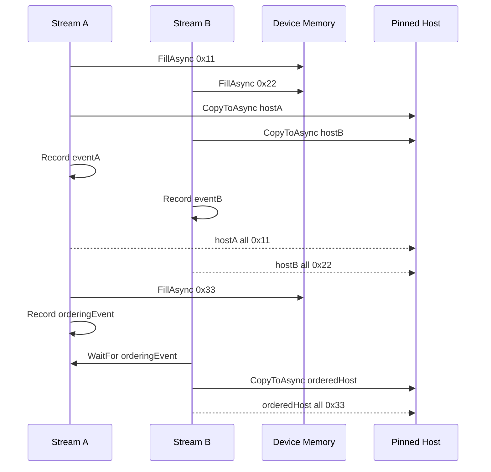
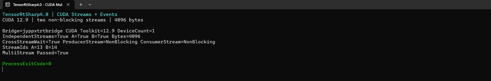

# 使用 TensorRtSharp4.0 在 C# 中实现 CUDA 多流与 Event 同步

GPU 工作不必全部挤在默认流中串行执行。数据拷贝、预处理、TensorRT 推理和后处理可以放到不同 CUDA stream，再用 event 表达“消费者必须等生产者完成”的依赖关系。这样既能保留并行机会，又不会依赖 CPU 忙等来维持正确顺序。

TensorRtSharp4.0 的 `MultiStream` 示例使用两个非阻塞 CUDA stream，先验证彼此独立的异步填充和读回，再验证跨 stream event wait。本文从环境准备开始，逐步完成显存、锁页内存、stream、event、异步操作和结果校验，并给出真实 GPU 运行截图。

## 适用读者

本文适合希望在 C# 中理解 CUDA stream/event 基础语义的开发者，也适合准备把数据传输、预处理和 TensorRT enqueue 拆到不同 stream 的维护者。

## 本文使用的项目与库

| 组件 | 本文中的职责 |
| --- | --- |
| TensorRtSharp4.0 | 示例所在项目，提供 CUDA/TensorRT 的 owner-safe C# API。 |
| `JYPPX.CudaSharp` | 管理 CUDA stream、event、device memory 和 pinned host memory。 |
| `jyppxtrtbridge` | 连接托管接口与本机 CUDA ABI，不携带 NVIDIA 运行库。 |
| NVIDIA CUDA Runtime | 执行异步填充、复制、事件记录与跨流等待。 |
| .NET | 编译并运行 C# 示例。 |

本文实测环境为 Windows 11、NVIDIA GeForce RTX 3060 Laptop GPU、驱动 576.02、CUDA 12.9 和 .NET SDK 10.0.301。CUDA、cuDNN、TensorRT 和 NVRTC 均由用户自行安装，仓库及后续发布物不打包这些厂商运行库。

## 模型获取与 ONNX 转换

这个示例**没有使用深度学习模型，也不需要 ONNX 文件**。它只操作 4096 字节的 device memory，用固定字节值验证两条 stream 和 event ordering。因此没有模型下载、权重许可证、ONNX 转换或外层 `models` 暂存文件。

示例同样不要求 TensorRT Engine。它验证的是更底层的 CUDA 并发原语，后续可以把相同 stream/event 组合用于真实 TensorRT 推理。

## 环境准备

安装 [.NET SDK](https://dotnet.microsoft.com/download/dotnet) 和 [CUDA Toolkit](https://developer.nvidia.com/cuda-downloads)，然后生成与 CUDA 主版本匹配的桥接库。进入仓库根目录后设置：

```powershell
$RepoRoot = (Get-Location).Path
$env:CUDA_PATH = '<你的 CUDA Toolkit 安装目录>'
$env:JYPPX_CUDA_ROOT = $env:CUDA_PATH
$env:JYPPX_NATIVE_BRIDGE_PATH = Join-Path $RepoRoot 'build-out\win-x64-trt10-cuda12-release\bin\Release\jyppxtrtbridge.dll'
$env:JYPPX_ENABLE_DEVELOPMENT_PROBING = 'true'
```

这里使用 TRT10/CUDA12 的桥接目录只是因为本次构建组合如此；MultiStream 实际只调用 CUDA 接口。切换 CUDA 主版本时仍应选择对应桥接构建产物。

## 示例验证的两段流程

源码位于 `samples/MultiStream/Program.cs`，固定操作 4096 字节。

### 独立 Stream

第一段创建 `streamA` 和 `streamB`：

- `streamA` 把 `deviceA` 填为 `0x11`，再异步复制到 `hostA`。
- `streamB` 把 `deviceB` 填为 `0x22`，再异步复制到 `hostB`。
- 两条 stream 各自记录 event，CPU 等待 event 完成后检查全部字节。

两份 host buffer 都正确，才会输出 `IndependentStreams=True`。

### 跨 Stream Event Wait

第二段让 `streamA` 把 `deviceA` 填为 `0x33`，并记录 `orderingEvent`。`streamB` 先等待该 event，再把 `deviceA` 复制到新的 pinned host buffer。全部字节都是 `0x33`，才会输出 `CrossStreamWait=True`。



## 一步步实现

### 1. 探测 CUDA 环境

```csharp
CudaEnvironmentSnapshot snapshot = CudaEnvironmentProbe.GetCurrent();
Console.WriteLine(
    $"Bridge={snapshot.BuildInfo.BridgeName} " +
    $"CUDA Toolkit={snapshot.BuildInfo.CudaToolkitVersion} " +
    $"DeviceCount={snapshot.CudaRuntimeInfo.DeviceCount}");
```

如果 CUDA runtime 不可用，示例会输出 `MultiStream=Skipped` 并结束，不会把跳过状态写成成功。

### 2. 创建资源并限定生命周期

```csharp
using CudaStream streamA =
    new CudaStream(CudaStreamCreationFlags.NonBlocking);
using CudaStream streamB =
    new CudaStream(CudaStreamCreationFlags.NonBlocking);

using CudaMemory deviceA = new CudaMemory(ByteCount);
using CudaMemory deviceB = new CudaMemory(ByteCount);
using CudaPinnedMemory hostA = new CudaPinnedMemory(ByteCount);
using CudaPinnedMemory hostB = new CudaPinnedMemory(ByteCount);
using CudaEvent eventA = new CudaEvent();
using CudaEvent eventB = new CudaEvent();
```

`using` 保证 event、pinned memory、device memory 和 stream 都有清晰所有权。异步操作完成前不能提前释放任何相关对象。

### 3. 提交两条独立异步任务

```csharp
deviceA.FillAsync(0x11, ByteCount, streamA);
deviceB.FillAsync(0x22, ByteCount, streamB);
deviceA.CopyToAsync(hostA, ByteCount, streamA);
deviceB.CopyToAsync(hostB, ByteCount, streamB);
eventA.Record(streamA);
eventB.Record(streamB);
eventA.Synchronize();
eventB.Synchronize();

bool streamAOk = hostA.ToArray(ByteCount)
    .All(static value => value == 0x11);
bool streamBOk = hostB.ToArray(ByteCount)
    .All(static value => value == 0x22);
```

同一 stream 内的操作按提交顺序执行；两条不同 stream 之间没有隐式顺序。

### 4. 用 Event 建立跨流依赖

```csharp
using CudaPinnedMemory orderedHost = new CudaPinnedMemory(ByteCount);
using CudaEvent orderingEvent = new CudaEvent();

deviceA.FillAsync(0x33, ByteCount, streamA);
orderingEvent.Record(streamA);
streamB.WaitFor(orderingEvent);
deviceA.CopyToAsync(orderedHost, ByteCount, streamB);
streamB.Synchronize();

bool crossStreamWaitOk = orderedHost.ToArray(ByteCount)
    .All(static value => value == 0x33);
```

`WaitFor` 把依赖提交到 GPU。CPU 不需要先同步 `streamA` 再提交 `streamB`，从而保留了异步调度空间。

## 编译并运行

从仓库根目录编译 Release 示例：

```powershell
dotnet build .\samples\MultiStream\MultiStream.csproj `
  -c Release `
  --no-restore `
  /p:UseSharedCompilation=false
```

运行：

```powershell
dotnet .\samples\MultiStream\bin\Release\net8.0\MultiStream.dll
```

这个示例没有命令行参数。CUDA 版本和桥接库由环境变量与本机安装决定。

## 真实运行结果

下面是 Release 示例的真实 Windows Terminal 运行窗口。图片只裁掉了输出结束后的空白区域，没有重绘或改写终端内容；终端截图来自本次真实运行的 stdout。



完整输出如下：

```text
Bridge=jyppxtrtbridge CUDA Toolkit=12.9 DeviceCount=1
IndependentStreams=True A=True B=True Bytes=4096
CrossStreamWait=True ProducerStream=NonBlocking ConsumerStream=NonBlocking
StreamIds A=13 B=14
MultiStream Passed=True
ProcessExitCode=0
```

| 检查项 | 实测结果 | 说明 |
| --- | --- | --- |
| CUDA 设备 | `DeviceCount=1` | CUDA runtime 找到 1 个设备。 |
| 独立 stream A | `A=True` | 4096 字节全部为 `0x11`。 |
| 独立 stream B | `B=True` | 4096 字节全部为 `0x22`。 |
| 跨流等待 | `CrossStreamWait=True` | event wait 后 4096 字节全部为 `0x33`。 |
| Stream flags | 两条均为 `NonBlocking` | 没有依赖默认流的隐式同步。 |
| Stream id | A=13 / B=14 | 仅对应本次进程，不应写成固定业务常量。 |
| 进程状态 | `ProcessExitCode=0` | 示例正常退出。 |

机器可读证据位于 `samples/assets/cuda-multistream-article-runtime-evidence.json`，其中保存源文件、程序集、桥接库、原始日志和截图 SHA256。测试会重新计算仓库内源文件与截图哈希。

## 与 TensorRT 推理的关系

TensorRT 的异步 enqueue 同样接收 CUDA stream。真实管线可以让一条 stream 执行 host-to-device copy，另一条执行预处理，再由推理 stream 等待 preprocessing event。推理完成后，后处理 stream 再等待 inference event。

这并不意味着 stream 越多越快。是否能够并行取决于数据依赖、GPU 资源占用、copy engine 和 kernel 调度；应先保证 event ordering 正确，再使用真实工作负载测量。

## 常见问题

### 输出 `MultiStream=Skipped`

这表示 CUDA runtime 或驱动不可用。先检查用户安装的 CUDA、显卡驱动、桥接库版本和环境变量，不要把 skipped 状态当作运行通过。

### `IndependentStreams=False`

检查异步 copy 前的 fill 是否提交到相同 stream，并确认 event 在 copy 之后记录。过早读取 pinned host memory 会得到尚未完成的数据。

### `CrossStreamWait=False`

确认 event 由生产者 stream 记录，消费者 stream 在 copy 前调用 `WaitFor`。event 记录和 wait 的顺序反了，就没有建立正确依赖。

### CUDA error 35

这通常说明显卡驱动不支持所加载的 CUDA runtime。应修正驱动、CUDA 与桥接库组合，而不是删掉同步检查。

## 本文结论与边界

本次实测验证了两个非阻塞 CUDA stream、异步显存填充、异步 device-to-host copy、pinned memory、event record/synchronize 和跨 stream wait，并对三组 4096 字节结果进行了逐字节校验。

该结果不包含 TensorRT Engine，也不代表真实模型推理管线已经获得性能提升。本文没有创建 Release，没有发布 NuGet/GitHub Packages，也没有执行 post-publish 验证。

## 下一步

- [ExecutionContext 与 Inference Binding](inference-bindings-tutorial.md)
- [Dynamic Shape 与 Optimization Profile](dynamic-shape-optimization-profile-tutorial.md)
- [CUDA Runtime Compilation](cuda-runtime-compilation-technical-article.md)
