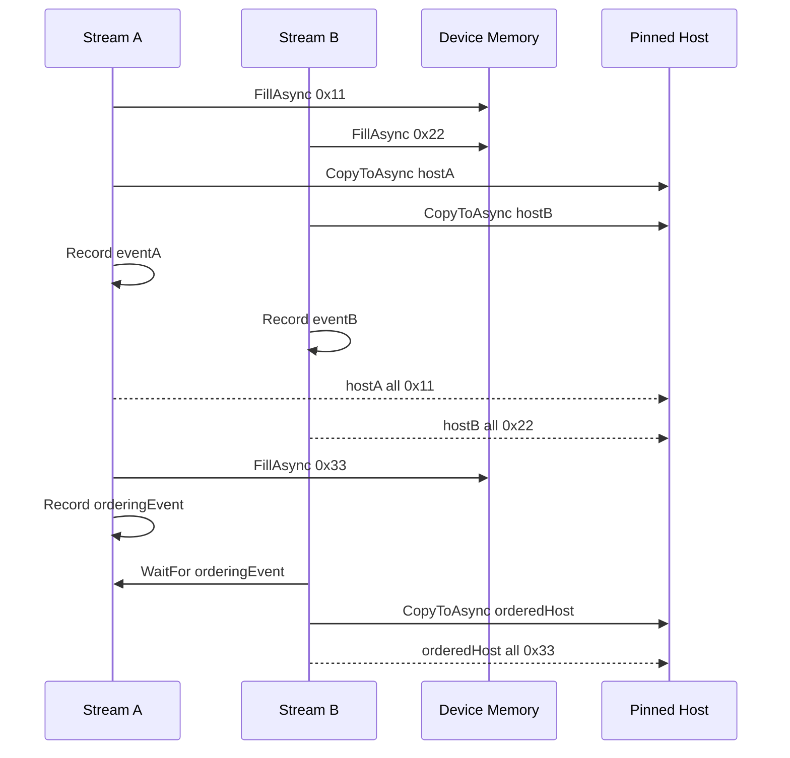

# CUDA Stream/Event 与跨 Stream 同步：一个最小多流样例

TensorRT 推理应用里，GPU 工作通常不是单线程排队完成的。预处理、拷贝、推理、后处理可能分别挂到不同 CUDA stream 上，再用 event 建立顺序约束。TensorRtSharp4.0 的 `samples/MultiStream` 用一个很小的样例演示这套基础能力：两个 non-blocking stream、异步填充、异步 copy、event record/synchronize，以及跨 stream wait。

这个样例不依赖 TensorRT，只验证 CUDA wrapper 的 stream/event/memory 基础能力。

## 样例位置

```text
samples/MultiStream/Program.cs
samples/MultiStream/README.md
```

## 样例目标

样例分成两段：

1. 两个 stream 分别填充不同 device memory，并异步复制到 pinned host memory，证明独立 stream 工作正常。
2. stream A 填充数据并记录 event，stream B 等待 event 后读取同一块 device memory，证明跨 stream ordering 正常。



## 运行命令

构建：

```powershell
dotnet build .\TensorRtSharp.sln -c Debug --no-restore /p:UseSharedCompilation=false
```

启用开发探测：

```powershell
$env:JYPPX_ENABLE_DEVELOPMENT_PROBING = "1"
```

运行：

```powershell
dotnet .\samples\MultiStream\bin\Debug\net8.0\MultiStream.dll
```

## 关键代码

创建两个 non-blocking stream：

```csharp
using CudaStream streamA = new CudaStream(CudaStreamCreationFlags.NonBlocking);
using CudaStream streamB = new CudaStream(CudaStreamCreationFlags.NonBlocking);
```

分配 device memory 和 pinned host memory：

```csharp
using CudaMemory deviceA = new CudaMemory(ByteCount);
using CudaMemory deviceB = new CudaMemory(ByteCount);
using CudaPinnedMemory hostA = new CudaPinnedMemory(ByteCount);
using CudaPinnedMemory hostB = new CudaPinnedMemory(ByteCount);
```

独立 stream 异步填充和读回：

```csharp
deviceA.FillAsync(0x11, ByteCount, streamA);
deviceB.FillAsync(0x22, ByteCount, streamB);
deviceA.CopyToAsync(hostA, ByteCount, streamA);
deviceB.CopyToAsync(hostB, ByteCount, streamB);
eventA.Record(streamA);
eventB.Record(streamB);
eventA.Synchronize();
eventB.Synchronize();
```

跨 stream wait：

```csharp
deviceA.FillAsync(0x33, ByteCount, streamA);
orderingEvent.Record(streamA);
streamB.WaitFor(orderingEvent);
deviceA.CopyToAsync(orderedHost, ByteCount, streamB);
streamB.Synchronize();
```

这段代码对应真实应用里的常见模式：一个 stream 产出数据，另一个 stream 在 event 之后消费数据。

## 输出 markers

成功时输出：

```text
Bridge=... CUDA Toolkit=... DeviceCount=...
IndependentStreams=True A=True B=True Bytes=4096
CrossStreamWait=True ProducerStream=NonBlocking ConsumerStream=NonBlocking
StreamIds A=... B=...
MultiStream Passed=True
```

| Marker | 含义 |
| --- | --- |
| `IndependentStreams=True` | 两个 stream 的异步填充与读回都正确。 |
| `CrossStreamWait=True` | event-based stream wait 生效。 |
| `StreamIds A=... B=...` | 当前 CUDA stream id 可查询，若 runtime 不支持会给出诊断。 |
| `MultiStream Passed=True` | 样例完成。 |

## 和 TensorRT 推理的关系

TensorRT execution context enqueue 通常也接收 CUDA stream。多 stream 样例可作为未来图像预处理管线的基础：

- stream A 做 host-to-device copy。
- stream B 做 CUDA preprocessing。
- stream C 做 TensorRT enqueue。
- stream D 做 postprocess 或 device-to-host copy。
- event 在各阶段之间建立顺序。

当前样例只验证 CUDA stream/event/memory wrapper，不声称已有完整图像预处理 kernel pipeline。

## 排障边界

如果本机 CUDA runtime 不可用，样例会输出：

```text
MultiStream=Skipped Reason=...
```

这表示环境或 driver/runtime 兼容性问题，不是 CUDA wrapper 完成度宣传，也不是 TensorRT callback proof。

如果 CUDA 13.2 runtime package 在当前机器返回 CUDA error 35，应先升级驱动或换兼容机器复测。

## 下一步

继续阅读：

- [ExecutionContext 与 Inference Binding](inference-bindings-tutorial.md)
- [Dynamic Shape 与 Optimization Profile](dynamic-shape-optimization-profile-tutorial.md)
- [常见问题排查总表](troubleshooting-index.md)

## 第二批正文门禁

### 适用读者

本文适合需要理解 CUDA stream/event 基础语义的 TensorRtSharp 用户，也适合准备把预处理、推理、后处理拆到不同 stream 的样例维护者。

### 解决问题

多 stream 的核心问题是顺序：一个 stream 产出数据，另一个 stream 消费数据时，必须用 event 表达依赖。本文用最小样例解释如何让 ordering 可见、可诊断、可测试。

### 核心思路

核心思路是把“能创建 stream”和“能证明跨 stream ordering”分开。`IndependentStreams=True` 是基础 smoke，`CrossStreamWait=True` 才说明 event wait 生效；二者仍不是 TensorRT runtime proof。

### 操作路径

先运行 `CudaSmokeRunner` 确认 runtime 可用，再运行 `samples/MultiStream` 记录 `IndependentStreams=True`、`CrossStreamWait=True`、`MultiStream Passed=True`。进入 TensorRT 场景后，再把同样的 stream/event 语义用于 H2D、enqueue、D2H 和后处理。

### 边界说明

build-only、dry-run、template、local feed、ProjectReference、direct `.nupkg`、TensorRtExec report、YoloVision matrix、OnnxToEngine report、readonly diagnostics 都不是 runtime proof。真实 proof 需要模型或最小 engine、host metadata、hash、stdout/stderr summary 和 validator。

### 下一步

下一步把 MultiStream 的 evidence markers 接入更完整的 CUDA 基础文章链路，并在真实 TensorRT enqueue 样例中复用同一套 stream/event 诊断语言。
