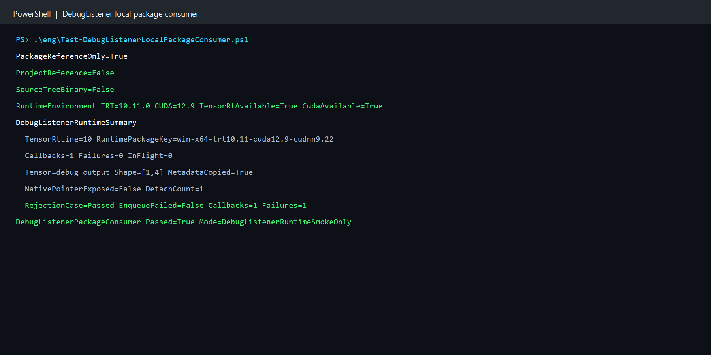

# 用本地 NuGet 包验证 TensorRT DebugListener：从调试张量到真实回调

> 项目：TensorRtSharp4.0
>
> 主要库：`JYPPX.TensorRtSharp`、`JYPPX.CudaSharp`、`jyppxtrtbridge`
>
> 示例：`samples/DebugListener.PackageConsumer`
>
> 本机结果：TensorRT 10.11、CUDA 12.9、NVIDIA GeForce RTX 3060 Laptop GPU
>
> 证据边界：本文验证本地 managed 包与 bridge-only 包，不代表公开源下载、Release 或发布后验证。

## 1. 项目与功能背景

TensorRtSharp4.0 为 TensorRT 与 CUDA 提供 C# 接口。`JYPPX.TensorRtSharp` 负责 builder、network、engine、execution context 和 callback owner，`JYPPX.CudaSharp` 负责 CUDA stream 与 device memory，`jyppxtrtbridge` 把稳定的 C ABI 映射到 NVIDIA C++ API。

TensorRT 10/11 的 `IDebugListener::processDebugTensor` 可以在 enqueue 时接收被标记张量的调试通知。原生回调包含 tensor 地址和 stream 等短生命周期资源，不能直接交给托管业务代码长期保存。因此本项目的 `TensorRtDebugListenerCallbackOwner` 只向 C# handler 传递复制后的名称、数据类型、位置和 shape，并把原生指针保留在 bridge 内部。

源码树 smoke 已经验证过 native owner。本文进一步回答一个更接近用户安装的问题：只引用本地生成的 managed 包与 bridge-only 包、完全不引用源码项目时，DebugListener 是否仍能安装 native vtable、收到真实回调、读取复制元数据，并在正负例之后安全 detach。

## 2. 依赖与包职责

用户需要自行安装 .NET 8 SDK、NVIDIA 驱动、CUDA Toolkit 和匹配的 TensorRT SDK。本项目不打包 CUDA、cuDNN、TensorRT 或 NVRTC。

外部消费者只引用两个本地候选包：

| 包 | 作用 | 边界 |
| --- | --- | --- |
| `JYPPX.TensorRT.CSharp.API` | 提供 `JYPPX.TensorRtSharp` 与 `JYPPX.CudaSharp` 托管接口 | 不含 NVIDIA DLL |
| `...Runtime.win-x64.trt10.11.cuda12.9.cudnn9.22.Bridge` | 提供匹配版本的 `jyppxtrtbridge.dll` | 只含 bridge，不含 vendor runtime |

运行前，示例通过 `TensorRtEnvironmentProbe.GetCurrent()` 读取 bridge build info，并要求 TensorRT 主版本与 `TensorRtApiLine` 一致。版本不匹配时立即失败，不用错误 ABI 继续执行。

## 3. 模型获取与转换说明

这个案例验证 callback ABI 和生命周期，不依赖训练权重、ONNX 文件或输入图片：

- 模型名称：程序内构造的 `[1,4]` FP32 identity network；
- 官方获取方式：不适用，没有模型下载地址；
- 权重许可证和 SHA256：不适用，没有权重文件；
- ONNX 转换方式：不适用，直接调用 TensorRT network API；
- 外部模型目录：不读写 `<workspace-root>/models`；
- 图像识别结果：不适用，本例没有视觉任务；
- 结果可视化：使用真实终端运行截图，不伪造图像识别画面；
- ONNX 与 plan：不生成 ONNX，序列化 plan 只在当前进程内持有。

分类、检测、分割、姿态和 OBB 演示仍必须在各自文章中写清官方模型来源、许可证、权重哈希、ONNX 导出命令和外部 `models` 暂存位置，并把识别结果绘制到输入图像上。本例不替代视觉模型文章的这些要求。

## 4. 生成本地测试包

先按本机 CUDA/TensorRT 组合编译 bridge，再生成 managed 与 bridge-only 本地候选包：

```powershell
powershell -NoProfile -ExecutionPolicy Bypass `
  -File .\eng\Invoke-LocalSplitRuntimePackage.ps1 `
  -SourceRuntimeKey win-x64-trt10.11-cuda12.9-cudnn9.22 `
  -Version 4.0.0 `
  -SkipConsumerValidation `
  -TensorRtRoot <TensorRT-root> `
  -CudaRoot <CUDA-root>
```

该命令只在本地生成候选文件，不创建 tag、GitHub Release，也不推送 NuGet 或 GitHub Packages。包审计会拒绝 `nvinfer`、`nvonnxparser`、`cudnn`、`cudart` 和 `nvrtc` vendor binary。

## 5. 仓库外消费者如何隔离

`Test-DebugListenerLocalPackageConsumer.ps1` 调用公共 callback-owner 验证器，在 Git 仓库之外创建一次性消费者目录。验证过程包括：

1. `NuGet.config` 使用 `<clear />`，只加入 managed 与 bridge 两个本地源；
2. 使用独立 package cache；
3. 项目只含两个 `PackageReference`，没有 `ProjectReference` 或 `HintPath`；
4. 移除 `JYPPX_NATIVE_BRIDGE_PATH`；
5. 移除 `JYPPX_ENABLE_DEVELOPMENT_PROBING`；
6. 比对消费者输出中的 bridge 与 nupkg entry 的 SHA256；
7. 扫描包和输出目录，要求 NVIDIA vendor runtime binary 数量为 0。

项目模板只有以下两个依赖：

```xml
<ItemGroup>
  <PackageReference Include="JYPPX.TensorRT.CSharp.API" Version="4.0.0" />
  <PackageReference
    Include="JYPPX.TensorRT.CSharp.API.Runtime.win-x64.trt10.11.cuda12.9.cudnn9.22.Bridge"
    Version="4.0.0" />
</ItemGroup>
```

因此运行成功不能由源码树 DLL、开发探测路径或项目引用解释。

## 6. 构造并标记调试张量

示例直接创建一个 identity network：

```csharp
using TensorRtNetworkDefinition network =
    builder.CreateNetwork(TensorRtNetworkDefinitionCreationFlags.ExplicitBatch);
using TensorRtTensor input = network.AddInput(
    "debug_input",
    TensorRtDataType.Float,
    new TensorRtDims(new[] { 1, 4 }));
using TensorRtLayer identity = network.AddIdentity(input);
using TensorRtTensor output = identity.GetOutput(0);
output.Name = "debug_output";
network.MarkOutput(output);

if (!network.MarkDebugTensor(output) || !network.IsDebugTensor(output))
{
    throw new InvalidOperationException("Debug tensor mark was not retained.");
}
```

build-time debug mark 会进入序列化 engine。反序列化后，示例为输入和输出各分配 4 个 FP32 的 CUDA 缓冲区，并在 execution context 中绑定 `debug_input` 与 `debug_output`。

## 7. 正例：接收复制后的调试元数据

正例 handler 保存 `TensorRtDebugTensorMetadataSnapshot`，然后返回 `true`：

```csharp
TensorRtDebugTensorMetadataSnapshot copiedMetadata = default;
using TensorRtDebugListenerCallbackOwner owner = new(
    TensorRtApiLine.TensorRt10,
    metadata =>
    {
        copiedMetadata = metadata;
        return true;
    });

context.SetDebugListener(owner);
context.SetTensorDebugState("debug_output", true);
context.EnqueueAsync(stream);
stream.Synchronize();
```

enqueue 完成后读取 pointer-free runtime snapshot，再显式解除 listener：

```csharp
TensorRtDebugListenerRuntimeSnapshot attached = owner.GetRuntimeSnapshot();
bool cleared = context.ClearDebugListener();
TensorRtDebugListenerRuntimeSnapshot detached = owner.GetRuntimeSnapshot();
```

正例必须同时满足：native vtable 已安装、真实 `processDebugTensor` 调用次数大于零、failure 和 in-flight 均为零、tensor 名称为 `debug_output`、shape 为 `[1,4]`、元数据已复制、没有暴露 borrowed pointer，并且 clear 后 owner 与 context 都不再保持 listener。

## 8. 负例：handler 返回 false

第二个 execution context 使用固定返回 `false` 的 handler：

```csharp
using TensorRtDebugListenerCallbackOwner rejectedOwner = new(
    TensorRtApiLine.TensorRt10,
    _ => false);
```

TensorRT 10.11 在这个 identity network 上仍完成 enqueue，但 native owner 会记录 callback rejection：

- `InvocationCount > 0`；
- `FailureCount > 0`；
- `LastCallbackSucceeded == false`；
- `IsRealCallbackRuntimeProof == false`；
- in-flight 回调归零；
- clear 和 detach 成功。

所以该 API 的 fail-closed 判定不能只看 enqueue 是否抛异常。验证器同时检查 failure counter、最后回调状态、in-flight drain 和 detach 生命周期，拒绝把负例误报为真实运行证明。

## 9. 执行完整验证

在仓库根目录执行：

```powershell
powershell -NoProfile -ExecutionPolicy Bypass `
  -File .\eng\Test-DebugListenerLocalPackageConsumer.ps1 `
  -TensorRtRoot <TensorRT-root> `
  -CudaRoot <CUDA-root>
```

脚本依次执行包内容审计、仓库外 restore、Release build、真实 TensorRT 运行、marker 严格解析、bridge 哈希比对、vendor DLL 扫描、证据报告写入和外部工作目录清理。现场诊断时可以加 `-KeepWorkspace`，保留的目录仍位于 Git 仓库之外，不应提交。

## 10. 本机执行结果

```text
PackageReferenceOnly=True
ProjectReference=False
SourceTreeBinary=False
RuntimeEnvironment TRT=10.11.0 CUDA=12.9 TensorRtAvailable=True CudaAvailable=True
DebugListenerRuntimeSummary
  TensorRtLine=10 RuntimePackageKey=win-x64-trt10.11-cuda12.9-cudnn9.22
  Callbacks=1 Failures=0 InFlight=0
  Tensor=debug_output Shape=[1,4] MetadataCopied=True
  NativePointerExposed=False DetachCount=1
  RejectionCase=Passed EnqueueFailed=False Callbacks=1 Failures=1
DebugListenerPackageConsumer Passed=True Mode=DebugListenerRuntimeSmokeOnly
```



截图来自同一次 package consumer stdout。完整长 marker 保存在 `samples/assets/debug-listener-local-package-consumer-tensorrt10.11.txt`，包哈希、源码哈希、截图哈希和边界记录在 `samples/assets/debug-listener-local-package-consumer-tensorrt10.11-evidence.json`。

## 11. 结果解读

| 检查项 | 本机结果 | 结论 |
| --- | ---: | --- |
| `PackageReferenceOnly` | True | 消费者只通过本地 NuGet 包引用接口。 |
| `ProjectReference` | False | 没有源码项目引用。 |
| `NativeVTableInstalled` | True | bridge 创建并安装了原生 listener。 |
| `InvocationCount` | 1 | TensorRT 真实进入 `processDebugTensor`。 |
| `FailureCount` | 0 | 正例 handler 成功。 |
| `InFlightCallbackCount` | 0 | 同步后没有未结束回调。 |
| tensor / shape | `debug_output` / `[1,4]` | 复制后的元数据符合网络定义。 |
| `MetadataCopied` | True | 托管层读取的是独立快照。 |
| `BorrowedPointerExposed` | False | 原生 tensor 地址和 stream 未暴露。 |
| `DetachCount` | 1 | listener 已安全解除。 |
| 负例 failure | 1 | handler 拒绝被明确记录。 |
| Vendor binary count | 0 | CUDA/TensorRT 来自用户安装。 |

`NegativeEnqueueFailed=False` 是当前 TensorRT 10.11 对该 identity 图的实际行为，不表示负例通过了正例合同。负例的 `IsRealCallbackRuntimeProof` 为 false，并由多个状态共同做 fail-closed 判定。

## 12. 常见问题

### 找不到 TensorRT 或 CUDA DLL

确认传入的 SDK 根目录有效，并确保 TensorRT `lib` 与 CUDA `bin` 对当前进程可见。不要把 NVIDIA DLL 复制进项目或 NuGet 包。

### bridge 主版本不匹配

选择与本机 TensorRT 主版本和 CUDA 组合一致的 bridge-only 包。环境探针不通过时不要关闭版本检查继续运行。

### 没有触发 callback

同时检查 build-time `MarkDebugTensor`、runtime `SetTensorDebugState`、listener 安装和 stream 同步。验证器要求 `InvocationCount > 0`，没有真实调用就不会通过。

### handler 返回 false，但 enqueue 没有抛错

这是本文 TensorRT 10.11 identity 图的已记录行为。应检查 `FailureCount`、`LastCallbackSucceeded`、`IsRealCallbackRuntimeProof`、in-flight 和 detach，不要只依赖 enqueue 异常。

### 需要 TensorRT 11 结果

在安装 TensorRT 11 的主机上，用匹配 bridge 和 `--tensor-rt-line 11` 重新执行。本次结果不能外推为 TensorRT 11 运行证明。

## 13. 证据与发布边界

本次结果证明：在当前 Windows、TensorRT 10.11 与 CUDA 12.9 主机上，本地 managed 包和 bridge-only 包可被仓库外项目独立消费，公开 DebugListener API 能完成 native vtable 安装、真实回调、复制元数据、指针隔离、失败记录和安全 detach。

它不证明 TensorRT 8/11 已在本机执行，不证明包已从 NuGet 或 GitHub Packages 下载，也不是 Linux、Release 或 post-publish 验证。当前项目仍处于开发收口阶段：不创建 tag、不创建 GitHub Release、不发布新包。NuGet 上已有包不在本文处理范围内。

DebugListener native owner、借用资源边界和源码树实测细节见 [TensorRT DebugListener 真实运行教程](debug-listener-real-runtime-tutorial.md)。
