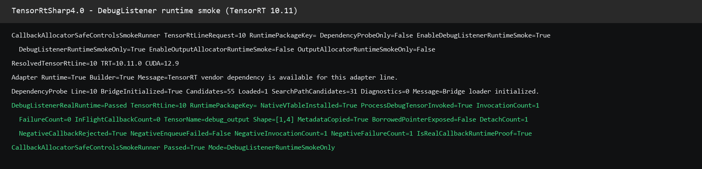

# TensorRT DebugListener 真实运行教程

> 状态：source-tree-local-runtime-evidence
>
> 本文记录 `TensorRtSharp4.0` 在 TensorRT 10.11.0 / CUDA 12.9 上的真实 `IDebugListener::processDebugTensor` 运行结果。它是源码树实测，不代表 NuGet、公开 Release、Linux 或 TensorRT 11 已完成发布验收。

## 1. 项目与依赖

TensorRtSharp4.0 是面向 C# 的 TensorRT/CUDA 桥接库。本文使用的顶层命名空间和职责如下：

| 组件 | 作用 |
| --- | --- |
| `JYPPX.TensorRtSharp` | 创建 TensorRT logger、builder、network、engine、execution context，并暴露 owner-safe DebugListener API。 |
| `JYPPX.CudaSharp` | 创建 CUDA stream 和 device memory，负责输入输出缓冲区与同步。 |
| native bridge | 将 C# 调用转发到 TensorRT 10/11 ABI；DebugListener 的 native owner 在 bridge 中实现。 |
| NVIDIA TensorRT / CUDA | 由使用者在本机安装，仓库不打包或上传这些运行库。 |

本例验证的是 callback 生命周期和元数据边界，不是某个视觉模型的精度。

## 2. 模型与转换说明

本例**没有外部深度学习模型**，因此没有模型下载地址或 ONNX 转换步骤。smoke runner 在内存中创建一个固定的 TensorRT identity network：输入 `debug_input` 为 `[1,4]` 的 `float32` tensor，identity 输出命名为 `debug_output`，然后将该输出标记为 build-time debug tensor。

这种构造方式有两个好处：运行证据只反映 DebugListener 链路，不混入模型文件、模型许可证、预处理或检测后处理误差；同时也不会把大型模型上传到 GitHub。需要验证 YOLO、语义分割或姿态模型时，应在对应文章中单独写明模型名称、官方获取方式、导出/转换命令和输入预处理。

## 3. 环境准备

请先按 NVIDIA 官方文档安装与目标 ABI 匹配的 CUDA、cuDNN 和 TensorRT，并让 bridge 能找到对应 DLL。项目不会替用户安装这些依赖，也不会将它们放进 managed 或 bridge-only 包。

本次记录的环境：

| 项目 | 值 |
| --- | --- |
| TensorRT API line | 10 |
| TensorRT | 10.11.0 |
| CUDA Toolkit | 12.9 |
| GPU | NVIDIA GeForce RTX 3060 Laptop GPU |
| NVIDIA driver | 576.02 |
| 运行模式 | `DebugListenerRuntimeSmokeOnly` |

如果本机没有 NVIDIA 驱动或 TensorRT，文章中的命令会输出 `Skipped`，这属于环境未满足，不应被误写成接口通过。

## 4. 编译 bridge

在仓库根目录执行以下命令。`TENSORRT_PATH` 指向本机安装目录，示例不包含任何作者机器的绝对路径：

```powershell
$env:TENSORRT_PATH = "<your TensorRT installation>"
cmake --preset win-x64-trt10-cuda12-release
cmake --build --preset win-x64-trt10-cuda12-release --parallel
```

运行 smoke 前设置 bridge loader 所需的环境变量。具体 DLL 搜索目录按本机 TensorRT 安装调整：

```powershell
$env:JYPPX_NATIVE_BRIDGE_PATH = "<bridge output directory>\jyppxtrtbridge.dll"
$env:JYPPX_TENSORRT_ROOT = $env:TENSORRT_PATH
$env:JYPPX_ENABLE_DEVELOPMENT_PROBING = "true"
dotnet run --project smoke/CallbackAllocatorSafeControlsSmokeRunner/CallbackAllocatorSafeControlsSmokeRunner.csproj `
  -c Release -- --tensor-rt-line 10 --debug-listener-runtime-smoke-only
```

## 5. 程序流程

运行路径分为六步：

1. `TensorRtBuilder` 创建显式 batch network 和 `[1,4]` identity graph。
2. `network.MarkDebugTensor(output)` 把 `debug_output` 写入 TensorRT engine 的 debug tensor 集合。
3. `TensorRtDebugListenerCallbackOwner` 创建 native `IDebugListener` owner；托管 handler 只接收复制后的名称、类型、位置和 shape。
4. `context.SetDebugListener(owner)` 安装 non-null listener，`SetTensorDebugState("debug_output", true)` 打开逐 tensor debug state。
5. `context.EnqueueAsync(stream)` 触发 TensorRT callback；`stream.Synchronize()` 等待设备与 callback 完成。
6. `GetRuntimeSnapshot()` 读取 pointer-free 计数和元数据，`ClearDebugListener()` 先 detach 再释放 owner borrow。

核心代码与 smoke runner 保持一致：

```csharp
using TensorRtDebugListenerCallbackOwner owner =
    new TensorRtDebugListenerCallbackOwner(line, metadata =>
    {
        managedMetadata = metadata;
        return true;
    });

context.SetDebugListener(owner);
context.SetTensorDebugState("debug_output", true);
context.EnqueueAsync(stream);
stream.Synchronize();

TensorRtDebugListenerRuntimeSnapshot attached = owner.GetRuntimeSnapshot();
bool cleared = context.ClearDebugListener();
TensorRtDebugListenerRuntimeSnapshot detached = owner.GetRuntimeSnapshot();
```

native owner 在 callback 入口先取得 in-flight 许可；detach 时阻止新 callback，等待计数归零后才清除 TensorRT 借用并释放 vtable。callback 中不会把 TensorRT 的 `addr`、CUDA stream 或 debug tensor 指针暴露给 C#。

## 6. 实际运行结果

下面的截图来自本次命令的原始终端输出，而不是手工绘制的示意图：



正例结果：

| 检查项 | 结果 |
| --- | --- |
| native vtable 安装 | `True` |
| `processDebugTensor` 调用 | `True`，`InvocationCount=1` |
| callback failure | `FailureCount=0` |
| in-flight callback | `0` |
| tensor 名称 | `debug_output` |
| shape | `[1,4]` |
| 元数据复制 | `True` |
| borrowed pointer 暴露 | `False` |
| detach | `DetachCount=1` |
| real runtime proof | `IsRealCallbackRuntimeProof=True` |

对应的逐行 stdout 保存在仓库路径 `samples/assets/debug-listener-real-runtime-tensorrt10.11.txt`，机器可读证据清单在 `samples/assets/debug-listener-real-runtime-tensorrt10.11-evidence.json`。两份文件包含 SHA-256，便于复核截图和输出是否被替换。

## 7. 受控负例：handler 返回 false

smoke runner 随后创建第二个 owner，handler 固定返回 `false`，用于检查失败是否被记录并安全 detach：

| 检查项 | 结果 |
| --- | --- |
| callback 被调用 | `NegativeInvocationCount=1` |
| callback failure 被记录 | `NegativeFailureCount=1` |
| 最近一次 callback 成功 | `False` |
| `NegativeCallbackRejected` | `True` |
| `NegativeEnqueueFailed` | `False` |
| real runtime proof | `False` |

TensorRT 10.11 在本 identity enqueue 中会记录 callback 返回值为失败，但仍完成 enqueue；所以不能只用“enqueue 是否抛异常”判断 callback 是否被拒绝。桥接层采用 `FailureCount`、`LastCallbackSucceeded`、in-flight drain 和 detach 状态做 fail-closed 判定，负例不会升级为真实运行证明。

## 8. 常见问题

- **找不到 bridge 或 TensorRT DLL**：确认 `JYPPX_NATIVE_BRIDGE_PATH`、`JYPPX_TENSORRT_ROOT` 与本机安装版本一致；不要把 vendor DLL 复制进仓库或包。
- **输出为 `Skipped`**：先检查 NVIDIA 驱动、CUDA/TensorRT ABI 和 DLL 搜索路径；这是环境跳过，不是接口通过。
- **`FailureCount` 大于零**：查看 handler 是否抛异常或返回 `false`，并确认 detach 后 `InFlightCallbackCount=0`。
- **需要 TRT11 结果**：使用 TRT11 bridge 和对应 `--tensor-rt-line 11` 重新运行；本文没有把 TRT10.11 结果外推到 TRT11。

## 9. 证据边界与当前发布策略

本次证据只证明：在一台已安装 TensorRT 10.11.0 / CUDA 12.9 的 Windows 本机，源码树中的 `JYPPX.TensorRtSharp` 与 native bridge 完成了 DebugListener 的安装、真实 callback、copied metadata、失败记录和 detach 生命周期。

它不证明 Linux、TensorRT 11、clean package consumer、公开包、GitHub Release 或 post-publish 环境。项目仍处于持续开发阶段，当前不创建 tag、Release、NuGet 或 GitHub Packages；CUDA、cuDNN、TensorRT、NVRTC 由用户自行安装。待所有演示、接口和跨平台验证完成后，再单独进行发布验收。
