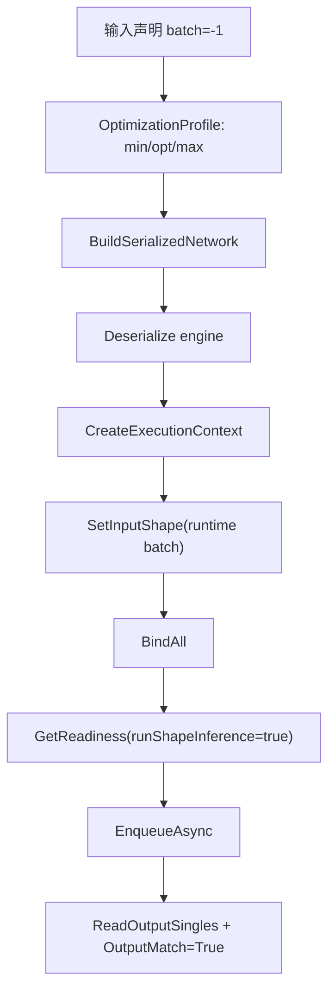

# Dynamic Shape 与 Optimization Profile：让 batch 在运行时变化

TensorRT 的 dynamic shape 是部署生产模型时绕不开的能力。真实业务里，batch size、图像尺寸、序列长度都可能变化；但 TensorRT 不能只靠一个 `-1` 就完成推理，它还需要 optimization profile 告诉 builder：最小、最优、最大 shape 分别是什么。

TensorRtSharp4.0 的 `samples/DynamicShape` 演示了一个完整但足够小的动态 batch 推理流程。它构建一个 C# 内联 identity network，用动态 batch 输入、profile min/opt/max、`TensorRtInferenceBindings` 和 CUDA stream 完成一次可验证的 enqueue/readback。

## 样例范围

对应仓库代码：

```text
samples/DynamicShape/Program.cs
samples/DynamicShape/README.md
```

这个样例不依赖外部模型、labels 或图片。它适合做 dynamic shape 能力的基础验证，也适合作为后续分类/检测模型教程的前置读物。

## 网络结构

样例网络：

```text
input [-1, 3, 4] -> Identity -> output [-1, 3, 4]
```

profile：

| 项 | Shape |
| --- | --- |
| min | `[1, 3, 4]` |
| opt | `[2, 3, 4]` |
| max | `[4, 3, 4]` |

默认 runtime batch 为 3，因此 runtime shape 是 `[3, 3, 4]`。



## 运行命令

先构建：

```powershell
dotnet build .\TensorRtSharp.sln -c Debug --no-restore /p:UseSharedCompilation=false
```

启用开发探测：

```powershell
$env:JYPPX_ENABLE_DEVELOPMENT_PROBING = "1"
```

运行：

```powershell
dotnet .\samples\DynamicShape\bin\Debug\net8.0\DynamicShape.dll --tensor-rt-line 10 --batch 3
```

参数：

| 参数 | 含义 |
| --- | --- |
| `--tensor-rt-line <8|10|11>` | 选择 TensorRT adapter line，默认 `10`。 |
| `--batch <1..4>` | 选择 runtime batch，必须落在 profile 范围内，默认 `3`。 |

## 关键代码

声明动态输入：

```csharp
using TensorRtTensor inputTensor = network.AddInput(
    "input",
    TensorRtDataType.Float,
    new TensorRtDims(new[] { -1, 3, 4 }));
```

设置 profile：

```csharp
profile.SetShape(
    "input",
    new TensorRtDims(new[] { 1, 3, 4 }),
    new TensorRtDims(new[] { 2, 3, 4 }),
    new TensorRtDims(new[] { 4, 3, 4 }));
int profileIndex = config.AddOptimizationProfile(profile);
```

设置运行时 shape：

```csharp
TensorRtDims runtimeShape = new TensorRtDims(new[] { batch, 3, 4 });
bindings.SetInputShape("input", runtimeShape)
        .CopyInputFromHost("input", inputValues, runtimeShape);
```

检查 readiness：

```csharp
TensorRtExecutionContextReadiness readiness =
    bindings.GetReadiness(runShapeInference: true);
```

这里的 readiness 很关键。dynamic shape 出错时，问题可能来自 shape 没设置、profile 不匹配、tensor address 未绑定或 shape inference 未运行。直接 enqueue 只会得到更晚、更难读的错误。

## 输出解读

成功输出包含：

```text
Profile Index=0 Min=[1,3,4] Opt=[2,3,4] Max=[4,3,4] Valid=True
RuntimeShape=[3,3,4] Values=36 HostMemory=... EngineTensors=...
Readiness Ready=True Bound=True ActiveProfile=0
BindingReport Ready=True Inputs=1 Outputs=1
Execution ... OutputMatch=True
DynamicShape Passed=True
```

| Marker | 含义 |
| --- | --- |
| `Valid=True` | profile 被 TensorRT 接受。 |
| `RuntimeShape=...` | 当前实际 batch shape。 |
| `Ready=True Bound=True` | enqueue 前 shape 和地址绑定已满足。 |
| `OutputMatch=True` | identity 网络输出与输入一致。 |

## 读取 engine profile tensor values

当网络包含 shape tensor input 时，TensorRT engine 可以在构建后读取某个 profile 的 min/opt/max 取值。TensorRtSharp4.0 对这条边界使用托管数组拷贝，不暴露 TensorRT 返回的 borrowed pointer。

常见用法优先使用自动推导数量的 overload：

```csharp
long[] optValues = engine.GetProfileTensorValuesV2(
    "shape_input",
    profileIndex: 0,
    TensorRtOptimizationProfileSelector.Opt);
```

如果 engine tensor shape 仍包含动态或未知维度，自动推导无法判断应复制多少个元素，此时使用显式数量 overload：

```csharp
long[] optValues = engine.GetProfileTensorValuesV2(
    "shape_input",
    profileIndex: 0,
    TensorRtOptimizationProfileSelector.Opt,
    valueCount: expectedShapeValueCount);
```

TensorRT 10 还保留了 legacy `int[] GetProfileTensorValues(...)` 路径；新代码应优先使用 `GetProfileTensorValuesV2(...)`。这类 API 只能证明 engine metadata 可读，不等同于 runtime enqueue smoke、CUDA 13.2 driver proof 或 callback runtime proof。

## 常见错误

### Batch 超出范围

`--batch 8` 会失败，因为 profile max 是 4。这个限制来自 TensorRT profile，不是 C# wrapper 任意限制。

### Runtime 或 builder 不可用

样例会输出：

```text
DynamicShape=Skipped Reason=...
```

这通常表示本机 TensorRT/CUDA 依赖或 driver/runtime 不满足。它应记录为环境状态，不要写成 API 缺失。

### CUDA error 35

如果使用 CUDA 13.2 runtime package，而当前机器 driver 不兼容，可能出现 `blocked-by-cuda-driver`。这不是 dynamic shape 逻辑问题，也不是 callback proof。

## 和真实模型的关系

真实模型的 dynamic shape 通常会更复杂：

- 图像模型可能是 `[N, C, H, W]`，H/W 也动态。
- NLP 模型可能有 sequence length 动态。
- 多输入模型需要多个 tensor 的 profile。
- 多 profile engine 需要正确设置 active profile。

但最小工作流不变：声明动态维度、设置 profile、运行时设置 shape、绑定地址、检查 readiness、enqueue、读回输出。

## 下一步

继续阅读：

- [ExecutionContext 与 Inference Binding](inference-bindings-tutorial.md)
- [ONNX Parser 到 Serialized Engine](onnx-parser-to-serialized-engine-tutorial.md)
- [NuGet 消费端验证全流程](nuget-package-consumer-validation-flow.md)

## 第二批正文门禁

### 适用读者

本文适合需要把固定 batch 样例升级为动态 batch、动态 H/W 或多 profile engine 的开发者，也适合检查 TensorRT wrapper 是否正确隐藏 borrowed pointer 的维护者。

### 解决问题

dynamic shape 最容易出错的地方不是声明 `-1`，而是 profile、runtime shape、binding address 和 readiness 之间不一致。本文解决 min/opt/max 设置、运行时 shape 绑定和 enqueue 前诊断三个问题。

### 核心思路

核心思路是先把 profile 范围写进 engine，再把 runtime shape 写进 execution context，最后用 `TensorRtInferenceBindings` 检查输入输出地址是否完整。每一层都输出可读 marker，便于后续 clean consumer proof 或真实模型 proof 引用。

### 操作路径

运行 `samples/DynamicShape`，选择落在 profile 范围内的 batch，检查 `Valid=True`、`Ready=True`、`Bound=True` 和 `OutputMatch=True`。真实模型接入时，为每个动态输入单独记录 min/opt/max、runtime shape 和 skipped reason。

### 边界说明

本文的 dynamic shape 样例可以证明 optimization profile、binding readiness 和最小 identity enqueue 路径可达，但不证明任意真实模型的 shape、layout、labels、后处理或精度正确。build-only、dry-run、template、local feed、ProjectReference、direct `.nupkg`、TensorRtExec report、YoloVision matrix、OnnxToEngine report、readonly diagnostics 都不是 runtime proof。

### 下一步

下一步把 dynamic shape 教程连接到真实分类和 YoloVision 模型案例，逐步把 profile、runtime shape 和后处理证据补成可验证 proof。
