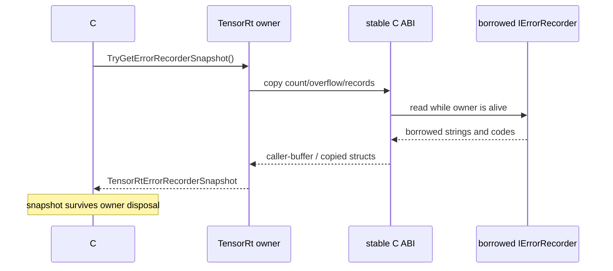

# ErrorRecorder Diagnostics Design Gate

`error-recorder-diagnostics-design-gate` 用来收口 `IErrorRecorder` 中风险 deferred 候选：项目已经可以通过 owner 对象复制诊断信息，但仍不能把原生 recorder 当作 public ownership 对象交给 C# 用户。

## 当前结论

- `RuntimeEvidenceKind=design-gate`。
- `CopiedDiagnosticsReady=True`，Runtime、Refitter、Builder、Engine、ExecutionContext、NetworkDefinition 和 EngineInspector 可以通过 `TensorRtErrorRecorderSnapshot` 读取 copied diagnostics。
- `RequiredOutputMode=owner-scoped copied diagnostics and interface metadata snapshot`。
- `CandidateMethods=IErrorRecorder::getInterfaceInfo, IErrorRecorder::getNbErrors, IErrorRecorder::getErrorCode, IErrorRecorder::getErrorDesc, IErrorRecorder::hasOverflowed, IErrorRecorder::incRefCount, IErrorRecorder::decRefCount`。
- `PointerFreeSurfaceReady=True`，public API 不暴露、返回或保存 recorder pointer。
- `RecorderPointerExposed=False`，`RecorderPointerProduced=False`，`BorrowedRecorderPointerEscaped=False`。
- `RefCountPublicOwnershipControl=False`，`InterfaceInfoPublicOwnershipControl=False`。
- `DirectRecorderOwnershipDeferred=True`，direct `IErrorRecorder*` ownership、ref-count 和 interface-info 行继续 deferred。
- `CanPromoteWithoutRuntimeProof=False`，`RuntimeProofBlocked=True`，`DeferredRowsStillRequired=True`，该门禁是 not proof。

## 已允许的 public 边界

所有已支持 owner 使用 copied snapshot：

- `TensorRtRuntime.TryGetErrorRecorderSnapshot(out TensorRtErrorRecorderSnapshot snapshot)`。
- `TensorRtRefitter.TryGetErrorRecorderSnapshot(out TensorRtErrorRecorderSnapshot snapshot)`。
- `TensorRtBuilder.TryGetErrorRecorderSnapshot(out TensorRtErrorRecorderSnapshot snapshot)`。
- `TensorRtEngine.TryGetErrorRecorderSnapshot(out TensorRtErrorRecorderSnapshot snapshot)`。
- `TensorRtExecutionContext.TryGetErrorRecorderSnapshot(out TensorRtErrorRecorderSnapshot snapshot)`。
- `TensorRtNetworkDefinition.TryGetErrorRecorderSnapshot(out TensorRtErrorRecorderSnapshot snapshot)`。
- `TensorRtEngineInspector.TryGetErrorRecorderSnapshot(out TensorRtErrorRecorderSnapshot snapshot)`。
- `TensorRtErrorRecorderSnapshot.Records` 是托管集合，记录项为 `TensorRtErrorRecord`。

所有 owner 同时使用 presence / clear 边界：

- `HasErrorRecorder` 只返回是否附加 recorder。
- `ClearErrorRecorder()` 只清除 owner 上的外部 recorder 绑定，不销毁 recorder，不接管生命周期。

Plugin registry inventory 也只使用 copied/presence 语义，不暴露 registry 或 recorder borrowed pointer。

## 继续 deferred 的内容

以下内容不能因为 design gate ready 而晋级：

- `IErrorRecorder::incRefCount` / `decRefCount`。
- direct `IErrorRecorder::getInterfaceInfo` ownership。
- 任何 `IErrorRecorder*` 或裸 `IntPtr` public API。
- 任何需要用户持有 borrowed recorder lifetime 的 API。

这些接口如果后续要提升，必须先有独立 ownership 模型、跨 ABI no-throw 约束、release ordering 和 package-consumer runtime proof。

下一轮如果只能证明 owner-scoped snapshot，则应继续扩展 `TensorRtErrorRecorderSnapshot` 证据链，而不是新增 direct `IErrorRecorder` public wrapper。

## 验证信号

`CallbackAllocatorSafeControlsSmokeRunner --dependency-probe-only` 会输出：

- `SafeControlSurface=error-recorder-diagnostics-design-gate;...`
- `ErrorRecorderDiagnosticsDesignGate=error-recorder-diagnostics-design-gate;...`
- `CopiedDiagnosticsReady=True`
- `PointerFreeSurfaceReady=True`
- `RefCountPublicOwnershipControl=False`
- `RuntimeProofBlocked=True`

这些信号只说明 design gate 存在，不是 full runtime smoke passed，也不是 package-consumer runtime proof。

## 为什么要复制，而不是包装 `IErrorRecorder*`

TensorRT owner 返回的 error recorder 通常是 borrowed interface。若 C# wrapper 直接保存该指针，就会出现三个无法靠
`SafeHandle` 自动解决的问题：谁持有 ref count、owner 释放后 recorder 是否仍有效、callback 或 getter 是否可能在
另一个线程发生。当前设计选择 owner-scoped read + managed copy，把风险留在一次受控 bridge 调用内。



实现入口集中在 `src/JYPPX.TensorRtSharp/TensorRtErrorRecorderSnapshot.cs` 和各 owner 的 boundary partial，
例如 `src/JYPPX.TensorRtSharp/TensorRtBuilder.Trt11BoundaryControls.cs`、
`src/JYPPX.TensorRtSharp/TensorRtEngine.Trt11BoundaryControls.cs`。design-gate 状态由
`src/JYPPX.TensorRtSharp/TensorRtErrorRecorderDiagnosticsDesignGate.cs` 表达，而不是由文章手工推断。

## Snapshot 数据怎么读

`TensorRtErrorRecorderSnapshot` 至少表达：

- `ErrorCount`：owner 报告的错误数。
- `Records`：复制后的 `TensorRtErrorRecord` 集合，每条含 code 与 description。
- `HasOverflowed`：原 recorder 的容量是否溢出。
- interface metadata 是否可用，以及不可用时的诊断。

`Records.Count` 可能因 native 侧读取失败或 overflow 与 `ErrorCount` 不同，因此 summary 额外保留
`CopiedRecordCountMatchesErrorCount`。调用方不应只检查集合非空，也不应把 description 当稳定机器码；自动化应优先使用
error code、count、overflow 和明确的 bridge status。

```csharp
if (runtime.TryGetErrorRecorderSnapshot(out TensorRtErrorRecorderSnapshot snapshot))
{
    Console.WriteLine($"Errors={snapshot.ErrorCount} " +
                      $"Copied={snapshot.Records.Count} " +
                      $"Overflow={snapshot.HasOverflowed}");

    foreach (TensorRtErrorRecord record in snapshot.Records)
    {
        Console.WriteLine($"Code={record.Code} Description={record.Description}");
    }
}
```

这段代码没有保存 recorder，也没有调用 `incRefCount`/`decRefCount`。snapshot 生成后是普通托管数据，可以在 owner
释放后用于日志归档。

## 七类 owner 的一致语义

| Owner | Snapshot 用途 | `ClearErrorRecorder()` 的含义 |
| --- | --- | --- |
| Runtime | deserialize/runtime 配置诊断 | 清除绑定，不销毁 recorder |
| Builder | network build 诊断 | 清除 builder 绑定 |
| Refitter | entry/set/refit 诊断 | 清除 refitter 绑定 |
| Engine | engine metadata/runtime 诊断 | 清除 engine 绑定 |
| ExecutionContext | enqueue/context 诊断 | 清除 context 绑定 |
| NetworkDefinition | layer/network 创建诊断 | 清除 network 绑定 |
| EngineInspector | inspector readback 诊断 | 清除 inspector 绑定 |

`HasErrorRecorder` 只说明 owner 当前有 recorder，不说明已有错误，更不说明 snapshot 已验证。clear 操作也不是 dispose；
managed API 不声称拥有 native recorder 的生命周期。

## 运行 design-gate smoke

```powershell
$repo = "E:\GitSpace\TensorRT-CSharp-API-4.0\TensorRtSharp4.0"
$case = "E:\TensorRtSharpAssets\cases\error-recorder-design-gate"
New-Item -ItemType Directory -Force -Path "$case\logs" | Out-Null
Set-Location $repo

dotnet build .\smoke\CallbackAllocatorSafeControlsSmokeRunner\CallbackAllocatorSafeControlsSmokeRunner.csproj `
  -c Debug --no-restore --nologo
dotnet .\smoke\CallbackAllocatorSafeControlsSmokeRunner\bin\Debug\net8.0\CallbackAllocatorSafeControlsSmokeRunner.dll `
  --dependency-probe-only 2>&1 | Tee-Object "$case\logs\dependency-probe.log"
```

dependency-probe-only 路径用于确认 bridge 和 safe-control surface 可发现；它会显式输出 `Skipped=True`，不能当成 runtime
callback invocation。兼容主机上的完整运行还应保存 resolved line、adapter、每类 owner 的 snapshot/clear marker 和退出码。

## 失败场景的解释顺序

1. 先读 bridge status 和 last error，区分 invalid argument、unsupported line、dependency missing 与 runtime error。
2. 再读 `HasErrorRecorder`；false 时不要伪造空 snapshot 等同于“无错误”。
3. snapshot 可用时检查 count、copied count、overflow 和 records。
4. 将错误绑定到具体 owner 与操作，例如 build、deserialize、refit 或 enqueue。
5. 保留原始 stdout/stderr、TensorRT line、runtime package key 和 host metadata。

如果 owner 已 dispose，正确行为是使用此前复制的 snapshot，而不是重新访问 owner。若需要更长时间的 native recorder
生命周期，必须另行设计 ownership contract，不能偷偷缓存 `IntPtr`。

## Direct ownership 为什么继续 deferred

`IErrorRecorder::incRefCount` 与 `decRefCount` 看似只是两个小接口，实际上会把引用计数协议、并发调用、析构顺序和
跨版本 ABI 全部暴露给 public caller。`getInterfaceInfo` 同样可能返回具有 native 生命周期的接口信息。没有以下证据前，
这些行继续 deferred：

- 跨 TRT8/TRT10/TRT11 的明确 availability 与签名。
- no-throw C ABI adapter 和 ref-count balance 测试。
- owner/recorder attach、detach、dispose 的状态机。
- callback 并发与 shutdown ordering 测试。
- clean package-consumer runtime proof。

copied interface metadata 可以继续通过 owner-safe 路径扩展，但这不会自动解锁 direct ownership。

## 验收与发布边界

- public API 搜索不到 recorder `IntPtr` 或 borrowed pointer。
- snapshot records 全部是 managed-owned 数据。
- 每类 owner 的 presence/snapshot/clear 语义一致。
- dependency probe、design gate、runtime invocation 分开记录。
- `CopiedDiagnosticsReady=True` 不等于 `CanPromoteWithoutRuntimeProof=True`。
- `performsPublish=false`、`canPublishPublicly=false`、`canCloseReleaseIssue=false`。

继续阅读：[ErrorRecorder Snapshot Guide](error-recorder-snapshot-guide.md)、
[Callback/allocator safety roadmap](callback-allocator-safety-bridge-roadmap.md) 与 [排障总表](troubleshooting-index.md)。
