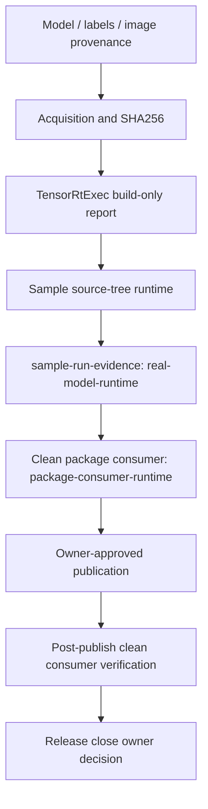

# 外部模型 Evidence 回填案例总览：从模型来源到发布后验证

## 写在前面

把一个外部 ONNX 模型“跑起来”和把它整理成可公开引用的工程证据，是两件不同的事。

前者可能只需要模型、输入和一条命令；后者还要回答来源、许可证、SHA256、导出方式、预处理、输出契约、构建报告、真实日志、主机信息、owner review，以及这份材料究竟能证明 source tree、包消费端还是公开渠道。

本文用 TensorRtSharp4.0 仓库中已经存在的 YOLOX-S、YOLOv10n 和 owner-action 模板说明完整方法。它不是“把所有 JSON 填成 passed”的教程，而是教你把不同证明放在正确层级，并让严格 validator 能重新计算关键事实。

## 适用读者

- 准备为 Classification 或 YoloVision 提供真实模型的 owner。
- 想写可复现模型案例的博客、公众号或项目维护者。
- 需要区分 build-only、real-model-runtime、package-consumer-runtime 的发布负责人。
- 正在排查模型能 build、但 sample 输出不正确的部署工程师。

## 本文解决什么

1. 模型、labels、图片和 license 应如何留档。
2. acquisition、build report、sidecar、output JSON、sample evidence 各自证明什么。
3. 一个真实 source-tree 运行如何晋级为 `real-model-runtime`。
4. 为什么 sample evidence 不能写成 `package-consumer-runtime`。
5. clean package consumer 和 post-publish verification 应在何时执行。
6. 如何使用仓库现有 schema、模板、importer 和 validator 收口 owner evidence。

## 五条证据线



图中每一级都需要独立材料，后一级不能反向伪造前一级。

### 证据分层表

| 层级 | 权威材料 | 能证明 | 不能证明 |
| --- | --- | --- | --- |
| acquisition | manifest、下载报告、length/SHA256 | 获取到预期资产 | inference 正确、允许再分发 |
| build-only | TensorRtExec report、engine hash | parser/builder/profile/serialization 执行 | 真实输出正确 |
| output review | YoloVision JSON/SVG | copied tensor/result 可审阅 | runtime proof 自动成立 |
| real-model-runtime | 真模型/输入/日志/hash/owner review | 指定 source-tree case 真实运行 | 包消费端可用 |
| package-consumer-runtime | clean external consumer record | 指定包在兼容主机运行 | 已从公开渠道重新下载 |
| post-publish verification | 真实 URL、下载 hash、clean consumer logs | 公开渠道产物可恢复运行 | owner 自动批准 close |

## 先分清四种文件

### Asset Manifest

资产 manifest 描述期望来源和身份：

- upstream repository/tag/revision；
- model、labels、input URL；
- license 与 SPDX id；
- expected length 与 SHA256；
- input/output contract；
- public redistribution owner decision。

manifest 是声明，不是运行结果。

### Acquisition Report

acquisition script 对实际文件重新计算 length/SHA256，并记录是否下载或复用本地文件。

它证明“本地文件与 pinned identity 一致”，不证明模型成功 enqueue。

### Build Report / Sidecar

TensorRtExec build report 记录 ONNX parse、shape profile、builder policy、engine serialization 和 diagnostics。

sidecar 把 model hash、report hash、engine hash 和 owner metadata 连起来。

两者都属于 build/report evidence。

### Sample Run Evidence

sample-run-evidence record 指向真实 sample command、真实日志、日志 SHA256、stdout/stderr summary、模型/labels/input hash 与 owner review。

只有它满足 schema、真实文件存在、hash 匹配、success marker 与任务输出一致时，才可能成为 `real-model-runtime`。

## E 盘资产工作区

大模型、engine、tensor 和原始日志不要落在 C 盘，也不要默认提交到 Git。

```text
E:\TensorRtSharpAssets\cases\<case-id>\
  source\
  models\
  labels\
  images\
  tensors\
  engines\
  reports\
  logs\
  evidence\
```

仓库中的官方 acquisition scripts 也使用外层 E 盘 `downloads` 目录，并显式拒绝 C 盘输出。

## 资产身份与许可证

每类资产分别记录：

| 资产 | 必填身份 | 许可证重点 |
| --- | --- | --- |
| checkpoint / ONNX | source URL、tag/commit、export command、SHA256 | 模型权重是否允许使用/再分发 |
| labels | source URL、class count、顺序、SHA256 | labels 或数据集条款 |
| input image | source URL、原图与派生图 hash | 文章展示和仓库分发授权 |
| preprocessing reference | 文件/commit/hash | 是否与 exporter 版本一致 |
| engine | TensorRT/CUDA/precision/profile/hash | 只在兼容版本使用，不作为源资产 |
| logs/output | host、命令、hash、隐私检查 | 本地路径或机器名是否需要脱敏 |

“上游仓库是开源的”不能自动推出“模型和测试图片可以随 NuGet 或 Release 分发”。

## 案例一：官方 YOLOX-S

### 权威资产合同

仓库文件：

```text
samples/assets/yolovision-yolox-official-assets.json
```

当前 manifest 固定：

- upstream：`Megvii-BaseDetection/YOLOX`；
- tag：`0.1.1rc0`；
- revision：`e1052df71842031413f6030723c3607b839c80ce`；
- license：`Apache-2.0`；
- model SHA256：`c5c2d13e59ae883e6af3b45daea64af4833a4951c92d116ec270d9ddbe998063`；
- derived PPM SHA256：`6cb94c9cd0781412598fe179246b09041af4303d388a5ba3c55f760dff11ec2c`；
- COCO labels SHA256：`4d4aaea7bee6be2f675d9b53a9195ca36dfe6429f7479f29155da522a6c85930`。

public redistribution approval 仍为 false。

### Acquisition

默认输出到外层 E 盘：

```powershell
pwsh -NoProfile -ExecutionPolicy Bypass -File .\eng\Acquire-YoloXOfficialAssets.ps1
```

已有本地资产时使用 offline 模式重新核验：

```powershell
pwsh -NoProfile -ExecutionPolicy Bypass -File .\eng\Acquire-YoloXOfficialAssets.ps1 -Offline
```

脚本会：

1. 拒绝 C 盘 `OutputRoot`。
2. 校验所有上游文件 length/SHA256。
3. 从官方 JPG 生成确定性 P6 RGB PPM。
4. 从固定 Python source 提取 80 个有序 COCO labels。
5. 写入 machine-readable acquisition report。

### 模型契约

官方 YOLOX-S 路径是 detection-only：

- input：`[1,3,640,640]`；
- tensor layout：NCHW；
- color：BGR；
- value：raw `0..255`；
- resize：top-left letterbox，fill 114；
- output：`[1,8400,85]` boxes-first；
- strides：8、16、32；
- postprocess：grid/stride transform、objectness score、application-side NMS。

### Source-Tree Run

```powershell
$assetRoot = "E:\GitSpace\TensorRT-CSharp-API-4.0\downloads\yolox-apache"
$caseRoot = "E:\TensorRtSharpAssets\cases\yolox-s"
@("tensors", "engines", "reports", "logs", "evidence") | ForEach-Object {
  New-Item -ItemType Directory -Force -Path (Join-Path $caseRoot $_) | Out-Null
}

dotnet run --project .\samples\YoloVision -- `
  --model "$assetRoot\source\yolox_s.onnx" `
  --labels "$assetRoot\derived\coco.names" `
  --image "$assetRoot\derived\dog.ppm" `
  --preprocessed-output "$caseRoot\tensors\dog-yolox-s.fp32.bin" `
  --input-shape 1x3x640x640 `
  --family yolox `
  --task det `
  --layout boxes-first `
  --class-count 80 `
  --nms-mode class-aware `
  --confidence 0.3 `
  --iou-threshold 0.45 `
  --output-json "$caseRoot\reports\output.json" `
  --visualization-svg "$caseRoot\reports\output.svg" `
  *> "$caseRoot\logs\yolovision.log"
```

### 仓库中的正例证据

```text
artifacts/yolovision/yolox-official-runtime/
  sample-run-evidence-record.yolox-official.json
  yolovision-output.json
  yolovision-output.svg
  validation/sample-run-evidence-record-validation.json
  validation/yolovision-output-report-validation.json
```

sample evidence validator 当前记录：

- `validationState=real-model-runtime`；
- `templateOnly=false`；
- `isSmokePassed=true`；
- `canPromoteRealModelRuntime=true`；
- `errorCount=0`；
- `ownerActionRequiredCount=0`；
- `packageConsumerRuntimeForbidden=true`。

output report validator 是 0 blocker，但它本身仍保持 `canPromoteRealModelRuntime=false`。真正的晋级来自完整 sample-run-evidence，不来自 JSON/SVG 单独存在。

YOLOX source-tree evidence 也明确：

- `canPromotePackageConsumerRuntime=false`；
- `publicRedistributionOwnerApproval=false`；
- `canPublishPublicly=false`；
- `performsPublish=false`。

因此这份正例不是 package-consumer-runtime proof，也不授权公开再分发模型资产。

## 案例二：官方 YOLOv10n

### 权威资产合同

```text
samples/assets/yolovision-yolov10-official-assets.json
```

当前固定：

- upstream：`THU-MIG/yolov10`；
- tag：`v1.1`；
- revision：`799ff3be47d21173bcf29b351820d4b8e955e0fe`；
- license：`AGPL-3.0-only`；
- ONNX SHA256：`7025ea1913f9a259cf8a8465ed608e10610d1bb376db2e0348b13e3bd286e0d3`；
- output：`[1,300,6]`；
- columns：`x1,y1,x2,y2,score,classId`。

AGPL 与模型再分发必须由 owner 单独审阅。

### Acquisition

```powershell
pwsh -NoProfile -ExecutionPolicy Bypass -File .\eng\Acquire-YoloV10OfficialAssets.ps1
pwsh -NoProfile -ExecutionPolicy Bypass -File .\eng\Acquire-YoloV10OfficialAssets.ps1 -Offline
```

默认目录是外层 E 盘 `downloads\yolov10-agpl`，脚本会拒绝 C 盘输出。

### Build-Only

```powershell
$assetRoot = "E:\GitSpace\TensorRT-CSharp-API-4.0\downloads\yolov10-agpl"
$caseRoot = "E:\TensorRtSharpAssets\cases\yolov10n"
@("tensors", "engines", "reports", "logs", "evidence") | ForEach-Object {
  New-Item -ItemType Directory -Force -Path (Join-Path $caseRoot $_) | Out-Null
}

dotnet run --project .\applications\TensorRtExec -- `
  --onnx "$assetRoot\source\yolov10n.onnx" `
  --saveEngine "$caseRoot\engines\yolov10n.plan" `
  --minShapes images:1x3x640x640 `
  --optShapes images:1x3x640x640 `
  --maxShapes images:1x3x640x640 `
  --buildOnly `
  --exportReport "$caseRoot\reports\build-report.json"
```

这一步只生成 build evidence。

### Source-Tree Runtime Closure

权威 closure：

```text
artifacts/interface-coverage/yolov10-official-runtime-proof-closure.json
```

它记录真实：

- TensorRT 10.11 / CUDA 12.9；
- engine SHA256 `21891d0dcfb322069f864b5395f1653182251c35e4d822d2cc2c02635a4d2000`；
- output shape `[1,300,6]`；
- 4 个 predictions；
- top prediction `dog`、score `0.91683036`；
- output JSON SHA256 `38aaddac4e6f22f6d230d6e36c9e787c4d407508d1cb5dea768d0967827a8c4f`；
- run log SHA256 `bb2c5958590c4ac074b969d90af87f3aedb38991054588434133a2f620ebc43e`；
- expected real-log marker `YoloVision Passed=True`。

closure 分类是 `source-tree-real-model-runtime`，但同时保持：

- `isPackageConsumerRuntimeProof=false`；
- `canPromotePackageConsumerRuntime=false`；
- `publicRedistributionOwnerApproval=false`；
- `canPublishPublicly=false`；
- `isPostPublishProof=false`；
- `canCloseReleaseIssue=false`。

这正是证据分层的具体例子：source-tree 真实运行成立，包与发布证明仍未成立。

## 案例三：Owner 自备 Classification

Classification 当前仍以 owner-action workflow 为主，不应从 YOLOX/YOLOv10 正例外推“任意分类模型已验证”。

owner 需要记录：

- model source/license/export/SHA256；
- labels source/license/order/count/SHA256；
- image source/license/SHA256；
- input/output tensor names/shapes；
- resize/crop/color/scale/mean/std；
- Top-K 与 softmax/logit 语义；
- build report、sidecar、run log 与 owner review。

推荐 E 盘目录：

```text
E:\TensorRtSharpAssets\cases\classification\
  models\classifier.onnx
  labels\labels.txt
  images\input.ppm
  tensors\input.fp32.bin
  engines\classifier.plan
  reports\build-report.json
  logs\classification.log
  evidence\sample-run-evidence.json
```

expected real-log success marker 必须来自真实运行；不能从文档复制 `Classification Passed=True` 作为证明。

## 六任务 YoloVision Owner Pack

对于 det/cls/seg/obb/pose/sem，仓库已经提供六任务一致性链：

```text
samples/assets/yolovision-article-case-pack.json
samples/assets/yolovision-real-asset-owner-backfill-pack.json
samples/assets/yolovision-real-asset-owner-backfill-pack.generated.json
samples/YoloVision/yolovision-task-output-contract.json
```

导出并检查投影漂移：

```powershell
pwsh -NoProfile -ExecutionPolicy Bypass -File .\eng\Export-YoloVisionRealAssetOwnerBackfillPack.ps1
```

生成器不会覆盖真实 owner proof；generated pack 和 sample evidence 仍是 template-only。

创建 owner input：

```powershell
pwsh -NoProfile -ExecutionPolicy Bypass -File .\eng\Export-YoloVisionRealAssetOwnerProofInputTemplate.ps1
```

严格验证并导入：

```powershell
pwsh -NoProfile -ExecutionPolicy Bypass -File .\eng\Test-YoloVisionRealAssetOwnerProofInput.ps1 -Strict
pwsh -NoProfile -ExecutionPolicy Bypass -File .\eng\Import-YoloVisionRealAssetOwnerProofInput.ps1
```

## Validator 顺序

### 1. Asset Manifest

```powershell
pwsh -NoProfile -ExecutionPolicy Bypass -File .\eng\Test-SampleAssetManifest.ps1
```

### 2. Build Sidecar

```powershell
pwsh -NoProfile -ExecutionPolicy Bypass -File .\eng\Test-OnnxEngineBuildEvidenceSidecar.ps1
```

### 3. YoloVision Output

```powershell
pwsh -NoProfile -ExecutionPolicy Bypass -File .\eng\Test-YoloVisionOutputReport.ps1 -Strict
```

output report 是 owner/golden-output review artifact，不会自行晋级 runtime proof。

### 4. Sample Run Evidence

```powershell
pwsh -NoProfile -ExecutionPolicy Bypass -File .\eng\Test-SampleRunEvidenceRecord.ps1 `
  -InputPath E:\TensorRtSharpAssets\cases\my-case\evidence\sample-run-evidence.json `
  -RequireExistingLog `
  -FailOnNotProof
```

validator 会检查真实日志存在、SHA256、summary、success marker、proof classification 和 promotion flag。

### 5. Package Consumer Runtime

```powershell
pwsh -NoProfile -ExecutionPolicy Bypass -File .\eng\Test-ExternalRuntimeProofRecord.ps1 `
  -InputPath .\artifacts\final-release\external-runtime-proof-record.json `
  -RuntimePackageKey win-x64-trt11.0-cuda13.2-cudnn9.22 `
  -RequireExistingLog `
  -FailOnNotProof
```

该记录必须来自仓库外 clean consumer，不能有 ProjectReference 或本地 nupkg 直链。

### 6. Post-Publish Verification

```powershell
pwsh -NoProfile -ExecutionPolicy Bypass -File .\eng\Test-PostPublishVerificationRecord.ps1 `
  -InputPath .\artifacts\final-release\post-publish-verification-record.json `
  -RequireExistingLog `
  -FailOnNotProof
```

它只能在 owner-approved 真实发布之后执行。

## Sample Evidence 必填字段

真实 `real-model-runtime` 至少包括：

- `recordKind=sample-run-evidence-record`；
- `templateOnly=false`；
- model path/hash/license；
- labels path/hash/license；
- input path/hash/license；
- preprocessed tensor path/hash/element count；
- evidence sidecar 与 build report；
- exact sample command；
- sample log path/hash；
- stdout/stderr summary；
- expected evidence lines；
- `isSmokePassed=true`；
- `canPromoteRealModelRuntime=true`；
- owner reviewer 与时间。

sample schema 明确禁止 `package-consumer-runtime`。

## 失败如何分类

| 现象 | 优先检查 | 证据状态 |
| --- | --- | --- |
| URL/hash 不匹配 | release/tag、代理缓存、文件长度 | acquisition failed |
| ONNX parse 失败 | opset、plugin、dynamic shape | build-only failed |
| build 成功但无结果 | preprocessing、layout、class count | runtime not proved |
| JSON 可读但日志缺失 | sample log path/hash | owner action required |
| `blocked-by-cuda-driver` | driver/runtime compatibility | blocked，不是通过 |
| local feed 可运行 | package source/clean consumer | 不是 public package proof |
| public URL 存在 | 下载 hash、clean restore/smoke | 仍需 post-publish validator |

## 常见误区

### 只保存 engine

engine 是特定 TensorRT/CUDA/profile 的派生产物，不包含模型来源、输入 license 或结果正确性。

### 只保存截图

截图不能重新计算 SHA256，也不能证明命令、host 或完整输出。

### Sidecar 写得很完整

sidecar-only 仍不是 runtime proof。它连接材料，不执行 inference。

### Sample 真实运行，所以包一定可用

source tree 可能使用本地 native library 和 ProjectReference。必须另跑 clean package consumer。

### 包在 local feed 可用，所以已经 post-publish

post publish 必须指向真实渠道 URL，并重新下载、restore、build、probe、smoke。

### `blocked-by-cuda-driver` 可以算环境通过

不可以。它是受控阻塞，必须在兼容 host 上重跑。

## 以下材料不得替代真实模型证明

- support matrix；
- model candidate list；
- template、draft、runbook；
- build-only、parse-only、dry-run；
- TensorRtExec report 单独存在；
- sidecar-only；
- output JSON/SVG 单独存在；
- synthetic input；
- local feed、ProjectReference、direct `.nupkg`；
- `blocked-by-cuda-driver`；
- 手写 success marker。

## 文章发布素材建议

一篇完整模型案例至少准备：

1. 上游 release/tag/license 截图。
2. acquisition report 中 length/hash 截图。
3. Netron 输入输出 contract 截图。
4. TensorRtExec build report 的 profile/engine 信息。
5. sample 真实运行终端日志。
6. output JSON 的模型/input/output hash 摘要。
7. SVG 或原图 overlay。
8. validator 0 error/owner-action 结果。
9. proof boundary 图。

截图是说明材料，不是结构化 evidence 的替代品。

## Owner 收尾清单

- [ ] 模型 source/tag/commit/license/export 已记录。
- [ ] labels 和图片分别记录 source/license。
- [ ] 所有原始/派生资产 SHA256 已计算。
- [ ] input/output/preprocess/postprocess contract 已确认。
- [ ] TensorRtExec build-only report 与 sidecar 已生成。
- [ ] sample command、stdout、stderr、run log 已保存。
- [ ] output JSON/SVG 已人工复核。
- [ ] sample-run-evidence 引用真实存在的日志。
- [ ] asset/sidecar/output/sample validators 已通过。
- [ ] sample evidence 没有声明 package-consumer-runtime。
- [ ] clean package consumer 使用仓库外项目和真实包源。
- [ ] post-publish verification 只在真实发布后执行。
- [ ] public redistribution 由 owner 明确批准。
- [ ] release close 仍由最终 owner decision 控制。

## 结语

外部模型 evidence 的核心不是材料数量，而是每份材料只承担它能证明的那一层。

YOLOX-S 和 YOLOv10n 已经展示了 source-tree real-model-runtime 可以怎样被 hash、日志、输出和 validator 共同证明；它们也同时展示了同一份证据为什么不能自动晋级 package consumer、公开再分发或 post-publish proof。

把 acquisition、build、sample、package、channel 五条线分开，owner 才能准确定位缺口，文章读者也能真正复现，而不是只能相信一张成功截图。
