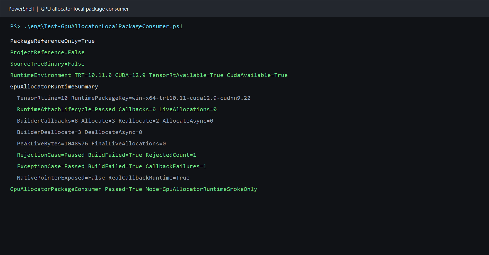

# 用本地 NuGet 包验证 TensorRT IGpuAllocator：独立消费者全流程

> 项目：TensorRtSharp4.0
>
> 主要库：`JYPPX.TensorRtSharp`、`JYPPX.CudaSharp`、`jyppxtrtbridge`
>
> 示例：`tests/fixtures/package-consumers/GpuAllocator.PackageConsumer`
>
> 本机结果：TensorRT 10.11、CUDA 12.9、NVIDIA GeForce RTX 3060 Laptop GPU
>
> 证据边界：本文验证本地 managed 包与 bridge-only 包，不代表公开源下载、Release 或发布后验证。

## 1. 项目与验证目标

TensorRtSharp4.0 为 TensorRT 与 CUDA 提供 C# 封装。`JYPPX.TensorRtSharp` 管理 builder、runtime、engine 和 network 等 TensorRT 对象，`JYPPX.CudaSharp` 提供 CUDA 设备与内存基础设施，`jyppxtrtbridge` 将稳定的 C ABI 映射到 NVIDIA C++ API。

`TensorRtGpuAllocatorCallbackOwner` 让 C# 代码为 TensorRT 的 `IGpuAllocator` 提供策略回调，但不把 device pointer 或 stream handle 暴露到公开托管 API。源码树 smoke 已能证明功能，本文进一步回答另一个问题：用户只拿到 NuGet 包、没有仓库项目引用和开发期 bridge 路径时，公开 API 是否仍能独立编译并进入真实 TensorRT 回调？

完整验证包含四条路径：

1. Runtime 挂载、反序列化、解除挂载和 Engine 销毁生命周期；
2. Builder 真实分配、重分配、释放和零泄漏；
3. 托管策略主动拒绝分配时，TensorRT 构建必须失败；
4. 托管回调抛异常时，异常不得穿越 C ABI，构建必须 fail closed。

## 2. 依赖与包职责

用户需要自行安装兼容版本的 .NET 8 SDK、CUDA Toolkit、显卡驱动和 TensorRT SDK。本项目不会把 CUDA、cuDNN、TensorRT 或 NVRTC 打入包中。

外部消费者只引用两个本地包：

| 包 | 作用 | 不包含 |
| --- | --- | --- |
| `JYPPX.TensorRT.CSharp.API` | `JYPPX.TensorRtSharp` 与 `JYPPX.CudaSharp` 托管接口 | NVIDIA 运行库 |
| `...Runtime.win-x64.trt10.11.cuda12.9.cudnn9.22.Bridge` | 对应版本的 `jyppxtrtbridge.dll` | CUDA、cuDNN、TensorRT、NVRTC |

bridge 包的 TensorRT/CUDA 组合必须与本机安装匹配。TensorRT 10 bridge 不能用于 TensorRT 8 或 11。

## 3. 模型获取与转换说明

本案例验证 GPU allocator 的 ABI、回调和所有权，不使用训练权重，也不执行图像识别。因此模型信息必须明确写为：

- 模型名称：程序内构造的 identity network；
- 官方获取方式：不适用，没有下载地址或第三方权重；
- ONNX 转换方式：不适用，程序直接调用 TensorRT network API；
- 外部模型目录：不读写 `<workspace-root>/models`；
- ONNX 与 plan：不产生 ONNX，序列化 plan 只在当前进程内短暂持有；
- GitHub 上传：没有模型、plan 或 NVIDIA 运行库进入仓库或包。

真实分类、检测、分割、姿态和 OBB 示例仍需在各自文章中给出上游模型地址、许可证、权重 SHA256、导出命令与外部 `models` 暂存位置。本案例不能替代它们的模型说明。

## 4. 生成本地测试包

先按本机 TensorRT 与 CUDA 版本编译 bridge，再在仓库根目录生成 managed 包和 bridge-only 包：

```powershell
powershell -NoProfile -ExecutionPolicy Bypass `
  -File .\eng\Invoke-LocalSplitRuntimePackage.ps1 `
  -SourceRuntimeKey win-x64-trt10.11-cuda12.9-cudnn9.22 `
  -Version 4.0.0 `
  -SkipConsumerValidation `
  -TensorRtRoot <TensorRT-root> `
  -CudaRoot <CUDA-root>
```

这是本地开发打包，不会调用 `dotnet nuget push`、`gh release create` 或创建 Git tag。脚本还会验证 bridge 包只有项目自有 bridge，不夹带 NVIDIA 运行库。

## 5. 独立消费者项目

项目模板只有两个 `PackageReference`：

```xml
<ItemGroup>
  <PackageReference Include="JYPPX.TensorRT.CSharp.API" Version="4.0.0" />
  <PackageReference
    Include="JYPPX.TensorRT.CSharp.API.Runtime.win-x64.trt10.11.cuda12.9.cudnn9.22.Bridge"
    Version="4.0.0" />
</ItemGroup>
```

验证脚本把 `tests/fixtures/package-consumers/GpuAllocator.PackageConsumer/Program.cs` 复制到仓库外的新目录，并生成只包含两个本地 package source 的 `NuGet.config`。还原时使用独立 package cache，项目没有 `ProjectReference`、`HintPath` 或源码树 DLL。

脚本主动移除以下开发期环境变量：

```text
JYPPX_NATIVE_BRIDGE_PATH
JYPPX_ENABLE_DEVELOPMENT_PROBING
```

因此运行时 bridge 必须来自 NuGet 的 `runtimes/win-x64/native/jyppxtrtbridge.dll`。

## 6. 创建网络并挂载 allocator

消费者通过公开 API 构造一个 `[1,4]` FP32 identity 网络：

```csharp
TensorRtNetworkDefinition network =
    builder.CreateNetwork(TensorRtNetworkDefinitionCreationFlags.ExplicitBatch);
using TensorRtTensor input = network.AddInput(
    "gpu_input",
    TensorRtDataType.Float,
    new TensorRtDims(new[] { 1, 4 }));
using TensorRtLayer identity = network.AddIdentity(input);
using TensorRtTensor output = identity.GetOutput(0);
output.Name = "gpu_output";
network.MarkOutput(output);
```

允许全部正常分配的 handler 只返回布尔决策：

```csharp
using TensorRtGpuAllocatorCallbackOwner owner =
    new TensorRtGpuAllocatorCallbackOwner(
        TensorRtApiLine.TensorRt10,
        request => true);

builder.SetGpuAllocator(owner);
using TensorRtEngine engine = builder.BuildEngineWithConfig(network, config);

TensorRtGpuAllocatorRuntimeSnapshot attached = owner.GetRuntimeSnapshot();
builder.ClearGpuAllocator();
engine.Dispose();
TensorRtGpuAllocatorRuntimeSnapshot released = owner.GetRuntimeSnapshot();
```

`ClearGpuAllocator` 解除 Builder 挂载，但 Engine 仍保留 owner 租约。Engine 先销毁 native 对象，TensorRT 完成 deallocate，托管 Engine 最后才释放租约。成功条件要求 `released.LiveAllocationCount == 0`。

## 7. Runtime 生命周期

消费者先构建一个内存中的序列化 plan，再验证 Runtime 路径：

```csharp
runtime.SetGpuAllocator(owner);
using TensorRtEngine engine = runtime.Deserialize(hostMemory);
TensorRtGpuAllocatorRuntimeSnapshot attached = owner.GetRuntimeSnapshot();
runtime.ClearGpuAllocator();
engine.Dispose();
TensorRtGpuAllocatorRuntimeSnapshot released = owner.GetRuntimeSnapshot();
```

这个极小 plan 在本机反序列化时没有请求 GPU allocation，所以 Runtime 路径的 callback 次数为 0。本文只把它称为包消费者挂载与生命周期证据；真实 callback invocation 由同一进程的 Builder 路径证明。

## 8. 两个受控负例

主动拒绝路径只允许释放通知：

```csharp
request => request.IsRelease
```

首次分配被拒绝后，`BuildEngineWithConfig` 必须抛出 `TensorRtException`，快照必须记录 `RejectedCount > 0` 且 `LiveAllocationCount == 0`。

异常路径让非释放回调抛出受控异常。托管 trampoline 捕获异常并向 native 返回失败，异常不会跨越 C ABI。测试要求 TensorRT 构建失败、`CallbackFailureCount > 0`、CUDA 错误为 0，且没有存活分配。

## 9. 执行完整验证

在仓库根目录运行：

```powershell
powershell -NoProfile -ExecutionPolicy Bypass `
  -File .\eng\Test-GpuAllocatorLocalPackageConsumer.ps1 `
  -TensorRtRoot <TensorRT-root> `
  -CudaRoot <CUDA-root>
```

脚本按顺序执行：包内容与 SHA256 检查、外部目录清理、仅本地源还原、Release 编译、真实运行、marker 解析、bridge 哈希比对、消费者输出 vendor DLL 扫描、证据报告写入和外部工作目录清理。

若需要现场审计生成的 `.csproj`、`project.assets.json` 和输出目录，可临时加 `-KeepWorkspace`。这些文件是本地诊断产物，不提交到仓库。

## 10. 本机执行结果

```text
PackageReferenceOnly=True
ProjectReference=False
SourceTreeBinary=False
RuntimeEnvironment TRT=10.11.0 CUDA=12.9 TensorRtAvailable=True CudaAvailable=True
GpuAllocatorRuntimeSummary
  TensorRtLine=10 RuntimePackageKey=win-x64-trt10.11-cuda12.9-cudnn9.22
  RuntimeAttachLifecycle=Passed Callbacks=0 LiveAllocations=0
  BuilderCallbacks=8 Allocate=3 Reallocate=2 AllocateAsync=0
  BuilderDeallocate=3 DeallocateAsync=0
  PeakLiveBytes=1048576 FinalLiveAllocations=0
  RejectionCase=Passed BuildFailed=True RejectedCount=1
  ExceptionCase=Passed BuildFailed=True CallbackFailures=1
  NativePointerExposed=False RealCallbackRuntime=True
GpuAllocatorPackageConsumer Passed=True Mode=GpuAllocatorRuntimeSmokeOnly
```



截图来自本次消费者 stdout。去路径化的原始文本、包哈希、源码哈希和截图哈希记录在 `samples/assets/gpu-allocator-local-package-consumer-tensorrt10.11-evidence.json`。

## 11. 结果如何解读

| 检查项 | 本机结果 | 结论 |
| --- | ---: | --- |
| `PackageReferenceOnly` | True | 外部项目通过 NuGet 引用库。 |
| `ProjectReference` | False | 没有回退到仓库项目。 |
| `SourceTreeBinary` | False | 没有手工加载源码树 DLL。 |
| Builder callback | 8 | 包内公开接口进入真实 `IGpuAllocator` vtable。 |
| Allocate / Reallocate | 3 / 2 | 分配与重分配路径均被执行。 |
| Deallocate | 3 | TensorRT 释放 native owner 管理的显存。 |
| Peak live bytes | 1,048,576 | native 台账观察到真实 GPU allocation。 |
| Final live allocations | 0 | Engine 销毁后没有泄漏。 |
| Rejected count | 1 | 主动拒绝按预期使构建失败。 |
| Callback failures | 1 | 托管异常被转换为 fail-closed 结果。 |
| Native pointer exposed | False | 公开 API 未泄漏地址或 stream handle。 |
| Vendor DLL in package/output | 0 | NVIDIA 运行库由用户安装提供。 |

## 12. 常见问题

### 找不到 TensorRT DLL

确认 `<TensorRT-root>/lib` 已加入当前进程的 `PATH`，并且安装版本与 bridge 包键一致。不要通过复制 `nvinfer*.dll` 到包或仓库解决。

### bridge 能加载但 ABI 不匹配

重新选择与 TensorRT 主版本及 CUDA 版本对应的 bridge-only 包。不要跨 TensorRT 8、10、11 混用。

### Builder callback 为 0

Runtime 对极小 plan 的 callback 为 0 可以成立；Builder 正例必须大于 0。若 Builder 仍为 0，应视为验证失败，检查是否错误加载了旧 bridge。

### 负例意外构建成功

拒绝或异常未让构建失败意味着 fail-closed 合同被破坏，不能把该结果当作通过，也不能继续发布。

## 13. 证据与发布边界

本次证据证明：在当前 Windows 主机和 TensorRT 10.11 环境中，本地 managed 包与 bridge-only 包可以被仓库外项目独立消费，公开 GPU allocator API 能完成真实回调、生命周期和两个失败路径验证。

它不证明 TensorRT 8/11 已在本机运行，不证明包已从 NuGet 或 GitHub Packages 下载，也不构成 Release 或发布后验证。当前项目仍在开发收口阶段：不创建 tag、不创建 GitHub Release、不发布新包。NuGet 上已有包不在本文处理范围内。

源码树实现与 native 所有权细节见 [TensorRT IGpuAllocator：C# 策略回调、native 显存台账与 Engine 生命周期](gpu-allocator-owner-safe-runtime-tutorial.md)。
