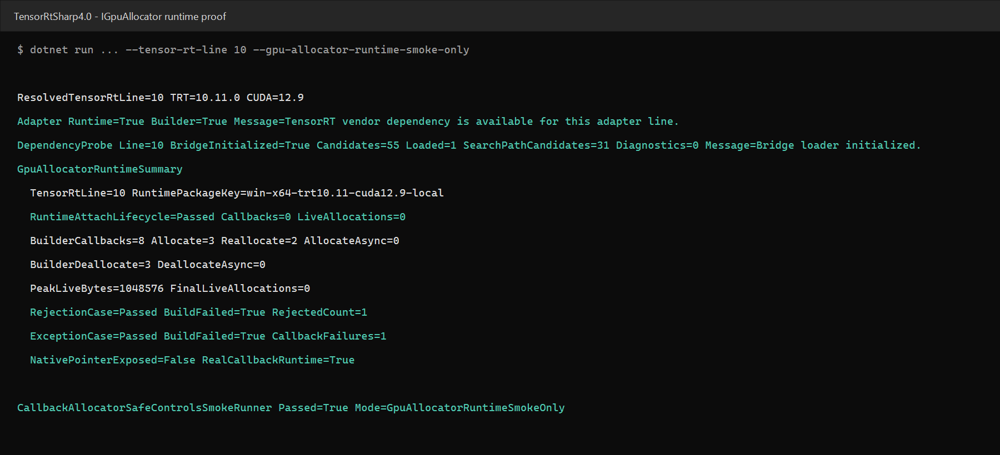

# TensorRT IGpuAllocator：C# 策略回调、native 显存台账与 Engine 生命周期

> 项目：TensorRtSharp4.0
>
> 主要接口：`TensorRtGpuAllocatorCallbackOwner`、`TensorRtRuntime.SetGpuAllocator`、`TensorRtBuilder.SetGpuAllocator`
>
> 本机结果：TensorRT 10.11、CUDA 12.9、NVIDIA GeForce RTX 3060 Laptop GPU
>
> 证据边界：TensorRT 8/10/11 ABI 与源码均已接入；本文只把本机 TensorRT 10.11 结果称为真实运行证据。

## 1. 项目与库

TensorRtSharp4.0 是 `JYPPX.TensorRtSharp` 与 `JYPPX.CudaSharp` 的统一源码仓库。前者封装 TensorRT 的 builder、runtime、engine 与 execution context；后者封装 CUDA runtime、stream、event 与 device memory。两者通过 `jyppxtrtbridge` 进入 NVIDIA 的 C++ API。

`nvinfer1::IGpuAllocator` 允许应用接管 TensorRT 的 GPU memory allocation。它不是普通的“让 C# 返回一个地址”的回调：TensorRT 可以并发调用 `allocate`、`reallocate`、`deallocate`，TensorRT 10 还可能调用 stream-aware 版本；allocator 的生命周期必须长于 builder、runtime 以及由它们创建且继续使用 allocator 的 engine。

本项目采用以下所有权边界：

| 组件 | 职责 |
| --- | --- |
| `TensorRtGpuAllocatorCallbackOwner` | 固定托管 delegate 与 callback state，管理借用计数。 |
| `TensorRtBuilder` / `TensorRtRuntime` | 挂载 native allocator，并在构建或反序列化期间保留 owner。 |
| `TensorRtEngine` | 继承一份 owner 租约，先销毁 native engine，再释放租约。 |
| `jyppxtrtbridge` | 实现稳定、不可 copy/move 的 `IGpuAllocator` vtable，并拥有 CUDA 分配台账。 |
| 托管 handler | 只读取复制后的 size、alignment、flags 和布尔元数据，决定是否接受分配。 |

公开 C# API 不包含 device pointer、CUDA stream handle、`IntPtr`、`UIntPtr` 或 `SafeHandle`。实际地址只存在于 native owner 的私有台账中。

## 2. 模型获取与转换说明

这个案例专门验证 allocator vtable 和对象生命周期，不需要训练好的深度学习模型。程序用 API 创建一个 `[1,4]` FP32 输入、一个 identity layer 和一个输出，因此：

- 模型名称：程序内构造的 identity network；
- 官方获取方式：不适用，没有模型下载地址；
- PyTorch、ONNX 或其他格式转换：不适用；
- ONNX 暂存目录：不产生 ONNX 文件，也不会向仓库或外部 `models` 目录写模型；
- engine：运行时临时构建，不提交到 GitHub。

后续如果把 allocator 用于真实分类、检测或分割案例，对应文章仍必须单独写明模型官方来源、权重校验、ONNX 导出命令和外部 `models` 暂存位置。本案例不能替代那些模型说明。

## 3. 环境准备

用户自行安装 .NET SDK、CUDA Toolkit 与目标 TensorRT SDK。本项目不捆绑 CUDA、cuDNN、TensorRT 或 NVRTC。先按实际安装目录设置环境：

```powershell
$env:TENSORRT_PATH = '<TensorRT 安装目录>'
$env:JYPPX_TENSORRT_ROOT = $env:TENSORRT_PATH
$env:JYPPX_NATIVE_BRIDGE_PATH = '<按当前 TensorRT/CUDA 组合编译的 jyppxtrtbridge.dll>'
$env:JYPPX_ENABLE_DEVELOPMENT_PROBING = 'true'
$env:PATH = "$env:TENSORRT_PATH\lib;$env:PATH"
```

从源码构建 bridge：

```powershell
cmake --preset win-x64-trt10-cuda12-release
cmake --build --preset win-x64-trt10-cuda12-release --parallel
```

版本必须匹配。用 TensorRT 10 编译的 bridge 不能当作 TensorRT 8 或 11 bridge 使用。

## 4. 创建无指针策略回调

handler 返回 `true` 允许分配或重分配；返回 `false` 时 native vtable 返回 `nullptr`，TensorRT 构建明确失败。释放通知不会允许业务 handler 阻止 `cudaFree`，即使 handler 抛异常，native 仍尝试释放 owner 管理的显存。

```csharp
using TensorRtGpuAllocatorCallbackOwner owner =
    new TensorRtGpuAllocatorCallbackOwner(
        TensorRtApiLine.TensorRt10,
        request =>
        {
            Console.WriteLine(
                $"{request.Kind}: size={request.RequestedSize}, " +
                $"alignment={request.Alignment}, stream={request.HasStream}");

            return true;
        });
```

`HasCurrentMemory` 只说明 TensorRT 提供了已有分配，`HasStream` 只说明回调带有 stream。两者都不会暴露原始值。

## 5. Builder 全流程

先创建网络和配置，再挂载 owner，最后直接构建 engine：

```csharp
using TensorRtLogger logger = new TensorRtLogger(TensorRtApiLine.TensorRt10);
using TensorRtBuilder builder = new TensorRtBuilder(logger);
using TensorRtBuilderConfig config = builder.CreateBuilderConfig();
config.SetMemoryPoolLimit(TensorRtMemoryPoolType.Workspace, 32UL * 1024UL * 1024UL);

using TensorRtNetworkDefinition network =
    builder.CreateNetwork(TensorRtNetworkDefinitionCreationFlags.ExplicitBatch);
using TensorRtTensor input = network.AddInput(
    "gpu_input",
    TensorRtDataType.Float,
    new TensorRtDims(new[] { 1, 4 }));
using TensorRtLayer identity = network.AddIdentity(input);
using TensorRtTensor output = identity.GetOutput(0);
output.Name = "gpu_output";
network.MarkOutput(output);

builder.SetGpuAllocator(owner);
using TensorRtEngine engine = builder.BuildEngineWithConfig(network, config);

TensorRtGpuAllocatorRuntimeSnapshot attached = owner.GetRuntimeSnapshot();
builder.ClearGpuAllocator();

// Engine 仍保留 owner；销毁 engine 后，native deallocate 才全部完成。
engine.Dispose();
TensorRtGpuAllocatorRuntimeSnapshot released = owner.GetRuntimeSnapshot();
```

`ClearGpuAllocator` 只解除 builder 的挂载。它不会提前销毁仍被 engine 使用的 owner，也不会把 live allocation 当场强制释放。`TensorRtEngine.Dispose` 先销毁 native engine；TensorRT 完成 deallocate 后，托管 engine 才释放 owner 租约。

## 6. Runtime 生命周期路径

Runtime 使用相同的 API：

```csharp
runtime.SetGpuAllocator(owner);
using TensorRtEngine engine = runtime.Deserialize(serializedPlan);
runtime.ClearGpuAllocator();
engine.Dispose();
```

本机的极小 identity plan 在反序列化时没有请求 GPU allocation，所以 Runtime 路径记录 `Callbacks=0`。这条结果只证明非空 allocator 成功挂载、engine 租约存在且解除挂载后没有泄漏；它不冒充 Runtime callback invocation 证明。真实 callback invocation 由同一次程序中的 Builder 路径证明。

## 7. 拒绝与异常负例

策略拒绝分配：

```csharp
using TensorRtGpuAllocatorCallbackOwner rejected =
    new TensorRtGpuAllocatorCallbackOwner(
        TensorRtApiLine.TensorRt10,
        request => request.IsRelease);
```

分配回调返回 `false` 后，`BuildEngineWithConfig` 失败，快照记录 `RejectedCount=1`，并要求 `LiveAllocationCount=0`。

异常负例让非释放回调抛出受控异常。托管 trampoline 捕获异常并返回失败状态，异常不会穿越 C ABI；TensorRT 构建失败，快照记录 `CallbackFailureCount=1`，同样要求没有 live allocation。

## 8. 执行程序

在仓库根目录执行：

```powershell
dotnet run --project smoke/CallbackAllocatorSafeControlsSmokeRunner `
  -c Release -- `
  --tensor-rt-line 10 `
  --runtime-package-key win-x64-trt10.11-cuda12.9-local `
  --gpu-allocator-runtime-smoke-only
```

本机真实结果摘要：

```text
GpuAllocatorRuntimeSummary
  TensorRtLine=10 RuntimePackageKey=win-x64-trt10.11-cuda12.9-local
  RuntimeAttachLifecycle=Passed Callbacks=0 LiveAllocations=0
  BuilderCallbacks=8 Allocate=3 Reallocate=2 AllocateAsync=0
  BuilderDeallocate=3 DeallocateAsync=0
  PeakLiveBytes=1048576 FinalLiveAllocations=0
  RejectionCase=Passed BuildFailed=True RejectedCount=1
  ExceptionCase=Passed BuildFailed=True CallbackFailures=1
  NativePointerExposed=False RealCallbackRuntime=True
```



截图由同一次 smoke stdout 渲染，原始文本与 SHA256 记录在 `samples/assets/gpu-allocator-real-runtime-tensorrt10.11-evidence.json`。

## 9. 如何判断成功

| 检查项 | 本机结果 | 含义 |
| --- | ---: | --- |
| `BuilderCallbacks` | 8 | TensorRT 真实进入 native `IGpuAllocator` vtable。 |
| `Allocate` / `Reallocate` | 3 / 2 | 同步分配与可选重分配路径均被调用。 |
| `BuilderDeallocate` | 3 | TensorRT 释放 owner 分配的显存。 |
| `PeakLiveBytes` | 1,048,576 | native 台账观察到真实 CUDA allocation。 |
| `FinalLiveAllocations` | 0 | Engine 销毁后没有遗留分配。 |
| `RejectedCount` | 1 | 托管策略拒绝让构建 fail closed。 |
| `CallbackFailures` | 1 | 托管异常被转换为失败状态。 |
| `NativePointerExposed` | False | 公开 API 没有暴露 CUDA 地址或 stream handle。 |

## 10. native 实现边界

- owner 地址稳定，禁止 copy/move，析构函数为 `noexcept`；
- TensorRT 8 的纯虚 `free(void*)` 通过版本条件映射到同一释放台账；TensorRT 10/11 使用 `deallocate`，并增加 async 入口；
- allocation ledger 以 native pointer 为私有 key，只对 C# 返回计数、大小和布尔值；
- 同步实现使用 `cudaMalloc`、`cudaMemcpy`、`cudaFree`；TensorRT 允许 `allocateAsync` 采用同步实现；
- callback invocation 与最大并发数使用原子计数，状态与台账由 mutex 保护；
- detach 先调用 `setGpuAllocator(nullptr)`，再等待当前 in-flight callback 退出；
- detach 不会释放 engine 仍可能使用的 allocation；最终 owner 析构才同步并清理异常残留；
- Runtime/Builder 的 Set、Clear、构建和反序列化使用同一生命周期锁；callback 内反向调用 Runtime/Builder 的 Clear、Set 或 Dispose 会被拒绝；allocator owner 自身的 `Dispose` 只登记延迟释放，直到全部借用租约归还后才销毁 native owner。

## 11. 版本与发布边界

TensorRT 8、10、11 各有 create、attach-runtime、attach-builder、detach、get-info 五个 manifest 入口。当前机器只安装了 TensorRT 10.11，因此 TRT8 与 TRT11 完成了源码、manifest、P/Invoke 与无 vendor SDK 编译验证，但没有伪造本机运行数据。

本文记录的是源码树本地验证，不是 clean package consumer、公开 NuGet、GitHub Package、Release 或 post-publish 证据。项目仍在开发阶段，不创建 tag、不发布 Release、不推送任何包。
