# ExecutionContext 与 Inference Binding：从张量地址到可验证推理

很多 TensorRT 教程会停在“engine 创建成功”。但真正进入应用时，难点往往不在 builder，而在 execution context：输入 shape 是否设置、device buffer 是否分配、tensor address 是否绑定、enqueue 前是否 ready、输出是否能安全读回。

TensorRtSharp4.0 的 `samples/InferenceBindings` 就是为这条路径准备的最小可运行样例。它不依赖外部 ONNX 模型，而是在 C# 中直接构建一个 explicit-batch identity network，用来验证 `TensorRtInferenceBindings` 的输入、输出、绑定、enqueue 和 readback 工作流。

## 适合谁

这篇文章适合：

- 想确认 TensorRT engine 创建之后如何执行推理的 C# 用户。
- 想避免手动管理裸 tensor address 的用户。
- 想为自己的模型样例复用 `TensorRtInferenceBindings` 模式的维护者。

本文对应仓库代码：

```text
samples/InferenceBindings/Program.cs
samples/InferenceBindings/README.md
```

## 样例做了什么

样例构建了一个非常小的网络：

```text
input [-1, 4] -> Identity -> output [-1, 4]
```

其中 batch 维度是动态的，optimization profile 设置为：

| 项 | Shape |
| --- | --- |
| min | `[1, 4]` |
| opt | `[2, 4]` |
| max | `[4, 4]` |

运行时通过 `--batch` 选择 batch 1 到 4 之间的实际 shape。

```mermaid
flowchart LR
  A["创建 Logger/Runtime/Builder"] --> B["创建 explicit-batch network"]
  B --> C["AddInput + Identity + MarkOutput"]
  C --> D["设置 optimization profile"]
  D --> E["BuildSerializedNetwork"]
  E --> F["Deserialize engine"]
  F --> G["创建 execution context"]
  G --> H["TensorRtInferenceBindings 设置输入 shape 和 host 数据"]
  H --> I["分配 output device buffer 并 BindAll"]
  I --> J["GetReadiness"]
  J --> K["EnqueueAsync"]
  K --> L["ReadOutputSingles 并校验 OutputMatch"]
```



## 运行命令

先构建 solution：

```powershell
dotnet build .\TensorRtSharp.sln -c Debug --no-restore /p:UseSharedCompilation=false
```

启用开发探测：

```powershell
$env:JYPPX_ENABLE_DEVELOPMENT_PROBING = "1"
```

运行样例：

```powershell
dotnet .\samples\InferenceBindings\bin\Debug\net8.0\InferenceBindings.dll --tensor-rt-line 10 --batch 2
```

也可以用源码项目运行：

```powershell
dotnet run --project .\samples\InferenceBindings -- --tensor-rt-line 10 --batch 2
```

参数：

| 参数 | 含义 |
| --- | --- |
| `--tensor-rt-line <8|10|11>` | 选择 TensorRT adapter line，默认 `10`。 |
| `--batch <1..4>` | 选择 profile 范围内的 runtime batch，默认 `2`。 |

## 关键代码路径

样例先选择 TensorRT 版本线：

```csharp
TensorRtApiLine line = TensorRtSampleSupport.ResolveLine(
    SampleCommandLine.GetStringArgument(args, "--tensor-rt-line", "10"));
```

然后创建 runtime、builder、config 和 CUDA stream：

```csharp
using TensorRtLogger logger = new TensorRtLogger(line);
using TensorRtRuntime runtime = new TensorRtRuntime(logger);
using TensorRtBuilder builder = new TensorRtBuilder(logger);
using TensorRtBuilderConfig config = builder.CreateBuilderConfig();
using CudaStream stream = new CudaStream();
```

网络本身很小：

```csharp
using TensorRtNetworkDefinition network =
    builder.CreateNetwork(TensorRtNetworkDefinitionCreationFlags.ExplicitBatch);
using TensorRtTensor inputTensor =
    network.AddInput("input", TensorRtDataType.Float, new TensorRtDims(new[] { -1, 4 }));
using TensorRtLayer identity = network.AddIdentity(inputTensor);
using TensorRtTensor outputTensor = identity.GetOutput(0);
outputTensor.Name = "output";
network.MarkOutput(outputTensor);
```

真正值得复用的是 binding 这一段：

```csharp
using TensorRtInferenceBindings bindings =
    new TensorRtInferenceBindings(engine, context, profileIndex);
bindings.SetInputShape("input", runtimeShape)
        .CopyInputFromHost("input", inputValues, runtimeShape);
bindings.AllocateDeviceBuffer("output", runtimeShape);
bindings.BindAll();
```

这段代码把 shape、host-to-device copy、输出 buffer 和 tensor address binding 收敛到一个高层对象里。用户不需要直接暴露或保存裸 `IntPtr` tensor address。

enqueue 前检查 readiness：

```csharp
TensorRtExecutionContextReadiness readiness =
    bindings.GetReadiness(runShapeInference: true);
```

如果 `readiness.IsReadyForEnqueue` 为 false，样例会失败并输出诊断，而不是盲目执行。

## 预期输出

成功时应看到类似 markers：

```text
InferenceBindings TensorRtLine=10 TRT=... CUDA=... Batch=2
BindingReport Ready=True Inputs=1 Outputs=1
EngineMemory Device=... Profile=... AuxStreams=...
Readiness Ready=True Bound=True ActiveProfile=0
Execution ... OutputMatch=True
InferenceBindings Passed=True
```

这些 markers 分别证明：

| Marker | 含义 |
| --- | --- |
| `BindingReport Ready=True` | binding report 判断输入输出已准备好。 |
| `Readiness Ready=True Bound=True` | execution context enqueue 前置条件满足，tensor address 已绑定。 |
| `OutputMatch=True` | identity 网络输出与输入一致。 |
| `InferenceBindings Passed=True` | 样例端到端完成。 |

## 常见问题

如果输出：

```text
InferenceBindings=Skipped Reason=...
```

说明当前 runtime、builder、CUDA 或 vendor dependency 探测不可用。它是环境证据，不是 deferred API 自动完成或失败的证明。

如果 batch 超出 1 到 4，样例会输出 invalid arguments。因为 profile 明确只覆盖 `[1,4]`。

如果遇到 CUDA 13.2 的 `blocked-by-cuda-driver`，应先处理驱动/runtime 兼容性，不要修改 inference binding API 来绕过。

## 为什么这个样例重要

它把用户最容易写错的几个步骤固定成可诊断流程：

- 不直接让用户处理裸 tensor address。
- 在 enqueue 前提供 readiness snapshot。
- 让 output readback 和 `OutputMatch=True` 成为明确 evidence。
- 支持 TRT8/TRT10/TRT11 line 选择，保留跨版本验证路径。

后续接入真实分类、检测或生成模型时，模型输入预处理会更复杂，但 execution context 的核心工作流仍然是这一套。

## 下一步

继续阅读：

- [Dynamic Shape 与 Optimization Profile](dynamic-shape-optimization-profile-tutorial.md)
- [ONNX Parser 到 Serialized Engine](onnx-parser-to-serialized-engine-tutorial.md)
- [常见问题排查总表](troubleshooting-index.md)
