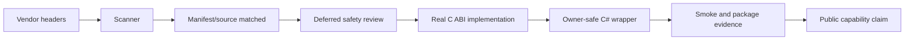
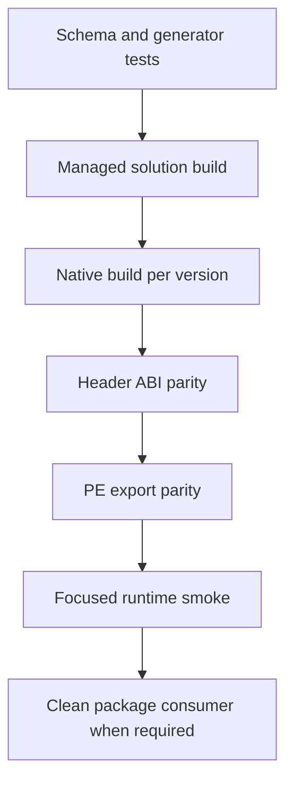

# 从接口清零到 Deferred 边界提升

TensorRtSharp4.0 的覆盖矩阵已经让本机扫描到的 TensorRT/CUDA 接口全部进入 manifest/source 账本。
这通常被简称为“接口清零”。但接口清零回答的是“项目是否知道这个官方接口”，不是“普通 C# 用户
是否已经能安全调用”。后一个问题需要真实 C ABI、托管路由、owner-safe wrapper、跨版本行为和
runtime/package evidence，项目把这个过程称为 deferred 边界提升。

本文给维护者一套从 coverage row 到 public API 的完整工作流，并解释每个状态能证明什么。

## 适用读者

- 需要选择下一批 deferred uplift 候选的维护者。
- 想理解 100% manifest matched 为什么不等于 100% public usable 的用户。
- 正在添加 native entry、generated interop、wrapper 和 smoke 的贡献者。
- 负责发布审计，希望避免把 source-quality 结果误报为 runtime proof 的 owner。

## 两个“完成”的区别

接口覆盖和可用性是两个坐标：



`M` 完成就是接口清零；只有经过 `D` 到 `T`，某一项能力才可能成为用户可调用的产品面。任何一步
缺失，都不能靠修改 coverage 文案跨过去。

## 权威覆盖工件

覆盖 exporter 位于 `eng/Export-InterfaceCoverageMatrix.ps1`，它扫描本地 vendor headers，并将结果与
`native/manifests` 和 native source 对齐。持续集成和人工审计主要读取：

- `artifacts/interface-coverage/interface-coverage-summary.md`
- `artifacts/interface-coverage/tensorrt-interface-coverage.csv`
- `artifacts/interface-coverage/cuda-runtime-interface-coverage.csv`
- `artifacts/interface-coverage/tensorrt-interface-comparison.csv`
- `artifacts/interface-coverage/cuda-runtime-interface-comparison.csv`

当前 summary 记录 4009 条 manifest API。本地可用的六个 TensorRT package 组合中，官方接口均能
匹配 manifest 和 native source：

| API line | 官方接口 | implemented | deferred-only |
| --- | ---: | ---: | ---: |
| TensorRT 8.6 | 880 | 760 | 120 |
| TensorRT 10.11 | 879 | 761 | 118 |
| TensorRT 11.0 | 901 | 814 | 87 |

CUDA 11.6 到 13.2 同样全部进入账本，但 implemented/deferred 数会随 toolkit API 面增长。数字必须从
当前 summary 重新读取，不应复制一篇旧文章的快照当永久事实。

## ImplementationStatus 怎么读

CSV 的 `ImplementationStatus` 不是二元值：

| 状态 | 含义 | 下一动作 |
| --- | --- | --- |
| `implemented` | 有真实非 deferred manifest/source 匹配 | 核对 wrapper、smoke 和版本声明 |
| `implemented-with-deferred-history` | 当前有真实实现，旧 deferred row 仍保留 | 验证 alias 与历史理由，不删除旧记录 |
| `deferred-only` | 只存在安全占位/边界记录 | 评估 ownership、symbol 和 runtime 风险 |
| `manifest-only` | 有 manifest，native source 未被识别 | 检查实现或 exporter token mapping |
| `missing` | vendor API 未进入有效账本 | 建立明确 triage，不直接写 public API |

`implemented-with-deferred-history` 很重要。一个接口从 deferred 提升后，旧记录仍能解释过去为何不安全，
coverage exporter 用显式 alias 将它与真实 entry 合并。删掉旧 manifest 只会抹掉历史，不能增加能力。

## Deferred 是安全决策，不是待办标签

以下情况通常应继续 deferred：

- 返回 borrowed plugin、tensor、device 或 resource pointer。
- vendor 会在未知线程回调托管 delegate。
- dispose 必须等待 in-flight callback 归零。
- acquire/release 协议需要稳定 native owner ledger。
- 字符串或数组只能拿到生命周期不明的 vendor buffer。
- import library/DLL 中不存在 header 声明的 symbol。
- 只有 mock、dry-run 或 synthetic callback，没有真实 runtime 触发。

相反，适合优先提升的候选通常是只读 scalar、copied metadata、caller-buffer string、count/copy list 或
能由现有 owner handle 严格限定生命周期的控制项。

## 候选审计必须先于实现

每批 uplift 先建立 candidate audit，至少记录：

| 维度 | 必须回答的问题 |
| --- | --- |
| Header | TRT8、TRT10、TRT11 或各 CUDA toolkit 是否声明该 API？ |
| LIB/DLL | import library 与 DLL 是否有真实可链接/可执行 symbol？ |
| ABI | 参数宽度、枚举、bool、字符串、数组如何稳定表达？ |
| Ownership | 输入/输出由谁拥有，是否 borrowed，是否跨调用保留？ |
| Exceptions | C++ exception、SEH、CUDA error 如何转为 status？ |
| Versions | 哪条 line 实现、NotSupported 或根本不应生成？ |
| Wrapper | public 类型是否 pointer-free，disposed/line/range 如何校验？ |
| Evidence | 需要 source test、native build、smoke 还是 clean consumer？ |

仓库中可参考 `artifacts/interface-coverage/trt-deferred-safe-uplift-candidate-audit.json` 与
`artifacts/interface-coverage/cuda-deferred-candidate-safety-audit.json`。候选表的价值是允许结论为
“不提升”；审计不是为了给预定实现找理由。

## 一个批次的端到端路径

### 1. 选一个内聚领域

一次选择 5-15 个同一 owner/lifetime 模型的接口，比跨领域挑若干简单 getter 更容易形成可靠验证。
例如 builder config scalar、engine copied metadata 或 CUDA memory range queries 都有统一的参数和错误模型。

### 2. 写 manifest，而不是手写两份声明

manifest 需要满足 `native/manifests/bridge-api.schema.json`，并明确 `id`、`entryPoint`、`returnType`、
`ownership`、`manualOverride` 和每个参数的 `direction`。版本专属能力放进对应 v8/v10/v11 目录，不能
为了复用代码把不存在的 TRT11 API 写进 TRT8。

### 3. 生成并验证绑定

```powershell
pwsh -NoProfile -File .\eng\Generate-Bindings.ps1
pwsh -NoProfile -File .\eng\Test-BindingGeneratorOutputs.ps1
```

第二条脚本会验证必填字段、ID/entry point 唯一性、生成文件存在性以及重复生成 hash 稳定性。若生成后
还有手工修改 generated file，应该修 generator/template，而不是把漂移提交进去。

### 4. 实现 no-throw C ABI

native 实现放入对应 line 的 source 或公共 `.inc`，但公共实现仍要由编译时 major guard 保护。入口应：

1. 校验 output pointer、handle magic、line 和 object kind。
2. 检查 TensorRT/CUDA 是否在 build 时可用。
3. 检查当前 vendor major 是否与 requested line 一致。
4. 捕获 C++ exception 和 Windows SEH。
5. 设置 last error 并返回稳定 status。
6. 对字符串/列表复制，不泄漏 vendor buffer。

### 5. 添加托管 interop 与 wrapper

generated P/Invoke 只是底层声明。`NativeBridgeApi` 负责 line route、UTF-8/count-copy 和 status；public
wrapper 再负责：

- null、range、enum 和 disposed 检查。
- owner/borrower keep-alive。
- 同一 `TensorRtApiLine` 约束。
- 返回 string、array、snapshot 或 owner object。
- 对不支持版本提供明确 `NotSupported`/`TryGet` 诊断。

public API 不应让用户传入或接收 `IntPtr`、`nint`、`SafeHandle` 或无语义 handle。

### 6. 建立与风险相称的证据



只读 metadata 可能以 focused smoke 和 copied snapshot assertion 收口；callback/allocator 则必须再证明
真实 vendor callback、no-throw trampoline、in-flight accounting、detach-before-release 与 clean package
consumer。测试范围应随 blast radius 增长。

## 覆盖 exporter 的复算流程

本机已有 vendor assets 时，可执行：

```powershell
pwsh -NoProfile -File .\eng\Export-InterfaceCoverageMatrix.ps1 `
  -TensorRtPackageRoot $env:JYPPX_TENSORRT_ROOT
```

然后检查 summary 和 CSV：

```powershell
Import-Csv .\artifacts\interface-coverage\tensorrt-interface-coverage.csv |
  Group-Object Package,ImplementationStatus |
  Select-Object Name,Count
```

注意 exporter 使用启发式 token matching。它适合做持续账本，不取代高风险接口的 header/symbol/manual
review。`manifest-only` 或异常宽泛匹配必须回到源码核查。

## ABI 与导出为什么要分开

`eng/Test-TensorRtNativeAbiSurface.ps1` 检查 manifest entry point 是否在三份 public header 中声明。
native build 证明编译/链接，PE export parity 则证明生成 DLL 确实导出预期入口。这三个门分别发现：

- manifest/header 漂移。
- vendor header 或 import library 不兼容。
- visibility、linker 或构建产物遗漏。

任一通过都不能代替另两个。

## Smoke 需要验证行为，不只验证入口存在

一个有效 smoke 至少要断言输入、状态和输出语义。例如 copied inventory 应检查 count、字符串非空、
版本 line 和重复项；memory range query 应检查 offset/count 校验和复制数量；engine control 应检查 set/readback
或明确 unsupported。仅调用一次并得到 status 0，通常不足以证明 wrapper contract。

runtime smoke 还必须记录目标 runtime key、bridge build info、TensorRT/CUDA 版本和 skip/blocked 原因。
`Skipped=True`、dependency probe 或 controlled dry-run 不能替代真实执行。

## Proof 分级

| 证据 | 已证明 | 未证明 |
| --- | --- | --- |
| header scanned | exporter 看见官方声明 | manifest 或实现存在 |
| manifest/source matched | API 已纳入追踪 | public wrapper 安全 |
| generator test | 描述与生成结果稳定 | vendor symbol 可链接 |
| native build | 指定 SDK 组合编译链接 | 运行行为和其它组合 |
| ABI/export parity | 声明和 DLL 导出一致 | 对象生命周期正确 |
| managed tests | wrapper contract 在测试输入成立 | GPU/vendor 路径已执行 |
| source-tree smoke | 当前源码和主机路径通过 | NuGet 消费端通过 |
| package consumer runtime | 指定包和主机真实执行 | post-publish 渠道可下载 |

## 常见失败与处理

| 失败 | 可能原因 | 正确处理 |
| --- | --- | --- |
| row 仍是 `deferred-only` | alias 缺失或真实 entry 未匹配 | 核对 ID/entry/source token，保留旧 row |
| generator 非幂等 | template 顺序或写入时间漂移 | 修 exporter 生成确定性内容 |
| native link 找不到 symbol | header 声明与 vendor binary 不一致 | 回退 deferred 并记录 symbol evidence |
| TRT8 build 过、TRT11 失败 | API 已删除或签名变化 | 拆 line 实现与 guard，不做最低公分母假入口 |
| wrapper 暴露 handle | ownership 尚未建模 | 设计 owner/snapshot，不把风险转嫁用户 |
| smoke controlled skip | 环境或前置条件缺失 | 保留 blocked/skip 分类，不写 passed |
| coverage 数字变好但测试没变 | 只改了 mapping/manifest | 补行为证据或撤销错误 promotion |

## 发布文案的正确写法

- `implemented`：可以写“已有真实 native entry”，仍需说明 wrapper/evidence。
- `implemented-with-deferred-history`：可以写“当前实现已提升，历史 deferred 保留”。
- `deferred-only`：写“已纳入账本，因具体 ownership/runtime 风险暂不公开”。
- `manifest matched 100%`：写“扫描接口全部纳入追踪”，不要写“全部 API 可用”。
- `blocked-by-cuda-driver`：写“当前主机 driver/runtime 不兼容”，不要改写为 smoke passed。

## 边界说明

coverage matrix 是 source-quality evidence，不是 runtime execution、package consumer、post-publish 或 owner
authorization。候选 audit、design gate、generated binding 和 native ABI parity 都不能单独让 release flag 晋级。

本阶段仍固定：`performsPublish=false`、`canPublishPublicly=false`、`canCloseReleaseIssue=false`。

## 批次完成清单

- [ ] candidate audit 记录三代 header、LIB/DLL symbol、ownership 和风险结论。
- [ ] 每条适用 line 都有正确 manifest 与 version guard。
- [ ] generator 连续执行输出稳定。
- [ ] C ABI status/no-throw/caller-buffer/count-copy 契约完整。
- [ ] public wrapper pointer-free，并执行 line/disposed/range 校验。
- [ ] focused tests 覆盖成功与负向路径。
- [ ] native build、ABI declaration 和 PE export parity 对目标 line 通过。
- [ ] coverage row 正确变为 `implemented` 或 `implemented-with-deferred-history`。
- [ ] smoke/package evidence 分类没有被夸大。
- [ ] completion review、plan、diary 和文档同步。

## 下一步

- [为什么不是简单 P/Invoke](why-not-plain-pinvoke.md)
- [TRT8/TRT10/TRT11 跨版本策略](trt-cross-version-strategy.md)
- [Callback 与 Allocator 安全桥接路线](callback-allocator-safety-bridge-roadmap.md)
- [最新 Windows API 覆盖状态](windows-api-completion-latest.md)
