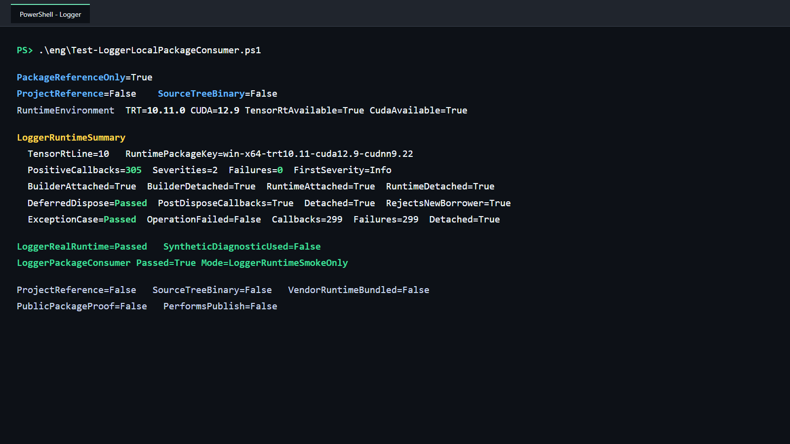

# 通过公开 NuGet 包使用 TensorRT ILogger：真实日志、生命周期与异常隔离

> 项目：TensorRtSharp4.0
>
> 主要库：`JYPPX.TensorRtSharp`、`JYPPX.CudaSharp`、`jyppxtrtbridge`
>
> 示例：`tests/fixtures/package-consumers/Logger.PackageConsumer`
>
> 本机结果：TensorRT 10.11、CUDA 12.9、NVIDIA GeForce RTX 3060 Laptop GPU
>
> 安装边界：用户流程使用公开 NuGet 包；文中的既有截图和 JSON 仍是发布前 local-feed 历史证据，不代表 post-publish 验证。

## 1. 项目与功能背景

TensorRtSharp4.0 为 NVIDIA TensorRT 和 CUDA 提供 C# 托管接口。TensorRT public API 统一位于 `JYPPX.TensorRtSharp`，CUDA public API 位于 `JYPPX.CudaSharp`，native bridge 则通过稳定 C ABI 调用 NVIDIA C++ API。

TensorRT 的 `ILogger::log` 是 builder、runtime、parser 等对象共用的诊断入口。`TensorRtLogger` 不只是一个委托包装器：它拥有 native logger、托管 handler、delegate 和 `GCHandle`；builder、runtime、parser 与 refitter 只借用 logger。最后一个 borrower 解除借用前，logger 即使收到 `Dispose()` 请求也不能提前释放 native 对象或托管回调状态。

原有 `ManagedLoggerCallbackSmokeRunner` 使用 `EmitDiagnostic` 验证 trampoline 基础行为。这对 ABI 单元验证有价值，但它不能证明 TensorRT 自身会在真实 build、deserialize 或 inference 流程中调用托管 handler。本文新增的外部消费者完全不调用 `EmitDiagnostic`，而是执行完整网络构建与推理，并以 `SyntheticDiagnosticUsed=False` 固化该边界。

## 2. 依赖与包职责

运行者需要自行安装 .NET 8 SDK、NVIDIA 驱动、CUDA Toolkit 和匹配的 TensorRT SDK。项目不再打包 CUDA、cuDNN、TensorRT 或 NVRTC。

仓库外消费者需要两个公开包：

| 包 | 作用 | 内容边界 |
| --- | --- | --- |
| `JYPPX.TensorRT.CSharp.API` | 提供 `JYPPX.TensorRtSharp` 与 `JYPPX.CudaSharp` 托管 API | 不含 NVIDIA DLL |
| `...Runtime.win-x64.trt10.11.cuda12.9.cudnn9.22.Bridge` | 提供匹配版本的 native bridge | 只含 `jyppxtrtbridge.dll` |

程序启动后通过 `TensorRtEnvironmentProbe.GetCurrent()` 核对 bridge build info、TensorRT/CUDA 可用状态和 TensorRT 主版本。bridge 与主机 TensorRT 不匹配时立即失败，而不是继续运行后给出含糊结果。

## 3. 模型获取与转换说明

本案例验证 logger callback，不依赖训练模型、ONNX 或输入图片：

- 模型名称：程序内创建的 `[1,1,32,32]` FP32 1x1 convolution network；
- 官方获取方式：不适用，没有模型下载地址；
- 权重许可证与 SHA256：不适用，卷积核和 bias 常量由示例源码创建；
- ONNX 转换方式：不适用，直接调用 TensorRT network API；
- 外层模型目录：不读写 `<workspace-root>/models`；
- 图像识别结果：不适用，本例不执行视觉识别任务；
- 结果可视化：使用真实程序运行终端截图，不伪造识别图；
- plan：仅在当前进程中创建、反序列化和执行，不作为模型文件提交。

涉及真实视觉模型的文章仍必须写明官方权重来源、固定 revision、许可证、转换命令、ONNX SHA256 和外层 `models` 暂存位置，并同时给出原图叠加结果与程序运行截图。

## 4. 并发与 ABI 安全修正

TensorRT 可能从内部工作线程调用 logger 或 profiler。原 bridge 中 `ManagedLogger::last_callback_failed_` 和 `ManagedProfiler::last_callback_failed_` 使用普通 `bool`；多个 native 线程同时读写会形成 C++ 数据竞争。现在 TRT8、TRT10、TRT11 都改为 `std::atomic<bool>`，读取使用 `load(std::memory_order_relaxed)`。

TRT11 runtime-create 诊断还保存 message count、last severity 和 last message。写入与快照复制现在都在 `diagnostics_mutex_` 下完成，外部结构只接收复制后的值，不得到指向 logger 内部字符缓冲区的指针。

这些修改只改变 bridge 内部类实现：

- 没有新增、删除或改名导出 C 函数；
- 没有改变 manifest 参数、返回值或调用约定；
- 没有改变 `TensorRtLogger` public 构造函数、属性或方法签名；
- 没有向 public API 暴露 native pointer。

因此并发修正不牺牲已有 C ABI 和 managed API 兼容性。

## 5. 安装公开包

在仓库外创建项目，并从公开 NuGet 源引用 managed 包和匹配本机矩阵的 bridge-only 包：

~~~powershell
dotnet new console --framework net8.0
dotnet add package JYPPX.TensorRT.CSharp.API --version "4.0.0"
dotnet add package JYPPX.TensorRT.CSharp.API.Runtime.win-x64.trt10.11.cuda12.9.cudnn9.22.Bridge --version "4.0.0"
~~~

精确 `4.0.0` 固定正式版本，避免 NuGet 选择 API 不兼容的历史 `4.0.6170`。Bridge 包 ID 必须按目标机器环境替换；NVIDIA runtime 继续由用户安装。

### 发布前 local-feed 证据复核

先构建与主机匹配的 bridge：

```powershell
cmake --preset win-x64-trt10-cuda12-release
cmake --build --preset win-x64-trt10-cuda12-release --parallel
```

再生成 managed 与 bridge-only 本地候选包：

```powershell
powershell -NoProfile -ExecutionPolicy Bypass `
  -File .\eng\Invoke-LocalSplitRuntimePackage.ps1 `
  -SourceRuntimeKey win-x64-trt10.11-cuda12.9-cudnn9.22 `
  -Version 4.0.0 `
  -SkipConsumerValidation `
  -TensorRtRoot <TensorRT-root> `
  -CudaRoot <CUDA-root>
```

该流程只生成本地候选物，不创建 tag、不创建 GitHub Release、不发布新包。bridge 包内容审计要求 NVIDIA vendor runtime 数量为 0。

## 6. 仓库外消费者如何隔离

`Test-LoggerLocalPackageConsumer.ps1` 调用统一 callback-owner 验证器，在 Git 仓库外创建一次性项目：

1. 本地 `NuGet.config` 使用 `<clear />`，只加入 managed 与 bridge-only 候选包目录；
2. 使用独立 package cache；
3. 项目只有两个 `PackageReference`，没有 `ProjectReference` 或 `HintPath`；
4. 清除 `JYPPX_NATIVE_BRIDGE_PATH` 和 `JYPPX_ENABLE_DEVELOPMENT_PROBING`；
5. 校验消费端 bridge 与 nupkg native entry 的 SHA256 完全一致；
6. 扫描候选包和消费端输出，要求 vendor runtime binary 数量都为 0。

项目依赖结构如下：

```xml
<ItemGroup>
  <PackageReference Include="JYPPX.TensorRT.CSharp.API" Version="4.0.0" />
  <PackageReference
    Include="JYPPX.TensorRT.CSharp.API.Runtime.win-x64.trt10.11.cuda12.9.cudnn9.22.Bridge"
    Version="4.0.0" />
</ItemGroup>
```

这样可以排除源码项目引用、开发探测和手工复制 bridge 对结果的影响。

## 7. 正例：接收真实 TensorRT 日志

handler 使用并发集合和原子计数维护状态：

```csharp
LogRecords records = new();
using TensorRtLogger logger = new(
    TensorRtApiLine.TensorRt10,
    records.Record,
    TensorRtLogSeverity.Verbose);
```

随后示例通过该 logger 创建 builder，构建 1x1 convolution plan，再创建 runtime、反序列化 engine、绑定 CUDA 显存并执行 `EnqueueAsync`。源码中没有 `EmitDiagnostic` 调用。

稳定合同不是固定日志条数，而是：

- 创建任何 TensorRT owner 前 callback count 为 0；
- build 完成后 callback count 大于 0；
- 完整流程 callback count 与 handler 记录数一致；
- severity 位于 TensorRT 合法范围，message 非空且已经复制为 managed string；
- 正例 `CallbackFailureCount` 为 0；
- builder 和 runtime 存活时 `IsAttached=True`，释放后恢复 False。

不同 GPU、TensorRT tactic 和优化级别可能改变日志数量，因此不能把本机 `305` 条当成跨机器断言。

## 8. 生命周期负例：Dispose 不提前释放 borrowed logger

生命周期路径先创建 logger 和 builder，然后在 builder 仍存活时请求释放 logger：

```csharp
TensorRtLogger logger = new(line, records.Record, TensorRtLogSeverity.Verbose);
TensorRtBuilder builder = new(logger);

logger.Dispose();
using TensorRtHostMemory plan = BuildPlan(builder);
builder.Dispose();
```

验证要求：

- Dispose 前 logger 已附着；
- Dispose 请求后，只要 builder 仍借用它，`IsAttached` 仍为 True；
- Dispose 后继续 build 能收到新的真实 TensorRT 日志，证明 delegate、`GCHandle` 和 native logger 没有提前释放；
- builder 释放后最后一个 borrower 解除，`IsAttached=False`；
- 已请求释放的 logger 拒绝创建新 runtime，抛出 `ObjectDisposedException`。

这条路径覆盖的是延迟释放合同，不是通过增加引用计数掩盖释放错误。

## 9. 异常负例：handler 异常不跨 ABI

异常路径使用固定抛出受控异常的 handler，并让真实 builder/build 日志触发它：

```csharp
using TensorRtLogger logger = new(
    line,
    static (_, _) => throw new InvalidOperationException("controlled logger handler failure"),
    TensorRtLogSeverity.Verbose);
```

`ILogger::log` 返回 `void`，没有“拒绝本次 TensorRT 操作”的返回值。managed trampoline 捕获异常、记录 `LastCallbackException` 和 `CallbackFailureCount`，再向 native 返回状态；native logger 记录失败，但不会让托管异常穿过 C ABI。

本机 TensorRT 10.11 继续完成 build，所以 `OperationFailed=False`。稳定负例合同是 invocation count 大于 0、failure count 等于 invocation count、最后异常类型正确，并且 builder 释放后 logger 已 detach。

## 10. 执行完整验证

在仓库根目录执行：

```powershell
powershell -NoProfile -ExecutionPolicy Bypass `
  -File .\eng\Test-LoggerLocalPackageConsumer.ps1 `
  -TensorRtRoot <TensorRT-root> `
  -CudaRoot <CUDA-root>
```

脚本依次完成候选包审计、仓库外 restore、Release build、真实 build/inference、严格 marker 解析、bridge 哈希比对、vendor DLL 扫描、证据写入和一次性目录清理。`-KeepWorkspace` 仅用于本地排查，保留目录仍位于仓库外。

## 11. 本机执行结果

```text
PackageReferenceOnly=True
ProjectReference=False
SourceTreeBinary=False
RuntimeEnvironment TRT=10.11.0 CUDA=12.9 TensorRtAvailable=True CudaAvailable=True
LoggerRuntimeSummary
  TensorRtLine=10 RuntimePackageKey=win-x64-trt10.11-cuda12.9-cudnn9.22
  PositiveCallbacks=305 Severities=2 Failures=0 FirstSeverity=Info FirstMessageLength=76
  BuilderAttached=True BuilderDetached=True RuntimeAttached=True RuntimeDetached=True
  DeferredDispose=Passed AttachedBefore=True AttachedAfter=True PostDisposeCallbacks=True Detached=True RejectsNewBorrower=True
  ExceptionCase=Passed OperationFailed=False Callbacks=299 Failures=299 Detached=True
LoggerPackageConsumer Passed=True Mode=LoggerRuntimeSmokeOnly
```



截图根据同一次真实 stdout 去路径化排版，没有修改结果值。完整 marker 位于 `samples/assets/logger-local-package-consumer-tensorrt10.11.txt`，源码、stdout 和截图哈希记录在 `samples/assets/logger-local-package-consumer-tensorrt10.11-evidence.json`。

| 检查项 | 本机结果 | 结论 |
| --- | ---: | --- |
| `PackageReferenceOnly` | True | 只消费本地候选包 |
| 正例 callback | 305 | TensorRT 真实 build/runtime 触发 handler |
| severity 种类 | 2 | 收到合法的多级别日志 |
| 正例 failure | 0 | 正常 handler 无异常 |
| build 后 callback | 297 | callback 不是构造 logger 时合成产生 |
| builder attach/detach | True/True | borrower 生命周期闭合 |
| runtime attach/detach | True/True | deserialize/inference 生命周期闭合 |
| Dispose 后继续 callback | True | callback 状态未被提前释放 |
| 已释放 logger 拒绝新 borrower | True | 不允许复活 owner |
| 异常 callback/failure | 299/299 | 每次受控异常都被记录 |
| `SyntheticDiagnosticUsed` | False | 没有用合成诊断冒充真实日志 |
| Vendor binary count | 0 | NVIDIA runtime 由用户安装 |

## 12. 常见问题

### callback count 为 0

确认使用带 handler 的 `TensorRtLogger`，minimum severity 设置为 `Verbose`，并且确实创建 builder 或 runtime。只创建 logger 不会构成真实 TensorRT 日志证明。

### 日志数量与本文不同

日志数量依赖 TensorRT 版本、GPU、tactic、缓存和优化配置。验证应检查数量大于 0、元数据合法和生命周期闭合，不应固定为 305。

### handler 异常但 build 没有失败

这是本机 TensorRT 10.11 已验证行为。`ILogger::log` 返回 `void`；应查看 `CallbackFailureCount`、`LastCallbackException` 和 detach 状态，不能只看 build 是否抛异常。

### Dispose 后为什么仍然 IsAttached

Dispose 表示 owner 请求释放，不表示可以破坏 TensorRT 正在借用的 native logger。最后一个 builder/runtime/parser/refitter 释放后才真正释放 native handle 和 `GCHandle`。

### 需要 TensorRT 8 或 11 的结果

在相应主机安装匹配 SDK 并构建 bridge 后，用 `-TensorRtLine 8` 或 `11` 重跑。本次真实结果只证明 TensorRT 10.11；缺少的本机矩阵能力应在发布说明中明确，不得从静态编译结果外推为实机通过。

## 13. 证据与发布边界

本次结果证明：当前 Windows、TensorRT 10.11 与 CUDA 12.9 主机上，仓库外两包消费者能够在真实 build、deserialize 和 inference 流程中通过 public `TensorRtLogger` 接收复制后的 TensorRT 日志；logger owner 的延迟释放和异常隔离合同成立；监控回调 native 失败标记不存在普通 `bool` 数据竞争。

它不证明 TensorRT 8/11 或 Linux 已实机通过，也不证明包已从公开源下载。项目仍处于开发收口阶段：不创建 tag、不创建 GitHub Release、不发布新包；NuGet 上已有包不在本文处理范围内。

基础接口与合成诊断说明可继续阅读 [Managed Logger、Profiler 与 ProgressMonitor](managed-logger-profiler-progress-monitor.md)。
