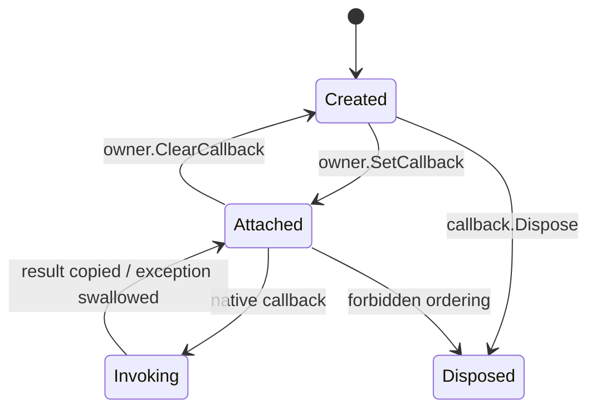

# Managed Logger Profiler Progress Monitor

Managed logger、profiler 和 progress monitor 是托管回调体验的入口，但它们必须遵守 no-throw、owner 生命周期和 callback proof 边界。

## Logger

Logger 用于接收 TensorRT 日志。托管侧实现必须捕获异常并转换为安全状态，不能让异常跨 ABI 传播。

## Profiler

Profiler 用于接收 layer profile 信息。公共 API 应提供复制后的名称、时间和 layer 记录，不暴露 TensorRT 内部字符串指针。

## Progress Monitor

Progress monitor 用于构建或长任务进度。它需要明确 owner attach/detach 顺序，并在释放前断开 native 回调入口。

## 证据要求

每条 managed callback 路径都应记录：

- owner 是否稳定。
- attach/detach 是否成对。
- callback 是否 no-throw。
- 异常是否被捕获并映射。
- 是否有真实 runtime invocation。

## 边界

Managed callback scaffold 或 design gate 不能写成真实 callback runtime proof。真实 proof 必须来自 runtime consumer，并看到 `InvocationCount>0`。

## 三种 callback，不是一个生命周期

logger、profiler、progress monitor 都从 native 进入 managed delegate，但触发者和 owner 不同：

| Callback | 主要 owner | 触发时机 | 当前安全输出 |
| --- | --- | --- | --- |
| Logger | runtime/builder 等对象链 | TensorRT 写日志 | copied severity/message、计数、最后异常 |
| Profiler | execution context | layer profile 回调 | copied layer name/time、计数、最后异常 |
| Progress monitor | builder config | build phase/step | copied event、continue/cancel、计数、最后异常 |

Logger public 类型位于 `TensorRtLogger.cs` core、`TensorRtLogger.InterfaceMetadata.cs`、`TensorRtLogger.Diagnostics.cs`、
`TensorRtLogger.Lifecycle.cs`、`TensorRtLogger.Trampoline.cs`、`TensorRtLogSeverity.cs` 与 `TensorRtLogHandler.cs`；Profiler
public 类型位于 `TensorRtProfiler.cs` core、同名 InterfaceMetadata/Diagnostics/Lifecycle/Trampoline partial 与
`TensorRtProfilerHandler.cs`。这些文件都在 `src/JYPPX.TensorRtSharp/Callbacks/Monitoring`，单独读取 core 不代表完整实现；
ProgressMonitor public 类型位于 `TensorRtProgressMonitor.cs` core、同名 InterfaceMetadata/Diagnostics/Lifecycle/Trampoline
partial，以及独立的 EventKind/Event/DiagnosticResult/Handler 文件；单独读取 core 同样不代表完整实现。native trampoline 分别位于
`src/JYPPX.TensorRtSharp/Internal/Interop/TensorRtLoggerCallback.cs`、
`src/JYPPX.TensorRtSharp/Internal/Interop/TensorRtProfilerCallback.cs`、
`src/JYPPX.TensorRtSharp/Internal/Interop/TensorRtProgressMonitorCallback.cs`。



dispose 前先 clear/detach 是核心规则。callback wrapper 在 attached 状态下必须保留 delegate 与 native shim，owner 释放或
clear 后才允许回收。每个类型的 `IsAttached` 是诊断状态，不是跨线程锁，也不能代替正确的使用顺序。

## no-throw 是 ABI 条件，不是代码风格

managed delegate 抛出的异常不能越过 native callback frame。三类 wrapper 都应捕获异常，增加 failure count，保存
`LastCallbackException`，并返回保守结果：logger/profiler diagnostic 返回未接受，progress monitor 在异常时继续执行，
避免异常被误解为用户取消或破坏 TensorRT 调用栈。

```csharp
using TensorRtProfiler profiler = new TensorRtProfiler(
    line,
    (layerName, milliseconds) =>
    {
        Console.WriteLine($"Layer={layerName} TimeMs={milliseconds}");
    });

context.SetProfiler(profiler);
try
{
    // enqueue and synchronize on a compatible runtime host
}
finally
{
    context.ClearProfiler();
}
```

示例的 `finally` 很重要：即使 enqueue 或 readback 失败，也要先从 context 清除 profiler，再 dispose profiler/context。

## Logger：先验证 shim，再验证真实日志

`smoke/ManagedLoggerCallbackSmokeRunner/Program.cs` 包含两类信号：`EmitDiagnostic` 主动经过 callback shim，验证
message/severity、invocation/failure count 和异常吞吐；随后尝试创建 TensorRT owner，让真实 native 日志进入 callback。

`ManagedLoggerCallback Accepted=True Invocations=1 Failures=0` 只证明 diagnostic shim。只有来自实际 runtime/builder
操作、且报告能区分 source 的 invocation，才可以用于真实 callback proof。dependency probe 输出加载信息，但不会触发 callback。

Logger 还可能是多个 TensorRT owner 的共同父依赖。推荐让 logger 最后释放：builder/runtime/engine/context 先 dispose，
最后 dispose logger，避免 native owner 在析构时向已经回收的 delegate 写日志。

## Profiler：attach 不等于 profile 已发生

`smoke/ManagedProfilerCallbackSmokeRunner/Program.cs` 先用 `EmitDiagnostic` 验证 copied record 与 no-throw，再执行：

```text
ManagedProfilerAttach Attached=True Cleared=True Native=False->True->False
```

这条输出证明 context 的 set/clear 与 managed `IsAttached` 一致，却不证明 TensorRT 在 enqueue 中调用了 profiler。真实 proof
至少要包含有效 engine、context、绑定、enqueue、stream synchronize、`CallbackInvocationCount>0` 和 copied layer record。

layer name 在 callback 返回后必须复制，不能保存 native `const char*`。执行时间也需要注明单位，不能把 diagnostic 中手工传入的
`1.25f` 写成真实 layer latency。

## Progress monitor：取消语义要可解释

Progress monitor 仅用于 TRT10/TRT11；TRT8 runner 会输出 `ProgressMonitorRequiresTensorRt10Or11`。在
`smoke/ManagedProgressMonitorSmokeRunner/Program.cs` 中，PhaseStart、StepComplete、PhaseFinish 被主动送入 shim，测试
step callback 返回 false 时 `ShouldContinue=False`，以及异常时 fail-safe continue。

builder config 的 attach/clear 还会读取 copied owner-scoped versioned metadata：

```text
ManagedProgressMonitorOwnerScopedMetadata Available=True Metadata=... Diagnostic=...
ManagedProgressMonitorAttach Attached=True Cleared=True
```

这证明 owner 关联和 metadata 路径，不等于真实 build 已产生 progress events。真实 build proof 必须保存 phase、parent、step、
total steps、return value 与 invocation count，并说明用户取消是否导致 build 终止。

## 可复核运行命令

```powershell
$repo = "."
$case = "..\downloads\cases\managed-callbacks"
New-Item -ItemType Directory -Force -Path "$case\logs" | Out-Null
Set-Location $repo

dotnet build .\smoke\ManagedLoggerCallbackSmokeRunner\ManagedLoggerCallbackSmokeRunner.csproj -c Debug --no-restore --nologo
dotnet build .\smoke\ManagedProfilerCallbackSmokeRunner\ManagedProfilerCallbackSmokeRunner.csproj -c Debug --no-restore --nologo
dotnet build .\smoke\ManagedProgressMonitorSmokeRunner\ManagedProgressMonitorSmokeRunner.csproj -c Debug --no-restore --nologo

$env:JYPPX_ENABLE_DEVELOPMENT_PROBING = "1"
dotnet .\smoke\ManagedLoggerCallbackSmokeRunner\bin\Debug\net8.0\ManagedLoggerCallbackSmokeRunner.dll `
  --tensor-rt-line 11 2>&1 | Tee-Object "$case\logs\logger.log"
dotnet .\smoke\ManagedProfilerCallbackSmokeRunner\bin\Debug\net8.0\ManagedProfilerCallbackSmokeRunner.dll `
  --tensor-rt-line 11 2>&1 | Tee-Object "$case\logs\profiler.log"
dotnet .\smoke\ManagedProgressMonitorSmokeRunner\bin\Debug\net8.0\ManagedProgressMonitorSmokeRunner.dll `
  --tensor-rt-line 11 2>&1 | Tee-Object "$case\logs\progress.log"
```

若本机缺少对应 runtime，先加 `--dependency-probe-only` 获取诊断。该模式会输出 `Skipped=True Reason=DependencyProbeOnly`，
因此结果只能分类为 dependency probe。

## 一份合格的 callback evidence

真实记录应至少包含：

- callback kind、TensorRT line、bridge/runtime package key。
- owner type、attach/clear 顺序和 dispose 顺序。
- invocation count、failure count、最后异常类型。
- 至少一条由真实 TensorRT 操作触发的 copied record。
- 对应 build/enqueue 操作、退出码、stdout/stderr 与 host metadata。
- driver/runtime blocker 的原始分类。
- clean consumer 路径与 validator 结果。

`InvocationCount>0` 仍只是必要条件：如果 invocation 全部来自 `EmitDiagnostic`，它不是 real native invocation；如果
`FailureCount>0`，需要解释异常与保守返回值，不能只保留总次数。

## 常见误区与排障

**attach 后立即 dispose callback**：先调用 owner 的 clear，再 dispose；不要依赖 GC 顺序。

**异常导致进程退出**：检查 trampoline 是否捕获所有 managed exception，并检查 callback 是否误用 async void。

**计数为 0**：确认实际触发了 build/enqueue/log path；metadata probe 与 attach 本身不必产生回调。

**TRT8 progress monitor 失败**：这是版本不适用，应走明确 skip，而不是尝试调用 TRT10/11 entrypoint。

**本地 runner 有 invocation、consumer 没有**：核对 runtime key、bridge DLL、native module search path 和 package 来源；
ProjectReference/local feed 不能替代 clean package consumer。

## Proof boundary

本文完成的是 managed callback 的使用、生命周期和诊断教程。source test、`EmitDiagnostic`、attach/clear、copied metadata、
dependency probe 或 `Skipped=True` 均不能单独提升 real callback runtime proof。当前仍保持
`performsPublish=false`、`canPublishPublicly=false`、`canCloseReleaseIssue=false`。

进一步阅读：[Callback/allocator safety roadmap](callback-allocator-safety-bridge-roadmap.md)、
[真实 callback runtime evidence schema](real-callback-runtime-evidence-schema.md) 与
[ErrorRecorder diagnostics design gate](error-recorder-diagnostics-design-gate.md)。
