# ONNX Parser 到 Serialized Engine：不依赖外部模型的端到端教程

很多部署教程第一步就要求下载模型，这会让“验证框架是否可用”和“验证某个模型是否正确”混在一起。TensorRtSharp4.0 的 `samples/OnnxToEngine` 刻意避开这个问题：它在进程内生成一个最小 dynamic-batch identity ONNX model，然后用 TensorRT ONNX parser 构建 serialized engine，再从文件反序列化并完成一次推理。

这让样例可以作为最干净的 ONNX 到 TensorRT engine 端到端验证路径。

## 样例位置

```text
samples/OnnxToEngine/Program.cs
samples/OnnxToEngine/README.md
```

它不需要外部 `.onnx` 文件，也不会把大模型提交进仓库。模型字节由 `OnnxIdentityModel.CreateDynamicBatchModel()` 生成。

## 流程概览

```mermaid
flowchart LR
  A["生成最小 ONNX identity model bytes"] --> B["创建 Logger/Runtime/Builder"]
  B --> C["创建 explicit-batch network"]
  C --> D["TensorRtOnnxParser.Parse"]
  D --> E["设置 optimization profile"]
  E --> F["BuildSerializedNetwork"]
  F --> G["SaveToFile(.plan)"]
  G --> H["DeserializeFromFile"]
  H --> I["TensorRtInferenceBindings"]
  I --> J["EnqueueAsync + ReadOutputSingles"]
  J --> K["OutputMatch=True"]
```



## 运行命令

构建：

```powershell
dotnet build .\TensorRtSharp.sln -c Debug --no-restore /p:UseSharedCompilation=false
```

启用开发探测：

```powershell
$env:JYPPX_ENABLE_DEVELOPMENT_PROBING = "1"
```

运行：

```powershell
dotnet .\samples\OnnxToEngine\bin\Debug\net8.0\OnnxToEngine.dll --tensor-rt-line 10 --batch 2
```

参数：

| 参数 | 含义 |
| --- | --- |
| `--tensor-rt-line <8|10|11>` | 选择 TensorRT adapter line，默认 `10`。 |
| `--batch <1..4>` | 选择 runtime batch，默认 `2`。 |

## 关键实现

生成模型：

```csharp
byte[] model = OnnxIdentityModel.CreateDynamicBatchModel();
```

创建 parser 并解析内存中的 ONNX：

```csharp
using TensorRtNetworkDefinition network =
    builder.CreateNetwork(TensorRtNetworkDefinitionCreationFlags.ExplicitBatch);
using TensorRtOnnxParser parser = new TensorRtOnnxParser(logger, network);
if (!parser.Parse(model, "sample-dynamic-identity.onnx"))
{
    throw new InvalidOperationException(parser.GetErrorSummary());
}
```

设置 dynamic batch profile：

```csharp
profile.SetShape(
    "input",
    new TensorRtDims(new[] { 1, 4 }),
    new TensorRtDims(new[] { 2, 4 }),
    new TensorRtDims(new[] { 4, 4 }));
int profileIndex = config.AddOptimizationProfile(profile);
```

构建并保存 engine：

```csharp
using TensorRtHostMemory hostMemory = builder.BuildSerializedNetwork(network, config);
hostMemory.SaveToFile(enginePath);
using TensorRtEngine engine = runtime.DeserializeFromFile(enginePath);
```

这一步验证了两个边界：serialized engine 可以从 builder 产出，也可以通过文件 round-trip 再进入 runtime。

## 输出 markers

成功时应看到：

```text
OnnxToEngine TensorRtLine=10 ModelBytes=... Batch=2
Preflight TRT=... CUDA=... Runtime=True Builder=True
Parsed=True ProfileIndex=0 EngineFileRoundTrip=True
BindingReport Ready=True Inputs=1 Outputs=1
Execution ... OutputMatch=True
OnnxToEngine Passed=True
```

| Marker | 含义 |
| --- | --- |
| `Parsed=True` | ONNX parser 成功把模型加载进 network。 |
| `ProfileIndex=0` | optimization profile 已加入 config。 |
| `EngineFileRoundTrip=True` | serialized engine 已保存并从文件反序列化。 |
| `OutputMatch=True` | identity 模型推理结果正确。 |

## 为什么不用外部模型

外部模型会引入一组额外变量：

- 模型许可证和再分发许可。
- ONNX opset 和 TensorRT 支持情况。
- 输入 tensor 名称、layout、shape、dtype。
- 预处理和后处理。
- labels、图片、归一化参数。

这些都很重要，但它们不应该挡住最小部署链路验证。`OnnxToEngine` 先证明 parser、builder、serialized engine、deserialize、binding、enqueue 和 readback 是通的。后续分类和 YOLO 教程再单独处理模型资产清单。

## 排障边界

如果输出：

```text
OnnxToEngine=Skipped Reason=...
```

说明 runtime、builder 或 vendor dependency 当前不可用。它不是 API completion claim。

如果 parser 失败，样例会输出 parser error summary。真实模型接入时，这通常和 opset、unsupported operator、dynamic shape 或 plugin 有关。

如果当前机器运行 CUDA 13.2 runtime package 并返回 CUDA error 35，应记录为 `blocked-by-cuda-driver`，而不是改写成 engine 构建失败或 callback proof。

## 下一步

这个样例是最小 ONNX 到 TensorRT engine 教程。继续向真实模型推进时，应先补模型资产清单：

- 模型来源和许可证。
- labels 来源和格式。
- 输入图片来源和授权。
- shape/layout/dtype。
- 预处理和后处理。
- 运行命令和 evidence lines。

继续阅读：

- [Dynamic Shape 与 Optimization Profile](dynamic-shape-optimization-profile-tutorial.md)
- [ExecutionContext 与 Inference Binding](inference-bindings-tutorial.md)
- [常见问题排查总表](troubleshooting-index.md)

## 第二批正文门禁

### 适用读者

本文适合第一次验证 ONNX parser、builder、serialized engine 和 runtime deserialize 链路的开发者，也适合维护 `samples/OnnxToEngine` 与 TensorRtExec parity 的负责人。

### 解决问题

真实 ONNX 模型会带来 opset、plugin、shape、layout、preprocess、postprocess 和许可证变量。本文先解决最小链路是否通：parser 能否读模型、builder 能否产出 serialized engine、engine 能否从文件 round-trip、execution context 能否完成一次 identity enqueue/readback。

### 核心思路

核心思路是先用内联 identity ONNX 消除模型变量，再逐步把外部模型变量加回来。这样 parser、builder、deserialize、binding 和 enqueue 的失败可以分层定位。

### 操作路径

先运行内联 identity ONNX 样例，确认 parser/build/deserialize/enqueue/readback 全链路；接入外部模型前补齐模型许可证、labels、输入图片、shape/layout/dtype 和后处理说明。若需要 TensorRtExec parity，先生成 report，再用真实 runtime runner 补 proof。

### 边界说明

`OnnxToEngine Passed=True` 是最小 ONNX-to-engine smoke，不是任意外部模型可运行的证明。build-only、dry-run、template、local feed、ProjectReference、direct `.nupkg`、TensorRtExec report、YoloVision matrix、OnnxToEngine report、readonly diagnostics 都不是 runtime proof。

### 下一步

下一步把最小 ONNX 链路扩展到真实模型资产教程，补齐模型来源、许可证、输入资产、engine hash 和 validator 结果。
