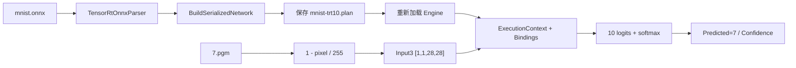
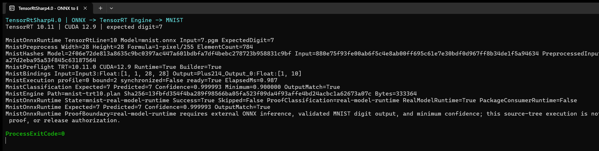

# 使用 TensorRtSharp4.0 将 MNIST ONNX 转换为 TensorRT Engine 并推理

ONNX 转 TensorRT Engine 不应只停留在“生成了一个 `.plan` 文件”。完整流程还要确认 ONNX Parser 接受模型、Engine 能被重新加载、输入预处理与模型合同一致、GPU 真正执行了推理，并且输出结果通过模型语义校验。

本文使用 TensorRtSharp4.0 的 `samples/OnnxToEngine`，把 NVIDIA TensorRT sample data 中的 MNIST ONNX 构建为 Engine，再用数字 7 的 PGM 输入完成真实推理。最终结果还会与 ONNX Runtime CPU 输出比较，避免把“进程正常退出”误写成模型正确。

## 目标读者

- 第一次在 .NET 中把 ONNX 转换为 TensorRT Engine 的开发者。
- 希望了解 ONNX Parser、Engine 序列化和 ExecutionContext 完整关系的模型部署工程师。
- 准备使用 `applications/TensorRtExec`、`samples/Classification` 或 `samples/YoloVision` 接入自己模型的维护者。

## 本文使用的项目与库

| 组件 | 本文中的职责 |
| --- | --- |
| TensorRtSharp4.0 | 提供 TensorRT/CUDA C# API、构建工具和示例。 |
| `samples/OnnxToEngine` | 解析参数并运行 MNIST 模型专用路径。 |
| `JYPPX.TensorRtSharp.Tools` | 实现 PGM 读取、预处理、Engine 构建、推理与结果记录。 |
| `JYPPX.TensorRtSharp` | 包装 ONNX Parser、Builder、Runtime、Engine 和 ExecutionContext。 |
| `JYPPX.CudaSharp` | 管理 CUDA stream 与 GPU buffer。 |
| NVIDIA TensorRT | 解析 ONNX、构建并执行 Engine。 |
| ONNX Runtime CPU | 提供独立输出参考，用于比较 10 个 logits。 |

本文实测环境为 Windows 11、NVIDIA GeForce RTX 3060 Laptop GPU、驱动 576.02、CUDA 12.9、TensorRT 10.11.0.33 和 .NET SDK 10.0.301。CUDA、cuDNN、TensorRT 和 NVRTC 由用户自行安装，项目不打包 NVIDIA 运行库。

## 模型获取、许可证与暂存

TensorRT 10.11 的 sample data 自带 `data/mnist/mnist.onnx`。同目录 `README.md` 将该 opset 8 模型归因于 ONNX Model Zoo。这个文件已经是上游发布的 ONNX，因此**不需要再执行 PyTorch/TensorFlow 到 ONNX 的转换**。

本项目没有获得该模型和 `7.pgm` 输入图的独立再分发授权，所以二者都不会提交到 GitHub。ONNX 只暂存在工作区外层 `models` 目录，PGM 输入继续从用户安装的 TensorRT sample data 读取。

从仓库根目录执行：

```powershell
$RepoRoot = (Get-Location).Path
$WorkspaceRoot = Split-Path -Parent $RepoRoot
$ModelDirectory = Join-Path $WorkspaceRoot 'models\OnnxToEngine\MNIST\nvidia-tensorrt-10.11'
$ModelPath = Join-Path $ModelDirectory 'mnist.onnx'
$TensorRtSampleModel = Join-Path $env:JYPPX_TENSORRT_ROOT 'data\mnist\mnist.onnx'

New-Item -ItemType Directory -Path $ModelDirectory -Force | Out-Null
Copy-Item -LiteralPath $TensorRtSampleModel -Destination $ModelPath -Force
Get-FileHash -LiteralPath $ModelPath -Algorithm SHA256
```

固定模型信息：

| 项目 | 值 |
| --- | --- |
| 模型 | NVIDIA TensorRT 10.11 sample data `mnist.onnx` |
| 长度 | 26,454 bytes |
| Opset | 8 |
| SHA256 | `2f06e72de813a8635c9bc0397ac447a601bdbfa7df4bebc278723b958831c9bf` |
| 暂存位置 | `<workspace>/models/OnnxToEngine/MNIST/nvidia-tensorrt-10.11/mnist.onnx` |
| 转换方式 | 上游已经是 ONNX，不做二次框架转换 |
| 仓库上传 | 否 |

输入图使用 `<TensorRT>/data/mnist/7.pgm`，长度 797 bytes，SHA256 为 `880e75f93fe00ab6f5c4e8ab00ff695c61e7e30bdf0d967ff8b34de1f5a94634`。它不复制进仓库，也不嵌入文章图片。

## ONNX 输入输出合同

MNIST 专用 runner 在构建后读取实际 Engine tensor metadata：

| 角色 | Tensor 名称 | 类型 | Shape |
| --- | --- | --- | --- |
| 输入 | `Input3` | `float32` | `[1, 1, 28, 28]` |
| 输出 | `Plus214_Output_0` | `float32` | `[1, 10]` |

PGM 必须是 P5 二进制灰度图。预处理公式与 TensorRT MNIST sample 保持一致：

```text
input = 1 - pixel / 255
```

784 个 float 的固定 SHA256 为 `81f2cd7784dca5c8f02a9887ae89a6a3582880a27d2eba95a53f845c63187564`。输出 10 个 logits 经过稳定 softmax 后取 argmax；只有预测数字等于期望数字且置信度达到阈值，运行才成功。



## 核心实现

### 1. 读取并验证模型与输入

`MnistOnnxRuntimeService` 先把路径规范化，再读取模型字节、PGM 文件和预处理 tensor：

```csharp
byte[] model = File.ReadAllBytes(modelPath);
MnistPgmImage image = MnistPgmReader.Read(inputPath);
float[] inputValues = MnistPgmReader.ToTensorInput(image);
```

控制台只显示文件名，避免把某台机器的盘符和用户名写进截图；JSON 报告仍保留真实路径供本机复查。

### 2. 使用 ONNX Parser 构建 Engine

```csharp
using TensorRtNetworkDefinition network =
    builder.CreateNetwork(TensorRtNetworkDefinitionCreationFlags.ExplicitBatch);
using TensorRtOnnxParser parser = new TensorRtOnnxParser(logger, network);

if (!parser.Parse(model, Path.GetFileName(modelPath)))
{
    throw new InvalidOperationException(parser.GetErrorSummary());
}

using TensorRtHostMemory hostMemory =
    builder.BuildSerializedNetwork(network, config);
hostMemory.SaveToFile(enginePath);
```

### 3. 重新加载并绑定输入输出

```csharp
using TensorRtEngine engine = runtime.DeserializeFromFile(enginePath);
using TensorRtExecutionContext context = engine.CreateExecutionContext();
using TensorRtInferenceBindings bindings =
    new TensorRtInferenceBindings(engine, context, profileIndex: 0);

bindings.CopyInputFromHost(input.Name, inputValues, inputShape);
bindings.AllocateDeviceBuffer(output.Name, outputShape, outputElementCount * sizeof(float));
bindings.BindAll();
```

从文件重新反序列化可以验证保存的 Engine 可读，而不是继续使用 builder 内存中的临时对象。

### 4. 执行并校验分类结果

```csharp
TensorRtInferenceExecutionSummary executionSummary = null!;
float elapsedMilliseconds = stream.MeasureElapsedTime(cudaStream =>
{
    executionSummary = bindings.EnqueueAsync(
        cudaStream,
        synchronize: false,
        runShapeInference: false);
});
stream.Synchronize();

float[] logits = bindings.ReadOutputSingles(output.Name, 10);
MnistClassification classification = MnistOutputClassifier.Classify(logits);
bool outputMatch = classification.PredictedDigit == options.ExpectedDigit &&
    classification.Confidence >= options.MinimumConfidence;
```

## 编译与环境

```powershell
dotnet build .\samples\OnnxToEngine\OnnxToEngine.csproj `
  -c Release `
  --no-restore `
  /p:UseSharedCompilation=false

$env:JYPPX_NATIVE_BRIDGE_PATH = Join-Path $RepoRoot 'build-out\win-x64-trt10-cuda12-release\bin\Release\jyppxtrtbridge.dll'
$env:JYPPX_ENABLE_DEVELOPMENT_PROBING = 'true'
```

## 可复制命令

所有输出写到仓库外层 `work`，不会进入 Git：

```powershell
$InputPath = Join-Path $env:JYPPX_TENSORRT_ROOT 'data\mnist\7.pgm'
$OutputRoot = Join-Path $WorkspaceRoot 'work\onnx-to-engine-mnist'
New-Item -ItemType Directory -Path $OutputRoot -Force | Out-Null

dotnet .\samples\OnnxToEngine\bin\Release\net8.0\OnnxToEngine.dll `
  --mnist `
  --tensor-rt-line 10 `
  --onnx $ModelPath `
  --mnistInput $InputPath `
  --expectedDigit 7 `
  --minimumConfidence 0.9 `
  --saveEngine (Join-Path $OutputRoot 'mnist-trt10.plan') `
  --exportReport (Join-Path $OutputRoot 'mnist-report.json') `
  --exportOutput (Join-Path $OutputRoot 'mnist-output.json') `
  --exportPreprocessedInput (Join-Path $OutputRoot 'mnist-input-f32.bin')
```

## 真实运行结果

下面是上述命令的真实 Windows Terminal 运行窗口，由 `PrintWindow` 直接捕获程序窗口，没有重绘终端文本。终端截图来自本次真实运行的 stdout。



本次运行的关键输出：

```text
MnistOnnxRuntime TensorRtLine=10 Model=mnist.onnx Input=7.pgm ExpectedDigit=7
MnistPreprocess Width=28 Height=28 Formula=1-pixel/255 ElementCount=784
MnistPreflight TRT=10.11.0 CUDA=12.9 Runtime=True Builder=True
MnistBindings Input=Input3:Float:[1, 1, 28, 28] Output=Plus214_Output_0:Float:[1, 10]
MnistExecution profile=0 bound=2 synchronized=False ready=True ElapsedMs=0.987
MnistClassification Expected=7 Predicted=7 Confidence=0.999993 Minimum=0.900000 OutputMatch=True
MnistEngine Path=mnist-trt10.plan Sha256=13fbfd354f4ba289f98566ba05fa523f09da4f93affe4bd24acbc1a62673a07c Bytes=333364
MnistOnnxRuntime State=mnist-real-model-runtime Success=True Skipped=False ProofClassification=real-model-runtime RealModelRuntime=True PackageConsumerRuntime=False
ProcessExitCode=0
```

| 检查项 | 实测结果 |
| --- | --- |
| ONNX | SHA256 与固定模型一致 |
| Parser / Builder | `Runtime=True Builder=True` |
| Engine tensor | 输入 `[1,1,28,28]`，输出 `[1,10]` |
| 预测 | Expected=7 / Predicted=7 |
| 置信度 | `0.999993 >= 0.9` |
| 输出校验 | `OutputMatch=True` |
| Engine 保存 | 333,364 bytes，SHA256 已记录 |
| 进程状态 | `ProcessExitCode=0` |

本次文章运行的机器可读证据位于 `samples/assets/onnxtoengine-mnist-article-runtime-evidence.json`。模型、PGM、Engine、report、output、原始日志均留在 Git 外层目录，仓库只保存哈希和允许公开的终端截图。

## 独立 ONNX Runtime 对比与负例

既有固定证据 `samples/assets/onnxtoengine-mnist-real-model-runtime-evidence.json` 使用 ONNX Runtime 1.23.2 CPUExecutionProvider 比较 10 个 logits：

- mismatch count：0；
- argmax 相同：true；
- 最大绝对误差：`0.000006`；
- 绝对/相对容差：`0.0001`。

受控负例只把 `--expectedDigit` 从 7 改为 6，模型、输入、预处理和置信度阈值保持不变。程序仍预测 7，但返回 `State=mnist-output-mismatch`、`OutputMatch=False` 和 exit code 2，证明结果校验会 fail closed。

## 使用自己的 ONNX

MNIST runner 的输入输出语义是专门实现的。任意外部 ONNX 可以使用 `samples/OnnxToEngine` 或 `applications/TensorRtExec` 生成 Engine 和 build report，但不能自动推断业务预处理与后处理。

| 场景 | 后续入口 |
| --- | --- |
| 通用构建与 CLI/GUI | `applications/TensorRtExec` |
| 图像分类 | `samples/Classification` |
| 检测、分割、OBB、Pose、语义分割 | `samples/YoloVision` |
| 参数兼容矩阵 | `samples/OnnxToEngine/trtexec-parity-matrix.json` |

`--buildOnly` 只证明 Parser/Builder 路径和 Engine 产物生成，不是模型推理成功。外部模型必须另行定义输入合同、参考输出和后处理验收。

## 常见问题

### 模型 SHA256 不一致

不要继续构建。确认文件来自同一 TensorRT sample data 版本，并重新复制到外层 `models` 目录。模型名相同不代表字节相同。

### `dependency-unavailable`

检查 TensorRT/CUDA 用户安装目录、桥接库组合和开发探测环境变量。skipped 状态不是运行成功。

### PGM 解析失败

MNIST runner 只接受 P5 二进制灰度 PGM，尺寸必须是 28x28。普通 PNG/JPEG 不能直接作为 `--mnistInput`。

### 预测数字正确但置信度不足

程序仍会失败。应先核对预处理公式、输入哈希、模型哈希和 logits，不要降低阈值掩盖合同错误。

## 边界说明

本次结果证明源码树中的 MNIST ONNX 可以被 TensorRT 10.11 解析、构建、保存、重新加载并完成真实 GPU 推理，且输出通过语义检查和独立 ORT 对比。

它不是任意外部模型的 runtime proof；build-only 也不是 inference proof。源码树运行不是 public package proof，也不是 post-publish proof、package push 或 release close approval。本文没有发布包、创建 Tag 或创建 Release。

英文边界术语：not runtime proof for arbitrary external models, not public package proof, and not post-publish proof.

## 下一步

- [TensorRtExec CLI 参数说明](tensorrtexec-cli-parameter-map.md)
- [Classification 真实模型流程](classification-real-asset-walkthrough.md)
- [YoloVision 样例总览](yolovision-sample-overview.md)
