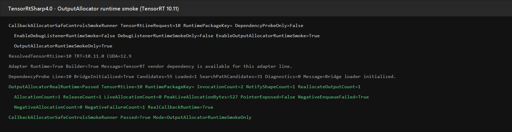

# TensorRT OutputAllocator：从托管回调到 CUDA 输出内存的完整流程

> 适用项目：TensorRtSharp4.0
>
> 适用接口：`TensorRtOutputAllocatorCallbackOwner`、`TensorRtExecutionContext.SetOutputAllocator`
>
> 本机验证：TensorRT 10.11、CUDA 12.9、NVIDIA GeForce RTX 3060 Laptop GPU
>
> 版本边界：TensorRT 8/10/11 均已生成 ABI；本机只执行了 TensorRT 10.11 正负例。

## 1. 为什么需要 OutputAllocator

普通推理会在 enqueue 前为每个输出 tensor 准备 CUDA 缓冲区。动态输出场景中，最终字节数可能只有在 TensorRT
解析完 shape 后才能确定。`nvinfer1::IOutputAllocator` 允许 TensorRT 通过以下回调完成这件事：

- `reallocateOutput` / `reallocateOutputAsync`：请求一块满足 size 与 alignment 的输出内存；
- `notifyShape`：通知最终输出 shape。

TensorRtSharp4.0 的实现没有把 CUDA device pointer 或 stream handle 交给 C#。native bridge 负责
`cudaMalloc`、对齐、复用、同步和 `cudaFree`；托管 handler 只决定是否接受请求，并读取复制后的名称、大小、
对齐、shape、是否有 current memory、是否为 async stream 等元数据。

## 2. 本例使用的项目与库

| 组件 | 作用 |
| --- | --- |
| `JYPPX.TensorRtSharp` | TensorRT builder、runtime、execution context 和 owner-safe callback API。 |
| `JYPPX.CudaSharp` | 输入 CUDA 内存与 stream 的所有权包装。 |
| `jyppxtrtbridge` | 实现 native `IOutputAllocator` vtable 与 CUDA 分配账本。 |
| `CallbackAllocatorSafeControlsSmokeRunner` | 构建网络并执行真实正例、受控负例。 |

本例不下载深度学习模型，也不做 ONNX 转换。程序在运行时创建 `[1,4]` 的 identity network，因此模型获取方式和
转换方式均为“不适用”。这避免把模型文件或 engine 写入仓库，也让 callback 生命周期测试只关注内存所有权。

## 3. 环境准备

用户需要自行安装以下依赖：

1. .NET 8 SDK；
2. 与目标版本匹配的 CUDA Toolkit；
3. TensorRT 8、10 或 11；
4. 按对应 TensorRT/CUDA 组合编译的 `jyppxtrtbridge`。

项目不打包 CUDA、cuDNN、TensorRT 或 NVRTC。运行时通过环境变量指定用户机器上的安装目录和 bridge：

```powershell
$env:TENSORRT_PATH = '<TensorRT 安装目录>'
$env:JYPPX_TENSORRT_ROOT = $env:TENSORRT_PATH
$env:JYPPX_NATIVE_BRIDGE_PATH = '<jyppxtrtbridge.dll 路径>'
$env:JYPPX_ENABLE_DEVELOPMENT_PROBING = 'true'
$env:PATH = "$env:TENSORRT_PATH\lib;$env:PATH"
```

## 4. 创建 owner-safe 托管回调

运行时 owner 使用 TensorRT 版本线和 handler 构造。handler 返回 `true` 允许 native bridge 分配；返回 `false`
会让分配请求 fail closed，native 不执行 `cudaMalloc`。

```csharp
TensorRtOutputAllocatorCallbackRequest lastReallocate = default;

using TensorRtOutputAllocatorCallbackOwner owner =
    new TensorRtOutputAllocatorCallbackOwner(
        TensorRtApiLine.TensorRt10,
        request =>
        {
            if (request.Kind == TensorRtOutputAllocatorCallbackKind.ReallocateOutput)
            {
                lastReallocate = request;
            }

            return true;
        });
```

`TensorRtOutputAllocatorCallbackRequest` 是复制值，不包含 `IntPtr`、`UIntPtr`、`nint`、CUDA stream handle 或
输出地址。业务代码可以记录元数据，但不能把 TensorRT 借用的 native pointer 带出 callback。

## 5. 构建网络并绑定 allocator

示例按以下顺序执行：

1. 创建 explicit-batch network；
2. 添加 `[1,4]` FP32 输入和 identity layer；
3. 将输出命名为 `allocator_output`；
4. 只绑定输入 CUDA 内存，不预先绑定输出地址；
5. 将 owner 绑定到输出 tensor；
6. enqueue 并同步 stream；
7. 读取无指针快照；
8. clear allocator，确认 native 分配全部释放。

```csharp
context.SetTensorAddress("allocator_input", inputBuffer);
context.SetOutputAllocator("allocator_output", owner);

context.EnqueueAsync(stream);
stream.Synchronize();

TensorRtOutputAllocatorRuntimeSnapshot attached = owner.GetRuntimeSnapshot();
bool cleared = context.ClearOutputAllocator("allocator_output");
TensorRtOutputAllocatorRuntimeSnapshot detached = owner.GetRuntimeSnapshot();

if (!cleared || detached.LiveAllocationCount != 0)
{
    throw new InvalidOperationException("Output allocator did not detach cleanly.");
}
```

执行上下文会按 tensor name 强引用 owner。即使调用方提前执行 `owner.Dispose()`，native vtable 也会等到
`ClearOutputAllocator` 或 context dispose 完成后才释放。禁止在 allocator callback 内替换 allocator 或销毁 context，
避免回调线程与 detach 互相等待。

## 6. 执行真实正负例

在仓库根目录执行：

```powershell
dotnet run --project smoke/CallbackAllocatorSafeControlsSmokeRunner `
  -c Release -- `
  --tensor-rt-line 10 `
  --output-allocator-runtime-smoke-only
```

正例 handler 返回 `true`，要求真实产生并释放 CUDA 分配。负例 handler 在 `ReallocateOutput` 返回 `false`，要求
enqueue 失败、分配数保持为零。核心输出如下：

```text
ResolvedTensorRtLine=10 TRT=10.11.0 CUDA=12.9
OutputAllocatorRealRuntime=Passed TensorRtLine=10 InvocationCount=2 NotifyShapeCount=1 ReallocateOutputCount=1 AllocationCount=1 ReleaseCount=1 LiveAllocationCount=0 PeakLiveAllocationBytes=527 PointerExposed=False NegativeEnqueueFailed=True NegativeAllocationCount=0 NegativeFailureCount=1 RealCallbackRuntime=True
CallbackAllocatorSafeControlsSmokeRunner Passed=True Mode=OutputAllocatorRuntimeSmokeOnly
```



上图由同一次运行保存的 stdout 原样排版生成，没有修改结果字段。原始文本和 SHA256 记录在
`samples/assets/output-allocator-real-runtime-tensorrt10.11-evidence.json`。

## 7. 如何判断结果正确

| 检查项 | 本机结果 | 含义 |
| --- | ---: | --- |
| `InvocationCount` | 2 | TensorRT 真实进入 native vtable。 |
| `ReallocateOutputCount` | 1 | TensorRT 请求输出内存。 |
| `NotifyShapeCount` | 1 | TensorRT 通知最终 shape。 |
| `AllocationCount` / `ReleaseCount` | 1 / 1 | native 分配与释放配对。 |
| `LiveAllocationCount` | 0 | detach 后没有遗留 CUDA 分配。 |
| `PointerExposed` | False | 公开快照没有暴露 native pointer。 |
| `NegativeEnqueueFailed` | True | handler 拒绝后推理明确失败。 |
| `NegativeAllocationCount` | 0 | 负例没有越过 handler 偷偷分配。 |

TensorRT 10.11 在本次运行中先请求内存、随后通知 shape，因此不能假设 `notifyShape` 一定发生在
`reallocateOutput` 之前。代码应按 callback kind 分别处理，不依赖固定顺序。

## 8. native 所有权与异常边界

- native owner 地址稳定，禁止 copy/move，析构函数为 `noexcept`；
- callback 进入/退出均计数，detach 等待 in-flight callback 清零；
- current memory 仅在 owner 自己的 allocation ledger 中查找和复用；
- 新分配按 alignment 调整返回地址，同时保留原始 base pointer 供 `cudaFree`；
- detach 先解除 TensorRT allocator，再执行 CUDA 同步并释放账本；
- 托管 handler 异常映射为失败状态，native 返回 null，不允许异常穿过 C ABI；
- snapshot 只复制计数、布尔值、名称、shape 和诊断文本。

## 9. 版本与发布边界

TensorRT 8、10、11 的 manifest 都包含 create/attach/detach/get-info 四个入口，生成器与 Release solution 已通过。
本机只有 TensorRT 10.11 环境，因此 TensorRT 8 和 11 仍需在对应安装环境执行同一 smoke。缺少某条版本线的本机
runtime 结果不代表 API 不存在，使用者应确保 bridge、TensorRT、CUDA 主版本相匹配。

本文记录的是源码树本机 runtime 结果，不是 NuGet package consumer、公开包、Release 或发布后验证证据。项目仍在
开发收口阶段，不应据此创建 tag、Release 或发布包。

## 10. 兼容的设计诊断模式

无参 `TensorRtOutputAllocatorCallbackOwner()` 和 `RunDesignDiagnostic` 仍保留，旧调用方的 public 元数据签名没有变化。
该模式继续输出 `output-allocator-callback-owner-design`、`RuntimeEvidenceKind=not-present`、
`RealCallbackRuntime=False`、`IsRealCallbackRuntimeProof=False`，属于 not proof 的合成设计诊断。旧的
`output-allocator-attach-detach-design-gate`、`output-buffer-ownership-safety-gate` 和
`output-allocator-runtime-proof-precheck` 也仅用于兼容历史 readiness 数据，不能替代本文的真实 enqueue 结果。

生成本地 managed 包与 bridge-only 包后，可继续执行[本地 NuGet 包独立消费者全流程](output-allocator-local-package-consumer-tutorial.md)。该流程只用两个 `PackageReference` 在仓库外还原、编译和执行同一组正负例，不使用源码树 DLL 或开发期 bridge 探测。
