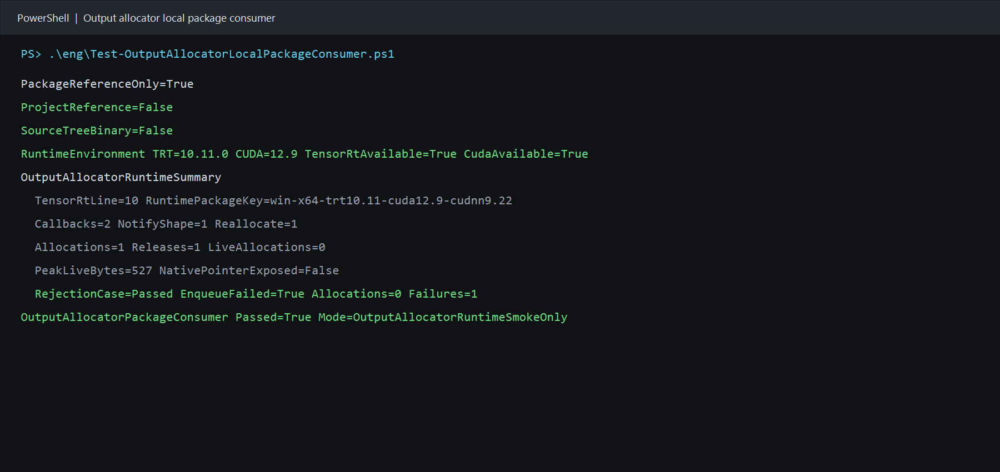

# 用本地 NuGet 包验证 TensorRT OutputAllocator：动态输出内存全流程

> 项目：TensorRtSharp4.0
>
> 主要库：`JYPPX.TensorRtSharp`、`JYPPX.CudaSharp`、`jyppxtrtbridge`
>
> 示例：`samples/OutputAllocator.PackageConsumer`
>
> 本机结果：TensorRT 10.11、CUDA 12.9、NVIDIA GeForce RTX 3060 Laptop GPU
>
> 证据边界：本文验证本地 managed 包与 bridge-only 包，不代表公开源下载、Release 或发布后验证。

## 1. 项目与功能背景

TensorRtSharp4.0 为 TensorRT 与 CUDA 提供 C# 封装。`JYPPX.TensorRtSharp` 管理 builder、runtime、engine、execution context 与 callback owner，`JYPPX.CudaSharp` 管理 CUDA stream 和 device memory，`jyppxtrtbridge` 把稳定 C ABI 映射到 NVIDIA C++ API。

普通推理通常在 enqueue 前为输出准备固定大小的 CUDA 缓冲区。对于形状只能在运行阶段确定的输出，TensorRT 的 `IOutputAllocator` 会调用 `reallocateOutput` 请求内存，并通过 `notifyShape` 报告最终形状。

`TensorRtOutputAllocatorCallbackOwner` 采用无指针的公开托管合同：C# handler 读取复制后的 tensor name、size、alignment、shape 和回调类型，只返回是否接受请求。device pointer、原始 CUDA allocation 和 stream handle 始终留在 native owner 的私有台账中。

源码树 smoke 已验证这一实现。本文继续验证：只拿 managed NuGet 包与 bridge-only 包的仓库外消费者，能否独立编译并完成真实 output allocation、释放和受控拒绝。

## 2. 依赖与包职责

用户自行安装 .NET 8 SDK、NVIDIA 驱动、CUDA Toolkit 和目标 TensorRT SDK。本项目不打包 CUDA、cuDNN、TensorRT 或 NVRTC。

外部消费者只有两个包引用：

| 包 | 作用 | 边界 |
| --- | --- | --- |
| `JYPPX.TensorRT.CSharp.API` | `JYPPX.TensorRtSharp` 与 `JYPPX.CudaSharp` 托管接口 | 不含 NVIDIA DLL |
| `...Runtime.win-x64.trt10.11.cuda12.9.cudnn9.22.Bridge` | 对应版本的 `jyppxtrtbridge.dll` | 仅 bridge，不含 vendor runtime |

TensorRT 主版本与 bridge 必须匹配。消费者在运行前读取 bridge build info，并要求 `TRT=10.x` 与 `TensorRtApiLine.TensorRt10` 一致；版本不匹配时直接失败。

## 3. 模型获取与转换说明

这个案例只验证动态输出分配、callback ABI 与生命周期，不需要训练权重或图像输入：

- 模型名称：程序内构造的 `[1,4]` FP32 identity network；
- 官方获取方式：不适用，没有模型下载地址；
- 权重许可证与 SHA256：不适用，没有权重文件；
- ONNX 转换方式：不适用，直接调用 TensorRT network API；
- 外部模型目录：不读写 `<workspace-root>/models`；
- 可视化结果：不适用，本例没有图像识别结果；
- ONNX 与 plan：不生成 ONNX，序列化 plan 仅在进程内持有。

对于分类、检测、分割、姿态或 OBB 演示，仍需在对应文章中写明官方模型来源、许可证、权重哈希、ONNX 导出命令、外部 `models` 暂存位置，并把识别结果绘制到原图。本例不替代这些要求。

## 4. 生成本地包

先按实际 CUDA/TensorRT 组合编译 bridge，再生成本地 managed 包和 bridge-only 包：

```powershell
powershell -NoProfile -ExecutionPolicy Bypass `
  -File .\eng\Invoke-LocalSplitRuntimePackage.ps1 `
  -SourceRuntimeKey win-x64-trt10.11-cuda12.9-cudnn9.22 `
  -Version 4.0.0 `
  -SkipConsumerValidation `
  -TensorRtRoot <TensorRT-root> `
  -CudaRoot <CUDA-root>
```

该命令只生成本地候选文件，不创建 tag、GitHub Release，也不调用任何包推送命令。bridge 包内容检查会拒绝 `nvinfer`、`nvonnxparser`、`cudnn`、`cudart` 和 `nvrtc` vendor binary。

## 5. 仓库外消费者如何隔离

`Test-OutputAllocatorLocalPackageConsumer.ps1` 调用公共 callback-owner 包验证器，在仓库外创建一次性目录。它执行以下隔离：

1. `NuGet.config` 先 `<clear />`，只加入 managed 与 bridge 两个本地源；
2. 使用外部独立 package cache；
3. 项目只有两个 `PackageReference`，没有 `ProjectReference` 或 `HintPath`；
4. 移除 `JYPPX_NATIVE_BRIDGE_PATH`；
5. 移除 `JYPPX_ENABLE_DEVELOPMENT_PROBING`；
6. 编译后核对输出 bridge 与 nupkg entry 的 SHA256；
7. 扫描包和输出目录，要求 vendor runtime binary 数量为 0。

项目模板的核心内容如下：

```xml
<ItemGroup>
  <PackageReference Include="JYPPX.TensorRT.CSharp.API" Version="4.0.0" />
  <PackageReference
    Include="JYPPX.TensorRT.CSharp.API.Runtime.win-x64.trt10.11.cuda12.9.cudnn9.22.Bridge"
    Version="4.0.0" />
</ItemGroup>
```

## 6. 构造网络和输入

示例直接创建 identity 网络：

```csharp
using TensorRtNetworkDefinition network =
    builder.CreateNetwork(TensorRtNetworkDefinitionCreationFlags.ExplicitBatch);
using TensorRtTensor input = network.AddInput(
    "allocator_input",
    TensorRtDataType.Float,
    new TensorRtDims(new[] { 1, 4 }));
using TensorRtLayer identity = network.AddIdentity(input);
using TensorRtTensor output = identity.GetOutput(0);
output.Name = "allocator_output";
network.MarkOutput(output);
```

构建并反序列化 engine 后，只为输入分配 CUDA 内存。输出地址不预先绑定，交给 OutputAllocator：

```csharp
using CudaStream stream = new CudaStream();
using CudaMemory inputBuffer = new CudaMemory(4 * sizeof(float));
inputBuffer.Fill(0, 4 * sizeof(float));

context.SetTensorAddress("allocator_input", inputBuffer);
```

## 7. 正例：接受动态输出分配

handler 记录复制后的重分配请求并返回 `true`：

```csharp
TensorRtOutputAllocatorCallbackRequest acceptedRequest = default;

using TensorRtOutputAllocatorCallbackOwner owner =
    new TensorRtOutputAllocatorCallbackOwner(
        TensorRtApiLine.TensorRt10,
        request =>
        {
            if (request.Kind == TensorRtOutputAllocatorCallbackKind.ReallocateOutput)
            {
                acceptedRequest = request;
            }

            return true;
        });

context.SetOutputAllocator("allocator_output", owner);
context.EnqueueAsync(stream);
stream.Synchronize();
```

运行后读取快照并解除挂载：

```csharp
TensorRtOutputAllocatorRuntimeSnapshot attached = owner.GetRuntimeSnapshot();
bool cleared = context.ClearOutputAllocator("allocator_output");
TensorRtOutputAllocatorRuntimeSnapshot detached = owner.GetRuntimeSnapshot();

if (!cleared || detached.LiveAllocationCount != 0)
{
    throw new InvalidOperationException("Output allocator did not detach cleanly.");
}
```

成功条件还要求真实 callback、一次以上 allocation 与 release、没有 callback failure、没有 in-flight callback，并且 context 的 managed/native allocator 状态均已清除。

## 8. 负例：拒绝重分配

负例对 `ReallocateOutput` 返回 `false`：

```csharp
request => request.Kind != TensorRtOutputAllocatorCallbackKind.ReallocateOutput
```

native owner 不调用 `cudaMalloc`，向 TensorRT 返回失败。测试要求：

- `EnqueueAsync` 或 stream 同步抛出 `TensorRtException`；
- `ReallocateOutputCount > 0`；
- `AllocationCount == 0`；
- `FailureCount > 0`；
- clear 成功，detach 后没有 live allocation。

这条负例确保托管策略拒绝不会被绕过，也不会以“仍然推理成功”的假结果通过。

## 9. 执行完整验证

在仓库根目录运行：

```powershell
powershell -NoProfile -ExecutionPolicy Bypass `
  -File .\eng\Test-OutputAllocatorLocalPackageConsumer.ps1 `
  -TensorRtRoot <TensorRT-root> `
  -CudaRoot <CUDA-root>
```

脚本依次完成包元数据与内容审计、外部还原、Release 编译、真实运行、结果 marker 解析、bridge 哈希比对、vendor binary 扫描、详细报告写入和外部工作目录清理。

现场审计时可加 `-KeepWorkspace` 保留 `.csproj`、`project.assets.json` 与输出目录。它们是本地诊断产物，不提交 Git。

## 10. 本机执行结果

```text
PackageReferenceOnly=True
ProjectReference=False
SourceTreeBinary=False
RuntimeEnvironment TRT=10.11.0 CUDA=12.9 TensorRtAvailable=True CudaAvailable=True
OutputAllocatorRuntimeSummary
  TensorRtLine=10 RuntimePackageKey=win-x64-trt10.11-cuda12.9-cudnn9.22
  Callbacks=2 NotifyShape=1 Reallocate=1
  Allocations=1 Releases=1 LiveAllocations=0
  PeakLiveBytes=527 NativePointerExposed=False
  RejectionCase=Passed EnqueueFailed=True Allocations=0 Failures=1
OutputAllocatorPackageConsumer Passed=True Mode=OutputAllocatorRuntimeSmokeOnly
```



截图来自本次包消费者 stdout。去路径化的原始文本、两个包的哈希、消费者源码哈希和截图哈希记录在 `samples/assets/output-allocator-local-package-consumer-tensorrt10.11-evidence.json`。

## 11. 结果解读

| 检查项 | 本机结果 | 结论 |
| --- | ---: | --- |
| `PackageReferenceOnly` | True | 消费者只通过 NuGet 引用库。 |
| `ProjectReference` | False | 没有仓库项目引用。 |
| `InvocationCount` | 2 | TensorRT 真实进入 native vtable。 |
| `NotifyShapeCount` | 1 | TensorRT 报告最终输出 shape。 |
| `ReallocateOutputCount` | 1 | TensorRT 请求动态输出内存。 |
| Allocation / release | 1 / 1 | native 分配与释放配对。 |
| `LiveAllocationCount` | 0 | detach 后没有遗留显存。 |
| `PeakLiveAllocationBytes` | 527 | native 台账观察到真实分配。 |
| `NativePointerExposed` | False | 公开托管 API 没有暴露地址。 |
| 负例 allocation | 0 | handler 拒绝后没有偷偷分配。 |
| 负例 failure | 1 | 拒绝明确记录并使 enqueue 失败。 |
| Vendor binary count | 0 | NVIDIA 运行库来自用户安装。 |

`notifyShape` 与 `reallocateOutput` 的调用顺序不能写死。业务代码应根据 callback kind 独立处理复制后的元数据。

## 12. 常见问题

### 找不到 TensorRT 或 CUDA DLL

确认传入的 SDK 根目录有效，并确保 TensorRT `lib` 和 CUDA `bin` 对当前进程可见。不要复制 vendor DLL 到项目或 NuGet 包中。

### bridge 主版本不匹配

选择与已安装 TensorRT 主版本和 CUDA 组合一致的 bridge-only 包。版本探针不通过时不要绕过检查。

### 正例没有进入 reallocateOutput

确认输出没有提前绑定固定地址，且加载的是当前 bridge。验证器要求 `ReallocateOutputCount > 0`，否则直接失败。

### 负例没有失败

如果拒绝重分配后 enqueue 仍成功，说明 fail-closed 合同被破坏。该结果不能用于发布候选。

## 13. 证据与发布边界

本次结果证明：在当前 Windows、TensorRT 10.11 与 CUDA 12.9 主机中，本地 managed 包和 bridge-only 包可被仓库外项目独立消费，公开 OutputAllocator API 能完成真实动态输出分配、释放、detach 和受控拒绝。

它不证明 TensorRT 8/11 已在本机执行，不证明包已从 NuGet 或 GitHub Packages 下载，也不是 Release 或发布后验证。当前项目仍处于开发收口阶段：不创建 tag、不创建 GitHub Release、不发布新包。NuGet 上已有包不在本文处理范围内。

源码树实现、native 台账与 owner 生命周期细节见 [TensorRT OutputAllocator：从托管回调到 CUDA 输出内存的完整流程](output-allocator-callback-owner-design.md)。
