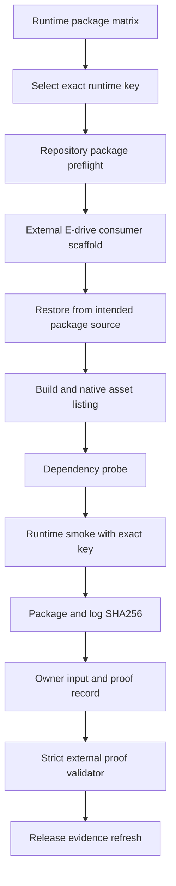

# Package Consumer Runtime Proof Playbook：从干净消费端到严格证明

## 写在前面

“包能 restore”和“包在干净消费端真实运行”不是同一件事。

前者可以由本地 feed、仓库内测试项目或 build-only 报告完成；后者必须说明消费的是哪个 managed/runtime 包、来自哪个包源、运行在哪台兼容主机、复制了哪些 native assets、实际执行了什么 runtime smoke，以及日志和包文件的 SHA256 是否可重新计算。

本文面向 TensorRtSharp4.0 release owner，把 `package-consumer-runtime` 从抽象 blocker 拆成可执行、可复核、可失败关闭的工作流。本文不会执行发布，不会把模板变成证明，也不会改变当前 `blocked-real-proof-required` 状态。

## 适用读者

- 准备在兼容 CUDA/TensorRT 主机上采集外部包消费证据的 release owner。
- 需要判断 local feed、bridge-only 或 dependency probe 能否晋级的维护者。
- 负责 Windows/Linux runtime package 兼容矩阵的验证执行人。
- 排查“restore 成功但 native DLL/SO 无法加载”问题的部署工程师。

## 解决问题

本文解决六个具体问题：

1. 如何选择与主机匹配的 runtime package key。
2. 如何把仓库内 package preflight 与仓库外 clean consumer proof 分开。
3. 如何验证没有 ProjectReference、本地 fallback 或 direct `.nupkg` 捷径。
4. 如何记录包 identity、native assets、host metadata、命令、日志和 SHA256。
5. 如何回填 owner input，并运行 strict validator。
6. proof 未成立时应该保留什么状态，而不是写成通过。

## 背景与场景

TensorRtSharp4.0 有两类公开获取通道：

- GitHub Release managed + bridge assets：通过不可变 URL 和 GitHub digest 获取 managed/bridge `.nupkg`。
- NuGet managed + bridge packages：通过 NuGet-compatible source 与标准 `PackageReference` 获取相同边界的包。

两种通道的 native asset 预期相同：包内只能有项目自有 bridge，NVIDIA TensorRT、CUDA、cuDNN 与可选 NVRTC 必须来自用户机器。GitHub Release 路线额外核对 URL、digest 与同提交 provenance；NuGet 路线额外核对公开 source 和解析版本。两者都要记录主机 SDK 搜索路径，不能用本地构建包替代公开资产。

## Proof 定义

`package-consumer-runtime` 只证明一个明确事实：指定版本的 managed/runtime package 在指定主机、指定 runtime key、指定 clean consumer 中完成真实 runtime smoke。

它不自动证明：

- 某个外部模型精度正确；
- 所有 TensorRT/CUDA 组合都可用；
- Linux row 已由 Windows 报告覆盖；
- 包已经从公开渠道重新下载；
- post-publish verification 已完成；
- release owner 已授权发布或关闭 issue。

### 最小证据合同

| 维度 | 必填证据 | 不能替代 |
| --- | --- | --- |
| package identity | package id/version/source、managed/runtime nupkg SHA256 | bin 目录文件名 |
| clean consumer | 仓库外项目、PackageReference、无 ProjectReference | 仓库内 sample/test |
| runtime selection | 完整 runtime package key | 只写 TRT11 或 CUDA13 |
| native assets | 期望/实际数量、输出目录清单、hash | restore success |
| compatible host | OS/arch/GPU/driver/CUDA/TensorRT/cuDNN | 开发机口头描述 |
| runtime smoke | 完整命令、exit code、stdout/stderr summary | dependency probe |
| immutable logs | restore/build/listing/probe/smoke 文件与 SHA256 | 手写 Passed=True |
| validator | strict validator 退出码 0 | template/draft/runbook |

## 操作路径总览

下面的流水线对应本文阶段一到阶段九：先选 runtime key 和做 package preflight，再创建仓库外 consumer、运行真实 smoke，最后回填 owner record 并执行 strict validator。



前一层只能为后一层准备输入，不能直接跳级。

## 代码与文件入口

### Package preflight

- `eng/Test-PackageConsumer.ps1`
- `artifacts/release-candidate/runtime-package-matrix.json`
- `artifacts/final-release/package-consumer-runtime-proof-preflight-matrix.json`
- `docs/articles/zh-cn/package-consumer-validation.md`

### External consumer

- `eng/New-PackageConsumerExternalSmokeScaffold.ps1`
- `artifacts/final-release/package-consumer-external-smoke-scaffold.json`
- `eng/Test-PostPublishCleanConsumerProject.ps1`

### Owner input and strict proof

- `eng/Export-PackageConsumerRuntimeProofOwnerInputTemplate.ps1`
- `eng/Test-PackageConsumerRuntimeProofOwnerInput.ps1`
- `eng/Import-PackageConsumerRuntimeProofOwnerInput.ps1`
- `eng/Export-PackageConsumerRuntimeProofRecordFromOwnerInput.ps1`
- `eng/Test-PackageConsumerRuntimeProofRecord.ps1`
- `eng/Test-ExternalRuntimeProofRecord.ps1`
- `artifacts/final-release/external-runtime-proof-record.json`

## 四类容易混淆的结果

| 结果 | 能证明 | 不能证明 |
| --- | --- | --- |
| package preflight | 包布局、restore/build、native copy 预期可检查 | 外部 clean runtime 已执行 |
| readonly summary | wrapper copied diagnostics 可读取 | TensorRT 已 enqueue |
| dependency probe | bridge/vendor dependency 可加载到某个阶段 | engine/runtime smoke 成功 |
| strict external proof | 指定 package/key/host 的 clean consumer runtime | 公开渠道 post-publish 可恢复 |

`ReadonlySummaryEvidenceKind=readonly-summary-diagnostics-not-runtime-proof`、`bridge-only` 和 `RuntimeProofPreflight` 都是有用材料，但仍不是 runtime proof。

## E 盘工作区

真实包、展开目录和日志不要放在系统盘临时目录。

```text
..\proof\package-consumer\<runtime-key>\
  packages\
    managed\
    runtime\
  consumer\
  output\
  reports\
  logs\
  evidence\
```

初始化：

```powershell
$runtimeKey = "win-x64-trt11.0-cuda13.2-cudnn9.22"
$caseRoot = Join-Path "..\proof\package-consumer" $runtimeKey
@("packages\managed", "packages\runtime", "consumer", "output", "reports", "logs", "evidence") |
  ForEach-Object {
    New-Item -ItemType Directory -Force -Path (Join-Path $caseRoot $_) | Out-Null
  }
```

如果目标主机驱动不支持 CUDA 13.2，不要继续制造通过日志。换到兼容主机或选择与真实发布候选一致的其他 key。

## 阶段一：选择 Runtime Key

权威矩阵：

```text
artifacts/release-candidate/runtime-package-matrix.json
```

检查 key：

```powershell
$matrix = Get-Content -Raw .\artifacts\release-candidate\runtime-package-matrix.json |
  ConvertFrom-Json
$matrix |
  Where-Object key -eq $runtimeKey |
  Select-Object key, platform, tensorRtVersion, cudaVersion, cudnnVersion,
    validationState, consumerStatus, runtimeProofStatus |
  Format-List
```

必须同时确认：

- OS/RID 与 key 一致；
- TensorRT/CUDA/cuDNN line 一致；
- GPU driver 支持目标 CUDA runtime；
- 包 identity 与 key 对应；
- 当前 row 是否只是 dry-run-only、historical local validation 或 blocked-by-cuda-driver。

矩阵本身是规划与历史状态，不是本次真实运行日志。

## 阶段二：仓库内 Package Preflight

`Test-PackageConsumer.ps1` 可验证本地候选包的 restore/build/native copy，并可执行 bounded smoke。它适合在外部采集前尽早发现 package layout 错误。

```powershell
pwsh -NoProfile -ExecutionPolicy Bypass -File .\eng\Test-PackageConsumer.ps1 `
  -RuntimePackageKey $runtimeKey `
  -SmokeRuntimePackageKey $runtimeKey `
  -ManagedPackageDirectory "$caseRoot\packages\managed" `
  -RuntimePackageDirectory "$caseRoot\packages\runtime" `
  -OutputRoot "$caseRoot\output\repository-preflight" `
  -ReportDirectory "$caseRoot\reports\repository-preflight" `
  -RunSmoke `
  -KeepConsumerOutput
```

这里有两个重要边界：

1. 使用本地 package directory 的结果是 package candidate preflight，不是 intended public source proof。
2. 即使输出 `SmokeResult=passed`，也不能仅凭这一行设置 `IsPackageConsumerRuntimeProof=True`。

报告中的 `RuntimeProofPreflight` 只复制：

- matrix 是否存在；
- runtime key entry 是否存在；
- runtime package id；
- restore source mode；
- native assets expected；
- owner action 与 blocked reason。

它不会替 strict validator 晋级。

## 阶段三：生成仓库外 Consumer Scaffold

scaffold 必须显式写到 E 盘，并提供真实 package source/id/version。

```powershell
$managedVersion = "<owner-approved-version>"
$runtimeVersion = "<owner-approved-version>"
$packageSource = "<owner-approved-package-source-url>"
$runtimePackageId = "JYPPX.TensorRT.CSharp.API.Runtime.win-x64.trt11.0.cuda13.2.cudnn9.22"

pwsh -NoProfile -ExecutionPolicy Bypass -File .\eng\New-PackageConsumerExternalSmokeScaffold.ps1 `
  -OutputRoot "$caseRoot\consumer" `
  -RuntimePackageKey $runtimeKey `
  -ManagedPackageId "JYPPX.TensorRT.CSharp.API" `
  -ManagedPackageVersion $managedVersion `
  -RuntimePackageId $runtimePackageId `
  -RuntimePackageVersion $runtimeVersion `
  -PublicPackageSource $packageSource
```

placeholder 不会变成真实 proof。owner 必须把版本、source 和 package id 替换为真实值。

### Consumer 结构审计

检查所有项目引用：

```powershell
rg -n "PackageReference|ProjectReference|RestoreSources|RestoreFallbackFolders|\.nupkg" `
  "$caseRoot\consumer"
```

合格 consumer 必须满足：

- 位于源码仓库外；
- 使用 versioned PackageReference；
- 无 ProjectReference；
- 无 repository artifacts feed；
- 无 local feed；
- 无 direct `.nupkg` PackageReference；
- 不依赖仓库的 `bin`/`obj`/`build-out`。

私有 feed 凭据不要写进文章、命令历史、JSON 或 Git。使用主机的安全凭据提供机制，证据只记录 source identity 和脱敏后的认证方式。

## 阶段四：Restore 与 Build

在 scaffold 的实际 `.csproj` 所在目录执行：

```powershell
$consumerProject = Get-ChildItem "$caseRoot\consumer" -Filter *.csproj -Recurse |
  Select-Object -First 1 -ExpandProperty FullName

dotnet restore $consumerProject --force --no-cache `
  2>&1 | Tee-Object "$caseRoot\logs\restore.log"
if ($LASTEXITCODE -ne 0) { throw "restore failed: $LASTEXITCODE" }

dotnet build $consumerProject -c Release --no-restore `
  2>&1 | Tee-Object "$caseRoot\logs\build.log"
if ($LASTEXITCODE -ne 0) { throw "build failed: $LASTEXITCODE" }
```

必须保留完整 source selection 信息。只保留“restore succeeded”一句摘要无法证明包来自目标 source。

## 阶段五：Native Asset Listing

找到 Release 输出目录后保存递归清单：

```powershell
$projectDir = Split-Path -Parent $consumerProject
$releaseRoot = Join-Path $projectDir "bin\Release"
$nativeListing = Join-Path $caseRoot "logs\native-assets.txt"

Get-ChildItem -LiteralPath $releaseRoot -File -Recurse |
  Sort-Object FullName |
  ForEach-Object {
    $hash = (Get-FileHash -Algorithm SHA256 -LiteralPath $_.FullName).Hash.ToLowerInvariant()
    "{0}`t{1}`t{2}" -f $_.Length, $hash, $_.FullName
  } | Set-Content -LiteralPath $nativeListing -Encoding utf8
```

检查内容至少包括目标 route 要求的 bridge/runtime 资产。具体 expected count 必须来自 `package-consumer-runtime-proof-preflight-matrix.json`，不能从另一 runtime key 抄数。

## 阶段六：Dependency Probe 与 Runtime Smoke

dependency probe 先回答“依赖加载到了哪里”，runtime smoke 再回答“真实 runtime 路径是否执行”。两份日志必须分开。

执行 scaffold 生成的 probe/smoke 命令，并把精确命令回填到 proof record。runtime smoke 命令必须包含完整 runtime key：

```text
--runtime-package-key win-x64-trt11.0-cuda13.2-cudnn9.22
```

采集约定：

```powershell
$probeLog = Join-Path $caseRoot "logs\dependency-probe.log"
$smokeLog = Join-Path $caseRoot "logs\runtime-smoke.log"

# 使用 scaffold README/command plan 中生成的真实命令替换占位符。
& <dependency-probe-command> *>&1 | Tee-Object $probeLog
$probeExitCode = $LASTEXITCODE

& <runtime-smoke-command> --runtime-package-key $runtimeKey *>&1 |
  Tee-Object $smokeLog
$smokeExitCode = $LASTEXITCODE
```

不要把上述占位命令直接登记为执行结果。proof record 必须保存最终展开后的真实命令。

### 通过条件

- exit code 为 0；
- runtime smoke status 为 passed；
- stdout summary 与真实日志一致；
- stderr 为空时明确写 `no-stderr-emitted`；
- native assets found 与 preflight entry 一致；
- 没有 `Skipped=True`；
- 没有 `blocked-by-cuda-driver`；
- 没有把 dependency probe 当 smoke。

## 阶段七：计算 Hash

```powershell
$evidenceFiles = @(
  "$caseRoot\logs\restore.log",
  "$caseRoot\logs\build.log",
  "$caseRoot\logs\native-assets.txt",
  "$caseRoot\logs\dependency-probe.log",
  "$caseRoot\logs\runtime-smoke.log"
)

$evidenceFiles | ForEach-Object {
  if (-not (Test-Path -LiteralPath $_ -PathType Leaf)) { throw "Missing evidence: $_" }
  Get-FileHash -Algorithm SHA256 -LiteralPath $_
} | Format-Table -AutoSize
```

managed/runtime nupkg 也要对实际消费的文件计算 SHA256。不要使用 build 目录中同名但未被 source 消费的另一个包。

## 阶段八：Owner Input

先生成模板：

```powershell
pwsh -NoProfile -ExecutionPolicy Bypass -File `
  .\eng\Export-PackageConsumerRuntimeProofOwnerInputTemplate.ps1 `
  -RuntimePackageKey $runtimeKey
```

将模板复制到 owner 工作区并回填真实字段，然后严格检查：

```powershell
pwsh -NoProfile -ExecutionPolicy Bypass -File `
  .\eng\Test-PackageConsumerRuntimeProofOwnerInput.ps1 `
  -InputPath "$caseRoot\evidence\package-consumer-owner-input.json" `
  -OutputRoot "$caseRoot\evidence\validation" `
  -Strict
```

导入前再次确认文件中没有密码、token、机器隐私或错误的本地 fallback 路径。

## 阶段九：Proof Record 与 Strict Validator

最终 external record 至少包含：

| 字段组 | 关键字段 |
| --- | --- |
| root | runtimePackageKey、templateOnly、proofState、proofClassification |
| host | ownerName、machineName、OS、GPU、driver、CUDA/TensorRT/cuDNN |
| packageSource | managed/runtime source、id/version/hash、consumer project、noProjectReference |
| command | restore/build/smoke command、exitCode、timestamps、logPath/logSha256 |
| results | dependencyProbeStatus、smokeStatus、nativeAssetsExpected/found、stdout/stderr |
| preflight | entryFound、runtimePackageId、restoreSourceMode、expected asset count |

严格验证：

```powershell
pwsh -NoProfile -ExecutionPolicy Bypass -File .\eng\Test-ExternalRuntimeProofRecord.ps1 `
  -InputPath "$caseRoot\evidence\external-runtime-proof-record.json" `
  -RuntimePackageKey $runtimeKey `
  -OutputRoot "$caseRoot\evidence\validation" `
  -RequireExistingLog `
  -FailOnNotProof
```

只有 validator 根据真实文件重新计算并返回 promotable `package-consumer-runtime`，这条 lane 才成立。

## 预期输出如何审阅

不要只看 PowerShell exit code。至少审阅：

- `validationState` 是否为真实 runtime proof，而不是 template-only；
- `proofClassification` 是否为 `package-consumer-runtime`；
- `canPromoteRuntimeProof` 是否由 validator 计算；
- failed proof items、missing evidence、owner action count 是否为 0；
- runtime key、package id、restore source mode 是否三方一致；
- log hash 是否重新计算匹配；
- host runtime 是否与 package key 匹配。

validator 失败时保留原始输入和输出，不手改 validation JSON。

## 常见失败与排障

### Restore 使用了错误 source

症状：restore 成功，但日志显示 repository artifacts 或用户级 fallback folder。

处理：清理 consumer-local NuGet 配置，只保留 owner 选择的 source，重新 `--force --no-cache` restore。

### Native asset 数量不匹配

症状：managed assembly 存在，bridge/vendor 文件缺失。

处理：对照 runtime preflight matrix，检查 RID、runtime package id、buildTransitive targets 和输出清单。不要把 PATH 中碰巧存在的 DLL 当 package copied asset。

### `0x8007007E` 或 DLL not found

处理顺序：

1. 确认进程架构与 win-x64 一致。
2. 检查 bridge 文件是否在输出目录。
3. 检查 TensorRT/CUDA/cuDNN 依赖版本。
4. 使用依赖检查工具定位第一个缺失 DLL。
5. 保存 probe 日志后再修 PATH。

### CUDA error 35

这是 driver/runtime compatibility blocker。记录 driver 和 runtime 版本，换兼容主机重跑。它不是 API 缺口，也不是通过。

### Smoke 通过但 validator 失败

常见原因：

- smoke command 没有 runtime key；
- nupkg hash 未填；
- log path 存在但 SHA256 不匹配；
- stdout/stderr summary 空；
- noProjectReference 未明确为 true；
- RuntimeProofPreflight 不一致；
- proof classification 仍是 dependency-probe-only。

按 validator finding 修真实输入，不改 validator 输出。

## Windows 与 Linux

Windows 和 Linux 不能互相替代。

| 项目 | Windows | Linux |
| --- | --- | --- |
| RID | win-x64 | linux-x64 |
| native bridge | DLL | SO |
| dependency search | output/PATH | output/LD_LIBRARY_PATH/rpath |
| host metadata | Windows build、driver | distro/version、kernel、driver |
| proof | Windows key only | Linux key + real Linux runner |

Linux dry-run-only row 必须在真实 Linux x64 compatible host 上执行后才能晋级。

## 边界说明

以下结果全部不能替代 `package-consumer-runtime`：

- build-only；
- dry-run；
- parse-only；
- template、draft、runbook、collection package；
- local feed；
- ProjectReference；
- direct `.nupkg`；
- TensorRtExec report；
- YoloVision matrix；
- OnnxToEngine report；
- readonly diagnostics；
- readonly summary；
- bridge-only；
- dependency-probe-only；
- synthetic-input-runtime；
- `Skipped=True`；
- `blocked-by-cuda-driver`。

本文和 closure ledger 也是文档证据，不是 runtime proof、post-publish proof、publish approval、package push 或 release close approval。

## 发布材料清单

对外文章可以展示：

- runtime key 与主机版本表；
- consumer 目录结构；
- 脱敏后的 PackageReference；
- native asset listing 摘要；
- validator 0 finding 摘要；
- proof boundary 图。

不要展示凭据、内部 source token、未脱敏机器名或可以定位用户目录的完整路径。

## 最终 Checklist

- [ ] runtime key 来自权威 matrix，并与主机兼容。
- [ ] 工作区位于 E 盘，包和日志未落入系统盘临时目录。
- [ ] consumer 位于源码仓库外。
- [ ] 只有 PackageReference，没有 ProjectReference/local fallback/direct nupkg。
- [ ] managed/runtime package id、version、source 和 SHA256 完整。
- [ ] restore/build/native listing/probe/smoke 日志全部存在。
- [ ] runtime smoke 命令包含完整 runtime key。
- [ ] exit code、stdout/stderr summary 与日志一致。
- [ ] host OS/GPU/driver/CUDA/TensorRT/cuDNN 完整。
- [ ] RuntimeProofPreflight entry 与实际结果一致。
- [ ] strict validator 重新计算 hash 并通过。
- [ ] 未把 package proof 写成 real-model 或 post-publish proof。
- [ ] release owner 仍单独审阅发布与 close 决策。

## 下一步

package-consumer-runtime lane 通过后，刷新 release evidence bundle 和 release close preflight。它们仍会检查 owner authorization、real-model-runtime、Linux runner 和 post-publish verification 等其它 blocker；任一 lane 未完成，最终状态就继续保持 blocked。
