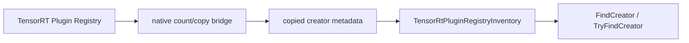

# Plugin Inventory 只读 API

本文面向需要在部署前检查 TensorRT plugin 可见性的 .NET 用户。Plugin Inventory 的目标不是创建 plugin，也不是接管 plugin 生命周期，而是把 TensorRT registry 中可安全复制的只读信息变成 C# 侧可诊断、可测试、无裸指针的对象。

## 目标读者

- 需要确认 TensorRT plugin creator 是否可见的部署工程师。
- 正在排查 name、version、namespace 或 field metadata 不一致的模型转换用户。
- 需要继续提升 plugin 相关 deferred API，但又不想暴露 borrowed pointer 的维护者。

## 为什么需要 Inventory

TensorRT plugin 常见问题并不总是发生在 engine build 阶段。更早的失败往往来自：

- plugin library 没有被加载。
- creator name、version 或 namespace 与 ONNX/export 配置不一致。
- runtime local registry 和 global registry 可见性不同。
- TRT8、TRT10、TRT11 的 registry 能力不完全一致。

传统 P/Invoke 如果直接返回 native creator pointer，用户会面对 borrowed pointer、生命周期和 ABI 异常传播风险。TensorRtSharp4.0 选择复制 name、version、namespace、field metadata 和 count 诊断，不把 `IntPtr` creator 暴露给 public API。



## 对应 API

主要 public surface：

- `TensorRtEnvironmentProbe.TryIsGlobalPluginRegistryAvailable`
- `TensorRtEnvironmentProbe.TryGetGlobalPluginRegistryInventory`
- `TensorRtEnvironmentProbe.TryIsGlobalPluginCreatorRegistered`
- `TensorRtEnvironmentProbe.TryGetGlobalPluginCreator`
- `TensorRtBuilder.TryIsPluginRegistryAvailable`
- `TensorRtBuilder.TryGetPluginRegistryInventory`
- `TensorRtRuntime.TryIsPluginRegistryAvailable`
- `TensorRtRuntime.TryGetPluginRegistryInventory`
- `TensorRtRuntime.TryIsPluginCreatorRegistered`
- `TensorRtRuntime.TryGetPluginCreator`
- `TensorRtPluginRegistryInventory`
- `TensorRtPluginCreatorInfo`
- `TensorRtPluginFieldSummary`
- `TensorRtPluginRegistryInventory.GetDiagnostics`
- `TensorRtPluginRegistryInventory.GetFieldSummaries`
- `TensorRtPluginRegistryInventoryDiagnostics`

这些 API 只返回 copied metadata，例如 creator count、name、version、namespace、field count 和 field descriptor。它们不会返回 native `IPluginCreator*`。`GetDiagnostics()` 也只检查这些已经复制到托管对象中的元数据是否自洽，不会再次调用 TensorRT。

Runtime-local lookup 现在也可以按 `name/version/namespace` 复制 creator metadata：TRT10/TRT11 会通过 lookup entrypoint 复制 interface kind、interface version、API language、field count、field name 和 field metadata；TRT8 保持 `IPluginCreator` 固定 interface 标识，并复制 lookup field count/name/metadata。这个路径仍然不返回 native creator pointer，也不会创建 plugin instance。

## 可复制命令

```powershell
dotnet run --project .\smoke\PluginRegistryInventorySmokeRunner\PluginRegistryInventorySmokeRunner.csproj -- --dependency-probe-only --tensor-rt-line 11
dotnet run --project .\smoke\PluginRegistryInventorySmokeRunner\PluginRegistryInventorySmokeRunner.csproj -- --tensor-rt-line 11
```

相关实现路径：

- `smoke/PluginRegistryInventorySmokeRunner`
- `src/JYPPX.TensorRtSharp/Plugins/TensorRtPluginRegistryInventory.cs`
- `src/JYPPX.TensorRtSharp/Runtime/TensorRtRuntime.PluginRegistryInventory.cs`
- `native/src/tensorrt/common/plugin_registry_inventory.inc`
- `artifacts/interface-coverage/tensorrt-interface-comparison.csv`

## Copied Metadata 诊断

`TensorRtPluginRegistryInventory.GetDiagnostics()` 用于在 smoke、部署前检查和 package consumer 证明中确认 copied inventory 的内部一致性：

```csharp
if (runtime.TryGetPluginRegistryInventory(out TensorRtPluginRegistryInventory inventory, out string diagnostic))
{
    TensorRtPluginRegistryInventoryDiagnostics diagnostics = inventory.GetDiagnostics();
    Console.WriteLine(diagnostics.DiagnosticSummary);

    if (!diagnostics.IsConsistent)
    {
        throw new InvalidOperationException("Plugin inventory metadata is inconsistent.");
    }
}
```

诊断字段包括：

- `CreatorCount` / `SummaryCount`：确认 creator 快照和 pointer-free summary 数量一致。
- `RecursiveCreatorCount` / `HasRecursiveCreatorCount`：在 runtime-local registry 支持递归查询时检查递归计数。
- `EmptyNameCount` / `EmptyVersionCount`：发现 creator identity 不完整。
- `CreatorWithFieldCount` / `TotalFieldCount`：汇总 creator field descriptor。
- `EmptyFieldNameCount` / `NegativeFieldLengthCount`：发现已复制 field metadata 的异常值。

这些诊断不是 plugin runtime 证明；它们只能说明 copied metadata 快照自洽，不能证明 plugin instance create、clone、enqueue、resource acquire/release 或 callback trampoline 已经可用。

如果需要在日志或 UI 中展示字段层面的只读信息，可以使用 `GetFieldSummaries()`。它只扫描已经复制到托管侧的快照，不再次调用 TensorRT，也不会暴露字段 data pointer：

```csharp
IReadOnlyList<TensorRtPluginFieldSummary> fields = inventory.GetFieldSummaries(
    maxCreators: 8,
    maxFieldsPerCreator: 16);

foreach (TensorRtPluginFieldSummary field in fields)
{
    Console.WriteLine($"{field.CreatorName}/{field.CreatorVersion}:{field.FieldName}:{field.FieldType}[{field.Length}]");
}
```

`HasData` 只表示 TensorRT 在 field descriptor 中报告了非空 data 指针。API 不会返回该指针，也不会复制 plugin field data payload。

## Smoke Runner

推荐先运行 dependency probe：

```powershell
dotnet run --project .\smoke\PluginRegistryInventorySmokeRunner\PluginRegistryInventorySmokeRunner.csproj -- --dependency-probe-only --tensor-rt-line 11
```

如果当前机器有可用 TensorRT runtime，再运行完整 smoke：

```powershell
dotnet run --project .\smoke\PluginRegistryInventorySmokeRunner\PluginRegistryInventorySmokeRunner.csproj -- --tensor-rt-line 11
```

预期输出包含类似字段：

```text
DependencyProbe Line=11 BridgeInitialized=True
GlobalPluginRegistry Exists=True
GlobalPluginRegistry Source=global Creators=...
BuilderPluginRegistry Exists=True
RuntimePluginRegistry Exists=True
PluginCreatorLookup Found=True Name=... Version=... Namespace=...
RuntimePluginCreatorLookup Found=True Name=... Version=... Namespace=...
RuntimePluginRegistry PluginRegistryInventoryDiagnostics IsConsistent=True CreatorCount=... TotalFieldCount=...
RuntimePluginRegistry FieldSummary Creator=... Field=... Type=... Length=... HasData=...
PluginRegistryInventorySmokeRunner Passed=True
```

如果环境缺少 TensorRT/CUDA 依赖，runner 会输出 `Skipped=True Reason=...`。这表示环境不可用，不表示 API 设计失败。

## 版本边界

TRT8 主要保留 builder-owned registry 只读路径；TRT10/TRT11 可覆盖 global registry、builder capability registry 和 runtime local registry。跨版本封装必须保持 version guard，不允许为了统一 API 而调用当前 TensorRT line 不支持的 entrypoint。

## 不能误读

- Inventory ready 不等于 plugin instance create ready。
- Creator lookup copied metadata 不等于取得 native creator ownership。
- Registry exists 不等于自定义 plugin library 已加载。
- 不允许把 register/deregister/load library 归入这个只读 API。

下一步如果要提升 plugin create、clone、enqueue 或 V2/V3 callback，需要单独处理 ownership、资源释放和 ABI no-throw 边界，不能复用本篇只读证明。

Boundary keywords: not public package proof, not post-publish proof, not package push, not release close approval.

这些 inventory smoke 也仍然是 not runtime proof：它们证明 registry/creator metadata 可以被安全复制，不证明 plugin instance create、enqueue、resource acquire/release 或真实模型调用已经执行。

## 截图与图示建议

- Plugin Registry -> count/copy bridge -> copied metadata -> C# inventory 的流程图。
- smoke runner 输出截图，展示 registry exists、creator count、creator lookup 和 diagnostics summary。
- 风险分层图：read-only metadata、resource ownership、plugin instance lifecycle、callback trampoline。

## 下一步

- 安全方向：继续提升 creator field metadata、registry availability、lookup copied result 等只读 API。
- 高风险方向：plugin create/clone/enqueue、resource acquire/release、register/deregister/load library 必须单独设计 owner/lifetime gate。
- 验证方向：扩展 `PluginRegistryInventorySmokeRunner` 和 ProjectQuality 测试，确保 public API 不暴露裸 `IntPtr` creator。

## 第三批正文门禁

### 适用读者

本文适合需要查看 TensorRT plugin registry、creator name/version/namespace 和 field metadata 的用户，也适合继续提升 deferred readonly API 的维护者。

### 解决问题

Plugin inventory 解决的是安全复制 metadata，而不是暴露 borrowed plugin creator pointer。用户应该拿到稳定字符串和结构化字段，不应该直接面对裸 pointer 生命周期。

### 背景与场景

TRT10/TRT11 的 plugin registry 能力对部署很关键：很多 ONNX 或自定义模型依赖 plugin。只读 inventory 可以帮助判断环境是否具备 plugin creator，但不触碰 register、deregister、create、clone、enqueue 等高风险 ownership API。

### 代码与文件入口

- `src/JYPPX.TensorRtSharp/Plugins/TensorRtPluginRegistryInventory.cs`
- `src/JYPPX.TensorRtSharp/Runtime/TensorRtRuntime.PluginRegistryInventory.cs`
- `native/src/tensorrt/common/plugin_registry_inventory.inc`
- `tests/JYPPX.ProjectQuality.Tests/PluginRegistryInventoryTests.cs`

### 操作路径

先读取 registry exists 和 creator count，再复制 creator name/version/namespace 与 field metadata，最后用 smoke runner 或 quality tests 验证跨版本 guard。

### 边界说明

build-only、dry-run、template、local feed、ProjectReference、direct `.nupkg`、TensorRtExec report、YoloVision matrix、OnnxToEngine report、readonly diagnostics 都不是 runtime proof。plugin inventory 只证明 metadata 可读，不证明 plugin instance runtime 已执行。

### 下一步

下一步继续提升低 ownership 风险 readonly API；如果转向 plugin create/enqueue，必须单独设计 owner ledger 和 no-throw callback 边界。
