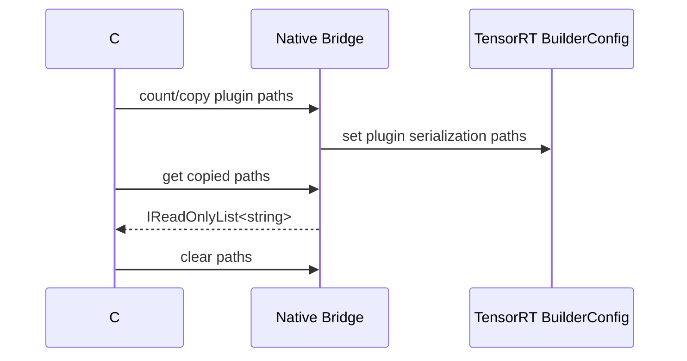

# Plugin Serialization Paths

本文说明 TensorRT 8/10/11 中 plugin serialization path 的托管封装和验证方式。这个功能主要用于 engine 序列化部署时记录需要随 engine 一起处理的 plugin library 路径，适合发布前检查 builder config 是否正确保存、读取和清理路径列表。

## 使用场景

当 engine 依赖外部 plugin library 时，部署材料通常需要回答：

- build config 中记录了哪些 plugin library 路径。
- 路径列表是否能被复制回 C# 侧。
- clear 后是否真的为空。
- 三个版本线是否都能完成 caller-buffer 路径 round-trip。

`TensorRtBuilderConfig.SetPluginsToSerialize` 和 `GetPluginsToSerialize` 使用字符串复制语义，避免把 native 内部数组或字符串指针暴露给用户。



## Smoke Runner

先做依赖探测：

```powershell
dotnet run --project .\smoke\PluginSerializationPathsSmokeRunner\PluginSerializationPathsSmokeRunner.csproj -- --dependency-probe-only --tensor-rt-line 11
```

完整 smoke：

```powershell
dotnet run --project .\smoke\PluginSerializationPathsSmokeRunner\PluginSerializationPathsSmokeRunner.csproj -- --tensor-rt-line 11
```

预期输出：

```text
PluginSerializationPathsSmokeRunner TensorRtLineRequest=11 DependencyProbeOnly=False
DependencyProbe Line=11 BridgeInitialized=True
PluginSerializationPaths Set=True Count=2 FirstMatches=True ClearedCount=0 TryGet=True AfterClear=0 Diagnostic=OK
PluginSerializationPathsSmokeRunner Passed=True
```

TRT8 使用相同的 count/caller-buffer/set 边界，可直接运行：

```powershell
dotnet run --project .\smoke\PluginSerializationPathsSmokeRunner\PluginSerializationPathsSmokeRunner.csproj -- --tensor-rt-line 8
```

该 smoke 不加载路径指向的 plugin library，只验证 TensorRT builder config 对字符串列表的复制、读取和清理。

## 发布边界

这个 API 只证明 builder config 的 path set/get/clear 行为。它不证明：

- plugin library 已被加载。
- plugin creator 已注册。
- plugin instance 可以 create/clone/enqueue。
- engine 已经在目标机器成功 deserialize。

如果 package consumer runtime smoke 当前是 `blocked-by-cuda-driver`，仍应把它记录为环境阻塞。不要把 plugin serialization path smoke 写成 full runtime proof。

## 推荐排查顺序

1. 运行 dependency probe，确认 bridge 和 TensorRT adapter 可加载。
2. 运行 serialization paths smoke，确认路径 round-trip。
3. 运行 Plugin Inventory，只读检查 creator 是否可见。
4. 构建实际 engine，并记录需要随包发布的 plugin library。
5. 在 package consumer 中验证 native asset copy 和 runtime load。
