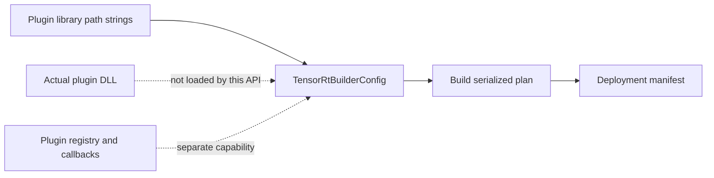
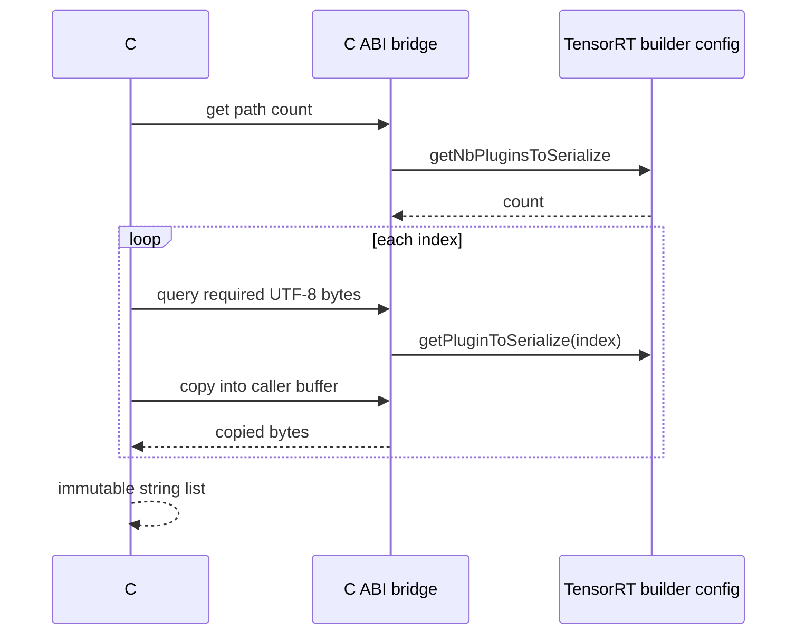

# Plugin Serialization Paths：设置、复制、清理与部署边界

TensorRT builder config 可以记录“生成 engine plan 时需要一并序列化的 plugin library 路径”。
TensorRtSharp4.0 为 TensorRT 8/10/11 提供 `SetPluginsToSerialize`、copied readback、snapshot 和 clear。

这个能力经常被误解成“加载 plugin”或“调用 plugin serialize”。实际上它只管理 builder config 中的路径
列表。plugin creator 注册、library load、plugin instance create/clone/enqueue、V2 serialize callback 和资源
acquire/release 都是独立能力，不能由 path round-trip 代替。

## 适用读者

- 构建依赖自定义 TensorRT plugin 的 engine 的开发者。
- 需要审计 plan 随附 plugin library 清单的发布维护者。
- 正在处理 caller-buffer、string list 与跨版本 builder config 的贡献者。
- 排查 plugin path 设置成功但目标机器仍无法 deserialize engine 的用户。

## 先区分四种 Plugin 能力

| 能力 | 本文覆盖 | 说明 |
| --- | --- | --- |
| Builder config serialization path list | 是 | set/count/get/clear/copy snapshot |
| Plugin registry inventory | 否 | 只读查看 creator name/version/namespace |
| Load/register/deregister library | 否 | 涉及 loader、registry 和 library lifetime |
| Plugin callback/create/serialize/enqueue | 否 | 涉及 plugin object、vtable、buffer 和 runtime ownership |



路径字符串进入 config，不表示 DLL 存在、可加载、已注册或已被 engine 使用。

## Public API

实现位于：

- `src/JYPPX.TensorRtSharp/TensorRtBuilderConfig.Trt11PluginSerialization.cs`
- `src/JYPPX.TensorRtSharp/TensorRtBuilderConfig.Trt11Diagnostics.cs`
- `src/JYPPX.TensorRtSharp/TensorRtBuilderConfigSerializedPluginSnapshot.cs`

虽然 partial 文件名保留了历史来源，这组 public API 已按 line route 覆盖 TRT8/10/11：

```csharp
bool SetPluginsToSerialize(IReadOnlyList<string> pluginLibraryPaths);
bool SetPluginsToSerialize(params string[] pluginLibraryPaths);
int PluginToSerializeCount { get; }
IReadOnlyList<string> GetPluginsToSerialize();
bool TryGetPluginsToSerialize(out IReadOnlyList<string> paths, out string diagnostic);
void ClearPluginsToSerialize();
TensorRtBuilderConfigSerializedPluginSnapshot GetSerializedPluginSnapshot();
```

空集合表示清空。bridge 只传递/复制路径，不持有或再分发 DLL。

## 三代 Manifest 与实现

关键 manifest：

- TRT8：`native/manifests/tensorrt/v8/trt8-builder-config-plugin-serialization-readonly.manifest.json`
- TRT8 set：`native/manifests/tensorrt/v8/trt8-safe-lifecycle-shape-serialization-metadata.manifest.json`
- TRT10：`native/manifests/tensorrt/v10/trt10-runtime-serialization-plugin-paths.manifest.json`
- TRT11：`native/manifests/tensorrt/v11/trt11-eleventh-batch.manifest.json`
- TRT11 set：`native/manifests/tensorrt/v11/trt11-fourteenth-batch.manifest.json`

TRT8 的实际实现位于
`native/src/tensorrt/v8/modules/builder/safe_plugin_serialization_paths.inc`。TRT10/11 也有各自 line route；
generated interop 位于
`src/JYPPX.TensorRtSharp/Internal/Interop/Generated/GeneratedTensorRtManifestNativeMethods.g.cs`。

旧 coverage 中 `getNbPluginsToSerialize`/`setPluginsToSerialize` 的 deferred row 仍保留，用 alias 表达真实实现
已经提升。旧记录不能删除来制造覆盖完成。

## 字符串列表如何跨 ABI

设置路径时，托管层先验证 collection 和每个 string，再创建稳定 UTF-8 指针数组，native 入口只在调用期间
读取。TensorRT 不会得到托管 string 对象，也不会长期持有 GC 可移动地址。

读取路径采用两阶段 caller-buffer：

1. 先获取 path count。
2. 对每个 index 查询 required UTF-8 byte count。
3. 分配 caller buffer。
4. 再次调用复制完整 path。
5. 解码为托管 string 并组装只读列表。



没有任何 vendor `char const*` 在调用后逃逸到 public API。

## 基本用法

以下示例仅演示 config round-trip。路径应放在受控 E 盘部署目录：

```csharp
using var logger = new TensorRtLogger(TensorRtApiLine.TensorRt10);
using var builder = new TensorRtBuilder(logger);
using var config = builder.CreateBuilderConfig();

string[] pluginPaths =
{
    @"E:\TensorRtSharpAssets\plugins\custom-preprocess.dll",
    @"E:\TensorRtSharpAssets\plugins\custom-postprocess.dll"
};

bool accepted = config.SetPluginsToSerialize(pluginPaths);
IReadOnlyList<string> copied = config.GetPluginsToSerialize();
TensorRtBuilderConfigSerializedPluginSnapshot snapshot =
    config.GetSerializedPluginSnapshot();

if (!accepted || copied.Count != pluginPaths.Length || !snapshot.HasPathInventory)
{
    throw new InvalidOperationException(snapshot.Diagnostic);
}

config.ClearPluginsToSerialize();
if (config.PluginToSerializeCount != 0)
{
    throw new InvalidOperationException("Plugin path list was not cleared.");
}
```

path round-trip 比较应使用适合目标平台的规则。当前 Windows smoke 使用 ordinal 比较预期字符串，不替你做
路径规范化、文件存在性或签名验证。

## Snapshot 字段怎么读

`TensorRtBuilderConfigSerializedPluginSnapshot` 是 pointer-free copied snapshot：

| 字段 | 含义 |
| --- | --- |
| `Line` | 读取时使用的 TensorRT API line |
| `Count` | TensorRT 报告的路径数 |
| `PluginLibraryPaths` | bridge 成功复制出的只读 string 列表 |
| `HasPathInventory` | 当前 line 是否提供完整 copied inventory |
| `Diagnostic` | unavailable/失败原因或 `OK` |

`Count` 与 `PluginLibraryPaths.Count` 应一致。若 count 可读但 path inventory 不支持，snapshot 会保留诊断，
调用方不能把空列表解释为“确定没有 plugin”。

## TryGet 与异常接口怎么选

`GetPluginsToSerialize` 适合调用方要求能力必须存在的 build 流程；失败直接抛出桥接异常。

`TryGetPluginsToSerialize`/`TryGetSerializedPluginSnapshot` 适合诊断 UI、矩阵扫描或跨 line report。返回 false
时应展示 `diagnostic`，不能静默换成空清单。

```csharp
if (config.TryGetSerializedPluginSnapshot(out var snapshot, out string diagnostic))
{
    Console.WriteLine(snapshot);
}
else
{
    Console.WriteLine($"Plugin path inventory unavailable: {diagnostic}");
}
```

## 仓库 Smoke

runner 位于 `smoke/PluginSerializationPathsSmokeRunner`。

先做依赖探测：

```powershell
dotnet run --project .\smoke\PluginSerializationPathsSmokeRunner\PluginSerializationPathsSmokeRunner.csproj `
  -c Debug --no-build -- --dependency-probe-only --tensor-rt-line 11
```

完整 round-trip：

```powershell
dotnet run --project .\smoke\PluginSerializationPathsSmokeRunner\PluginSerializationPathsSmokeRunner.csproj `
  -c Debug --no-build -- --tensor-rt-line 11
```

对其它 line 将参数改为 8 或 10。runner 执行：

1. dependency probe 与 builder availability 检查。
2. 创建 logger/builder/config。
3. 设置两个 path string。
4. 读取 list 与 snapshot。
5. 验证顺序和字符完全一致。
6. clear 后验证 count/list/snapshot 都为空。

runner 使用临时目录构造字符串，但不创建或加载那两个 plugin DLL。因此成功输出应解读为 path state
round-trip，而不是 plugin execution。

预期关键标记：

```text
PluginSerializationPaths Set=True
Count=2
FirstMatches=True
ClearedCount=0
AfterClear=0
PluginSerializationPathsSmokeRunner Passed=True
```

`DependencyProbeOnly=True` 最终会输出 `Skipped=True`，不能当 full smoke passed。

## 与 Engine Build 的关系

真实工程应在 build report 中同时记录：

- runtime package key 和 TensorRT line。
- plugin library 原始路径、规范化路径和 SHA256。
- plugin name/version/namespace 与 creator inventory。
- config snapshot count/path list。
- engine plan SHA256。
- build stdout/stderr 和 validator 结果。

设置 path 后仍要构建实际 network/engine，确认 TensorRT 接受配置。path list 不验证 plugin ABI 与目标 TensorRT
版本兼容，也不验证 plugin 所需的其它 DLL。

## 部署时不要保留开发机绝对路径

开发机 E 盘路径适合本地 build 证据，但公开部署不能假设用户有相同目录。推荐将 plugin DLL 纳入明确的
runtime/package asset 清单，并在部署阶段投影为应用目录可解析路径。

需要记录：

| 项 | 要求 |
| --- | --- |
| Source path | 仅本地 owner evidence，不写成用户固定路径 |
| Packaged path | nupkg/bundle 内的相对位置 |
| Output path | consumer build 后的实际文件位置 |
| SHA256 | source/package/output 三层可比对 |
| Dependencies | `dumpbin /dependents` 或等价检查 |
| License | plugin 和第三方依赖的再分发许可 |

## 安全与输入校验

- 拒绝 null collection 和 null/无效 path entry。
- 不把不可信相对路径直接拼入系统目录。
- public package 中不要包含用户可写目录指向的 DLL。
- 保存 hash、签名和 package identity，避免 DLL search order hijacking。
- plugin DLL 加载应由独立 loader/registry contract 管理，不在 path setter 中偷偷执行。

## Path API 与 Plugin Callback 的 Deferred 边界

以下 manifest row 仍与本文能力不同：

- `IPluginV2::serialize`
- plugin creator deserialize/create
- `IPluginV3OneRuntime::getFieldsToSerialize`
- plugin resource acquire/release
- registry register/deregister/load library

它们涉及 plugin object、vendor callback、buffer ownership 或 library lifetime。path set/get 已提升，不会自动
让这些 row 成为 implemented。维护者必须保留旧 deferred record，并为每一类建立独立 owner/runtime proof。

## 常见问题

### Set 返回 True，但 Get 是空

先检查 API line、snapshot diagnostic 和 clear 调用顺序。使用 focused test 复现；不要把 false/exception 转为空
列表。若只有 count 没有 copied inventory，记录 capability 差异。

### Path 存在，但 Build 找不到 Plugin

path config 不负责加载 DLL。检查 library architecture、TensorRT plugin ABI、依赖 DLL、registry 初始化和 build
process search path。

### Build 成功，目标机 Deserialize 失败

目标机可能缺 plugin DLL、依赖版本不同、creator 未注册或 plan/plugin ABI 不兼容。用 package consumer 输出
清单、hash 和 runtime log定位，不要只对比 path string。

### TRT8/10/11 的 API 是否完全一样

public wrapper 提供统一语义，但底层 entry point/manifest/guard 独立。每个 line 都要跑自己的 native build 和
focused smoke。

### 可以把任意 Path 写入 Config 吗

round-trip smoke 只验证字符串复制。真实 build 应要求文件存在、扩展名/architecture 合法、hash 已记录，并
使用受控资产目录。

### Smoke Passed 是否等于 Package Proof

不是。source-tree runner 不 restore public package，不验证 nupkg asset copy，也不加载实际 plugin。

## 证据分级

| 证据 | 证明 | 不证明 |
| --- | --- | --- |
| set/get/clear unit test | wrapper 与 copied list 契约 | vendor builder 执行 |
| source smoke passed | 指定 line 的 config round-trip | plugin DLL load |
| actual engine build | builder 接受 network/config/plugin setup | clean consumer runtime |
| plugin inventory | creator metadata 可见 | instance/enqueue 成功 |
| package native-copy | DLL 进入 consumer output | ABI 与执行正确 |
| runtime deserialize/enqueue | 指定 engine/plugin 路径运行 | post-publish channel 正确 |

## 边界说明

本文与 smoke 只证明 builder config serialization path 的 copied set/get/clear。它不是 plugin load、creator
registration、plugin callback、engine runtime、package consumer 或 post-publish proof。

当前仍固定 `performsPublish=false`、`canPublishPublicly=false`、`canCloseReleaseIssue=false`。

## 完成清单

- [ ] runtime key 与 TensorRT line 已固定。
- [ ] plugin DLL 来源、license、architecture 和 SHA256 已记录。
- [ ] set 返回值、count、copied path 顺序和 snapshot 已验证。
- [ ] clear 后 count/list/snapshot 均为空。
- [ ] TryGet 失败时 diagnostic 没有被丢弃。
- [ ] 实际 build 与 path-only smoke 分开执行。
- [ ] plugin inventory 与 library load/registry 状态分开记录。
- [ ] package output 中 plugin DLL 和依赖的来源/hash 可追踪。
- [ ] deferred callback/resource/registry row 未被删除或误报。
- [ ] source smoke 未被写成 public package runtime proof。

## 下一步

- [Plugin Registry Inventory](plugin-registry-inventory-user-guide.md)
- [Callback 与 Allocator 安全桥接路线](callback-allocator-safety-bridge-roadmap.md)
- [Runtime Package 和 Split Package 怎么选](runtime-package-selection.md)
- [Package Consumer Runtime Proof Playbook](package-consumer-runtime-proof-playbook.md)
