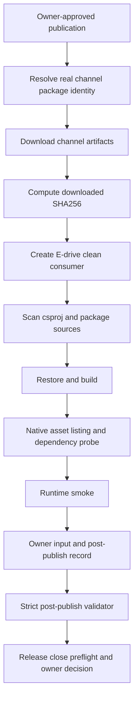

# Post Publish Verification Proof Playbook：从真实渠道回下载到关闭门禁

## 写在前面

发布动作返回成功，只能说明上传请求完成；它不能证明用户能从真实渠道找到正确版本、下载到正确字节、restore 出正确 native assets，并在干净主机完成 runtime smoke。

`post-publish verification` 的任务正是验证这一段“发布之后”的路径。它必须发生在 owner 批准并执行真实发布之后，输入是公开或 owner 指定渠道中的实际产物，而不是构建目录、本地 feed 或发布前候选包。

本文只说明验证方法，不执行发布，不生成公开副作用，也不授权 release close。当前仓库发布冻结和 GitHub Actions 配额约束继续有效。

## 适用读者

- 完成真实渠道发布后负责验收的 release owner。
- 需要验证 NuGet/GitHub Packages/Release 产物可恢复性的维护者。
- 负责 clean consumer、native dependency 和 runtime smoke 的执行人。
- 需要编写回滚决策、发布公告和 issue close 记录的发布负责人。

## 解决问题

本文回答七个问题：

1. post-publish proof 与发布前 package-consumer-runtime 有何区别。
2. 如何固定 channel、package identity、URL、version 和 downloaded SHA256。
3. 如何在 E 盘创建仓库外 clean consumer。
4. 如何证明没有 ProjectReference、本地 feed 或 direct `.nupkg` 捷径。
5. 如何采集 restore/build/native listing/probe/smoke 的真实日志。
6. strict validator 需要哪些 owner 字段。
7. 验证失败时何时停止推广、执行回滚或继续修复。

## 背景与场景

发布前可以完成：

- source-quality build/test；
- package layout 和 dry-run；
- local package consumer；
- compatible host package-consumer-runtime；
- release owner authorization。

这些证据仍然无法证明“真实渠道上的字节就是被验证的字节”。post-publish 必须重新从渠道解析版本、下载包、计算 hash、创建新 consumer，并保存新的日志。

## 三段不可合并的 Proof

| 阶段 | 证明对象 | 典型输入 | 不能替代 |
| --- | --- | --- | --- |
| pre-publish package proof | 发布候选包 | candidate package/hash/compatible host | 真实渠道可下载 |
| post-publish verification | 渠道中实际产物 | channel URL/download hash/clean consumer | owner close decision |
| release close | 全部 lanes + owner decision | evidence bundle/rollback/approval | 单个 smoke |

同一个版本可以在三段中出现，但每段日志、来源和审核语义不同。

## Proof 定义

合格 `post-publish-package-consumer-runtime` 至少包括：

- selected channel 和不可歧义的 channel source URI；
- managed/runtime package id 与 version；
- 实际 package URL；
- 从渠道下载的 managed/runtime nupkg SHA256；
- 下载时间与 hash 来源；
- 仓库外 clean consumer root 和 `.csproj`；
- no ProjectReference；
- no local package source；
- no local nupkg PackageReference；
- restore/build/native asset/dependency probe/runtime smoke 日志；
- 所有日志的 SHA256；
- stdout/stderr summary；
- host OS/GPU/driver/CUDA/TensorRT/cuDNN；
- owner/reviewer/timestamp；
- strict validator 结果。

## 证据流水线



发布前候选包不能直接跳到 J；必须重新经过 B-I。

## 代码与文件入口

### Consumer scan

- `eng/Test-PostPublishCleanConsumerProject.ps1`
- `docs/articles/zh-cn/post-publish-clean-consumer-project-scan.md`
- `artifacts/final-release/post-publish-clean-consumer-project-scan.json`

### Owner input and projection

- `eng/Export-PostPublishVerificationOwnerInputTemplate.ps1`
- `eng/Test-PostPublishVerificationOwnerInput.ps1`
- `eng/Export-PostPublishVerificationRecordFromOwnerInput.ps1`
- `eng/Export-PostPublishVerificationRecordInputDraft.ps1`

### Strict validation and close

- `eng/Test-PostPublishVerificationRecord.ps1`
- `eng/Export-ReleaseEvidenceBundle.ps1`
- `eng/Export-ReleaseClosePreflight.ps1`
- `eng/Test-ReleaseIssueCloseRecord.ps1`
- `artifacts/final-release/post-publish-verification-record.json`
- `artifacts/final-release/release-candidate-final-evidence-freeze.json`

## 渠道差异

### NuGet-compatible source

NuGet.org、GitHub Packages 或 owner 指定的 NuGet v3 feed 可以作为 restore source。证据要保留 source URI、package id/version 和 restore 日志。

### GitHub Release assets

GitHub Release URL 能提供真实下载文件，但 Release asset 本身不是 NuGet source。不能仅把 `.nupkg` 下载到本地目录，再把这个目录称为公开 source。

如果项目选择 GitHub Release managed + bridge assets 路线，owner 需要明确：

- managed 与 `.Bridge` 资产各自的下载 URL、release/tag/asset identity 和 GitHub digest；
- 两个 nuspec 的 repository commit 是否一致；
- validator 如何区分真实渠道下载与本地候选包；
- clean consumer 如何只把已验证的公开下载文件放入隔离 restore staging；
- 主机上的 TensorRT/CUDA/cuDNN/NVRTC 如何独立发现，且没有进入包资产。

当前 strict record 要求 `noLocalPackageSource=true`。无法满足时应保持 blocker，不要把临时本地 feed 写成 post-publish proof。

### Private feed

private feed 可作为 owner 指定真实渠道，但凭据不得进入文档、record、日志或 Git。只记录脱敏认证方式和 source identity。

## E 盘验证工作区

每次发布版本使用全新目录，避免旧 global package cache 或旧输出混入。

```text
..\proof\post-publish\<version>\<runtime-key>\
  downloads\
  consumer\
  nuget-config\
  output\
  logs\
  reports\
  evidence\
```

初始化：

```powershell
$version = "<owner-published-version>"
$runtimeKey = "win-x64-trt11.0-cuda13.2-cudnn9.22"
$caseRoot = "..\proof\post-publish\$version\$runtimeKey"

@("downloads", "consumer", "nuget-config", "output", "logs", "reports", "evidence") |
  ForEach-Object {
    New-Item -ItemType Directory -Force -Path (Join-Path $caseRoot $_) | Out-Null
  }
```

不要复用发布前 consumer，也不要把系统盘 NuGet cache 当证据目录。

## 阶段零：确认发布授权已经存在

验证执行人首先确认：

- owner approval 不是 template；
- selected channel 与实际发布渠道一致；
- version 已固定且不可覆盖；
- managed/runtime package identities 已审核；
- NVIDIA redistribution disposition 已记录；
- rollback plan 已存在。

如果发布根本没有发生，post-publish workflow 应立即停止。不要使用 candidate URL 或 placeholder 继续。

## 阶段一：解析真实 Channel Identity

记录以下值：

```text
selectedChannel
channelSourceUri
publishedPackageUrl
managedPackageUrl
runtimePackageUrl
managedPackageId / managedPackageVersion
runtimePackageId / runtimePackageVersion
publishedVersion
```

URL 必须能定位到真实版本，而不是项目主页、搜索页或 latest alias。

### URL 检查

```powershell
$managedPackageUrl = "<owner-fill-real-managed-package-url>"
$runtimePackageUrl = "<owner-fill-real-runtime-package-url>"

foreach ($uri in @($managedPackageUrl, $runtimePackageUrl)) {
  if ($uri -like "<*>") { throw "Owner must replace URL placeholder: $uri" }
  $parsed = [Uri]$uri
  if (-not $parsed.IsAbsoluteUri -or $parsed.Scheme -notin @("https")) {
    throw "Expected an absolute HTTPS package URL: $uri"
  }
}
```

HEAD/metadata request 成功不等于包内容已验证，下一步必须下载真实字节。

## 阶段二：下载并固定 Hash

下载动作由 owner 在获批渠道完成。验证脚本只接受实际下载后的文件：

```powershell
$managedNupkg = Join-Path $caseRoot "downloads\managed.nupkg"
$runtimeNupkg = Join-Path $caseRoot "downloads\runtime.nupkg"

foreach ($file in @($managedNupkg, $runtimeNupkg)) {
  if (-not (Test-Path -LiteralPath $file -PathType Leaf)) {
    throw "Missing channel-downloaded package: $file"
  }
  Get-FileHash -Algorithm SHA256 -LiteralPath $file
}
```

同时记录：

- download timestamp UTC；
- source URL；
- HTTP/channel identity 摘要；
- 文件长度；
- SHA256；
- 下载工具与版本。

不要用发布前 package hash 自动填充 downloaded hash。两者应该比较，但必须分别计算。

### 发布前后 Hash 比较

如果渠道设计承诺字节不变，两个 hash 应一致。若不一致：

1. 停止 release promotion。
2. 保存两份文件和 hash。
3. 检查渠道是否重打包、签名或重新压缩。
4. 确认下载到的 version 是否正确。
5. 由 owner 决定修复、重新发布或回滚。

不能通过修改 record 让 hash 看起来一致。

## 阶段三：创建全新 Consumer

consumer 必须通过真实 source restore，而不是直接引用 `downloads` 目录中的 nupkg。

```powershell
$consumerRoot = Join-Path $caseRoot "consumer"
dotnet new console -n TensorRtSharpPostPublishConsumer -f net8.0 -o $consumerRoot
if ($LASTEXITCODE -ne 0) { throw "consumer creation failed" }
```

使用 owner 选定 source 添加 versioned PackageReference。不要在文章里固化尚未发布的真实版本或凭据。

consumer 项目应记录：

- target framework；
- RID；
- managed/runtime package id/version；
- selected source；
- runtime key；
- smoke entrypoint。

## 阶段四：Clean Consumer Scan

先扫描项目结构：

```powershell
$consumerProject = Join-Path $consumerRoot "TensorRtSharpPostPublishConsumer.csproj"

pwsh -NoProfile -ExecutionPolicy Bypass -File `
  .\eng\Test-PostPublishCleanConsumerProject.ps1 `
  -ProjectPath $consumerProject `
  -OutputRoot "$caseRoot\reports"
```

scan 必须确认：

- project exists；
- extension 是 `.csproj`；
- XML 可解析；
- project 在 repository 外；
- 至少一个目标 TensorRtSharp PackageReference；
- ProjectReference count 为 0。

scan 只证明项目形状，不证明 restore source 和 runtime smoke。`scanPassed=true` 仍不是 post-publish proof。

### Source 污染扫描

```powershell
rg -n "ProjectReference|RestoreSources|RestoreFallbackFolders|\.nupkg|artifacts|build-out|local" `
  $consumerRoot
```

任何 repository/local fallback 命中都要人工判断。最终 record 必须真实满足：

- `noProjectReference=true`；
- `noLocalPackageSource=true`；
- `noLocalNupkgPackageReference=true`；
- `cleanConsumerProjectScanPassed=true`。

## 阶段五：隔离 Restore

使用本次 case 的 package cache，避免用户全局 cache 隐藏 source 问题：

```powershell
$env:NUGET_PACKAGES = Join-Path $caseRoot "output\nuget-packages"
$restoreLog = Join-Path $caseRoot "logs\restore.log"

dotnet restore $consumerProject --force --no-cache `
  2>&1 | Tee-Object $restoreLog
$restoreExitCode = $LASTEXITCODE
if ($restoreExitCode -ne 0) { throw "restore failed: $restoreExitCode" }
```

审阅 restore log：

- package/version 是否正确；
- source 是否是 selected channel；
- 是否出现 fallback；
- 是否从旧 global cache 直接命中；
- runtime package 是否与 key 一致。

## 阶段六：Build 与 Native Assets

```powershell
$buildLog = Join-Path $caseRoot "logs\build.log"
dotnet build $consumerProject -c Release --no-restore `
  2>&1 | Tee-Object $buildLog
$buildExitCode = $LASTEXITCODE
if ($buildExitCode -ne 0) { throw "build failed: $buildExitCode" }

$nativeListing = Join-Path $caseRoot "logs\native-assets.txt"
Get-ChildItem (Join-Path $consumerRoot "bin\Release") -File -Recurse |
  Sort-Object FullName |
  ForEach-Object {
    $hash = (Get-FileHash -Algorithm SHA256 -LiteralPath $_.FullName).Hash.ToLowerInvariant()
    "{0}`t{1}`t{2}" -f $_.Length, $hash, $_.FullName
  } | Set-Content -LiteralPath $nativeListing -Encoding utf8
```

两种公开通道的 native listing 规则相同：包内只检查项目自有 bridge，并单独记录主机 TensorRT/CUDA/cuDNN/NVRTC discovery。任何 NVIDIA 原厂 binary 出现在 nupkg listing 中都应让验证 fail closed。

## 阶段七：Dependency Probe

dependency probe 用于定位加载失败，不是 runtime proof。

记录：

- bridge path；
- first missing dependency；
- architecture；
- TensorRT/CUDA/cuDNN version；
- process search path；
- probe exit code。

```powershell
$dependencyProbeLog = Join-Path $caseRoot "logs\dependency-probe.log"
& <owner-generated-dependency-probe-command> *>&1 |
  Tee-Object $dependencyProbeLog
$dependencyProbeExitCode = $LASTEXITCODE
```

placeholder 必须在执行记录中替换成真实展开命令。

## 阶段八：Runtime Smoke

runtime smoke 必须绑定 exact runtime key：

```powershell
$runtimeSmokeLog = Join-Path $caseRoot "logs\runtime-smoke.log"
& <owner-generated-runtime-smoke-command> --runtime-package-key $runtimeKey *>&1 |
  Tee-Object $runtimeSmokeLog
$runtimeSmokeExitCode = $LASTEXITCODE
```

通过条件：

- exit code 0；
- smoke status passed；
- runtime key 与 package identity 一致；
- TensorRT runtime 真正初始化；
- 目标 bounded inference/diagnostic contract 完成；
- stdout/stderr summary 可从日志复核；
- 没有 skip/driver blocker；
- 日志文件可重新计算 SHA256。

如果出现 `blocked-by-cuda-driver`，保留诊断并换兼容主机重跑。不能把 controlled skip 当 post-publish pass。

## 阶段九：日志 Hash

```powershell
$logs = @(
  $restoreLog,
  $buildLog,
  $nativeListing,
  $dependencyProbeLog,
  $runtimeSmokeLog
)

$logs | ForEach-Object {
  if (-not (Test-Path -LiteralPath $_ -PathType Leaf)) { throw "Missing log: $_" }
  Get-FileHash -Algorithm SHA256 -LiteralPath $_
} | Format-Table -AutoSize
```

validator 会比较声明 hash 与真实文件。任何日志内容修改都需要重新计算并重新 review。

## 阶段十：Owner Input 与 Record

生成 owner input template：

```powershell
pwsh -NoProfile -ExecutionPolicy Bypass -File `
  .\eng\Export-PostPublishVerificationOwnerInputTemplate.ps1
```

先对 owner input 做严格验证：

```powershell
pwsh -NoProfile -ExecutionPolicy Bypass -File `
  .\eng\Test-PostPublishVerificationOwnerInput.ps1 `
  -InputPath "$caseRoot\evidence\post-publish-owner-input.json" `
  -OutputRoot "$caseRoot\evidence\validation" `
  -Strict
```

再投影 record：

```powershell
pwsh -NoProfile -ExecutionPolicy Bypass -File `
  .\eng\Export-PostPublishVerificationRecordFromOwnerInput.ps1 `
  -OwnerInputPath "$caseRoot\evidence\post-publish-owner-input.json" `
  -OutputPath "$caseRoot\evidence\post-publish-verification-record.json"
```

## Record 字段复核

| 字段组 | 关键字段 |
| --- | --- |
| channel | selectedChannel、channelSourceUri、publishedPackageUrl |
| packageIdentity | managed/runtime id/version/URL/SHA256/hash source/download timestamp |
| consumer | cleanConsumerRoot、project name/path、outside repository |
| isolation | noProjectReference、noLocalPackageSource、noLocalNupkgPackageReference |
| host | owner/machine/OS/GPU/driver/CUDA/TensorRT/cuDNN |
| commands | restoreCommand、buildCommand、smokeCommand |
| logs | restore/native listing/probe/runtime smoke path + SHA256 |
| result | exit codes、smoke status、stdout/stderr summary |
| review | ownerName、reviewerName、publishedVersion、timestamps |

所有 placeholder、空 summary、伪 hash 和仓库内 consumer 都会阻止 promotion。

## 阶段十一：Strict Validator

```powershell
pwsh -NoProfile -ExecutionPolicy Bypass -File `
  .\eng\Test-PostPublishVerificationRecord.ps1 `
  -InputPath "$caseRoot\evidence\post-publish-verification-record.json" `
  -OutputRoot "$caseRoot\evidence\validation" `
  -RequireExistingLog `
  -FailOnNotProof
```

目标 validation state 是真实 post-publish proof，而不是：

- template-only；
- incomplete-post-publish-verification；
- dependency-probe-only；
- invalid-record；
- blocked-by-cuda-driver。

validator 必须自己计算 `isPostPublishVerificationProof` 和 close eligibility。不得手改 validation artifact。

## 阶段十二：Release Close Preflight

post-publish validator 通过后再刷新：

```powershell
pwsh -NoProfile -ExecutionPolicy Bypass -File .\eng\Export-ReleaseEvidenceBundle.ps1
pwsh -NoProfile -ExecutionPolicy Bypass -File .\eng\Export-ReleaseClosePreflight.ps1
```

release close 还需要：

- owner authorization；
- package-consumer-runtime；
- Linux runner proof；
- real-model-runtime；
- rollback approval；
- final owner close record。

post-publish 单 lane 通过不会自动关闭 issue。

## 失败决策树

### Channel 找不到 Version

检查 package id、source、prerelease 标记、index propagation 和权限。不要退回本地 candidate 伪造验证。

### Download Hash 与 Candidate 不同

冻结推广，比较包内容与签名/压缩差异，确认是否渠道变换或错误版本。由 owner 决定修复或回滚。

### Clean Scan 发现 ProjectReference

删除引用，重新创建 consumer 并重新 restore/build。仅修改 scan JSON 无效。

### Restore 命中 Local Feed

清理 consumer NuGet.Config、环境 source 和 fallback folder。使用隔离 `NUGET_PACKAGES` 重跑。

### Native Asset 缺失

检查 package RID、targets、buildTransitive、bridge/vendor route。保留缺失清单，不要从源码 bin 手动复制后冒充 package copy。

### Dependency Probe 成功但 Smoke 失败

probe 只说明部分依赖可加载。继续检查 engine/runtime API、driver compatibility、TensorRT/CUDA line 和 smoke output。

### CUDA Error 35

记录主机 driver/runtime 后换兼容主机。它是 owner action required，不是 post-publish proof。

### Validator 报 Hash Mismatch

重新计算真实文件 hash，确认日志是否被追加或转码。修 input 后重新投影和验证，不修改 validator output。

## Rollback 触发条件

以下任一情况都应阻止继续推广，并交 owner 判断回滚：

- 渠道 package version 与批准版本不一致；
- downloaded hash 无法解释地变化；
- managed/runtime package identity 不配套；
- clean consumer 必须依赖本地 fallback 才能运行；
- native assets 缺失或来自错误 RID；
- 多台兼容主机稳定复现 runtime failure；
- 公开包泄露不允许分发的 vendor/model 资产；
- rollback plan 无法执行。

回滚结果也要记录 channel、version、timestamp、owner 和后续用户指引。

## 边界说明

以下内容不是 post-publish proof：

- build-only；
- dry-run；
- parse-only；
- template、input draft、backfill plan、collection package；
- local feed；
- ProjectReference；
- direct `.nupkg`；
- clean consumer scan 本身；
- TensorRtExec report；
- YoloVision matrix；
- OnnxToEngine report；
- readonly diagnostics；
- dependency-probe-only；
- pre-publish package-consumer-runtime；
- `Skipped=True`；
- `blocked-by-cuda-driver`；
- package URL 仅能打开。

本文和 technical article closure ledger 也是 guidance，不是 runtime proof、publish approval、package push 或 release close approval。

## 对外材料建议

文章和 release note 可以展示：

- selected channel/version；
- package URL 的脱敏截图；
- downloaded length/SHA256；
- clean consumer 项目片段；
- native asset listing 摘要；
- compatible host 表；
- strict validator 0 finding 摘要；
- rollback/known issue 状态。

不要公开凭据、内部 feed token、个人机器路径或未经许可的 vendor/model 资产。

## 最终 Checklist

- [ ] 发布动作真实发生且 owner approval 可追溯。
- [ ] selected channel/source URI/version 不含 placeholder。
- [ ] managed/runtime package URL 指向实际版本。
- [ ] 两个 nupkg 均从渠道重新下载并计算 SHA256。
- [ ] post-publish workspace 位于 E 盘且是全新目录。
- [ ] clean consumer 位于源码仓库外。
- [ ] 无 ProjectReference、local source、fallback、direct nupkg。
- [ ] restore/build/native listing/probe/smoke 日志齐全。
- [ ] runtime smoke 命令含 exact runtime key。
- [ ] exit code、stdout/stderr 与日志一致。
- [ ] host metadata 完整且与 runtime key 兼容。
- [ ] owner/reviewer/timestamps 和 rollback disposition 已填写。
- [ ] strict post-publish validator 读取真实日志并通过。
- [ ] release evidence bundle 和 close preflight 已刷新。
- [ ] final issue close 仍由 owner 单独决定。

## 下一步

只有真实渠道 verification 通过、其它 release lanes 也全部通过、rollback 已审阅且 final owner close record 有效时，release issue 才可能关闭。在此之前，任何 template、dashboard、文章、截图或单条 passed marker 都只能作为执行辅助材料。
