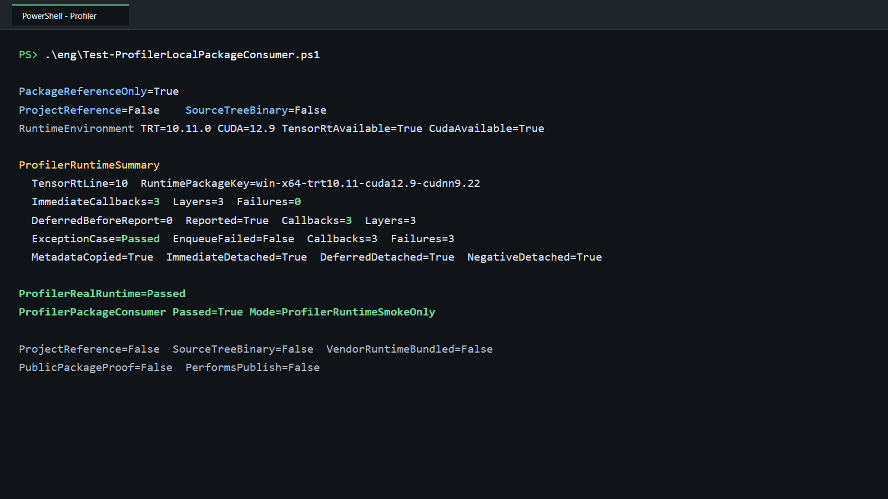

# 用本地 NuGet 包验证 TensorRT IProfiler：即时计时、延迟上报与异常隔离

> 项目：TensorRtSharp4.0
>
> 主要库：`JYPPX.TensorRtSharp`、`JYPPX.CudaSharp`、`jyppxtrtbridge`
>
> 示例：`samples/Profiler.PackageConsumer`
>
> 本机结果：TensorRT 10.11、CUDA 12.9、NVIDIA GeForce RTX 3060 Laptop GPU
>
> 证据边界：本文验证本地 managed 包与 bridge-only 包，不代表公开源下载、Release 或发布后验证。

## 1. 项目与功能背景

TensorRtSharp4.0 为 NVIDIA TensorRT 与 CUDA 提供 C# 接口。TensorRT public API 统一位于 `JYPPX.TensorRtSharp`，CUDA public API 位于 `JYPPX.CudaSharp`；`jyppxtrtbridge` 则把稳定 C ABI 映射到 NVIDIA C++ API。

TensorRT 的 `IProfiler::reportLayerTime` 会在推理执行后把 layer 名称和耗时交给用户。项目用 `TensorRtProfiler` 托管 owner 持有 native vtable、委托和 `GCHandle`，execution context 只借用 profiler 指针。用户通过两个接口控制上报时机：

- `EnqueueEmitsProfile=true`：enqueue 完成时立即上报 layer timing；
- `EnqueueEmitsProfile=false`：先收集计时数据，之后显式调用 `ReportToProfiler()` 上报。

旧 smoke 只验证了 `EmitDiagnostic` 合成调用和 attach/clear，没有执行真实 enqueue。本文从本地候选包开始，构建网络、分配 CUDA memory、执行推理，并验证即时、延迟和异常三条路径。layer 名称在 native 边界内复制为托管字符串，不向业务代码暴露借用指针。

## 2. 依赖与包职责

运行者需要自行安装 .NET 8 SDK、NVIDIA 驱动、CUDA Toolkit 和匹配的 TensorRT SDK。项目不打包 CUDA、cuDNN、TensorRT 或 NVRTC。

仓库外消费者只引用：

| 包 | 作用 | 内容边界 |
| --- | --- | --- |
| `JYPPX.TensorRT.CSharp.API` | `JYPPX.TensorRtSharp` 与 `JYPPX.CudaSharp` 托管 API | 不含 NVIDIA DLL |
| `...Runtime.win-x64.trt10.11.cuda12.9.cudnn9.22.Bridge` | 对应版本的 native bridge | 只含 `jyppxtrtbridge.dll` |

程序启动时使用 `TensorRtEnvironmentProbe.GetCurrent()` 检查 bridge build info、TensorRT 和 CUDA 可用状态。TensorRT 主版本与 `TensorRtApiLine` 不一致时立即失败。

## 3. 模型获取与转换说明

本案例验证 profiler callback，不依赖训练模型、ONNX 或输入图片：

- 模型名称：程序内构造的 `[1,1,32,32]` FP32 1x1 convolution network；
- 官方获取方式：不适用，没有模型下载地址；
- 权重许可证与 SHA256：不适用，卷积核常量由示例源码创建；
- ONNX 转换方式：不适用，直接调用 TensorRT network API；
- 外层模型目录：不读写 `<workspace-root>/models`；
- 图像识别结果：不适用，本例不执行视觉识别；
- 结果可视化：使用真实程序运行终端截图，不伪造识别图；
- plan：只在当前进程内反序列化并执行，不作为模型文件提交。

视觉模型文章仍必须独立写明官方权重来源、固定 revision、许可证、转换命令、ONNX SHA256、外层 `models` 暂存位置，并提供原图叠加结果和程序运行截图。

## 4. 生成本地候选包

构建匹配本机环境的 bridge：

```powershell
cmake --preset win-x64-trt10-cuda12-release
cmake --build --preset win-x64-trt10-cuda12-release --parallel
```

再生成 managed 与 bridge-only 本地候选包：

```powershell
powershell -NoProfile -ExecutionPolicy Bypass `
  -File .\eng\Invoke-LocalSplitRuntimePackage.ps1 `
  -SourceRuntimeKey win-x64-trt10.11-cuda12.9-cudnn9.22 `
  -Version 4.0.0 `
  -SkipConsumerValidation `
  -TensorRtRoot <TensorRT-root> `
  -CudaRoot <CUDA-root>
```

这些命令不创建 tag、GitHub Release，不推送 NuGet 或 GitHub Packages。内容审计要求候选包不含 NVIDIA vendor runtime。

## 5. 仓库外消费者如何隔离

`Test-ProfilerLocalPackageConsumer.ps1` 调用统一 callback-owner 验证器，在 Git 仓库外创建一次性项目：

1. 本地 `NuGet.config` 先 `<clear />`，只加入两个候选包目录；
2. 使用独立 package cache；
3. 项目只有两个 `PackageReference`，没有 `ProjectReference` 或 `HintPath`；
4. 移除 `JYPPX_NATIVE_BRIDGE_PATH` 与 `JYPPX_ENABLE_DEVELOPMENT_PROBING`；
5. 校验输出 bridge 和 nupkg native entry 的 SHA256 一致；
6. 要求包和消费端输出中的 vendor runtime binary 数量均为 0。

项目依赖结构如下：

```xml
<ItemGroup>
  <PackageReference Include="JYPPX.TensorRT.CSharp.API" Version="4.0.0" />
  <PackageReference
    Include="JYPPX.TensorRT.CSharp.API.Runtime.win-x64.trt10.11.cuda12.9.cudnn9.22.Bridge"
    Version="4.0.0" />
</ItemGroup>
```

因此结果不能由源码项目引用、开发探测或手工复制 bridge 解释。

## 6. 构建网络并绑定 CUDA memory

示例通过 `TensorRtBuilder` 创建 1x1 convolution，并序列化、反序列化为 engine。每个测试路径创建独立 execution context，然后绑定输入输出显存：

```csharp
using CudaMemory input = new(32 * 32 * sizeof(float));
using CudaMemory output = new(32 * 32 * sizeof(float));
using TensorRtExecutionContext context = engine.CreateExecutionContext();

context.SetTensorAddress("profiler_input", input);
context.SetTensorAddress("profiler_output", output);
```

真实 `EnqueueAsync` 和 `CudaStream.Synchronize` 是 profiler runtime proof 的必要条件。只创建 profiler 或调用 `EmitDiagnostic` 不算真实 layer timing。

## 7. 正例一：enqueue 即时上报

即时模式把 `EnqueueEmitsProfile` 设为 `true`：

```csharp
ProfileRecords records = new();
using TensorRtProfiler profiler = new(
    TensorRtApiLine.TensorRt10,
    (layerName, milliseconds) => records.Record(layerName, milliseconds));

context.SetProfiler(profiler);
context.EnqueueEmitsProfile = true;
context.EnqueueAsync(stream);
stream.Synchronize();
context.ClearProfiler();
```

`ProfileRecords` 使用 `Interlocked` 和 `ConcurrentDictionary`，要求 layer 名称非空、耗时有限且不小于 0。回调数量必须与 `CallbackInvocationCount` 一致，`CallbackFailureCount` 为 0，clear 后 context 与 owner 都解除借用。

## 8. 正例二与负例

延迟模式先关闭自动上报：

```csharp
context.EnqueueEmitsProfile = false;
context.EnqueueAsync(stream);
stream.Synchronize();

long beforeReport = profiler.CallbackInvocationCount;
bool reported = context.ReportToProfiler();
```

本机合同要求 `beforeReport == 0`、`reported == true`，随后收到真实 layer timing。这样同时证明 `EnqueueEmitsProfile` 开关和 `ReportToProfiler()` 不是只读占位接口。

负例的 handler 固定抛出受控异常：

```csharp
using TensorRtProfiler profiler = new(
    TensorRtApiLine.TensorRt10,
    static (_, _) => throw new InvalidOperationException("controlled profiler handler failure"));
```

`IProfiler::reportLayerTime` 返回 `void`，没有“拒绝本次推理”的布尔协议。bridge 会吞掉托管异常、增加 `CallbackFailureCount` 并保存 `LastCallbackException`，异常不会跨 native ABI。TensorRT 10.11 在本机继续完成 enqueue，所以验证器不要求 `EnqueueFailed=True`；它要求真实调用次数大于 0、failure 次数大于 0、异常类型正确且最终 detach。

## 9. 执行完整验证

在仓库根目录执行：

```powershell
powershell -NoProfile -ExecutionPolicy Bypass `
  -File .\eng\Test-ProfilerLocalPackageConsumer.ps1 `
  -TensorRtRoot <TensorRT-root> `
  -CudaRoot <CUDA-root>
```

脚本依次完成包内容审计、仓库外 restore、Release build、真实推理、marker 严格解析、bridge 哈希比对、vendor DLL 扫描、证据写入和一次性目录清理。`-KeepWorkspace` 只用于本地排查，保留目录仍位于 Git 仓库外。

## 10. 本机执行结果

```text
PackageReferenceOnly=True
ProjectReference=False
SourceTreeBinary=False
RuntimeEnvironment TRT=10.11.0 CUDA=12.9 TensorRtAvailable=True CudaAvailable=True
ProfilerRuntimeSummary
  TensorRtLine=10 RuntimePackageKey=win-x64-trt10.11-cuda12.9-cudnn9.22
  ImmediateCallbacks=3 Layers=3 Failures=0
  DeferredBeforeReport=0 Reported=True Callbacks=3 Layers=3
  ExceptionCase=Passed EnqueueFailed=False Callbacks=3 Failures=3
  MetadataCopied=True ImmediateDetached=True DeferredDetached=True NegativeDetached=True
ProfilerPackageConsumer Passed=True Mode=ProfilerRuntimeSmokeOnly
```



截图根据同一次真实 stdout 去路径化排版，没有修改结果值。完整 marker 位于 `samples/assets/profiler-local-package-consumer-tensorrt10.11.txt`，包、源码、stdout 和截图哈希记录在 `samples/assets/profiler-local-package-consumer-tensorrt10.11-evidence.json`。

## 11. 结果解读

| 检查项 | 本机结果 | 结论 |
| --- | ---: | --- |
| `PackageReferenceOnly` | True | 只消费本地候选包 |
| `ProjectReference` | False | 没有源码项目引用 |
| 即时回调 | 3 | enqueue 真实触发 `reportLayerTime` |
| 即时 layer | 3 | 收到三个不同的复制后 layer 名称 |
| 即时 failure | 0 | 正例 handler 无异常 |
| 延迟上报前 | 0 | 关闭自动上报后没有提前回调 |
| `ReportToProfiler` | True | TensorRT 接受显式上报 |
| 延迟回调 | 3 | 显式上报触发真实 timing |
| 异常回调 | 3 | 负例确实进入 handler |
| 异常 failure | 3 | 每次异常均被 ABI 边界记录 |
| `EnqueueFailed` | False | 符合 void profiler callback 的本机行为 |
| 三条路径 detach | True | 没有遗留托管借用 |
| Vendor binary count | 0 | NVIDIA runtime 由用户安装 |

layer 数量和耗时取决于 TensorRT 优化、GPU 与 tactic，不能把固定数字当成跨机器合同。稳定合同是即时/延迟两条路径都有真实回调、延迟上报前为 0、metadata 合法、正例无 failure、异常负例有 failure，并且最终 detach。

## 12. 常见问题

### 即时模式没有回调

确认在 enqueue 前设置了 profiler，`EnqueueEmitsProfile` 为 `true`，并等待 CUDA stream 同步。只 build engine 不会产生 inference layer timing。

### 延迟模式回调一直为 0

enqueue 与 stream 同步后还要调用 `ReportToProfiler()`。如果方法返回 `false`，先检查 profiler 是否仍绑定以及该 context 是否完成过推理。

### handler 异常但 enqueue 没抛错

这是本机 TensorRT 10.11 的已验证行为。`reportLayerTime` 返回 `void`；请检查 `CallbackFailureCount`、`LastCallbackException` 和 detach，不能只看 enqueue 是否抛异常。

### layer 名称偶发集合异常

不要在 callback 中直接修改普通 `List<T>` 或 `Dictionary<TKey,TValue>`。使用并发集合、`Interlocked` 或显式锁，并让 handler 尽快返回。

### 需要 TensorRT 8 或 11 结果

在相应主机安装匹配 SDK 与 bridge 后，用 `--tensor-rt-line 8` 或 `11` 重跑。本次结果只证明 TensorRT 10.11；本机缺少的环境能力应在发布说明中明确。

## 13. 证据与发布边界

本次结果证明：在当前 Windows、TensorRT 10.11 与 CUDA 12.9 主机上，仓库外两包消费者能够完成真实推理，并通过 public `TensorRtProfiler` 接收即时和延迟 layer timing；托管异常被隔离、计数且 owner 生命周期正确结束。

它不证明 TensorRT 8/11 或 Linux 已实机通过，也不证明包已经从公开源下载。项目仍处于开发收口阶段：不创建 tag、不创建 GitHub Release、不发布新包；NuGet 上已有包不在本文处理范围内。

Profiler owner 和合成诊断基础说明可继续阅读 [Managed Logger、Profiler 与 ProgressMonitor](managed-logger-profiler-progress-monitor.md)。
