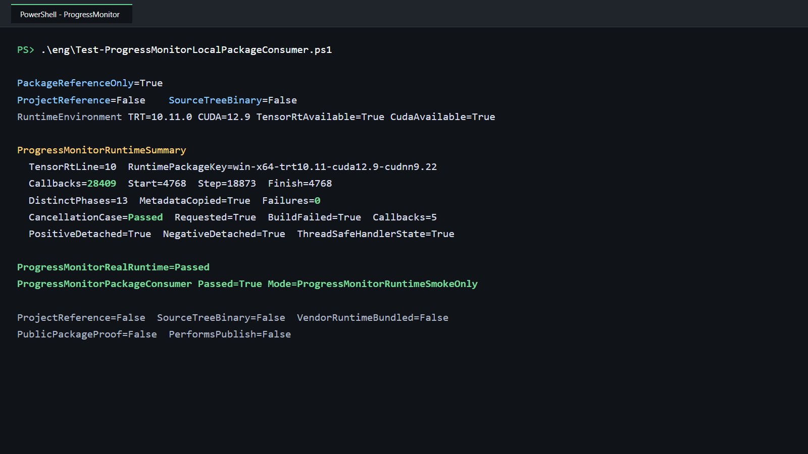

# 通过公开 NuGet 包使用 TensorRT IProgressMonitor：真实构建进度与安全取消

> 项目：TensorRtSharp4.0
>
> 主要库：`JYPPX.TensorRtSharp`、`jyppxtrtbridge`
>
> 示例：`tests/fixtures/package-consumers/ProgressMonitor.PackageConsumer`
>
> 本机结果：TensorRT 10.11、CUDA 12.9、NVIDIA GeForce RTX 3060 Laptop GPU
>
> 安装边界：用户流程使用公开 NuGet 包；文中的既有截图和 JSON 仍是发布前 local-feed 历史证据，不代表 post-publish 验证。

## 1. 项目与功能背景

TensorRtSharp4.0 为 NVIDIA TensorRT 与 CUDA 提供 C# 接口。公开 TensorRT API 统一位于顶层命名空间 `JYPPX.TensorRtSharp`；CUDA API 位于 `JYPPX.CudaSharp`。其中 managed 层负责类型安全、异常映射和对象生命周期，`jyppxtrtbridge` 负责把稳定 C ABI 转发到 NVIDIA C++ API。

TensorRT 10/11 的 `IProgressMonitor` 会在 engine 构建期间报告三种事件：

- `phaseStart`：某个构建阶段开始，并携带父阶段和总步数；
- `stepComplete`：某一步完成，返回 `false` 可以请求取消构建；
- `phaseFinish`：某个构建阶段结束。

这类回调的难点不在于“能否调用一个委托”，而在于 native vtable、托管委托、`GCHandle` 和 builder config 借用关系必须同时存活。TensorRT 还可能从多个内部线程报告进度，所以用户 handler 也必须使用线程安全状态。

本文从公开 NuGet 包开始，完整验证仓库外消费者能否接收真实构建回调、复制阶段元数据、主动取消构建，并在正负例后安全解绑。它不使用合成的 `EmitDiagnostic` 代替 TensorRT 真实调用。

## 2. 依赖与包职责

运行者需要自行安装：

- .NET 8 SDK；
- NVIDIA 驱动；
- CUDA Toolkit；
- 与 bridge 版本匹配的 TensorRT SDK。

项目不打包 CUDA、cuDNN、TensorRT 或 NVRTC。仓库外消费者需要两个公开包：

| 包 | 作用 | 内容边界 |
| --- | --- | --- |
| `JYPPX.TensorRT.CSharp.API` | 提供 `JYPPX.TensorRtSharp` 与 `JYPPX.CudaSharp` 托管接口 | 不含 NVIDIA DLL |
| `...Runtime.win-x64.trt10.11.cuda12.9.cudnn9.22.Bridge` | 提供匹配版本的 `jyppxtrtbridge.dll` | 只含 bridge，不含 vendor runtime |

程序首先调用 `TensorRtEnvironmentProbe.GetCurrent()`，要求 bridge 报告的 TensorRT 主版本和请求的 `TensorRtApiLine` 一致。版本不匹配时立即失败，避免跨 ABI 继续执行。

## 3. 模型获取与转换说明

本案例验证构建期 callback ABI 与生命周期，不依赖训练权重、ONNX 文件或输入图片：

- 模型名称：程序内构造的 `[1,1,32,32]` FP32 输入和 1x1 convolution network；
- 官方获取方式：不适用，没有模型下载地址；
- 权重许可证与 SHA256：不适用，卷积核常量由示例代码创建；
- ONNX 转换方式：不适用，直接调用 TensorRT network API；
- 外层模型目录：不读写 `<workspace-root>/models`；
- 图像识别结果：不适用，本例不是视觉识别案例；
- 结果可视化：提供真实程序运行终端截图，不伪造识别叠加图；
- ONNX 与 plan：不生成 ONNX，序列化 plan 只在当前进程内用于验证非空构建结果。

分类、检测、实例分割、语义分割、姿态和 OBB 案例仍必须在各自文章中写清模型来源、固定 revision、许可证、转换命令、ONNX 哈希和外层 `models` 暂存位置，并把识别结果绘制到原图。这个 callback 案例不能替代那些要求。

## 4. 安装公开包

在仓库外创建项目，并从公开 NuGet 源引用 managed 包和匹配本机矩阵的 bridge-only 包：

~~~powershell
dotnet new console --framework net8.0
dotnet add package JYPPX.TensorRT.CSharp.API --version "4.0.0-*"
dotnet add package JYPPX.TensorRT.CSharp.API.Runtime.win-x64.trt10.11.cuda12.9.cudnn9.22.Bridge --version "4.0.0-*"
~~~

`4.0.0-*` 只跟随当前 4.0.0 预览线，避免 NuGet 选择 API 不兼容的历史 `4.0.6170`。Bridge 包 ID 必须按目标机器环境替换，并且只包含项目自有 bridge。

### 发布前 local-feed 证据复核

先按当前 CUDA/TensorRT 组合构建 native bridge：

```powershell
cmake --preset win-x64-trt10-cuda12-release
cmake --build --preset win-x64-trt10-cuda12-release --parallel
```

然后生成 managed 与 bridge-only 候选包：

```powershell
powershell -NoProfile -ExecutionPolicy Bypass `
  -File .\eng\Invoke-LocalSplitRuntimePackage.ps1 `
  -SourceRuntimeKey win-x64-trt10.11-cuda12.9-cudnn9.22 `
  -Version 4.0.0 `
  -SkipConsumerValidation `
  -TensorRtRoot <TensorRT-root> `
  -CudaRoot <CUDA-root>
```

这些命令只生成本地候选文件，不创建 tag、GitHub Release，也不推送 NuGet 或 GitHub Packages。包内容审计会拒绝 `nvinfer`、`nvonnxparser`、`cudnn`、`cudart` 和 `nvrtc` 等 vendor binary。

## 5. 仓库外消费者如何隔离

`Test-ProgressMonitorLocalPackageConsumer.ps1` 复用统一 callback-owner 验证器，在 Git 仓库之外创建一次性消费项目。验证过程要求：

1. `NuGet.config` 使用 `<clear />`，只加入 managed 与 bridge 两个本地源；
2. restore 使用独立 package cache；
3. 项目中恰好有两个 `PackageReference`，没有 `ProjectReference` 或 `HintPath`；
4. 移除 `JYPPX_NATIVE_BRIDGE_PATH`；
5. 移除 `JYPPX_ENABLE_DEVELOPMENT_PROBING`；
6. 比对消费端 bridge 与 nupkg entry 的 SHA256；
7. 扫描包和输出目录，要求 NVIDIA vendor runtime binary 数量均为 0。

项目模板的依赖结构只有：

```xml
<ItemGroup>
  <PackageReference Include="JYPPX.TensorRT.CSharp.API" Version="4.0.0" />
  <PackageReference
    Include="JYPPX.TensorRT.CSharp.API.Runtime.win-x64.trt10.11.cuda12.9.cudnn9.22.Bridge"
    Version="4.0.0" />
</ItemGroup>
```

因此成功结果不能由源码项目引用、开发期 bridge 探测或手工复制 DLL 解释。

## 6. 构造真实 TensorRT 网络

示例直接使用 public API 创建一个小型卷积网络：

```csharp
TensorRtNetworkDefinition network =
    builder.CreateNetwork(TensorRtNetworkDefinitionCreationFlags.ExplicitBatch);
using TensorRtTensor input = network.AddInput(
    "progress_input",
    TensorRtDataType.Float,
    new TensorRtDims(new[] { 1, 1, 32, 32 }));

TensorRtWeights kernel = TensorRtWeights.FromSingleArray(new[] { 1.0f });
TensorRtWeights bias = TensorRtWeights.FromSingleArray(new[] { 0.0f });
using TensorRtLayer convolution = network.AddConvolution(
    input,
    1,
    new TensorRtDims(new[] { 1, 1 }),
    kernel,
    bias);
using TensorRtTensor output = convolution.GetOutput(0);
network.MarkOutput(output);
```

卷积层会让 builder 进入真实优化和 tactic 选择流程，从而产生实际进度事件。正例还要求 `BuildSerializedNetwork` 返回非空 plan，不能只安装 monitor 后立即 clear。

## 7. 正例：线程安全地接收构建进度

handler 使用 `Interlocked` 维护计数，并用 `ConcurrentDictionary<string, byte>` 保存已经复制到托管内存的阶段名称：

```csharp
EventCounters events = new();
using TensorRtProgressMonitor monitor = new(
    TensorRtApiLine.TensorRt10,
    progressEvent =>
    {
        events.Record(progressEvent);
        return true;
    });

config.SetProgressMonitor(monitor);
using TensorRtHostMemory plan = builder.BuildSerializedNetwork(network, config);
config.ClearProgressMonitor();
```

验证器要求 `config.HasProgressMonitor` 与 `monitor.IsAttached` 在构建前后均为 `true`，clear 后均为 `false`。三类事件计数都必须大于 0，阶段名称不能为空，`CallbackFailureCount` 必须为 0。

bridge 内的 `ManagedProgressMonitor` 也把跨线程读写的 `last_callback_failed_` 保存为 `std::atomic<bool>`。这不替代用户 handler 的线程安全责任，但消除了 bridge 自身在并发回调时的数据竞争。

## 8. 负例：从 StepComplete 主动取消

负例不是抛出托管异常，而是在第一个 `StepComplete` 返回 `false`：

```csharp
int cancellationRequested = 0;
using TensorRtProgressMonitor monitor = new(
    TensorRtApiLine.TensorRt10,
    progressEvent =>
    {
        if (progressEvent.Kind == TensorRtProgressMonitorEventKind.StepComplete)
        {
            Interlocked.Exchange(ref cancellationRequested, 1);
            return false;
        }

        return true;
    });
```

TensorRT 10.11 在本机按合同终止构建，托管调用收到 `TensorRtException`。这次取消是 handler 的正常返回值，所以 `CallbackFailureCount` 必须保持 0；如果把它计为托管异常，或者 build 继续成功，验证器都会失败。最后仍必须执行 `ClearProgressMonitor()` 并确认 owner 与 config 都已解绑。

## 9. 执行完整验证

在仓库根目录执行：

```powershell
powershell -NoProfile -ExecutionPolicy Bypass `
  -File .\eng\Test-ProgressMonitorLocalPackageConsumer.ps1 `
  -TensorRtRoot <TensorRT-root> `
  -CudaRoot <CUDA-root>
```

脚本依次执行包内容审计、仓库外 restore、Release build、真实 TensorRT 正例、主动取消负例、marker 严格解析、bridge 哈希比对、vendor DLL 扫描、证据写入和一次性工作目录清理。现场排查时可以增加 `-KeepWorkspace`，保留位置仍在 Git 仓库之外。

## 10. 本机执行结果

```text
PackageReferenceOnly=True
ProjectReference=False
SourceTreeBinary=False
RuntimeEnvironment TRT=10.11.0 CUDA=12.9 TensorRtAvailable=True CudaAvailable=True
ProgressMonitorRuntimeSummary
  TensorRtLine=10 RuntimePackageKey=win-x64-trt10.11-cuda12.9-cudnn9.22
  Callbacks=28409 Start=4768 Step=18873 Finish=4768
  DistinctPhases=13 MetadataCopied=True Failures=0
  CancellationCase=Passed Requested=True BuildFailed=True Callbacks=5
  PositiveDetached=True NegativeDetached=True ThreadSafeHandlerState=True
ProgressMonitorPackageConsumer Passed=True Mode=ProgressMonitorRuntimeSmokeOnly
```



截图根据同一次真实 package consumer stdout 做去路径化排版，未改变任何结果值。完整 machine marker 保存在 `samples/assets/progress-monitor-local-package-consumer-tensorrt10.11.txt`，包哈希、源码哈希、截图哈希和证据边界记录在 `samples/assets/progress-monitor-local-package-consumer-tensorrt10.11-evidence.json`。

## 11. 结果解读

| 检查项 | 本机结果 | 结论 |
| --- | ---: | --- |
| `PackageReferenceOnly` | True | 只通过本地 NuGet 候选包引用接口 |
| `ProjectReference` | False | 没有源码项目引用 |
| `InvocationCount` | 28,409 | TensorRT 在真实构建中进入 native vtable |
| `PhaseStartCount` | 4,768 | 收到阶段开始事件 |
| `StepCompleteCount` | 18,873 | 收到可取消的步骤事件 |
| `PhaseFinishCount` | 4,768 | 正例阶段完整结束 |
| `DistinctPhaseCount` | 13 | 阶段名称已复制并可在回调后读取 |
| `FailureCount` | 0 | 正例没有托管回调异常 |
| 取消负例回调 | 5 | 在真实构建早期进入 `stepComplete` |
| 取消负例 build | Failed | 返回 `false` 成功终止构建 |
| 取消负例 failure | 0 | 正常取消没有伪装成托管异常 |
| 正负例 detach | True | builder config 不再借用 monitor |
| Vendor binary count | 0 | CUDA/TensorRT 由用户安装提供 |

回调数量与具体 GPU、TensorRT build、tactic cache 和 builder 配置有关，不能把 `28,409` 当成跨机器固定值。可移植合同是三类正例计数均大于 0、元数据有效、异常计数为 0、取消负例确实终止构建且最终解绑。

## 12. 常见问题

### 没有收到回调

确认 monitor 在调用 `BuildSerializedNetwork` 之前已经通过 `SetProgressMonitor` 绑定，并且没有提前 clear 或 dispose。过于简单且被完全消除的网络可能产生不同数量的阶段；本例使用 1x1 convolution 保证进入真实优化流程。

### handler 偶发出现集合异常

TensorRT 可能并发报告进度。不要在 handler 中直接写普通 `List<T>`、`Dictionary<TKey,TValue>` 或无锁共享变量；使用 `Interlocked`、并发集合或自己的锁，并避免耗时阻塞。

### 返回 false 后 FailureCount 仍为 0

这是正确结果。`false` 是 `stepComplete` 定义的取消协议，不是托管异常。应同时检查 cancellation flag、build failure 和 detach 状态。

### 找不到 TensorRT 或 CUDA DLL

确认传入的 SDK 根目录有效，并让 TensorRT `lib` 与 CUDA `bin` 对当前进程可见。不要把 NVIDIA DLL 复制到项目或 NuGet 包中。

### 需要 TensorRT 11 结果

在安装 TensorRT 11 的主机上选择匹配 bridge 和 `--tensor-rt-line 11` 重新执行。本次 TensorRT 10.11 结果不能外推为 TensorRT 11 实机证明；缺少对应本机环境时，应在发布说明中明确这一点。

## 13. 证据与发布边界

本次结果证明：在当前 Windows、TensorRT 10.11 与 CUDA 12.9 主机上，本地 managed 包和重新编译的 bridge-only 包可被仓库外项目独立消费；公开 `TensorRtProgressMonitor` API 能完成真实构建回调、复制元数据、并发安全计数、主动取消和 owner/config 解绑。

它不证明 TensorRT 8/11 已在本机运行，不证明 Linux 路线，也不证明包已从 NuGet 或 GitHub Packages 下载。当前项目仍处于开发收口阶段：不创建 tag、不创建 GitHub Release、不发布新包；NuGet 上已有包不在本文处理范围内。

接口的基础 owner、诊断回调和 metadata 说明可继续阅读 [Managed Logger、Profiler 与 ProgressMonitor](managed-logger-profiler-progress-monitor.md)。
