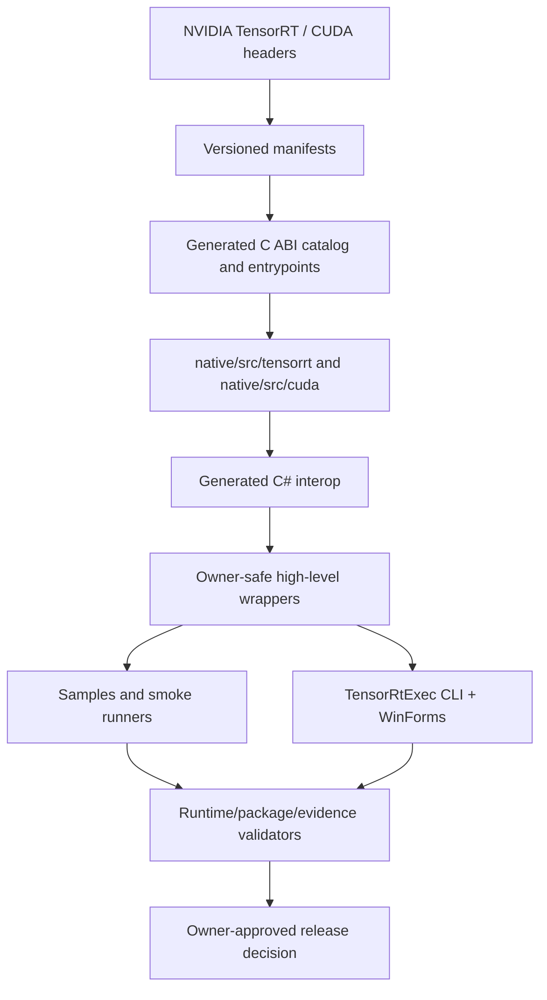
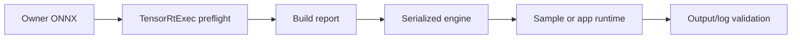

# TensorRtSharp4.0：项目能力、工程完成度与发布边界

## 项目定位

TensorRtSharp4.0 是面向 .NET 的 TensorRT/CUDA 工程化封装。

它不是简单把 NVIDIA C++ 头文件翻译成 P/Invoke，也不是只提供一组能编译的 native exports。项目在 C ABI bridge、generated interop、owner-safe C# wrapper、samples/applications、runtime packages 和 release evidence 之间建立可追踪链路，让用户既能调用能力，也能知道某条能力在哪个版本可用、由谁拥有、如何验证、哪里仍然 deferred。

本文面向项目首页、公众号、博客和技术评审。它会介绍当前已经具备的能力，也会直接给出不能宣传为“全部完成”的部分。

## 适用读者

- 想在 C# 中部署 TensorRT engine 的 .NET 开发者。
- 需要 CUDA memory/stream/event 和 TensorRT builder/runtime 的工程团队。
- 正在比较 Python/C++/C# 推理栈的技术负责人。
- 需要审计 ABI、ownership、跨版本兼容和包发布证据的维护者。

## 项目解决的核心问题

原生推理库接入 .NET 时，难点通常不在“能否写出 DllImport”，而在：

1. C++ ABI 不稳定，exception 不能跨语言边界。
2. TensorRT 8/10/11 API 会增加、移除或改变生命周期。
3. CUDA/TensorRT 对象可能是 owned、borrowed、callback-owned 或 device pointer。
4. 大型 runtime 依赖不适合和小型 managed API 一起走同一分发路线。
5. build 成功、sample 成功、package consumer 成功和公开渠道成功是不同证明。
6. callback、allocator、plugin lifecycle 一旦 ownership 设计错误，后果比“暂时 deferred”更严重。

TensorRtSharp4.0 的工程策略是把这些问题显式建模，而不是隐藏在 `IntPtr` 后面。

## 总体架构



### 第一层：Versioned Manifests

```text
native/manifests/tensorrt/v8
native/manifests/tensorrt/v10
native/manifests/tensorrt/v11
native/manifests/cuda
```

manifest 描述 entrypoint、version guard、参数和 deferred history。

旧 deferred manifest 不会为了制造漂亮覆盖率而删除；真实安全实现通过 alias 归并为 `implemented-with-deferred-history`。

### 第二层：Native C ABI Bridge

```text
native/src/tensorrt
native/src/cuda
native/generated/bridge_api_catalog.g.h
native/generated/bridge_entrypoints.g.h
```

bridge 的关键规则：

- 导出稳定 C ABI；
- 不让 C++ exception 跨 ABI；
- Windows SEH 不泄漏到托管端；
- string 走 caller buffer；
- array 走 count/copy；
- native owner 与 borrowed view 分离；
- version-specific implementation 独立 guarded。

### 第三层：Generated Interop

```text
GeneratedApiCatalog.g.cs
GeneratedEntryPointNames.g.cs
GeneratedNativeMethods.g.cs
GeneratedTensorRtManifestNativeMethods.g.cs
GeneratedCudaManifestNativeMethods.g.cs
```

生成器减少手写签名漂移，并通过重复生成幂等测试守住 manifest/native/managed 一致性。

generated interop != high-level wrapper。

### 第四层：High-Level Wrapper

主要项目：

```text
src/JYPPX.TensorRtSharp
src/JYPPX.CudaSharp
src/JYPPX.TensorRtSharp.Tools
src/JYPPX.Shared
```

高层 API 的职责是把 native handle 转换为用户能理解的对象、snapshot、result 和生命周期。

public surface 不应让普通用户直接处理无语义 `IntPtr`、device pointer 或 borrowed plugin object。

## 当前接口覆盖事实

权威摘要：

```text
artifacts/interface-coverage/interface-coverage-summary.md
```

当前扫描记录：

- manifest API count：4009；
- TensorRT 8.6：880 scanned / 880 matched / 880 source present / 760 implemented / 120 deferred-only；
- TensorRT 10.11：879 scanned / 879 matched / 879 source present / 761 implemented / 118 deferred-only；
- TensorRT 11.0：901 scanned / 901 matched / 901 source present / 814 implemented / 87 deferred-only；
- CUDA 11.6 到 13.2 均有独立扫描与 version line 数据。

这些数字说明 header、manifest 和 native source checklist 已高度闭合。

manifest/source 匹配不等于 100% 可用。

真实用户可用性还要看：

- active implementation 不是 deferred-only；
- C ABI ownership 正确；
- generated interop 路由存在；
- high-level wrapper 可用；
- smoke 或 package consumer 覆盖真实路径；
- 对应 version guard 与 vendor symbol 成立。

## 为什么仍然保留 Deferred

deferred 不是“忘记实现”，而是明确的安全状态。

### 低风险候选

优先提升：

- scalar getter/setter；
- copied string/array diagnostics；
- pointer-free snapshot；
- deployment-critical query；
- owner 明确的 create/destroy pair。

### 高风险边界

继续谨慎：

- callback trampoline；
- GPU/output allocator；
- calibrator lifetime；
- plugin create/register/deregister/load library；
- borrowed tensor/plugin pointer；
- external resource import；
- IPC open/close ownership；
- runtime deserialization ownership；
- user-object destructor callback。

这些区域在 real callback runtime proof、owner ledger、nothrow bridge 和 clean package consumer 证据完整前，保持 deferred 比暴露不安全 API 更专业。

## TensorRT 高层对象

项目中的典型高层入口包括：

- `TensorRtBuilder`；
- `TensorRtBuilderConfig`；
- `TensorRtRuntime`；
- `TensorRtEngine`；
- `TensorRtExecutionContext`；
- `TensorRtOnnxParser`；
- `TensorRtOnnxParserRefitter`；
- `TensorRtPluginRegistryInventory`；
- `TensorRtEngineInspector`。

这些 wrapper 负责：

- deterministic dispose；
- copied diagnostics；
- shape/profile/engine metadata；
- tensor binding readiness；
- version-aware unsupported diagnostics；
- 不把 borrowed native storage 暴露给调用者。

## CUDA 高层能力

典型入口包括：

- `CudaDevice`；
- device/pinned/managed/pitched memory owner；
- stream/event；
- peer access 与 device snapshot；
- graph memory allocation/free 的 pointer-free owner route；
- texture/surface descriptor；
- primary execution context owner；
- IPC token export；
- `CudaEnvironmentProbe`。

CUDA 能力同样遵循版本线、owner 和 runtime proof 分层。

## OnnxToEngine

```text
samples/OnnxToEngine
```

它是教学型 round-trip sample，展示：

- ONNX parser；
- engine build/serialize；
- deserialize；
- identity/known output 对照；
- trtexec-like option grammar；
- build-only 与 runtime boundary。

它不承担完整 CLI/GUI 工具职责。

## TensorRtExec

```text
applications/TensorRtExec
```

TensorRtExec 提供：

- console CLI；
- WinForms GUI；
- shared normalized command；
- ONNX/build/load-engine；
- shape profile、precision、workspace；
- timing cache、plugin path、refit；
- report JSON/Markdown；
- bounded runtime/benchmark diagnostics；
- machine-readable capability output。

离线查看能力：

```powershell
dotnet run --project .\applications\TensorRtExec -- --help-json
```

当前 GUI/CLI field map 有 90 个字段；release candidate gap list 有 20 个 item。

字段状态会区分：

- applied build/runtime behavior；
- version-guarded behavior；
- parse-only；
- report-only；
- preflight-only；
- blocked owner lifecycle。

`TrtexecAlignmentStatus=parse-only` 和 `OptionImplementationStatus` 必须被保留，不能把参数可解析写成官方 trtexec 行为已完整复刻。

## YoloVision

```text
samples/YoloVision
```

YoloVision 统一：

- family：YOLOv5、YOLOv6、YOLOv7、YOLOv8、YOLOv9、YOLOv10、YOLOv11、YOLOv26、YOLOX、custom；
- task：det、cls、seg、obb、pose、sem；
- preprocessing、layout、objectness、NMS；
- segmentation prototype、pose keypoint、OBB angle、semantic map；
- output JSON/SVG 和 owner evidence。

离线 capability matrix 有 60 行：55 supported、5 个 YOLOX non-detection unsupported design boundaries。

现实模型规划矩阵是 10 个 family entries，不能和 60 行托管配置能力混为一谈。

当前 `demo-model-inventory.json` 的 10 个 demo model entries 均绑定唯一且存在的 runtime evidence；每项证明仍只覆盖指定模型、任务、输入和运行环境，不能替代 package consumer 或公开发布证明。

## Samples 与 Smoke

用户入口包括：

- `samples/MultiStream`；
- `samples/DynamicShape`；
- `samples/InferenceBindings`；
- `samples/OnnxToEngine`；
- `samples/Classification`；
- `samples/YoloVision`。

smoke runners 覆盖 builder/runtime/network layers、plugin inventory、parser/refitter diagnostics、CUDA memory/stream/graph、managed callback safe controls 等路径。

smoke 的 evidence kind 必须按真实范围解释；synthetic identity、compile surface 或 skipped run 不能自动成为 real-model/package proof。

## 双通道 Bridge-only 策略

TensorRT、CUDA、cuDNN 体积大且有独立安装与许可边界，因此项目不再分发 NVIDIA 原厂 runtime。GitHub Release 与 NuGet-compatible source 是两种获取通道，不是两种包内容。

两种通道都只发布：

- managed core API；
- 与 runtime key 匹配的项目自有 C++ bridge；
- targets/buildTransitive/native copy metadata。

用户自行安装匹配的 TensorRT、CUDA、cuDNN 与可选 NVRTC。GitHub Release 通道额外记录不可变 URL、GitHub digest 与同提交 provenance；NuGet 通道记录公开 source 与实际解析版本。两者都需要仓库外 clean consumer 和 post-publish 验证。

历史 vendor-bearing package identity 只保留用于清理与审计，不能重新 pack 或发布。

## Runtime Package Matrix

权威文件：

```text
artifacts/release-candidate/runtime-package-matrix.json
artifacts/release-candidate/runtime-package-matrix.md
```

当前有 18 个 runtime keys：

- 6 个 Windows 组合；
- 12 个 Linux Ubuntu 20.04/22.04/24.04 规划组合；
- Windows TRT8/TRT10/TRT11 多个历史 local validation；
- `win-x64-trt11.0-cuda13.2-cudnn9.22` 当前是 `blocked-by-cuda-driver`；
- Linux rows 当前保持 dry-run-only / not-proved。

matrix 描述构建与验证状态，不等于公开渠道包已发布。

## 用户路径一：从 ONNX 到 Engine



```powershell
$caseRoot = "E:\TensorRtSharpAssets"
@("engines", "reports") | ForEach-Object {
  New-Item -ItemType Directory -Force -Path (Join-Path $caseRoot $_) | Out-Null
}

dotnet run --project .\applications\TensorRtExec -- `
  --onnx "$caseRoot\models\model.onnx" `
  --saveEngine "$caseRoot\engines\model.plan" `
  --minShapes input:1x3x224x224 `
  --optShapes input:1x3x224x224 `
  --maxShapes input:4x3x224x224 `
  --buildOnly `
  --exportReport "$caseRoot\reports\build-report.json"
```

build-only 不证明业务输出正确。

## 用户路径二：视觉模型

1. 从明确来源获取模型、labels、图片。
2. 记录 license、tag/commit、export、SHA256。
3. 用 TensorRtExec 构建并保存 build report。
4. 用 YoloVision preflight 检查 profile/metadata。
5. 真实运行并生成 JSON/SVG/log。
6. 用 sample evidence validator 晋级指定 source-tree case。

详见：

- `yolovision-all-task-overview.md`；
- `yolovision-detection-tutorial.md`；
- `external-model-evidence-case-study.md`。

## 用户路径三：Package Consumer

package-consumer-runtime 必须来自仓库外 clean consumer：

- no ProjectReference；
- no repository-local package source；
- real managed/runtime nupkg identity/SHA256；
- restore/build/native asset listing；
- dependency probe 与 runtime smoke；
- compatible host metadata；
- real logs and matching SHA256。

严格 validator：

```powershell
pwsh -NoProfile -ExecutionPolicy Bypass -File .\eng\Test-ExternalRuntimeProofRecord.ps1 `
  -InputPath .\artifacts\final-release\external-runtime-proof-record.json `
  -RequireExistingLog `
  -FailOnNotProof
```

local feed、ProjectReference 或 direct `.nupkg` install 都不是公开 package source proof。

## 技术文章矩阵

项目不仅维护 API reference，也维护面向用户的完整文章。

当前机器可读 publication matrix 有 103 篇文章记录；`article-roadmap-30plus.json` 有 44 个精选 roadmap entries，最低目标 30。

数量不是完成标准。每篇文章还要绑定：

- 用户问题；
- 真实代码路径；
- 可执行命令；
- machine-readable artifact；
- validator；
- proof boundary；
- 截图/图示计划；
- owner action。

## 当前发布状态

权威冻结文件：

```text
artifacts/final-release/release-candidate-final-evidence-freeze.json
```

当前状态：

- `freezeState=blocked-real-proof-required`；
- blocker count：5；
- `performsPublish=false`；
- `canPublishPublicly=false`；
- `canCloseReleaseIssue=false`；
- `requiresHumanOwner=true`；
- `requiresCompatibleHost=true`。

### 五个真实 Blocker

| Blocker ID | 所需真实输入 | 不能替代 |
| --- | --- | --- |
| `owner-authorization` | channel、package identity、rollback、redistribution decision | template/checklist |
| package-consumer-runtime | clean consumer、nupkg hash、runtime logs、compatible host | local feed/ProjectReference |
| real-model-runtime | Classification/YoloVision assets、license、logs、hash | build-only/sidecar |
| `linux-runner-proof` | 真实 Linux x64 compatible host run | Windows handoff/dry-run |
| `post-publish-verification` | public URL、downloaded hash、clean consumer logs | draft/local package |

当前冻结是用户明确要求和真实证据状态共同决定的，不是技术文章可以解除的。

## Evidence Ladder

| Level | 例子 | 是否 runtime proof |
| --- | --- | --- |
| source-quality | build、unit tests、ABI parity | 否 |
| precheck | path/config/schema validator | 否 |
| build-only | engine/report | 否 |
| synthetic runtime | identity/synthetic tensor | 仅限定路径 |
| source-tree real model | YOLOX/YOLOv10 case | 指定 sample case |
| package-consumer-runtime | clean consumer real smoke | 指定 package/host |
| post-publish | real channel download and smoke | 指定 published artifacts |
| release close | all lanes + owner decision | 最终状态 |

## 为什么 `blocked-by-cuda-driver` 不是失败也不是通过

它说明程序已经到达 runtime compatibility 边界，但当前 driver/runtime 不能完成执行。

正确处理方式：

1. 保存原始错误、host metadata 和 package key。
2. 保持 proof flag false。
3. 在兼容 CUDA/TensorRT 主机重跑。
4. 用 strict validator 重新计算日志/hash。

不能把 controlled skip 写成 passed，也不能把它误诊为 API 缺失。

## 诚实发布规则

### 可以宣传

- 明确版本下已经实现并有 wrapper/test 的 API；
- 已验证的 source-tree sample case；
- CLI/GUI 已实现字段及其状态；
- 当前 package matrix 与安装路线；
- deferred 安全原则和 owner workflow。

### 不能宣传

- “TensorRT/CUDA 100% 全部可用”；
- “所有 YOLO family/task 都有真实模型证明”；
- “参数可解析等于官方 trtexec 行为完整”；
- “local feed 等于 NuGet/GitHub 已发布”；
- “source-tree run 等于 package consumer”；
- “download URL 存在等于 post-publish smoke 通过”；
- “dashboard/checklist 能关闭 release issue”。

## 以下材料不得替代发布证明

- manifest/source match；
- generated interop；
- build-only、parse-only、preflight-only；
- sidecar-only；
- command preview 或 GUI screenshot；
- support matrix；
- local feed、ProjectReference、direct `.nupkg`；
- dependency-probe-only；
- `Skipped=True`；
- `blocked-by-cuda-driver`；
- template、draft、runbook、dashboard；
- managed-readiness 或 schema-only。

## 从源码构建

基础命令：

```powershell
dotnet build .\TensorRtSharp.sln -c Debug --no-restore
```

native bridge 需要根据 TensorRT/CUDA 版本选择 CMake preset，并配置 vendor roots。

完整教程：

- `tensorrtsharp-source-build-cpp-guide.md`；
- `source-build-cmake-windows-guide.md`；
- `publishing/native-bridge-build-public-article.md`。

源码 build 成功是 source-quality evidence，不是 package/post-publish proof。

## 常见问题

### 这个项目是不是已经支持 TensorRT 8/10/11

版本 manifests、native source、interop 和大量高层路径已经覆盖三条线；具体 API 仍要看 implementation status、version guard 和 deferred boundary。

### 为什么不直接暴露所有指针

因为 borrowed/device/plugin pointer 的生命周期不能由普通 C# 调用者可靠推断。高层 API 优先返回 copied snapshot 或明确 owner。

### TensorRtExec 是否完全等于官方 trtexec

它覆盖了广泛的 trtexec-like build/report/runtime 表面，但 field map 会明确 applied、parse-only、report-only 和 blocked lifecycle，不会用一个“支持”词掩盖差异。

### YoloVision 是否真的支持所有任务

托管配置/decoder surface 覆盖六任务，但真实模型证据按 family/task/exporter 独立收集。YOLOX 非 detection 是明确 unsupported boundary。

### 可以只安装小 NuGet 包吗

可以。用户同时引用 managed 与匹配的 `.Bridge` 包，自行安装 NVIDIA runtime，并处理 native search path。

### 为什么现在不发布

当前还缺 owner authorization、clean package consumer、Linux runner、完整 real-model lanes 和 post-publish proof。发布动作也受用户的 GitHub Actions 配额冻结要求约束。

## 配图与宣传素材建议

1. 四层 architecture Mermaid 图。
2. TRT8/10/11 interface coverage 表。
3. TensorRtExec CLI 与 WinForms 同一 normalized command 截图。
4. YoloVision 六任务输出拼图。
5. GitHub Release / NuGet managed + bridge-only 双通道图。
6. 五级 proof ladder 与 release blocker dashboard。
7. source build、test、validator 的终端截图。

截图要附对应 artifact 路径，不能替代原始 JSON/log/hash。

## 面向用户的承诺

TensorRtSharp4.0 不通过删除 deferred 记录制造完成度，也不通过一条本地成功日志宣称所有版本和分发渠道都已验证。

项目的承诺是：

- 每个 uplift 都保留 version guard 与 deferred history；
- 每个 native entry 尽量有 owner-safe wrapper；
- 每个 sample 说明输入输出和 proof boundary；
- 每个 package 状态区分 build、consumer、post-publish；
- 高风险 ownership 没有证据时保持 deferred；
- owner 能从机器可读 dashboard 看到真实剩余工作。

## 项目收尾清单

- [ ] interface coverage summary 与 vendor versions 已刷新。
- [ ] binding generation 连续执行幂等。
- [ ] native ABI declaration/export parity 通过。
- [ ] public wrapper 不泄露无语义 handle。
- [ ] TensorRtExec field map/gap list 与代码一致。
- [ ] YoloVision task/model/owner packs 对齐。
- [ ] full Debug build 0 warning / 0 error。
- [ ] relevant ProjectQuality tests 通过。
- [ ] stale release claims findingCount=0。
- [ ] runtime package matrix 与真实验证状态一致。
- [ ] owner authorization 有非模板输入。
- [ ] package-consumer-runtime 来自 clean compatible host。
- [ ] Linux runner proof 来自真实 Linux x64。
- [ ] real-model evidence 包含 license/hash/log/review。
- [ ] post-publish proof 来自真实渠道重新下载。
- [ ] owner final close decision 在所有 hard gates 之后。

## 结语

TensorRtSharp4.0 已经从“C# 能否调用 TensorRT/CUDA”推进到“如何让 ABI、ownership、工具、样例、包和证据共同可维护”。

当前 source-quality、跨版本 surface、工具和案例体系已经具备相当规模；剩余工作主要集中在必须由兼容主机、真实模型和发布 owner 提供的外部 proof。保持这条边界，项目才能在最终发布时给用户一个经得起复查的答案，而不是一个只在维护者机器上成立的完成声明。
