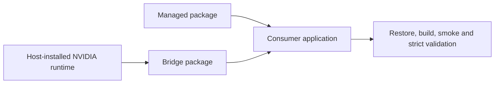

# TensorRtSharp4.0 NuGet 安装与 Bridge 包选择

TensorRtSharp4.0 当前只发布两类 NuGet 包：C# 托管接口包和项目自行编译的 `.Bridge` 包。CUDA、cuDNN、TensorRT 以及可选 NVRTC 都由用户在目标机器上安装，不进入 nupkg，也不再作为 GitHub Release 依赖包发布。

本文面向第一次集成项目的 C# 开发者，说明如何选择 runtime key、安装 managed + bridge-only 包、核对主机依赖，以及哪些结果不能被当成 package-consumer-runtime proof。

## 适合谁阅读

- 准备在自己的 .NET 项目中引用 TensorRtSharp4.0 的用户。
- 需要区分 managed package、bridge package 和主机 NVIDIA 依赖的维护者。
- 遇到 DLL 加载、CUDA runtime、TensorRT 版本组合问题的工程师。
- 需要采集公开包 consumer 证据但不能越界宣称 release proof 的 owner。

## 当前发布模型

安装和运行分成四层：

1. managed API：`JYPPX.TensorRT.CSharp.API`，包含 C# wrapper、interop、工具类和高层对象。
2. native bridge：runtime key 对应的 `.Bridge` 包，只包含 `jyppxtrtbridge.dll` 或 `libjyppxtrtbridge.so`。
3. host dependencies：CUDA、cuDNN、TensorRT、parser、plugin、builder resource 和可选 NVRTC，全部来自用户自己的 NVIDIA 安装。
4. release proof：仓库外 clean consumer 使用公开来源执行 restore、build、runtime smoke 后留下的不可变记录。



旧的 vendor runtime、collection、meta 和 builder-resource 包身份只为远端清理与历史审计保留。它们不允许重新 pack、push 或上传。权威策略是 `pack/external-vendor-runtime-policy.json`。

## 两条公开获取通道

项目支持两条 managed + bridge-only 获取通道：

- GitHub Release verified staging：下载 managed 与 `.Bridge` nupkg，校验 GitHub immutable URL、digest、SHA256、大小、nuspec identity 和 repository commit，再放入临时 NuGet-compatible staging source。
- NuGet-compatible source：从 owner 明确批准的公开 NuGet 源按 package id/version 还原 managed 与 `.Bridge` 包。

两条通道的包都必须来自同一个源码提交。跨提交配对只能用于诊断，不能晋级为 package-consumer-runtime、public package 或 post-publish proof。仓库中的对应入口是：

```text
eng/Invoke-PublicReleaseBridgePackageConsumer.ps1
eng/Test-PublicReleaseBridgePackageConsumer.ps1
eng/Export-PackageConsumerDualRouteProofPlan.ps1
eng/Test-ExternalVendorRuntimePackagePolicy.ps1
```

`-AllowCrossCommitPair` 是 diagnostic-only 开关；即使显式启用，结果也必须保持不可晋级。

## Runtime key 与 Bridge identity

runtime key 仍用于确定 bridge 的编译 ABI 和主机依赖组合。典型 key 包括：

```text
win-x64-trt8.6-cuda11.8-cudnn8.9
win-x64-trt10.11-cuda12.9-cudnn9.22
win-x64-trt11.0-cuda13.2-cudnn9.22
linux-x64-trt10.11-cuda12.9-cudnn9.22
```

对应的 bridge package identity 形如：

```text
JYPPX.TensorRT.CSharp.API.Runtime.win-x64.trt10.11.cuda12.9.cudnn9.22.Bridge
```

选择顺序固定为：

1. 确认 RID，例如 `win-x64` 或明确 Linux 发行版的 key。
2. 确认 TensorRT line，例如 TRT8、TRT10 或 TRT11。
3. 确认 CUDA line 和 cuDNN major。
4. 确认目标 GPU driver 支持该 CUDA runtime。
5. 确认 bridge 是由同一 runtime key 对应的 headers、import libraries 和 CMake preset 编译。

仓库中的兼容矩阵入口包括：

```text
pack/runtime/runtime-packages.manifest.json
pack/runtime-split/split-runtime-packages.manifest.json
pack/runtime/runtime-package-smoke-command-template.json
pack/runtime/README.md
pack/runtime-split/README.md
docs/articles/zh-cn/tensorrtsharp-nuget-runtime-package-guide.md
docs/articles/zh-cn/runtime-package-selection.md
docs/articles/zh-cn/runtime-package-matrix-reading-guide.md
docs/articles/zh-cn/runtime-package-installation-deep-dive.md
docs/articles/zh-cn/package-consumer-runtime-proof-clean-consumer-guide.md
```

manifest 中的 `key`、`packageId`、`rid`、`platform`、`tensorRtLine`、`tensorRtVersion`、`cudaLine`、`cudaVersion`、`cudnnMajor`、`cudnnVersion`、`distributionTier`、`validationState`、`buildPreset` 和 `bridgeFile` 用于兼容性、构建和诊断。`tensorRtFiles`、`cudaFiles`、`cudnnFiles` 现在表示主机依赖检查范围，不是 nupkg 内容清单。split manifest 的当前可发布角色只有 `role = bridge`。

## 安装主机依赖

安装 NuGet 包前，先按 NVIDIA 官方方式安装与 runtime key 匹配的组件：

- TensorRT runtime，以及应用实际使用的 parser、plugin 或 builder resource。
- CUDA Toolkit/runtime。
- 目标 TensorRT line 所需的 cuDNN。
- 使用 CUDA Runtime Compilation 时所需的 NVRTC 和匹配的 NVRTC builtins。
- Windows 上的 Visual C++ runtime，或 Linux 上对应的系统 loader 依赖。

不要从本仓库的历史 Release 中恢复 vendor DLL，也不要把 GitHub Package 中遗留的 vendor package 当作当前安装源。主机依赖路径应通过操作系统 loader、容器镜像或部署系统配置。

## 基础安装命令

在业务项目中只引用 managed 包和一个匹配的 `.Bridge` 包：

```powershell
dotnet new console -n TensorRtSharpApp
cd TensorRtSharpApp
dotnet add package JYPPX.TensorRT.CSharp.API --version <public-version> --source <approved-source>
dotnet add package JYPPX.TensorRT.CSharp.API.Runtime.win-x64.trt10.11.cuda12.9.cudnn9.22.Bridge --version <public-version> --source <approved-source>
dotnet restore --force-evaluate
dotnet build -c Release
```

实际 package id、version、source URL 和 runtime key 必须以 owner 发布清单为准。本文不会执行发布，也不会把 Actions dry-run 当作公开包。

## PackageReference-only consumer

clean consumer 的项目文件只保留两个 PackageReference，不应出现仓库内 ProjectReference：

```xml
<Project Sdk="Microsoft.NET.Sdk">
  <PropertyGroup>
    <OutputType>Exe</OutputType>
    <TargetFramework>net8.0</TargetFramework>
    <RuntimeIdentifier>win-x64</RuntimeIdentifier>
    <PlatformTarget>x64</PlatformTarget>
  </PropertyGroup>
  <ItemGroup>
    <PackageReference Include="JYPPX.TensorRT.CSharp.API" Version="<public-version>" />
    <PackageReference Include="JYPPX.TensorRT.CSharp.API.Runtime.win-x64.trt10.11.cuda12.9.cudnn9.22.Bridge" Version="<public-version>" />
  </ItemGroup>
</Project>
```

restore 成功只说明包图可解析。它不证明 bridge 能加载主机 NVIDIA 依赖，也不证明 engine build、deserialize、enqueue 或输出校验成功。

## Package source 与缓存边界

先检查真实包源：

```powershell
dotnet nuget list source
dotnet nuget add source <public-or-owner-approved-source> --name TensorRtSharpPublic
dotnet nuget locals all --list
```

GitHub Release asset 不是 NuGet feed。使用 Release 通道时，必须先校验下载资产，再由受控脚本建立临时 staging source；不能把本地构建目录冒充公开包源。local folder source 不能出现在 clean consumer proof 的 package source 字段里。

如果 C 盘空间紧张，可以调整缓存：

```powershell
$env:NUGET_PACKAGES = "E:\\NuGetPackages"
dotnet restore --force-evaluate
```

这只是缓存位置调整，不改变 proof 语义。不要把 NVIDIA 安装文件、ONNX、engine 或 plan 放进临时目录后声称它们来自 NuGet 包。

## 安装后检查

先确认 managed 与 bridge 资产：

```powershell
dotnet --info
dotnet list package
Get-ChildItem .\bin\Release -Recurse -File |
  Where-Object Name -in 'JYPPX.TensorRtSharp.dll','JYPPX.CudaSharp.dll','jyppxtrtbridge.dll'
```

再检查主机安装的 vendor 依赖，而不是期待它们从 nupkg 复制出来：

```powershell
nvidia-smi
where.exe nvinfer_10.dll
where.exe nvonnxparser_10.dll
where.exe cudart64_12.dll
where.exe cudnn64_9.dll
dumpbin /dependents .\bin\Release\net8.0\win-x64\jyppxtrtbridge.dll
```

Linux 应记录 `ldconfig`/`ldd` 结果和实际 `.so` 路径。检查记录至少区分：

```text
ManagedPackagePresent=true/false
BridgePackagePresent=true/false
BridgeAssetPresent=true/false
VendorDependenciesSource=host-installed
InstalledVendorAssetListing=<path>
RuntimePackageKey=win-x64-trt10.11-cuda12.9-cudnn9.22
PackageReferenceOnly=true/false
UsesProjectReference=false
UsesLocalFeed=false
UsesDirectNupkg=false
DependencyProbeOnly=false
RuntimeSmokeAttempted=false
PackageConsumerRuntimeProof=false
```

## Clean consumer proof 的最低字段

package-consumer-runtime proof 必须在仓库外干净目录执行，并至少记录：

```text
public package source URL
managed package id/version
bridge package id/version/runtime key
managed nupkg SHA256
bridge nupkg SHA256
managed repository commit
bridge repository commit
packageSourceCommitAligned=true
clean consumer project path
restore log path + SHA256
build log path + SHA256
runtime JSON path + SHA256
stdout path + SHA256
stderr path + SHA256
installed vendor asset listing
dependency probe log
runtime smoke log
exitCode = 0
OS / architecture / GPU / driver
CUDA / TensorRT / cuDNN / NVRTC metadata
strict validator result
```

只有真实输入存在并通过以下 validator，结果才可能晋级：

```text
eng/Test-PublicReleaseBridgePackageConsumer.ps1
eng/Test-ExternalRuntimeProofRecord.ps1
eng/Test-PackageConsumerRuntimeProofRecord.ps1
eng/Test-PostPublishVerificationRecord.ps1
artifacts/final-release/package-consumer-runtime-proof-owner-input.template.json
artifacts/final-release/package-consumer-runtime-proof-record-validation.md
artifacts/final-release/post-publish-verification-record.json
```

模板、package id/version template、release issue close record template、post-publish verification input draft、占位值或只验证引用文件存在都不能授权发布。

## 不能作为 proof 的情况

以下内容可用于开发或排障，但不是 package-consumer-runtime proof：

- local feed package consumer。
- ProjectReference consumer。
- direct `.nupkg` install。
- GitHub Actions dry-run。
- owner execution package 或 input draft。
- package id/version template。
- build-only report。
- dependency-probe-only log。
- PackageReference-only 但没有 runtime smoke。
- bridge 加载成功但没有 TensorRT enqueue/output validation。
- blocked-by-cuda-driver。
- README、截图、GUI screenshot 或 command preview。

一句话边界：包可下载、hash 匹配、restore 成功、build 成功和 dependency probe 通过，都不能单独替代真实 runtime smoke 与 strict validator。

## 常见错误与处理

`DllNotFoundException` 需要先区分“bridge 不存在”和“bridge 找到但主机 vendor dependency 不存在”。前者检查 `.Bridge` 包、RID 和输出目录；后者检查系统安装、loader path 和版本组合。

`BadImageFormatException` 通常表示 x86/x64、Windows/Linux、TensorRT line 或 CUDA line 不匹配。确认项目为 x64，并重新 restore/build。

CUDA error 35 表示 driver/runtime 不兼容时，应换兼容主机或调整用户安装的 NVIDIA 版本，并保留 `blocked-by-cuda-driver`。不能删除 blocker 后把诊断写成通过。

TensorRT engine 反序列化失败可能来自 TensorRT 版本、plugin、lean runtime、version-compatible 或 engine 构建配置差异。不要把 runtime deserialization ownership、plugin lifecycle、allocator、callback、borrowed pointer 或 external resource 伪装成低风险安装问题。

## 配图建议

- managed package、Bridge 与用户自装 NVIDIA 依赖的关系图。
- GitHub Release verified staging 和 NuGet-compatible source 的双通道流程图。
- runtime key 选择流程：RID -> TensorRT line -> CUDA line -> cuDNN major -> driver compatibility。
- clean external consumer 的 restore/build/dependency probe/runtime smoke/strict validator 流程图。

## 下一步

安装完成后先运行 bridge dependency diagnostics，再在兼容 GPU 主机执行真实 TensorRT smoke。发布 owner 还要补齐 package-consumer-runtime、Linux runner proof、real-model-runtime、owner authorization 和 post-publish verification；这些 proof 通过前，不能发布，不能关闭 release issue，也不能把安装教程当成发布完成声明。
