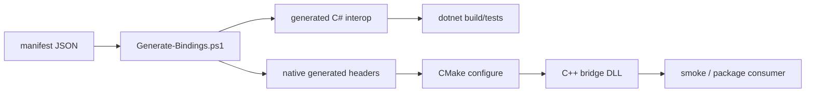

# Windows 源码构建：从 CMake 到可验证产物

TensorRtSharp4.0 的源码构建不是为了替代 NuGet 安装，而是给维护者一条能复核 native bridge、runtime 资产和 ABI guard 的本地路径。它适合在发布前确认 Windows 环境、CUDA/TensorRT SDK、CMake preset 和生成绑定是否仍然匹配。

## 适合

- 需要在 Windows 上从源码构建 TensorRtSharp4.0 的维护者。
- 需要排查 CUDA、TensorRT、cuDNN DLL 搜索路径的人。
- 需要理解 build-only、readonly diagnostics 与 package-consumer-runtime proof 边界的发布负责人。

## 构建路线图

源码构建要同时照顾 C#、C++ bridge 和 NVIDIA runtime 三层：



这张图里最容易出错的是 `F -> G`：CMake 能否找到正确的 CUDA、TensorRT、cuDNN include/lib/DLL，决定了 native bridge 是否真的匹配目标 line。仅仅 managed build 通过，不代表 native runtime 可以被用户加载。

## 环境清单

建议先把以下信息写入构建日志，后续排障会轻松很多：

| 组件 | 检查命令 | 说明 |
| --- | --- | --- |
| .NET SDK | `dotnet --info` | 应与仓库 `global.json` / net8.0 target 兼容。 |
| CMake | `cmake --version` | 仓库 preset 依赖 CMake 3.27+。 |
| Visual Studio C++ | `where cl` | 需要 VS 2022 Desktop development with C++ workload。 |
| CUDA Toolkit | `where nvcc`、`nvcc --version`、`$env:CUDA_PATH` | 多 CUDA 并存时，确认与 preset 中 CUDA 版本一致。 |
| TensorRT | 检查 `include\NvInfer.h`、`lib\nvinfer*.lib` | TensorRT 8/10/11 line 不能混用头文件和库。 |
| cuDNN | 检查 include/lib/bin | CUDA 11.8 常见 cuDNN 8.x；CUDA 12.9/13.2 常见 cuDNN 9.x。 |

推荐把大型 SDK 和构建产物放在 E 盘或其他数据盘，避免把 TensorRT、CUDA、cuDNN、ONNX、engine 或 nupkg 下载到 C 盘用户目录。NuGet 小包路线下用户本机必须自行安装这些 NVIDIA runtime；GitHub full runtime 包路线则可以携带匹配依赖，但仍需要许可和公开包 proof。

## 推荐目录

CUDA 通常保持官方安装路径：

```text
C:\Program Files\NVIDIA GPU Computing Toolkit\CUDA\v11.8
C:\Program Files\NVIDIA GPU Computing Toolkit\CUDA\v12.9
C:\Program Files\NVIDIA GPU Computing Toolkit\CUDA\v13.2
```

TensorRT/cuDNN 可以放到稳定工具目录，例如：

```text
E:\NVIDIA\TensorRT-8.6
E:\NVIDIA\TensorRT-10.11
E:\NVIDIA\TensorRT-11.x
E:\NVIDIA\cuDNN-8.9
E:\NVIDIA\cuDNN-9.x
```

实际探测规则以 `CMakePresets.json`、`native/CMakeLists.txt` 和相关 CMake/PowerShell 脚本为准。不要用临时复制 DLL 到系统目录的方式掩盖路径问题；那会让本机能跑、外部 consumer 失败。

## 准备环境

推荐先确认这些命令输出，并把 stdout/stderr 写入日志：

```powershell
dotnet --info
cmake --version
ninja --version
where cl
where nvcc
$env:CUDA_PATH
```

## 生成绑定与托管构建

在源码目录运行生成和质量检查：

```powershell
Set-Location E:\GitSpace\TensorRT-CSharp-API-4.0\TensorRtSharp4.0
dotnet restore .\TensorRtSharp.sln
pwsh -NoProfile -ExecutionPolicy Bypass -File .\eng\Generate-Bindings.ps1
pwsh -NoProfile -ExecutionPolicy Bypass -File .\eng\Test-BindingGeneratorOutputs.ps1
pwsh -NoProfile -ExecutionPolicy Bypass -File .\eng\Export-InterfaceCoverageMatrix.ps1
dotnet build .\TensorRtSharp.sln -c Debug --no-restore
```

如果你只改了文章或高层 C# wrapper，可能不需要生成绑定；但只要改了 `native/manifests`、generated interop、native source 或 entrypoint 名称，就必须跑这组命令。否则最容易出现 native bridge 已经变了、C# P/Invoke 仍停在旧签名的问题。

## CMake preset 选择

Windows release candidate 常用 preset 覆盖 6 个组合：

| Preset | TensorRT | CUDA | cuDNN | 适合场景 |
| --- | --- | --- | --- | --- |
| `win-x64-trt8-cuda11-release` | TRT8 | 11.8 | 8.x | 旧版 TRT8 / CUDA11 用户。 |
| `win-x64-trt8-cuda12-release` | TRT8 | 12.1 | 8.x | TRT8 + CUDA12 兼容验证。 |
| `win-x64-trt10-cuda11-release` | TRT10 | 11.8 | 8.x | CUDA11 企业环境迁移。 |
| `win-x64-trt10-cuda12-release` | TRT10 | 12.9 | 9.x | 当前常用 TRT10 路线。 |
| `win-x64-trt11-cuda12-release` | TRT11 | 12.9 | 9.x | TRT11 + CUDA12 兼容探测。 |
| `win-x64-trt11-cuda13-release` | TRT11 | 13.2 | 9.x | CUDA13-only API 与最新 runtime guard。 |

native 构建使用发布候选 preset，例如：

```powershell
cmake --preset win-x64-trt11-cuda13-release
cmake --build --preset win-x64-trt11-cuda13-release --parallel
```

这里的关键路径是 `native/CMakeLists.txt`、`native/src/tensorrt/v11/api.cpp`、`native/generated/bridge_api_catalog.g.h` 和 `native/generated/bridge_entrypoints.g.h`。如果这些文件发生变化，必须重新跑绑定生成和 quality gate。

## 构建后验证

完成 native bridge 构建后，不建议马上打包。先做三类检查：

```powershell
pwsh -NoProfile -ExecutionPolicy Bypass -File .\eng\Export-InterfaceCoverageMatrix.ps1
dotnet test .\tests\JYPPX.ProjectQuality.Tests\JYPPX.ProjectQuality.Tests.csproj -c Debug --no-build --filter "FullyQualifiedName~TensorRtNativeAbiSurfaceParityTests|FullyQualifiedName~PublicApiHandleExposureAuditTests"
dotnet run --project .\smoke\CallbackAllocatorSafeControlsSmokeRunner\CallbackAllocatorSafeControlsSmokeRunner.csproj -c Debug
```

如果只想验证某个改动批次，可以跑对应 targeted filter；但最终发布前仍要按 release gate 组合收敛。smoke 输出中出现 `Skipped=True` 时，要记录原因。它可以帮助定位依赖缺失，但不能写成 runtime proof。

## 常见排障

### CMake 找不到 CUDA

先检查：

```powershell
where nvcc
nvcc --version
$env:CUDA_PATH
```

多版本 CUDA 并存时，`CUDA_PATH`、Visual Studio integration 和 CMake preset 目标版本要一致。CUDA 13 preset 需要 CUDA 13.2 headers/libs；如果机器只有 CUDA 12.x，CUDA 13-only wrapper 应保持 version guard，不应强行编译通过。

### TensorRT 头文件和 lib 不匹配

典型症状是 C++ 能 include 但 link 失败，或 ABI parity 出现 missing。检查：

```text
include\NvInfer.h
include\NvOnnxParser.h
lib\nvinfer*.lib
lib\nvonnxparser*.lib
```

TRT8、TRT10、TRT11 的 headers 不能混用。特别是 TRT8 legacy parser、TRT10/11 stream/runtime API、TRT11 debug listener 等接口差异很大，必须依赖 version guard。

### DLL 加载失败

NuGet 小包路线不会内置 CUDA/TensorRT/cuDNN 大依赖，因此用户机器必须能通过 PATH 或应用目录找到这些 DLL。排查顺序：

```powershell
dumpbin /dependents path\to\jyppxtrtbridge.dll
$env:PATH -split ';'
```

先修复缺失依赖，再运行 dependency probe 或 smoke。不要把系统目录污染成“本机刚好能跑”的状态。

### CUDA error 35

CUDA error 35 通常是 driver/runtime 不兼容。先看 `nvidia-smi` 的 driver，再看 `nvcc --version` 和实际加载的 runtime package key。CUDA 13 smoke 需要足够新的 NVIDIA driver；driver 不满足时只能记录 dependency/runtime blocker，不能声明通过。

## GitHub full runtime 包与 NuGet 小包

源码构建教程要服务两条发布路线：

| 路线 | 包含内容 | 用户要求 | 优点 | 边界 |
| --- | --- | --- | --- | --- |
| GitHub full runtime 包 | managed API、C++ bridge、TensorRT/CUDA/cuDNN runtime assets | 选择匹配 runtime key | 开箱更近，适合完整示例 | 包体大，授权和 post-publish proof 更重 |
| NuGet 小包 | C# core API 与 C++ bridge 小包 | 用户自装 CUDA/TensorRT/cuDNN | 公开 .NET 生态更友好 | DLL 搜索路径和版本匹配由用户环境承担 |

无论哪条路线，源码构建成功都只是 build-only 路径健康。它不能证明用户能从公开包安装，也不能证明 post-publish 包可用，更不能替代 package-consumer-runtime proof。

| 产物 | 能说明什么 | 不能说明什么 |
|---|---|---|
| CMake configure/build 通过 | native toolchain 可构建 | 公开包可被外部 consumer 使用 |
| `dotnet build` 通过 | 托管项目可编译 | TensorRT runtime 已真实执行 |
| binding generator 通过 | manifest/source/generated 对齐 | deferred API 已有高层 wrapper |
| interface coverage matrix | 接口覆盖现状可审计 | release close 可通过 |

真正推动发布的仍然是 `artifacts/final-release/owner-external-proof-execution-result.input.json` 中 owner 回填的真实外部执行结果，并通过严格 validator。

更完整的源码编译长文见 `docs/articles/zh-cn/source-build-cmake-windows-guide.md` 和
`docs/articles/zh-cn/tensorrtsharp-source-build-cpp-guide.md`。本篇 public article 是面向公众号/博客读者的入口，深文负责展开每个命令和排障细节。

## 配图建议

- 一张 Windows 终端截图，展示 CMake preset、`dotnet build` 和生成绑定连续通过。
- 一张目录截图，标出 `native/generated`、`artifacts/interface-coverage` 和 `artifacts/final-release` 的关系。
- 一张 evidence ladder 图，把 build-only 放在 proof 之前的低层级。
- 一张 GitHub full runtime 包与 NuGet 小包的依赖对照图。

## 下一步

源码构建通过后，不要直接宣称发布完成。继续执行 clean external consumer，收集 stdout/stderr/merged transcript、SHA256、host metadata 和 owner review，再交给 `eng/Import-OwnerExternalProofExecutionResult.ps1` 与严格验证脚本处理。
