# 真实 Callback Trampoline 门禁复审

> 状态：设计门禁复审
> readiness marker：`real-callback-trampoline-gate`
> evidence kind：design-gate-only
> 当前结论：`dry-run`、`copied-state` 与 `internal-runtime-prototype` 证据不能升级为 `real-callback-runtime`，也不能作为真实 TensorRT callback 已启用的证据。

## 目标

本门禁用于判断 allocator/debug-listener 真实 callback trampoline 是否可以进入最小原型阶段。它不是实现完成声明，也不允许删除 deferred rows。

当前已有证据分为三类：

| 证据 | 类型 | 结论 |
| --- | --- | --- |
| `allocator-owner-dry-run-diagnostics` | `dry-run` | 只证明 managed owner skeleton 可以调用用户 handler。 |
| `allocator-owner-native-dry-run-controls` | `dry-run` | 只证明短生命周期 native diagnostic owner 可以创建、复制状态并释放。 |
| `allocator-owner-state-ledger-dry-run-controls` | `dry-run` | 只证明 synthetic state/ledger intent 可以复制成 C# 结果。 |
| `allocator-owner-internal-runtime-prototype` | `internal-runtime-prototype` | 只证明内部 sync allocator prototype 的 GCHandle/delegate keep-alive、in-flight counter、release hook 和 exception-to-status 诊断；`RealCallbackRuntime=False`，not proof。 |
| `allocator-owner-ledger-safety-gate` | `ledger-safety-gate` | 只证明 internal prototype 与 native ledger dry-run copied diagnostics 已可汇总，`CanAttemptRuntimeProof=False`、`RuntimeProofBlocked=True`；not proof。 |
| `output-allocator-internal-runtime-gate` | `internal-runtime-gate` | 只证明 OutputAllocator notify/reallocate 形状、shape/size/alignment copied diagnostics、in-flight counter 与 release hook；`RealCallbackRuntime=False`，not proof。 |
| `output-allocator-callback-owner-design` | `owner-design-gate` | 只证明 public OutputAllocator owner wrapper、native ledger intent、`RuntimeEvidenceKind=not-present`、`RealCallbackRuntime=False` 和 `IsRealCallbackRuntimeProof=False`；not proof。 |
| `output-allocator-attach-detach-design-gate` | `design-gate` | 只证明 OutputAllocator attach/detach 生命周期门禁已结构化，`AttachControlAvailable=False`、`DetachClearControlAvailable=True`、`LineSpecificAttachDetachReady=False`；not proof。 |
| `output-buffer-ownership-safety-gate` | `design-gate` | 只证明 OutputAllocator output-buffer ownership、`currentMemory` reuse 和 borrowed/owned device pointer 规则已拆成 pointer-free safety gate；`OutputBufferOwnershipRuntimeReady=False`、`ReallocateOutputRuntimeReady=False`；not proof。 |
| `output-allocator-runtime-proof-precheck` | `runtime-gate-precheck` | 只证明 OutputAllocator owner snapshot 和 attach/detach gate 已能产出 `CanAttemptRuntimeProof=False`、`RuntimeProofBlocked=True` 与 attach/native-vtable/runtime-ledger/stream/output-buffer/smoke 阻塞项；not proof。 |
| `debug-listener-callback-owner-design` | `owner-design-gate` | 只证明 public DebugListener owner wrapper、debug tensor metadata copy-out、`RuntimeEvidenceKind=not-present`、`RealCallbackRuntime=False` 和 `IsRealCallbackRuntimeProof=False`；not proof。 |
| `debug-listener-attach-detach-design-gate` | `design-gate` | 只证明 DebugListener attach/detach 生命周期门禁已结构化，`AttachControlAvailable=False`、`DetachClearControlAvailable=True`、`LineSpecificAttachDetachReady=False`；not proof。 |
| `debug-listener-borrowed-tensor-safety-gate` | `design-gate` | 只证明 DebugListener borrowed tensor/data lifetime 边界已拆成 pointer-free safety gate；`BorrowedDebugTensorPointerEscapeBlocked=True`、`BorrowedDebugTensorDataLifetimeReady=False`、`ProcessDebugTensorRuntimeReady=False`；not proof。 |
| `debug-listener-attach-vtable-safety-gate` | `design-gate` | 只证明 DebugListener non-null attach、stable native owner address、no-throw vtable 和 exception-to-status blocker 已结构化；`AttachControlAvailable=False`、`ExceptionToStatusMappingReady=False`；not proof。 |
| `debug-listener-native-attach-nothrow-preflight` | `preflight` | 只证明 DebugListener native attach/no-throw 前置条件已被 pointer-free preflight 结构化；`NativeAttachEntryLocated=False`、`NoThrowVTableDesignReady=False`、`CanImplementNativeAttach=False`；not proof。 |
| `debug-listener-native-owner-address-design-gate` | `design-gate` | 只证明 DebugListener native owner address 生命周期 blocker 已结构化；`StableNativeOwnerAddressDesignReady=False`、`NativeOwnerNonCopyableReady=False`、`NoThrowNativeDestructorReady=False`、`NativeOwnerLifecycleReady=False`；not proof。 |
| `debug-listener-native-nothrow-vtable-design-gate` | `design-gate` | 只证明 DebugListener native no-throw vtable blocker 已结构化；`NativeVTableTrampolineReady=False`、`CallbackExceptionCaptureReady=False`、`CallbackStatusMappingReady=False`、`CallbackInFlightAccountingReady=False`；not proof。 |
| `debug-listener-native-attach-entry-design-gate` | `design-gate` | 只证明 DebugListener native attach entry blocker 已结构化；`NativeAttachEntryLocated=False`、`LineSpecificAttachEntryDesignReady=False`、`AttachEntryNoThrowReady=False`、`AttachEntryVersionGuardReady=False`、`AttachEntryOwnershipReady=False`、`DetachBeforeReleaseReady=False`；not proof。 |
| `debug-listener-native-detach-before-release-design-gate` | `design-gate` | 只证明 DebugListener native detach-before-release blocker 已结构化；`ReleaseHookOrderingReady=False`、`DisposeIdempotencyReady=False`、`InFlightDrainBeforeReleaseReady=False`、`CallbackStateUnpinAfterDetachReady=False`、`DelegateUnpinAfterDetachReady=False`；not proof。 |
| `debug-listener-native-owner-lifecycle-dry-run` | `dry-run` | 只证明 DebugListener native owner lifecycle dry-run copied evidence 已结构化；`DryRunReady=True`、`StableNativeOwnerIdentityReady=False`、`NativeOwnerNonCopyableReady=False`、`NoThrowNativeDestructorReady=False`、`NativeOwnerLifecycleReady=False`；not proof。 |
| `debug-listener-native-attach-entry-runtime-scaffold` | `scaffold` | 只证明 DebugListener native attach entry runtime scaffold copied evidence 已结构化；`RuntimeScaffoldReady=True`、`NativeAttachEntryLocated=False`、`StableNativeOwnerIdentityReady=False`、`NativeOwnerNonCopyableReady=False`；not proof。 |
| `debug-listener-native-attach-entry-minimal-safety` | `minimal-safety` | 只证明 DebugListener native attach entry 的 source-visible no-throw shape 已定位；`NativeAttachEntryLocated=True` 只在该结果内生效，`SetDebugListenerNonNullEnabled=False`、`NativeAttachWouldBeBlocked=True`；not proof。 |
| `debug-listener-native-owner-stable-identity` | `identity-gate` | 只证明 DebugListener owner id / diagnostic identity 已 pointer-free 结构化；`StableNativeOwnerIdentityReady=True`、`NativeAttachEntryLocated=False`、`NativeOwnerNonCopyableReady=False`；not proof。 |
| `debug-listener-native-owner-noncopyable-storage` | `storage-gate` | 只证明 DebugListener native owner storage scaffold 已删除 copy/move 且 public surface 不暴露 owner pointer；`NativeOwnerNonCopyableReady=True` 不代表 native owner lifecycle ready；not proof。 |
| `debug-listener-native-nothrow-destructor` | `destructor-gate` | 只证明 DebugListener native owner destructor 的 source-visible no-throw scaffold 已就绪；`NoThrowNativeDestructorReady=True` 不代表 native owner lifecycle ready；not proof。 |
| `debug-listener-native-owner-lifecycle-gate` | `lifecycle-gate` | 只证明 DebugListener native owner detach/release/drain/unpin scaffold 已 source-visible；`LifecycleGateReady=True` 不代表 `NativeOwnerLifecycleReady=True`；not proof。 |
| `debug-listener-native-attach-bridge-shape-gate` | `attach-bridge-shape-gate` | 只证明 DebugListener attach bridge 参数形状、version guard、no-throw boundary 和 ownership diagnostics 已 source-visible；`SetDebugListenerNonNullEnabled=False`、`NativeAttachEntryLocated=False`；not proof。 |
| `debug-listener-exception-status-mapping-gate` | `exception-status-gate` | 只证明 DebugListener callback exception capture、status mapping、diagnostic copy 和 exception escape blocking 已 source-visible；not proof。 |
| `debug-listener-inflight-accounting-gate` | `inflight-accounting-gate` | 只证明 DebugListener enter/leave accounting、release-after-drain 和 unpin-after-drain gate 已 source-visible；not proof。 |
| `debug-listener-native-nothrow-vtable-scaffold-gate` | `vtable-scaffold-gate` | 只证明 DebugListener native no-throw vtable scaffold、callback stub、exception/status mapping 和 in-flight accounting 已 source-visible；`NativeVTableDesignReady=False`；not proof。 |
| `debug-listener-nothrow-vtable-callback-stub` | `callback-stub-gate` | 只证明 DebugListener callback stub 的 metadata copy、no-throw completion、exception/status mapping 和 in-flight pairing 已 source-visible；`NativeVTableInstalled=False`、`SetDebugListenerNonNullEnabled=False`；not proof。 |
| `debug-listener-borrowed-debug-tensor-metadata-runtime-gate` | `borrowed-debug-tensor-metadata-gate` | 只证明 borrowed debug tensor name/type/location/shape/flags copied metadata 和 pointer/data-pointer escape blocker 已 source-visible；`BorrowedDebugTensorLifetimeReady=False`、`ProcessDebugTensorRuntimeReady=False`；not proof。 |
| `debug-listener-native-vtable-install-preflight` | `native-vtable-install-preflight` | 只证明 native vtable install 的 owner/attach/scaffold/metadata 前置诊断已 source-visible；`NativeVTableInstalled=False`、`CanInstallNativeVTable=False`；not proof。 |
| `debug-listener-native-owner-vtable-install-experiment` | `native-owner-vtable-install-experiment` | 只证明 native owner/vtable install 的 disabled-by-default experiment shape、rollback、detach-before-release 和 status mapping 诊断已 source-visible；`NativeVTableInstallAttempted=False`、`NativeVTableInstalled=False`；not proof。 |
| `debug-listener-runtime-proof-precheck` | `runtime-gate-precheck` | 只证明 DebugListener owner snapshot 和 attach/detach gate 已能产出 `CanAttemptRuntimeProof=False`、`RuntimeProofBlocked=True` 与 attach/vtable/lifetime/smoke 阻塞项；not proof。 |
| `debug-listener-real-non-null-attach-runtime-smoke` | `runtime-smoke-skipped` / `runtime-smoke-blocked` / `runtime-smoke-attempted` / `runtime-smoke-failed` | 只证明 opt-in runtime smoke report scaffold 已能复制 attach/vtable/callback/full-package-consumer 前置条件；`AttachSucceeded=False`、`NativeVTableInstalled=False`、`ProcessDebugTensorInvoked=False`、`CanPromoteRealCallbackRuntime=False`；not proof。 |
| `debug-listener-process-debug-tensor-callback-trampoline` | `callback-trampoline-shape` | 只证明 processDebugTensor private/internal callback trampoline shape 已 source-visible，包含 no-throw entry、exception/status mapping、in-flight accounting、borrowed metadata copy 和 pointer-free report；`ProcessDebugTensorRuntimeReady=False`、`InvocationCount=0`；not proof。 |
| `debug-listener-real-callback-runtime-proof` | `runtime-smoke-skipped` / `real-callback-runtime-blocked` / `attempted-no-invocation` | 只证明最终 proof promotion gate 已 source-visible，包含 full package consumer、attach/detach/rollback、native vtable、`ProcessDebugTensorInvoked`、`InvocationCount>0`、metadata copy 和 pointer-free checks；当前 `CanPromoteRealCallbackRuntime=False`；not proof。 |
| `callback-interface-info-safe-controls` | `copied-state` | 只复制 borrowed callback interface metadata，不返回 borrowed pointer。 |
| `execution-context-callback-state-snapshot` | `copied-state` | 只复制 execution context callback presence/clear 状态。 |
| `real-callback-runtime` | 尚未具备 | 必须由真实 TensorRT build/enqueue 路径触发 callback 后才能声明。 |

## go/no-go checklist

| Gate | Go 条件 | No-go 条件 |
| --- | --- | --- |
| native owner 生命周期 | owner stable address、不可复制、no-throw 析构、显式 attach/detach/release hook 已审计。 | TensorRT 仍可能保存 callback pointer 时 owner 可释放。 |
| dispose 顺序 | managed `Dispose` 先 detach 或进入不可回调状态，再释放 native owner，最后释放 `GCHandle` 与 delegate。 | `Dispose` 先释放托管 state，或依赖 finalizer 回收已注册 callback。 |
| `GCHandle` 与 delegate pinning | callback state、delegate、release hook 的 pin/unpin 配对可审计且幂等。 | native owner 只保存临时 delegate 或未固定托管 state。 |
| `C ABI no-throw` | managed exception、C++ exception、Windows SEH 都映射为 `exception-to-status` 诊断。 | 任何异常可能跨 C ABI 或 TensorRT vtable 逃逸。 |
| device pointer ledger | allocation/free/deallocate/reallocate 有 `allocationId`、owner、size、alignment、stream、state、diagnostic。 | public C# 暴露 raw device pointer ownership 或无法检测跨 owner 释放。 |
| `stream/async` | async stream lifetime、释放时机、graph capture 约束已设计并有 smoke。 | 复用同步 allocator 模型处理 `IGpuAsyncAllocator::*`。 |
| package-consumer real runtime evidence | full package consumer smoke 触发真实 TensorRT callback，报告 `real-callback-runtime`、invocation count、release pairing 和 failure count。 | 只有 `dry-run`、`copied-state`、bridge-only wrapper surface 或 dependency probe。 |
| 跨版本 | TRT8、TRT10、TRT11 各自 manifest/header/source/interop/wrapper route 和 version guard 已同步。 | 一个 public wrapper 隐式吞掉 TRT8 `free` 与 TRT10/TRT11 `deallocate` 差异。 |
| public API | 只暴露 owner wrapper 和 copied diagnostics，不暴露 `IntPtr`/`nint` callback owner、tensor buffer 或 device pointer。 | public API 返回 borrowed pointer 或 ownership 不清的 native handle。 |

## native owner 生命周期

真实 callback trampoline 的 native owner 至少要满足以下生命周期：

```mermaid
flowchart LR
  A["Managed owner ctor"] --> B["Pin GCHandle and delegate pinning"]
  B --> C["Native owner create"]
  C --> D["Attach to TensorRT object"]
  D --> E["TensorRT invokes callback"]
  E --> F["Record status and ledger"]
  F --> G["Detach from TensorRT object"]
  G --> H["Native owner destroy"]
  H --> I["Release GCHandle and delegate"]
```

约束：

- native owner 不能复制，地址必须稳定。
- attach 后必须知道 TensorRT 对象归属：builder/runtime/context/config/engine inspector 等不能混用。
- release hook 必须可以重复调用且不抛异常。
- finalizer 只能做兜底诊断，不能作为正常 detach 机制。
- 每个 owner 必须记录 TensorRT line、callback kind、last status、last diagnostic、invocation count、failure count。

## dispose 顺序

最小可接受 dispose 顺序：

1. 标记 owner 正在关闭，阻止新的 managed callback 注册。
2. 对已 attach 的 TensorRT 对象执行 line-specific detach。
3. 确认没有 in-flight callback 或记录无法确认的 blocked diagnostic。
4. 销毁 native owner 或转入不可回调状态。
5. 释放 `GCHandle`、delegate pinning 和 managed callback state。

若无法证明第 2、3 步，`Dispose` 不能释放 TensorRT 仍可能回调的 state。这个条件对 `IOutputAllocator` 和 `IDebugListener` 尤其重要，因为它们绑定在 execution context 生命周期上。

## `GCHandle` 与 delegate pinning

托管层必须把 callback state 和 delegate 生命周期显式建模：

- `GCHandle` 只由 owner 持有，并由 release hook 释放。
- delegate pinning 必须覆盖 native owner 可能调用的完整窗口。
- handler exception 必须被捕获并写入 `LastCallbackException`、failure count 和 native diagnostic。
- release hook 不能再次调用用户 handler。
- package consumer 只能把这些作为 owner shape 证据，不能把它们当成 `real-callback-runtime`。

## `C ABI no-throw` 与 `exception-to-status`

所有 callback entry 必须遵守 `C ABI no-throw`：

- managed exception：捕获，写入 failure count、last diagnostic，并映射为 TensorRT callback 允许的失败值。
- C++ exception：捕获，映射为 `JYPPX_STATUS_RUNTIME_ERROR` 或更具体 status。
- Windows SEH：捕获 structured exception code，写入 diagnostic。
- OOM：不能跨 ABI 抛异常，必须通过 null/failure 语义和 ledger failed state 表达。
- unsupported line：返回 `JYPPX_STATUS_NOT_SUPPORTED`，并保留 TRT8/TRT10/TRT11 route 信息。

## device pointer ledger

真实 allocator callback 的返回值必须进入 device pointer ledger。最小字段：

| 字段 | 要求 |
| --- | --- |
| `allocationId` | owner 内单调递增，用于 release pairing。 |
| `ownerId` | 产生 allocation 的 owner，禁止跨 owner 释放。 |
| `pointerValue` | 只读诊断数值，不表示 public ownership。 |
| `size` / `alignment` | 来自 TensorRT callback 请求。 |
| `streamValue` | `stream/async` 场景的 borrowed stream 数值，仅诊断。 |
| `state` | allocated、released、failed、foreign、double-release 等。 |
| `diagnostic` | OOM、异常、非法释放、unsupported line 等。 |

在 ledger 可审计前，`IGpuAllocator::allocate/free/deallocate/reallocate` 和 `IGpuAsyncAllocator::*` 继续 deferred。

## `stream/async`

`IGpuAsyncAllocator::allocateAsync` 与 `IGpuAsyncAllocator::deallocateAsync` 不能复用同步 allocator 的成功标准。

必须先明确：

- stream handle 是 borrowed 参数，public C# 不能接管。
- allocation 与 deallocation 的顺序是否依赖 stream 同步。
- graph capture 或异步 enqueue 中是否允许 managed callback 阻塞。
- full runtime smoke 如何验证 async allocation/release pairing。

在这些问题完成前，`stream/async` 门禁为 no-go。

## package-consumer 与 runtime smoke 证据

`real-callback-runtime` 证据必须来自真实 TensorRT 路径，而不是编译引用或 dependency probe。

最低 smoke 输出由 [真实 Callback Runtime Evidence Schema](real-callback-runtime-evidence-schema.md) 固定。当前 readiness 对象必须区分：

- `realCallbackRuntimeEvidenceSchema`：schema-only，证明验收格式已被文档和脚本审计。
- `realCallbackRuntimeEvidence`：真实 full package consumer smoke 是否已经输出 runtime callback 证据。

最低 smoke 输出应包含：

- `RealCallbackRuntime=True`
- `EvidenceKind=real-callback-runtime`
- `CallbackKind=sync-allocator` 或更具体 kind
- `InvocationCount>0`
- `AllocationCount==ReleaseCount` 或明确解释 TensorRT ownership
- `FailureCount==0` 或失败诊断可解释
- 对应 runtime key、TensorRT line、CUDA line 和 full package consumer report path

以下证据都不能作为真实 TensorRT callback 已启用的证据：

- `dry-run`
- `copied-state`
- bridge-only wrapper surface
- `dependency-probe-only`
- `allocator-owner-ledger-design-gate`
- `allocator-owner-internal-runtime-prototype`
- `allocator-owner-ledger-safety-gate`
- `output-allocator-internal-runtime-gate`
- `output-allocator-callback-owner-design`
- `output-allocator-attach-detach-design-gate`
- `output-buffer-ownership-safety-gate`
- `output-allocator-runtime-proof-precheck`
- `debug-listener-callback-owner-design`
- `debug-listener-attach-detach-design-gate`
- `debug-listener-borrowed-tensor-safety-gate`
- `debug-listener-attach-vtable-safety-gate`
- `debug-listener-native-attach-nothrow-preflight`
- `debug-listener-native-owner-address-design-gate`
- `debug-listener-native-nothrow-vtable-design-gate`
- `debug-listener-native-attach-entry-design-gate`
- `debug-listener-native-detach-before-release-design-gate`
- `debug-listener-native-owner-lifecycle-dry-run`
- `debug-listener-native-attach-entry-runtime-scaffold`
- `debug-listener-native-attach-entry-minimal-safety`
- `debug-listener-native-owner-stable-identity`
- `debug-listener-native-owner-noncopyable-storage`
- `debug-listener-native-nothrow-destructor`
- `debug-listener-native-owner-lifecycle-gate`
- `debug-listener-native-attach-bridge-shape-gate`
- `debug-listener-exception-status-mapping-gate`
- `debug-listener-inflight-accounting-gate`
- `debug-listener-native-nothrow-vtable-scaffold-gate`
- `debug-listener-nothrow-vtable-callback-stub`
- `debug-listener-borrowed-debug-tensor-metadata-runtime-gate`
- `debug-listener-native-vtable-install-preflight`
- `debug-listener-native-owner-vtable-install-experiment`
- `debug-listener-runtime-proof-precheck`
- `debug-listener-real-non-null-attach-runtime-smoke`
- `debug-listener-process-debug-tensor-callback-trampoline`
- `debug-listener-real-callback-runtime-proof`
- `callback-trampoline-shape`
- `runtime-smoke-skipped`
- `runtime-smoke-blocked`
- `runtime-smoke-attempted`
- `runtime-smoke-failed`
- `real-callback-trampoline-gate`

## internal runtime prototype

当前 `allocator-owner-internal-runtime-prototype` 通过 public `TensorRtAllocatorCallbackOwner.RunLifecycleDiagnostic`、`GetSnapshot` 与 `TensorRtAllocatorCallbackOwnerSnapshot` 输出 copied lifecycle diagnostics；底层仍由 `RunInternalSyncAllocatorRuntimePrototype` 和 `GetInternalRuntimePrototypeSnapshot` 承载 keep-alive / exception-to-status 诊断。它返回 copied diagnostic，不暴露 raw `IntPtr` / `nint`，并输出：

- `EvidenceKind=allocator-owner-internal-runtime-prototype`
- `RuntimeEvidenceKind=not-present`
- `RealCallbackRuntime=False`
- `IsRealCallbackRuntimeProof=False`
- `CallbackKind=sync-allocator-prototype`
- `InFlightCallbackCount`
- `ReleaseHookCount`
- `CallbackStatePinned`
- `DelegatePinned`
- `DisposeRequested`
- `DevicePointerExposed=False`
- `DevicePointerProduced=False`
- `BorrowedPointerEscaped=False`
- `PointerFreeSurfaceReady=True`
- `LastStatus`
- `LastDiagnostic`

该 prototype 的价值是把 `GCHandle`、delegate pinning/keep-alive、no-throw、exception-to-status、dispose-order diagnostic 和 release hook 形状固定下来。它没有把 owner 注册到 TensorRT，也没有经过 build/enqueue 路径，因此 `real-callback-runtime=not-present`，not proof that TensorRT callbacks are enabled。

## allocator owner ledger safety gate

`allocator-owner-ledger-safety-gate` 提供 public `TensorRtAllocatorLedgerSafetyGate`、`TensorRtAllocatorLedgerSafetyGateResult`、`Evaluate` 与 `GetSnapshot`。它把 `allocator-owner-internal-runtime-prototype` 的 keep-alive/release hook 诊断和 `allocator-owner-state-ledger-dry-run-controls` 的 copied state ledger 汇总为 pointer-free result，输出 `RuntimeEvidenceKind=ledger-safety-gate`、`ManagedKeepAliveReady`、`DisposeReleaseReady`、`NativeLedgerDesignReady`、`PointerFreeSurfaceReady=True`、`LineSpecificAttachDetachReady=False`、`DevicePointerLedgerRuntimeReady=False`、`StreamLifetimeReady=False`、`FullPackageConsumerRuntimeEvidenceReady=False`、`CanAttemptRuntimeProof=False` 和 `RuntimeProofBlocked=True`。

该 gate 不调用 `setGpuAllocator`，不 attach 到真实 TensorRT object，不产生 device pointer，也不证明 `IGpuAllocator::*` 或 `IGpuAsyncAllocator::*` 已经由真实 build/enqueue 路径触发。它是 `ledger-safety-gate`，not proof。

## output allocator internal runtime gate

`output-allocator-internal-runtime-gate` 只通过 dedicated smoke/internal diagnostics 触发 `TensorRtOutputAllocatorRuntimeGate.RunInternalNotifyShapeRuntimeGate`、`RunInternalReallocateOutputRuntimeGate` 和 `GetInternalRuntimeGateSnapshot`。它复制 `TensorName`、`RequestedSize`、`Alignment`、`ShapeRank`、`ShapeSummary`、`NotifyShapeCount`、`ReallocateOutputCount`、`InFlightCallbackCount`、`ReleaseHookCount`、`LastStatus` 和 `LastDiagnostic`，并固定输出：

- `EvidenceKind=output-allocator-internal-runtime-gate`
- `RealCallbackRuntime=False`
- `CallbackKind=output-allocator-prototype`
- `OutputBufferPointerExposed=False`
- `OutputBufferPointerProduced=False`

该 gate 不注册到 TensorRT，不调用 `setOutputAllocator`，不返回 output buffer 或 device pointer，也不证明 `IOutputAllocator::notifyShape/reallocateOutput` 已由真实 TensorRT build/enqueue 路径触发。它是 `internal-runtime-gate`，not proof。

## output allocator callback owner design

`output-allocator-callback-owner-design` 提供 public `TensorRtOutputAllocatorCallbackOwner`、`TensorRtOutputAllocatorCallbackRequest`、`TensorRtOutputAllocatorCallbackOwnerSnapshot` 和 `RunDesignDiagnostic`。它把 `output-allocator-internal-runtime-gate` 与 native allocator owner state ledger dry-run 组合为 pointer-free snapshot，复制 `NativeLedgerAvailable`、`StateTransitionCount`、`LedgerAllocationCount`、`LedgerReleaseCount`、`OutputBufferPointerExposed=False` 和 `OutputBufferPointerProduced=False`。

该 design gate 仍不调用 `setOutputAllocator`，不 attach 到真实 execution context，不经过 build/enqueue 路径。readiness 必须保持：

- `EvidenceKind=output-allocator-callback-owner-design`
- `RuntimeEvidenceKind=not-present`
- `RealCallbackRuntime=False`
- `IsRealCallbackRuntimeProof=False`

它是 owner design gate，not proof。

## output allocator attach/detach design gate

`output-allocator-attach-detach-design-gate` 提供 public `TensorRtOutputAllocatorAttachDetachDesignGate`、`TensorRtOutputAllocatorAttachDetachDesignGateResult` 和 `Evaluate`。它只消费 copied `output-allocator-callback-owner-design` snapshot，复制 `ManagedOwnerStateMachineReady`、`AttachControlAvailable=False`、`DetachClearControlAvailable=True`、`LineSpecificAttachDetachReady=False`、`StableNativeOwnerAddressReady=False`、`NoThrowNativeVTableReady=False`、`NativeVTableReady=False`、`OutputBufferOwnershipRuntimeReady=False`、`CanAttemptRuntimeProof=False` 和 `RuntimeProofBlocked=True`。

readiness 必须保持：

- `EvidenceKind=output-allocator-attach-detach-design-gate`
- `RuntimeEvidenceKind=design-gate`
- `RealCallbackRuntime=False`
- `IsRealCallbackRuntimeProof=False`
- `AttachControlAvailable=False`
- `DetachClearControlAvailable=True`
- `LineSpecificAttachDetachReady=False`
- `OutputBufferOwnershipRuntimeReady=False`

该 gate 只说明 TRT8/TRT10/TRT11 `setOutputAllocator(nullptr)` 清理控制已可诊断，non-null attach bridge、native owner stable address、no-throw vtable 和 output buffer ownership 仍未就绪。它是 design gate，not proof。

## output buffer ownership safety gate

`output-buffer-ownership-safety-gate` 提供 public `TensorRtOutputBufferOwnershipSafetyGate`、`TensorRtOutputBufferOwnershipSafetyGateResult` 和 `Evaluate`。它消费 copied `output-allocator-callback-owner-design` snapshot 与 `output-allocator-attach-detach-design-gate` result，复制 tensor name、requested size、alignment、shape rank、`currentMemory` 是否存在、notify/reallocate count 等 metadata，同时保持 `OutputBufferOwnershipRuntimeReady=False`、`CurrentMemoryReusePolicyReady=False`、`BorrowedPointerEscapeBlocked=True`、`OwnedDevicePointerReleasePolicyReady=False`、`ShapeNotificationOrderingReady=False`、`ReallocateOutputRuntimeReady=False`、`CanAttemptRuntimeProof=False` 和 `RuntimeProofBlocked=True`。

readiness 必须保持：

- `EvidenceKind=output-buffer-ownership-safety-gate`
- `RuntimeEvidenceKind=design-gate`
- `RealCallbackRuntime=False`
- `IsRealCallbackRuntimeProof=False`
- `SafetyGateReady=True`
- `OutputBufferOwnershipRuntimeReady=False`
- `CurrentMemoryReusePolicyReady=False`
- `BorrowedPointerEscapeBlocked=True`
- `OwnedDevicePointerReleasePolicyReady=False`
- `ShapeNotificationOrderingReady=False`
- `ReallocateOutputRuntimeReady=False`
- `CanAttemptRuntimeProof=False`
- `RuntimeProofBlocked=True`

该 gate 不返回 `currentMemory`、output buffer 或 device pointer，不调用 `setOutputAllocator(non-null)`，也不证明 `IOutputAllocator::reallocateOutput` 已由真实 TensorRT build/enqueue 路径触发。它是 design gate，not proof。

## output allocator runtime proof precheck

`output-allocator-runtime-proof-precheck` 提供 public `TensorRtOutputAllocatorRuntimeProofPrecheck`、`TensorRtOutputAllocatorRuntimeProofPrecheckResult` 和 `Evaluate`。它消费 `output-allocator-callback-owner-design` 的 copied snapshot、`output-allocator-attach-detach-design-gate` copied result 和 `output-buffer-ownership-safety-gate` copied result，复制 `OwnerDesignReady`、`NativeLedgerDesignReady`、`DisposeReleaseReady`、`PointerFreeSurfaceReady`、`AttachDetachDesignGateReady`、`OutputBufferOwnershipSafetyGateReady=True`、`DetachClearControlAvailable=True`、`AttachControlAvailable=False`、`StableNativeOwnerAddressReady=False`、`NoThrowNativeVTableReady=False`、`OutputBufferOwnershipRuntimeReady=False`、`CurrentMemoryReusePolicyReady=False`、`ReallocateOutputRuntimeReady=False`、`BlockedPrerequisiteCount` 和 `RuntimeProofBlocked=True`。

readiness 必须保持：

- `EvidenceKind=output-allocator-runtime-proof-precheck`
- `RuntimeEvidenceKind=runtime-gate`
- `RealCallbackRuntime=False`
- `IsRealCallbackRuntimeProof=False`
- `AttachDetachDesignGateReady=True`
- `AttachControlAvailable=False`
- `DetachClearControlAvailable=True`
- `LineSpecificAttachDetachReady=False`
- `StableNativeOwnerAddressReady=False`
- `NoThrowNativeVTableReady=False`
- `NativeVTableReady=False`
- `DevicePointerLedgerRuntimeReady=False`
- `StreamLifetimeReady=False`
- `OutputBufferOwnershipRuntimeReady=False`
- `FullPackageConsumerRuntimeEvidenceReady=False`
- `CanAttemptRuntimeProof=False`

该 precheck 仍不调用 `setOutputAllocator(non-null)`，不 attach 到真实 execution context，不经过 build/enqueue 路径，不暴露 output buffer/device pointer。TRT8/TRT10/TRT11 的 `setOutputAllocator(nullptr)` clear 控制只能证明 detach/clear 诊断存在，不能证明 attach 或 callback runtime。它是 runtime gate precheck，not proof。

## debug listener callback owner design

`debug-listener-callback-owner-design` 提供 public `TensorRtDebugListenerCallbackOwner`、`TensorRtDebugListenerCallbackRequest`、`TensorRtDebugListenerCallbackOwnerSnapshot` 和 `RunDesignDiagnostic`。它复制 debug tensor name、`TensorRtDataType`、`TensorRtTensorLocation`、shape metadata、input/output 标记、shape/execution tensor 标记、`ProcessDebugTensorCount`、`DebugTensorMetadataCopied`、`DebugTensorPointerExposed=False`、`DebugTensorPointerProduced=False` 和 `BorrowedDebugTensorPointerEscaped=False`。

该 design gate 仍不调用 `setDebugListener`，不 attach 到真实 execution context，不经过 build/enqueue 路径。readiness 必须保持：

- `EvidenceKind=debug-listener-callback-owner-design`
- `RuntimeEvidenceKind=not-present`
- `RealCallbackRuntime=False`
- `IsRealCallbackRuntimeProof=False`
- `CallbackKind=debug-listener-prototype`

它是 owner design gate，not proof。

## debug listener attach/detach design gate

`debug-listener-attach-detach-design-gate` 提供 public `TensorRtDebugListenerAttachDetachDesignGate`、`TensorRtDebugListenerAttachDetachDesignGateResult` 和 `Evaluate`。它只消费 copied `debug-listener-callback-owner-design` snapshot，复制 `ManagedOwnerStateMachineReady`、`AttachControlAvailable=False`、`DetachClearControlAvailable=True`、`LineSpecificAttachDetachReady=False`、`StableNativeOwnerAddressReady=False`、`NoThrowNativeVTableReady=False`、`NativeVTableReady=False`、`BorrowedDebugTensorLifetimeReady=False`、`CanAttemptRuntimeProof=False` 和 `RuntimeProofBlocked=True`。

readiness 必须保持：

- `EvidenceKind=debug-listener-attach-detach-design-gate`
- `RuntimeEvidenceKind=design-gate`
- `RealCallbackRuntime=False`
- `IsRealCallbackRuntimeProof=False`
- `AttachControlAvailable=False`
- `DetachClearControlAvailable=True`
- `LineSpecificAttachDetachReady=False`

该 gate 只说明 TRT10/TRT11 `setDebugListener(nullptr)` 清理控制已可诊断，non-null attach bridge、native owner stable address、no-throw vtable 和 borrowed debug tensor lifetime 仍未就绪。它是 design gate，not proof。

## debug listener borrowed tensor safety gate

`debug-listener-borrowed-tensor-safety-gate` 提供 public `TensorRtDebugListenerBorrowedTensorSafetyGate`、`TensorRtDebugListenerBorrowedTensorSafetyGateResult` 和 `Evaluate`。它消费 copied `debug-listener-callback-owner-design` snapshot 与 `debug-listener-attach-detach-design-gate` result，复制 debug tensor name、`TensorRtDataType`、`TensorRtTensorLocation`、shape rank、shape summary、input/output 标记、shape/execution tensor 标记和 `ProcessDebugTensorCount`，同时保持 `BorrowedDebugTensorPointerEscapeBlocked=True`、`BorrowedDebugTensorLifetimeReady=False`、`BorrowedDebugTensorDataLifetimeReady=False`、`ProcessDebugTensorRuntimeReady=False`、`CanAttemptRuntimeProof=False` 和 `RuntimeProofBlocked=True`。

readiness 必须保持：

- `EvidenceKind=debug-listener-borrowed-tensor-safety-gate`
- `RuntimeEvidenceKind=design-gate`
- `RealCallbackRuntime=False`
- `IsRealCallbackRuntimeProof=False`
- `SafetyGateReady=True`
- `BorrowedDebugTensorPointerEscapeBlocked=True`
- `BorrowedDebugTensorLifetimeReady=False`
- `BorrowedDebugTensorDataLifetimeReady=False`
- `ProcessDebugTensorRuntimeReady=False`
- `CanAttemptRuntimeProof=False`

该 safety gate 只说明 public C# surface 不让 borrowed debug tensor pointer 或 data pointer 逃逸，不能证明真实 TensorRT debug tensor/data lifetime。它是 design gate，not proof。

## debug listener attach/vtable safety gate

`debug-listener-attach-vtable-safety-gate` 提供 public `TensorRtDebugListenerAttachVTableSafetyGate`、`TensorRtDebugListenerAttachVTableSafetyGateResult` 和 `Evaluate`。它消费 copied owner snapshot、`debug-listener-attach-detach-design-gate` result 与 `debug-listener-borrowed-tensor-safety-gate` result，复制 `SafetyGateReady=True`、`AttachControlAvailable=False`、`StableNativeOwnerAddressReady=False`、`NoThrowNativeVTableReady=False`、`NativeVTableReady=False`、`ExceptionToStatusMappingReady=False`、`ProcessDebugTensorRuntimeReady=False`、`FullPackageConsumerRuntimeEvidenceReady=False`、`CanAttemptRuntimeProof=False` 和 `RuntimeProofBlocked=True`。

readiness 必须保持：

- `EvidenceKind=debug-listener-attach-vtable-safety-gate`
- `RuntimeEvidenceKind=design-gate`
- `RealCallbackRuntime=False`
- `IsRealCallbackRuntimeProof=False`
- `AttachControlAvailable=False`
- `StableNativeOwnerAddressReady=False`
- `NoThrowNativeVTableReady=False`
- `ExceptionToStatusMappingReady=False`
- `ProcessDebugTensorRuntimeReady=False`
- `CanAttemptRuntimeProof=False`
- `RuntimeProofBlocked=True`

该 gate 只说明 DebugListener attach/vtable blocker 已被 pointer-free public API 固定，不能证明真实 TensorRT callback 已启用。它是 design gate，not proof。

## debug listener native attach/no-throw preflight

`debug-listener-native-attach-nothrow-preflight` 提供 public `TensorRtDebugListenerNativeAttachNoThrowPreflight`、`TensorRtDebugListenerNativeAttachNoThrowPreflightResult` 和 `Evaluate`。它消费 copied owner snapshot、`debug-listener-attach-detach-design-gate` result、`debug-listener-borrowed-tensor-safety-gate` result 与 `debug-listener-attach-vtable-safety-gate` result，复制 `AttachVTableSafetyGateReady=True`、`NativeAttachEntryLocated=False`、`NativeDetachEntryLocated=True`、`StableNativeOwnerAddressDesignReady=False`、`ManagedCallbackKeepAliveDesignReady=True`、`NoThrowVTableDesignReady=False`、`ExceptionToStatusMappingDesignReady=False`、`BorrowedDebugTensorMetadataCopyDesignReady=True`、`BorrowedDebugTensorPointerEscapeBlocked=True`、`NativeVTableDesignReady=False`、`ProcessDebugTensorRuntimeReady=False`、`FullPackageConsumerRuntimeEvidenceReady=False`、`PreflightReady=True`、`CanImplementNativeAttach=False`、`CanAttemptRuntimeProof=False` 和 `RuntimeProofBlocked=True`。

readiness 必须保持：

- `EvidenceKind=debug-listener-native-attach-nothrow-preflight`
- `RuntimeEvidenceKind=preflight`
- `RealCallbackRuntime=False`
- `IsRealCallbackRuntimeProof=False`
- `PreflightReady=True`
- `NativeAttachEntryLocated=False`
- `NativeDetachEntryLocated=True`
- `StableNativeOwnerAddressDesignReady=False`
- `NoThrowVTableDesignReady=False`
- `ExceptionToStatusMappingDesignReady=False`
- `CanImplementNativeAttach=False`
- `CanAttemptRuntimeProof=False`
- `RuntimeProofBlocked=True`

该 preflight 只说明 native attach/no-throw blocker 已能被 C# copied result 表达；它不实现 `setDebugListener(non-null)`，不创建 native owner，不公开 borrowed pointer，也不证明 `IDebugListener::processDebugTensor` 已被 TensorRT 调用。它是 preflight，not proof。

## debug listener native no-throw vtable design gate

`debug-listener-native-nothrow-vtable-design-gate` 提供 public `TensorRtDebugListenerNativeNoThrowVTableDesignGate`、`TensorRtDebugListenerNativeNoThrowVTableDesignGateResult` 和 `Evaluate`。它消费 copied owner snapshot、attach/detach gate、borrowed tensor safety gate、attach/vtable safety gate、native attach/no-throw preflight 和 native owner address design gate，复制 `NativeOwnerAddressDesignGateReady=True`、`NativeAttachNoThrowPreflightReady=True`、`ManagedCallbackKeepAliveDesignReady=True`、`BorrowedDebugTensorMetadataCopyDesignReady=True` 和 `BorrowedDebugTensorPointerEscapeBlocked=True`，同时保持 `NativeAttachEntryLocated=False`、`NativeOwnerLifecycleReady=False`、`NoThrowNativeDestructorReady=False`、`NoThrowVTableDesignReady=False`、`ExceptionToStatusMappingDesignReady=False`、`NativeVTableTrampolineReady=False`、`CallbackExceptionCaptureReady=False`、`CallbackStatusMappingReady=False`、`CallbackInFlightAccountingReady=False`、`NativeVTableDesignReady=False`、`CanImplementNativeAttach=False`、`CanAttemptRuntimeProof=False` 和 `RuntimeProofBlocked=True`。

readiness 必须保持：

- `EvidenceKind=debug-listener-native-nothrow-vtable-design-gate`
- `RuntimeEvidenceKind=design-gate`
- `RealCallbackRuntime=False`
- `IsRealCallbackRuntimeProof=False`
- `DesignGateReady=True`
- `NativeOwnerAddressDesignGateReady=True`
- `NativeAttachNoThrowPreflightReady=True`
- `NoThrowNativeDestructorReady=False`
- `NoThrowVTableDesignReady=False`
- `ExceptionToStatusMappingDesignReady=False`
- `NativeVTableTrampolineReady=False`
- `CallbackExceptionCaptureReady=False`
- `CallbackStatusMappingReady=False`
- `CallbackInFlightAccountingReady=False`
- `CanImplementNativeAttach=False`
- `RuntimeProofBlocked=True`

该 gate 只说明 native no-throw vtable blocker 已能被 pointer-free public API 固定；它不安装 native `IDebugListener` vtable，不捕获真实 TensorRT callback exception，不做真实 callback status mapping，也不证明 `IDebugListener::processDebugTensor` 已被 TensorRT 调用。它是 design gate，not proof。

## debug listener native attach entry design gate

`debug-listener-native-attach-entry-design-gate` 提供 public `TensorRtDebugListenerNativeAttachEntryDesignGate`、`TensorRtDebugListenerNativeAttachEntryDesignGateResult` 和 `Evaluate`。它消费 copied owner snapshot、attach/detach gate、borrowed tensor safety gate、attach/vtable safety gate、native attach/no-throw preflight、native owner address design gate 和 native no-throw vtable design gate，复制 `NativeNoThrowVTableDesignGateReady=True`、`NativeOwnerAddressDesignGateReady=True`、`NativeAttachNoThrowPreflightReady=True`、`NativeDetachEntryLocated=True`、`ManagedCallbackKeepAliveDesignReady=True`、`BorrowedDebugTensorMetadataCopyDesignReady=True` 和 `BorrowedDebugTensorPointerEscapeBlocked=True`，同时保持 `NativeAttachEntryLocated=False`、`LineSpecificAttachEntryDesignReady=False`、`AttachEntryNoThrowReady=False`、`AttachEntryVersionGuardReady=False`、`AttachEntryOwnershipReady=False`、`DetachBeforeReleaseReady=False`、`NativeOwnerLifecycleReady=False`、`NativeVTableDesignReady=False`、`CanImplementNativeAttach=False`、`CanAttemptRuntimeProof=False` 和 `RuntimeProofBlocked=True`。

readiness 必须保持：

- `EvidenceKind=debug-listener-native-attach-entry-design-gate`
- `RuntimeEvidenceKind=design-gate`
- `RealCallbackRuntime=False`
- `IsRealCallbackRuntimeProof=False`
- `DesignGateReady=True`
- `NativeAttachEntryLocated=False`
- `LineSpecificAttachEntryDesignReady=False`
- `AttachEntryNoThrowReady=False`
- `AttachEntryVersionGuardReady=False`
- `AttachEntryOwnershipReady=False`
- `DetachBeforeReleaseReady=False`
- `CanImplementNativeAttach=False`
- `RuntimeProofBlocked=True`

该 gate 只说明 native attach entry blocker 已能被 pointer-free public API 固定；它不实现 `setDebugListener(non-null)`，不创建 native owner，不公开 borrowed pointer，也不证明 `IDebugListener::processDebugTensor` 已被 TensorRT 调用。它是 design gate，not proof。

## debug listener native detach-before-release design gate

`debug-listener-native-detach-before-release-design-gate` 提供 public `TensorRtDebugListenerNativeDetachBeforeReleaseDesignGate`、`TensorRtDebugListenerNativeDetachBeforeReleaseDesignGateResult` 和 `Evaluate`。它消费 copied attach entry design gate，复制 `NativeAttachEntryDesignGateReady=True`、`NativeNoThrowVTableDesignGateReady=True`、`NativeOwnerAddressDesignGateReady=True`、`NativeDetachEntryLocated=True`、`ManagedCallbackKeepAliveDesignReady=True`、`BorrowedDebugTensorMetadataCopyDesignReady=True` 和 `BorrowedDebugTensorPointerEscapeBlocked=True`，同时保持 `NativeAttachEntryLocated=False`、`LineSpecificAttachEntryDesignReady=False`、`AttachEntryNoThrowReady=False`、`AttachEntryVersionGuardReady=False`、`AttachEntryOwnershipReady=False`、`DetachBeforeReleaseReady=False`、`ReleaseHookOrderingReady=False`、`DisposeIdempotencyReady=False`、`InFlightDrainBeforeReleaseReady=False`、`CallbackStateUnpinAfterDetachReady=False`、`DelegateUnpinAfterDetachReady=False`、`NativeOwnerLifecycleReady=False`、`NativeVTableDesignReady=False`、`CanImplementNativeAttach=False`、`CanAttemptRuntimeProof=False` 和 `RuntimeProofBlocked=True`。

readiness 必须保持：

- `EvidenceKind=debug-listener-native-detach-before-release-design-gate`
- `RuntimeEvidenceKind=design-gate`
- `RealCallbackRuntime=False`
- `IsRealCallbackRuntimeProof=False`
- `DesignGateReady=True`
- `NativeAttachEntryDesignGateReady=True`
- `NativeDetachEntryLocated=True`
- `NativeAttachEntryLocated=False`
- `DetachBeforeReleaseReady=False`
- `ReleaseHookOrderingReady=False`
- `DisposeIdempotencyReady=False`
- `InFlightDrainBeforeReleaseReady=False`
- `CallbackStateUnpinAfterDetachReady=False`
- `DelegateUnpinAfterDetachReady=False`
- `CanImplementNativeAttach=False`
- `RuntimeProofBlocked=True`

该 gate 只说明 detach-before-release blocker 已能被 pointer-free public API 固定；它不执行真实 detach，不释放 native owner，不公开 borrowed pointer，也不证明 `IDebugListener::processDebugTensor` 已被 TensorRT 调用。它是 design gate，not proof。

## debug listener native owner lifecycle dry-run

`debug-listener-native-owner-lifecycle-dry-run` 提供 public `TensorRtDebugListenerNativeOwnerLifecycleDryRun`、`TensorRtDebugListenerNativeOwnerLifecycleDryRunResult` 和 `Evaluate`。它消费 copied owner snapshot、attach/detach gate、borrowed tensor safety gate、attach/vtable safety gate、native attach/no-throw preflight、native owner address design gate、native no-throw vtable design gate、native attach entry design gate 和 native detach-before-release design gate，复制 `NativeDetachBeforeReleaseDesignGateReady=True`、`NativeAttachEntryDesignGateReady=True`、`NativeNoThrowVTableDesignGateReady=True`、`NativeOwnerAddressDesignGateReady=True`、`NativeDetachEntryLocated=True`、`ManagedCallbackKeepAliveDesignReady=True`、`BorrowedDebugTensorMetadataCopyDesignReady=True` 和 `BorrowedDebugTensorPointerEscapeBlocked=True`，同时保持 `NativeAttachEntryLocated=False`、`StableNativeOwnerIdentityReady=False`、`NativeOwnerNonCopyableReady=False`、`ReleaseHookOrderingReady=False`、`DisposeIdempotencyReady=False`、`InFlightDrainBeforeReleaseReady=False`、`CallbackStateUnpinAfterDetachReady=False`、`DelegateUnpinAfterDetachReady=False`、`NoThrowNativeDestructorReady=False`、`NativeOwnerLifecycleReady=False`、`CanImplementNativeAttach=False`、`CanAttemptRuntimeProof=False` 和 `RuntimeProofBlocked=True`。

readiness 必须保持：

- `EvidenceKind=debug-listener-native-owner-lifecycle-dry-run`
- `RuntimeEvidenceKind=dry-run`
- `RealCallbackRuntime=False`
- `IsRealCallbackRuntimeProof=False`
- `DryRunReady=True`
- `StableNativeOwnerIdentityReady=False`
- `NativeOwnerNonCopyableReady=False`
- `ReleaseHookOrderingReady=False`
- `DisposeIdempotencyReady=False`
- `InFlightDrainBeforeReleaseReady=False`
- `CallbackStateUnpinAfterDetachReady=False`
- `DelegateUnpinAfterDetachReady=False`
- `NoThrowNativeDestructorReady=False`
- `NativeOwnerLifecycleReady=False`
- `CanImplementNativeAttach=False`
- `RuntimeProofBlocked=True`

该 dry-run 只说明 native owner lifecycle blocker 已能被 pointer-free public API 固定；它不创建 native owner，不执行真实 attach/detach/release，不公开 borrowed pointer，也不证明 `IDebugListener::processDebugTensor` 已被 TensorRT 调用。它是 dry-run，not proof。

## debug listener native attach entry runtime scaffold

`debug-listener-native-attach-entry-runtime-scaffold` 提供 public `TensorRtDebugListenerNativeAttachEntryRuntimeScaffold`、`TensorRtDebugListenerNativeAttachEntryRuntimeScaffoldResult` 和 `Evaluate`。它消费 copied owner snapshot 与 `debug-listener-native-owner-lifecycle-dry-run` copied result，复制 `NativeOwnerLifecycleDryRunReady=True`、`NativeDetachEntryLocated=True`、`AttachEntryParameterShapeReady=True`、`AttachEntryVersionGuardReady=True`、`AttachEntryNoThrowBoundaryReady=True` 和 `AttachEntryOwnershipDiagnosticsReady=True`，同时保持 `NativeAttachEntryLocated=False`、`StableNativeOwnerIdentityReady=False`、`NativeOwnerNonCopyableReady=False`、`NoThrowNativeDestructorReady=False`、`NativeOwnerLifecycleReady=False`、`CanImplementNativeAttach=False`、`CanAttemptRuntimeProof=False` 和 `RuntimeProofBlocked=True`。

readiness 必须保持：

- `EvidenceKind=debug-listener-native-attach-entry-runtime-scaffold`
- `RuntimeEvidenceKind=scaffold`
- `RealCallbackRuntime=False`
- `IsRealCallbackRuntimeProof=False`
- `RuntimeScaffoldReady=True`
- `NativeOwnerLifecycleDryRunReady=True`
- `NativeAttachEntryLocated=False`
- `NativeDetachEntryLocated=True`
- `AttachEntryParameterShapeReady=True`
- `AttachEntryVersionGuardReady=True`
- `AttachEntryNoThrowBoundaryReady=True`
- `AttachEntryOwnershipDiagnosticsReady=True`
- `StableNativeOwnerIdentityReady=False`
- `NativeOwnerNonCopyableReady=False`
- `NoThrowNativeDestructorReady=False`
- `CanImplementNativeAttach=False`
- `RuntimeProofBlocked=True`

该 scaffold 只说明 native attach entry runtime shape blocker 已能被 pointer-free public API 固定；它不创建 native owner，不执行真实 `setDebugListener(non-null)`，不公开 borrowed pointer，也不证明 `IDebugListener::processDebugTensor` 已被 TensorRT 调用。它是 scaffold，not proof。

## debug listener native attach entry minimal safety

`debug-listener-native-attach-entry-minimal-safety` 提供 public `TensorRtDebugListenerNativeAttachEntryMinimalSafety`、`TensorRtDebugListenerNativeAttachEntryMinimalSafetyResult` 和 `Evaluate`。它消费 attach entry runtime scaffold 与 native owner lifecycle gate evidence，并检查 `native/src/tensorrt/common/debug_listener_native_attach_entry_minimal_safety.inc` 的 source-visible no-throw shape。该结果中的 `NativeAttachEntryLocated=True` 只表示 minimal-safety shape 已定位，不允许传播为 runtime precheck 的真实 attach entry。它必须保持 `SetDebugListenerNonNullEnabled=False`、`NonNullAttachStillDisabled=True`、`NativeAttachWouldBeBlocked=True`、`ProcessDebugTensorRuntimeReady=False`、`CanImplementNativeAttach=False`、`CanAttemptRuntimeProof=False` 和 `RuntimeProofBlocked=True`。

readiness 必须保持：

- `EvidenceKind=debug-listener-native-attach-entry-minimal-safety`
- `RuntimeEvidenceKind=minimal-safety`
- `RealCallbackRuntime=False`
- `IsRealCallbackRuntimeProof=False`
- `MinimalSafetyReady=True`
- `NativeAttachEntryLocated=True`
- `SetDebugListenerNonNullEnabled=False`
- `NativeAttachWouldBeBlocked=True`

## debug listener native owner stable identity

`debug-listener-native-owner-stable-identity` 提供 public `TensorRtDebugListenerNativeOwnerStableIdentity`、`TensorRtDebugListenerNativeOwnerStableIdentityResult` 和 `Evaluate`。它消费 copied owner snapshot 与 `debug-listener-native-attach-entry-runtime-scaffold` copied result，复制 `NativeAttachEntryRuntimeScaffoldReady=True`、`StableNativeOwnerIdentityReady=True`、`OwnerIdentityDiagnosticsReady=True`、`OwnerIdentityPointerFree=True` 和 `NativeDetachEntryLocated=True`，同时保持 `NativeAttachEntryLocated=False`、`NativeOwnerNonCopyableReady=False`、`NoThrowNativeDestructorReady=False`、`NativeOwnerLifecycleReady=False`、`CanImplementNativeAttach=False`、`CanAttemptRuntimeProof=False` 和 `RuntimeProofBlocked=True`。

readiness 必须保持：

- `EvidenceKind=debug-listener-native-owner-stable-identity`
- `RuntimeEvidenceKind=identity-gate`
- `RealCallbackRuntime=False`
- `IsRealCallbackRuntimeProof=False`
- `NativeAttachEntryRuntimeScaffoldReady=True`
- `StableNativeOwnerIdentityReady=True`
- `OwnerIdentityDiagnosticsReady=True`
- `OwnerIdentityPointerFree=True`
- `NativeAttachEntryLocated=False`
- `NativeOwnerNonCopyableReady=False`
- `NoThrowNativeDestructorReady=False`
- `CanImplementNativeAttach=False`
- `RuntimeProofBlocked=True`

该 identity gate 只说明 owner id / diagnostic identity 已能被 pointer-free public API 固定；它不创建 native owner，不证明 stable native address，不执行真实 `setDebugListener(non-null)`，不公开 borrowed pointer，也不证明 `IDebugListener::processDebugTensor` 已被 TensorRT 调用。它是 identity gate，not proof。

## debug listener native owner non-copyable storage

`debug-listener-native-owner-noncopyable-storage` 提供 public `TensorRtDebugListenerNativeOwnerNonCopyableStorage`、`TensorRtDebugListenerNativeOwnerNonCopyableStorageResult` 和 `Evaluate`。它消费 copied owner snapshot 与 `debug-listener-native-owner-stable-identity` copied result，复制 `NativeOwnerStableIdentityReady=True`、`OwnerIdentityDiagnosticsReady=True`、`OwnerIdentityPointerFree=True` 和 `NativeDetachEntryLocated=True`，并把 source-visible native scaffold `DebugListenerNativeOwnerNonCopyableStorage` 提升为 `NativeOwnerNonCopyableReady=True`、`NativeOwnerCopyBlocked=True`、`NativeOwnerMoveBlocked=True`、`NativeOwnerAddressExposed=False`、`NativeOwnerPointerProduced=False`。它同时保持 `NativeAttachEntryLocated=False`、`NoThrowNativeDestructorReady=False`、`NativeOwnerLifecycleReady=False`、`CanImplementNativeAttach=False`、`CanAttemptRuntimeProof=False` 和 `RuntimeProofBlocked=True`。

readiness 必须保持：

- `EvidenceKind=debug-listener-native-owner-noncopyable-storage`
- `RuntimeEvidenceKind=storage-gate`
- `RealCallbackRuntime=False`
- `IsRealCallbackRuntimeProof=False`
- `NativeOwnerStableIdentityReady=True`
- `OwnerIdentityDiagnosticsReady=True`
- `OwnerIdentityPointerFree=True`
- `NativeOwnerNonCopyableReady=True`
- `NativeOwnerCopyBlocked=True`
- `NativeOwnerMoveBlocked=True`
- `NativeOwnerAddressExposed=False`
- `NativeOwnerPointerProduced=False`
- `NativeAttachEntryLocated=False`
- `NativeDetachEntryLocated=True`
- `NoThrowNativeDestructorReady=False`
- `CanImplementNativeAttach=False`
- `RuntimeProofBlocked=True`

该 storage gate 只说明 native owner storage scaffold 已阻止 copy/move；它不创建 native owner，不证明 stable native address，不证明 no-throw destructor lifecycle，不执行真实 `setDebugListener(non-null)`，不公开 borrowed pointer，也不证明 `IDebugListener::processDebugTensor` 已被 TensorRT 调用。它是 storage gate，not proof。

## debug listener native no-throw destructor

`debug-listener-native-nothrow-destructor` 提供 public `TensorRtDebugListenerNativeNoThrowDestructor`、`TensorRtDebugListenerNativeNoThrowDestructorResult` 和 `Evaluate`。它消费 copied owner snapshot 与 `debug-listener-native-owner-noncopyable-storage` storage-gate result，复制 `NativeOwnerNonCopyableStorageReady=True`、`NativeOwnerNonCopyableReady=True`、`NativeOwnerCopyBlocked=True`、`NativeOwnerMoveBlocked=True`、`NativeOwnerAddressExposed=False` 和 `NativeOwnerPointerProduced=False`，并把 source-visible native scaffold `DebugListenerNativeNoThrowDestructor` 提升为 `DestructorNoThrowScaffoldReady=True`、`DestructorExceptionEscapeBlocked=True`、`DestructorAddressExposed=False`、`DestructorPointerProduced=False` 和 `NoThrowNativeDestructorReady=True`。它同时保持 `NativeAttachEntryLocated=False`、`NativeOwnerLifecycleReady=False`、`ProcessDebugTensorRuntimeReady=False`、`FullPackageConsumerRuntimeEvidenceReady=False`、`CanImplementNativeAttach=False`、`CanAttemptRuntimeProof=False` 和 `RuntimeProofBlocked=True`。

readiness 必须保持：

- `EvidenceKind=debug-listener-native-nothrow-destructor`
- `RuntimeEvidenceKind=destructor-gate`
- `RealCallbackRuntime=False`
- `IsRealCallbackRuntimeProof=False`
- `NativeOwnerNonCopyableStorageReady=True`
- `NativeOwnerNonCopyableReady=True`
- `NativeOwnerCopyBlocked=True`
- `NativeOwnerMoveBlocked=True`
- `NativeOwnerAddressExposed=False`
- `NativeOwnerPointerProduced=False`
- `DestructorNoThrowScaffoldReady=True`
- `DestructorExceptionEscapeBlocked=True`
- `DestructorAddressExposed=False`
- `DestructorPointerProduced=False`
- `NativeAttachEntryLocated=False`
- `NativeDetachEntryLocated=True`
- `NoThrowNativeDestructorReady=True`
- `NativeOwnerLifecycleReady=False`
- `CanImplementNativeAttach=False`
- `CanAttemptRuntimeProof=False`
- `RuntimeProofBlocked=True`

该 destructor gate 只说明 native owner destructor scaffold 已满足 source-visible no-throw 条件；它不创建 native owner，不证明 attach/detach/release lifecycle，不执行真实 `setDebugListener(non-null)`，不公开 borrowed pointer，也不证明 `IDebugListener::processDebugTensor` 已被 TensorRT 调用。它是 destructor gate，not proof。

## debug listener native owner lifecycle gate

`debug-listener-native-owner-lifecycle-gate` 提供 public `TensorRtDebugListenerNativeOwnerLifecycleGate`、`TensorRtDebugListenerNativeOwnerLifecycleGateResult` 和 `Evaluate`。它消费 copied owner snapshot 与 `debug-listener-native-nothrow-destructor` destructor-gate result，复制 `NativeNoThrowDestructorGateReady=True`、`ManagedDisposeSnapshotReady=True`、`LifecycleScaffoldReady=True`、`ReleaseHookOrderingGateReady=True`、`DisposeIdempotencyGateReady=True`、`InFlightDrainGateReady=True`、`CallbackStateUnpinAfterDetachGateReady=True`、`DelegateUnpinAfterDetachGateReady=True`、`LifecycleAddressExposed=False` 和 `LifecyclePointerProduced=False`。它同时保持 `NativeAttachEntryLocated=False`、`NativeDetachEntryLocated=True`、`NoThrowNativeDestructorReady=True`、`ReleaseHookOrderingReady=False`、`DisposeIdempotencyReady=False`、`InFlightDrainBeforeReleaseReady=False`、`CallbackStateUnpinAfterDetachReady=False`、`DelegateUnpinAfterDetachReady=False`、`LifecycleGateReady=True`、`NativeOwnerLifecycleReady=False`、`NativeVTableDesignReady=False`、`ProcessDebugTensorRuntimeReady=False`、`FullPackageConsumerRuntimeEvidenceReady=False`、`CanImplementNativeAttach=False`、`CanAttemptRuntimeProof=False` 和 `RuntimeProofBlocked=True`。

readiness 必须保持：

- `EvidenceKind=debug-listener-native-owner-lifecycle-gate`
- `RuntimeEvidenceKind=lifecycle-gate`
- `RealCallbackRuntime=False`
- `IsRealCallbackRuntimeProof=False`
- `LifecycleGateReady=True`
- `NativeOwnerLifecycleReady=False`
- `NativeVTableDesignReady=False`
- `CanImplementNativeAttach=False`
- `CanAttemptRuntimeProof=False`
- `RuntimeProofBlocked=True`

该 lifecycle gate 只说明 native owner detach/release/drain/unpin scaffold 已 source-visible；它不执行真实 `setDebugListener(non-null)`，不创建可被 TensorRT 保存的 native listener，不公开 borrowed pointer，也不证明 `IDebugListener::processDebugTensor` 已被 TensorRT 调用。它是 lifecycle gate，not proof。

## debug listener runtime proof precheck

`debug-listener-runtime-proof-precheck` 提供 public `TensorRtDebugListenerRuntimeProofPrecheck`、`TensorRtDebugListenerRuntimeProofPrecheckResult` 和 `Evaluate`。它消费 `debug-listener-callback-owner-design` 的 copied snapshot、`debug-listener-attach-detach-design-gate` copied result、`debug-listener-borrowed-tensor-safety-gate` copied result、`debug-listener-attach-vtable-safety-gate` copied result、`debug-listener-native-attach-nothrow-preflight` copied result、`debug-listener-native-owner-address-design-gate` copied result、`debug-listener-native-nothrow-vtable-design-gate` copied result、`debug-listener-native-attach-entry-design-gate` copied result、`debug-listener-native-detach-before-release-design-gate` copied result、`debug-listener-native-owner-lifecycle-dry-run` copied result、`debug-listener-native-attach-entry-runtime-scaffold` copied result、`debug-listener-native-owner-stable-identity` copied result、`debug-listener-native-owner-noncopyable-storage` storage-gate result、`debug-listener-native-nothrow-destructor` destructor-gate result 和 `debug-listener-native-owner-lifecycle-gate` lifecycle-gate result，复制 `OwnerDesignReady`、`DebugTensorMetadataCopied`、`DisposeReleaseReady`、`PointerFreeSurfaceReady`、`AttachDetachDesignGateReady`、`BorrowedTensorSafetyGateReady=True`、`AttachVTableSafetyGateReady=True`、`NativeAttachNoThrowPreflightReady=True`、`NativeOwnerAddressDesignGateReady=True`、`NativeNoThrowVTableDesignGateReady=True`、`NativeAttachEntryDesignGateReady=True`、`NativeDetachBeforeReleaseDesignGateReady=True`、`NativeOwnerLifecycleDryRunReady=True`、`NativeAttachEntryRuntimeScaffoldReady=True`、`NativeOwnerStableIdentityReady=True`、`OwnerIdentityDiagnosticsReady=True`、`OwnerIdentityPointerFree=True`、`NativeOwnerNonCopyableStorageReady=True`、`NativeNoThrowDestructorGateReady=True`、`NativeOwnerLifecycleGateReady=True`、`ManagedDisposeSnapshotReady=True`、`LifecycleScaffoldReady=True`、`ReleaseHookOrderingGateReady=True`、`DisposeIdempotencyGateReady=True`、`InFlightDrainGateReady=True`、`CallbackStateUnpinAfterDetachGateReady=True`、`DelegateUnpinAfterDetachGateReady=True`、`LifecycleAddressExposed=False`、`LifecyclePointerProduced=False`、`NativeOwnerCopyBlocked=True`、`NativeOwnerMoveBlocked=True`、`NativeOwnerAddressExposed=False`、`NativeOwnerPointerProduced=False`、`NativeOwnerNonCopyableReady=True`、`DestructorNoThrowScaffoldReady=True`、`DestructorExceptionEscapeBlocked=True`、`DestructorAddressExposed=False`、`DestructorPointerProduced=False`、`NoThrowNativeDestructorReady=True`、`AttachEntryParameterShapeReady=True`、`AttachEntryNoThrowBoundaryReady=True`、`AttachEntryOwnershipDiagnosticsReady=True`、`NativeAttachEntryLocated=False`、`NativeDetachEntryLocated=True`、`LineSpecificAttachEntryDesignReady=False`、`AttachEntryNoThrowReady=False`、`AttachEntryVersionGuardReady=False`、`AttachEntryOwnershipReady=False`、`DetachBeforeReleaseReady=False`、`ReleaseHookOrderingReady=False`、`DisposeIdempotencyReady=False`、`InFlightDrainBeforeReleaseReady=False`、`CallbackStateUnpinAfterDetachReady=False`、`DelegateUnpinAfterDetachReady=False`、`NoThrowVTableDesignReady=False`、`ExceptionToStatusMappingDesignReady=False`、`NativeVTableTrampolineReady=False`、`CallbackExceptionCaptureReady=False`、`CallbackStatusMappingReady=False`、`CallbackInFlightAccountingReady=False`、`CanImplementNativeAttach=False`、`BorrowedDebugTensorPointerEscapeBlocked=True`、`BorrowedDebugTensorDataLifetimeReady=False`、`ProcessDebugTensorRuntimeReady=False`、`AttachControlAvailable=False`、`DetachClearControlAvailable=True`、`ExceptionToStatusMappingReady=False`、`BlockedPrerequisiteCount` 和 `RuntimeProofBlocked=True`。

readiness 必须保持：

- `EvidenceKind=debug-listener-runtime-proof-precheck`
- `RuntimeEvidenceKind=runtime-gate`
- `RealCallbackRuntime=False`
- `IsRealCallbackRuntimeProof=False`
- `AttachDetachDesignGateReady=True`
- `AttachControlAvailable=False`
- `DetachClearControlAvailable=True`
- `LineSpecificAttachDetachReady=False`
- `StableNativeOwnerAddressReady=False`
- `NoThrowNativeVTableReady=False`
- `NativeVTableReady=False`
- `ExceptionToStatusMappingReady=False`
- `BorrowedTensorSafetyGateReady=True`
- `AttachVTableSafetyGateReady=True`
- `NativeAttachNoThrowPreflightReady=True`
- `NativeOwnerAddressDesignGateReady=True`
- `NativeNoThrowVTableDesignGateReady=True`
- `NativeOwnerLifecycleDryRunReady=True`
- `NativeNoThrowDestructorGateReady=True`
- `DestructorNoThrowScaffoldReady=True`
- `DestructorExceptionEscapeBlocked=True`
- `DestructorAddressExposed=False`
- `DestructorPointerProduced=False`
- `NoThrowNativeDestructorReady=True`
- `NativeAttachEntryLocated=False`
- `NativeDetachEntryLocated=True`
- `NoThrowVTableDesignReady=False`
- `ExceptionToStatusMappingDesignReady=False`
- `NativeVTableTrampolineReady=False`
- `CallbackExceptionCaptureReady=False`
- `CallbackStatusMappingReady=False`
- `CallbackInFlightAccountingReady=False`
- `CanImplementNativeAttach=False`
- `BorrowedDebugTensorPointerEscapeBlocked=True`
- `BorrowedDebugTensorLifetimeReady=False`
- `BorrowedDebugTensorDataLifetimeReady=False`
- `ProcessDebugTensorRuntimeReady=False`
- `FullPackageConsumerRuntimeEvidenceReady=False`
- `CanAttemptRuntimeProof=False`

该 precheck 仍不调用 `setDebugListener`，不 attach 到真实 execution context，不经过 build/enqueue 路径。它是 runtime gate precheck，not proof。

## debug listener real non-null attach runtime smoke

`debug-listener-real-non-null-attach-runtime-smoke` 提供 public `TensorRtDebugListenerRealNonNullAttachRuntimeSmoke`、`TensorRtDebugListenerRealNonNullAttachRuntimeSmokeResult` 和 `Evaluate`。它消费 `debug-listener-runtime-proof-attempt-preflight` 的 copied result，并把 opt-in、full package consumer report、attach guard、native vtable guard、borrowed debug tensor runtime guard、callback invocation guard、attach/detach/rollback 状态和 counters 复制成 pointer-free smoke report。

readiness 必须保持：

- `EvidenceKind=debug-listener-real-non-null-attach-runtime-smoke`
- `RuntimeEvidenceKind=runtime-smoke-skipped`、`runtime-smoke-blocked`、`runtime-smoke-attempted` 或 `runtime-smoke-failed`
- `RealCallbackRuntime=False`
- `IsRealCallbackRuntimeProof=False`
- `AttachSucceeded=False`
- `NativeVTableInstalled=False`
- `ProcessDebugTensorInvoked=False`
- `InvocationCount=0`
- `ReportPointerFree=True`
- `CanPromoteRealCallbackRuntime=False`
- `RuntimeProofBlocked=True`

该 smoke report 是 opt-in attempt scaffold，not proof。即使 full package consumer 输出 `DebugListenerRealNonNullAttachRuntimeSmoke=`，只要没有 `EvidenceKind=real-callback-runtime`、`RuntimeEvidenceKind=real-callback-runtime`、`ProcessDebugTensorInvoked=True` 和 `InvocationCount>0`，readiness 和 package consumer parser 都不能把它升级为真实 TensorRT callback runtime evidence。

## 跨版本 deferred rows

本门禁要求以下 rows 继续保留为 direct deferred，直到真实替代 API、native/source、C# wrapper、smoke 和 package-consumer runtime evidence 全部满足：

- `IGpuAllocator::allocate`
- `IGpuAllocator::free`
- `IGpuAllocator::deallocate`
- `IGpuAsyncAllocator::allocateAsync`
- `IGpuAsyncAllocator::deallocateAsync`
- `IOutputAllocator::notifyShape`
- `IOutputAllocator::reallocateOutput`
- `IDebugListener::processDebugTensor`

`IProfiler::reportLayerTime`、`IProgressMonitor::phaseStart`、`IProgressMonitor::stepComplete`、`IProgressMonitor::phaseFinish` 已有 managed callback owner 和 diagnostic 路径，可作为 callback pattern 参考；但它们不能替代 allocator/debug-listener 的 ownership、device pointer ledger 或 `stream/async` 证据。

## 最小原型建议

下一阶段若要进入原型，只允许选择 1 个 internal/private route：

- internal sync allocator trampoline prototype。
- 不注册到 TensorRT，或只在专用 smoke 中 attach/detach。
- 不公开 raw `IntPtr` / `nint`。
- 只返回 copied diagnostic。
- 保留所有 direct deferred rows。
- readiness 中新增独立 `real-callback-runtime` 证据字段前，不得把原型标记为可用 API。

## 当前结论

`real-callback-trampoline-gate` 只证明门禁复审已写入文档、quality tests 和 readiness 报告。它是 design gate only，不是 runtime callback proof。当前可以继续提升 owner shape、dispose 顺序断言、exception-to-status 映射和 package-consumer evidence schema；不应直接解除 `IOutputAllocator::reallocateOutput`、`IOutputAllocator::notifyShape` 或 `IDebugListener::processDebugTensor` deferred。

`real-callback-runtime-evidence-schema` 同样是 schema-only。只有 `realCallbackRuntimeEvidence.isRealCallbackRuntimeProof=true`，并且 full package consumer smoke 输出 `EvidenceKind=real-callback-runtime` 与完整 counters 后，才能把它视为真实 TensorRT callback runtime evidence。
