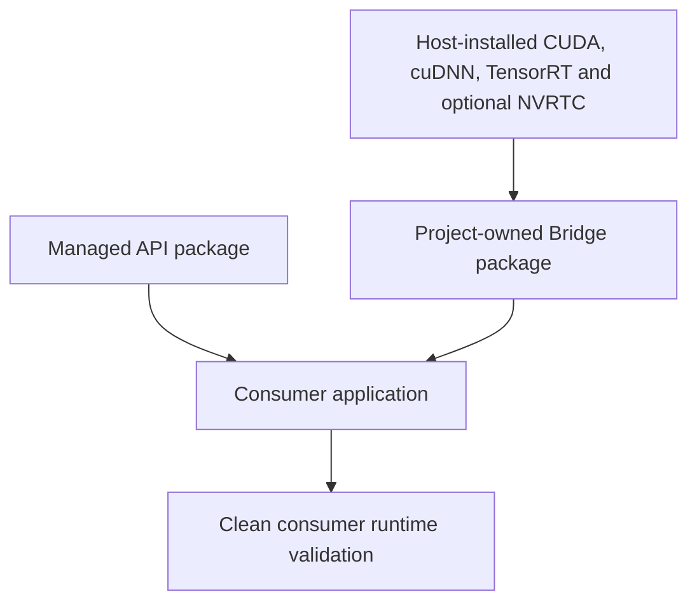
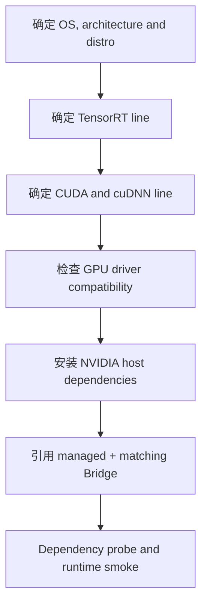

# Runtime Key 和 Bridge Package 怎么选

TensorRtSharp4.0 将托管 API、项目自有 native bridge 与 NVIDIA 原厂运行库分开管理。当前发布面只有 managed package、与 runtime key 对应的 `.Bridge` package，以及不包含第三方二进制的源码归档。CUDA、cuDNN、TensorRT 和可选 NVRTC 由用户自行安装。

真正的选择题不是“下载哪种完整 runtime 包”，而是“目标机器需要哪个 ABI 组合的 bridge，以及怎样证明它加载的是匹配的主机 NVIDIA 依赖”。

## 适用读者

- 需要为 Windows/Linux 应用选择 runtime key 的用户。
- 已安装 NVIDIA SDK，需要引用 C# API 和小型 bridge 包的团队。
- 负责 native build、package consumer 和发布证据的维护者。
- 正在从旧 vendor-bundle 方案迁移到 bridge-only 方案的 owner。

## 当前策略

权威规则位于 `pack/external-vendor-runtime-policy.json`。允许发布的 package kind 只有：

- managed：`JYPPX.TensorRT.CSharp.API`。
- bridge：package id 以 `.Bridge` 结尾，包内只包含项目自行编译的 `jyppxtrtbridge.dll` 或 `libjyppxtrtbridge.so`。

禁止把 `nvinfer*`、`nvonnxparser*`、`cudart*`、`cublas*`、`cudnn*`、`nvrtc*` 等 NVIDIA 文件放进 nupkg 或 GitHub Release asset。旧 full、vendor split、collection、meta、builder-resource 身份只为远端清理和历史证据解释保留，不得重新打包或发布。

## 三层依赖关系



| 层 | 示例身份 | 内容与来源 |
| --- | --- | --- |
| Managed API | `JYPPX.TensorRT.CSharp.API` | C# API，由项目发布 |
| Bridge | runtime key + `.Bridge` | 一个项目自有 C ABI bridge，由项目发布 |
| Vendor runtime | TensorRT/CUDA/cuDNN/NVRTC | 用户通过 NVIDIA 官方方式安装 |

managed 包不会隐式提供 native bridge；bridge 包也不会隐式提供 NVIDIA 依赖。consumer 必须同时满足 package identity、ABI 和主机 runtime 三个条件。

## Runtime key 是第一选择条件

key 形如：

```text
<os>-<arch>-<distro>-trt<version>-cuda<version>-cudnn<version>
```

Windows 示例：

```text
win-x64-trt8.6-cuda11.8-cudnn8.9
win-x64-trt10.11-cuda12.9-cudnn9.22
win-x64-trt11.0-cuda13.2-cudnn9.22
```

Linux 示例还包含发行版：

```text
linux-x64-ubuntu22.04-trt11.0-cuda12.9-cudnn9.22
linux-x64-ubuntu24.04-trt11.0-cuda13.2-cudnn9.22
```

当前 manifest 共 18 个 key：6 个 Windows、12 个 Linux。key 的存在表示项目建模了对应 bridge 编译输入和主机兼容组合，不表示公开包已经发布，也不表示目标主机已有 runtime proof。

## Windows 六个 key

| Runtime key | Native build preset |
| --- | --- |
| `win-x64-trt8.6-cuda11.8-cudnn8.9` | `win-x64-trt8-cuda11-release` |
| `win-x64-trt8.6-cuda12.1-cudnn8.9` | `win-x64-trt8-cuda12-release` |
| `win-x64-trt10.11-cuda11.8-cudnn8.9` | `win-x64-trt10-cuda11-release` |
| `win-x64-trt10.11-cuda12.9-cudnn9.22` | `win-x64-trt10-cuda12-release` |
| `win-x64-trt11.0-cuda12.9-cudnn9.22` | `win-x64-trt11-cuda12-release` |
| `win-x64-trt11.0-cuda13.2-cudnn9.22` | `win-x64-trt11-cuda13-release` |

这些 preset 决定 bridge 使用哪一套 headers、import libraries 和 ABI line。它们不授权把 preset 指向的 NVIDIA DLL 收集到包中。

## Linux key

Linux key 还要区分 Ubuntu 20.04、22.04、24.04 等发行版。不能把 `linux-x64` 泛化包用于所有发行版，也不能把 x64、SBSA arm64 和 Jetson/L4T 当成同一 ABI。目标 key 必须与实际 runner、glibc、loader path 和 NVIDIA repository 支持范围一致。

Linux bridge 包内只允许 `runtimes/<rid>/native/libjyppxtrtbridge.so`。TensorRT、CUDA、cuDNN 和 NVRTC `.so` 由 runner 镜像或目标机器安装。

## 唯一消费路线

当前唯一受支持的 package 组合是：

```text
JYPPX.TensorRT.CSharp.API
+
JYPPX.TensorRT.CSharp.API.Runtime.<runtime-key-with-dots>.Bridge
+
matching host-installed NVIDIA dependencies
```

用户不应寻找 vendor runtime package、split meta package 或 monolithic package。若目标机器尚未安装匹配的 NVIDIA runtime，正确动作是先完成主机安装或容器镜像配置，再引用 `.Bridge` 包。

## 选择决策树



不能用“最新版本”代替明确组合，也不能只因为机器上存在 `CUDA_PATH` 就跳过 TensorRT/cuDNN/driver 检查。

## 查看兼容 Manifest

```powershell
$manifest = Get-Content -Raw .\pack\runtime\runtime-packages.manifest.json |
  ConvertFrom-Json

$manifest.packages |
  Select-Object key,platform,tensorRtVersion,cudaVersion,cudnnVersion,buildPreset |
  Format-Table -AutoSize
```

检查单个 key：

```powershell
$key = 'win-x64-trt11.0-cuda12.9-cudnn9.22'
$entry = $manifest.packages | Where-Object key -eq $key
if ($null -eq $entry) { throw "Unknown runtime key: $key" }
$entry | ConvertTo-Json -Depth 8
```

重点字段：

| 字段 | 当前用途 |
| --- | --- |
| `key`、`rid`、`platform` | 选择目标 OS/architecture |
| `tensorRtLine`、`tensorRtVersion` | bridge ABI 与主机 TensorRT 版本 |
| `cudaLine`、`cudaVersion` | CUDA bridge target 与 driver/runtime 检查 |
| `cudnnMajor`、`cudnnVersion` | 主机 cuDNN 检查 |
| `buildPreset`、`bridgeFile` | 项目 bridge 构建与包内容 |
| `tensorRtFiles`、`cudaFiles`、`cudnnFiles` | 主机依赖诊断范围，不是包资产 |

## 安装主机 NVIDIA 依赖

按 NVIDIA 官方安装方法准备目标组合，并记录安装来源、版本和路径。Windows 上要确认 loader 可找到对应 DLL；Linux 上要确认 `ldconfig`、`LD_LIBRARY_PATH` 或容器 loader 配置。使用 RTC 时必须同时安装 NVRTC 与同版本 builtins。

不要从仓库历史 Release、旧 GitHub Package 或另一台机器复制 vendor DLL 来构成正式安装证据。临时复制只能标记为诊断，不能进入 package proof。

## 应用引用示例

以下示例只展示 identity 结构，`<version>` 与 `<approved-source>` 必须来自真实发布记录：

```xml
<ItemGroup>
  <PackageReference Include="JYPPX.TensorRT.CSharp.API" Version="<version>" />
  <PackageReference
    Include="JYPPX.TensorRT.CSharp.API.Runtime.win-x64.trt10.11.cuda12.9.cudnn9.22.Bridge"
    Version="<version>" />
</ItemGroup>
```

```powershell
dotnet restore --force-evaluate --source <approved-source>
dotnet build -c Release
```

bridge nupkg 中应只有项目自有 native binary 和 NuGet metadata。若发现 NVIDIA 文件，`eng/Test-ExternalVendorRuntimePackagePolicy.ps1` 必须失败。

## 两条公开来源

GitHub Release 通道提供 managed + bridge assets，经 immutable URL、digest、SHA256、大小、nuspec repository URL/commit 校验后进入 verified staging。NuGet-compatible source 通道直接按 package id/version restore managed + bridge packages。

不论使用哪条通道，managed 和 bridge 必须绑定同一个 source commit。`-AllowCrossCommitPair` 只允许真实历史资产诊断，结果必须是 diagnostic-only，不能晋级 package-consumer-runtime 或 post-publish proof。

## 本地 Bridge 构建

本地维护者可以解析 runtime root 并编译 bridge，但不得收集 vendor assets：

```powershell
pwsh -NoProfile -ExecutionPolicy Bypass -File .\eng\Invoke-LocalSplitRuntimePackage.ps1 `
  -SourceRuntimeKey win-x64-trt11.0-cuda12.9-cudnn9.22 `
  -Version <candidate-version> `
  -SplitPackageRole bridge

pwsh -NoProfile -ExecutionPolicy Bypass -File .\eng\Test-ExternalVendorRuntimePackagePolicy.ps1
```

`eng/Invoke-LocalRuntimePackage.ps1`、full role、vendor role、collection/meta 和 all-role 请求必须 fail closed。

## 安装后资产检查

Windows 输出目录中应出现 managed assemblies 和 `jyppxtrtbridge.dll`。不应因为 PackageReference 出现 `nvinfer*`、`cudart*`、`cudnn*` 或 `nvrtc*`。这些文件应来自系统安装路径，并在 dependency report 中记录实际 resolved path 和 version。

Linux 同理：包只复制 `libjyppxtrtbridge.so`，`ldd` 显示的 NVIDIA `.so` 必须解析到用户安装或容器镜像位置。

## 验证结果分层

| 层级 | 能证明什么 | 不能证明什么 |
| --- | --- | --- |
| package policy | nupkg 不含禁止的 vendor binary | 主机 runtime 可运行 |
| restore/build | managed + bridge 引用可解析 | bridge 依赖可加载 |
| dependency probe | loader 能解析外部依赖 | TensorRT enqueue 正确 |
| runtime smoke | 指定主机完成真实执行 | 所有 GPU/模型/版本都兼容 |
| strict public proof | 公开来源、hash、提交和日志闭环 | 自动授权未来发布 |

local feed、ProjectReference 和 direct `.nupkg` 适合开发诊断，但不能替代公开 package source。

## 常见错误

### Bridge 找不到

检查 `.Bridge` PackageReference、RID、输出目录和 `NativeBridgePathResolver`。不要先修改系统 PATH 掩盖 package identity 错误。

### Vendor dependency 找不到

检查用户安装的 TensorRT/CUDA/cuDNN/NVRTC 路径、版本和 loader 配置。bridge 包不负责复制这些文件。

### ABI line 混用

TRT8、TRT10、TRT11 的 DLL 命名与 ABI 不同。不要让输出目录和 PATH 同时混入多个 line，再依据偶然加载成功判断兼容。

### CUDA error 35

这通常表示 driver 不支持目标 CUDA runtime。结论应保留为 `blocked-by-cuda-driver`，并换兼容主机复测，而不是删除 blocker。

### Restore 成功但运行失败

restore 只验证 NuGet 图。继续检查 bridge asset、host dependency listing、dependency probe、runtime smoke、stdout/stderr 和 host metadata。

## 发布前证据

公开消费记录至少要绑定 public source URL、managed/bridge package id/version、两份 nupkg SHA256、两份 repository commit、clean consumer root、restore/build/runtime JSON/stdout/stderr hash、installed vendor asset listing、host metadata、exit code 和 strict validator 结果。

GitHub Release verified staging 与 NuGet-compatible source 都必须各自留下可验证记录。包可下载不等于 runtime 可用，单机 runtime 可用也不等于 post-publish verification 已完成。

## 边界说明

本文是选择和本地验证指南，不执行 package push，不证明任何 package 当前已在公开源可用。build-only、dry-run、template、local feed、ProjectReference、direct `.nupkg`、TensorRtExec report、YoloVision matrix、OnnxToEngine report 和 readonly diagnostics 都不是 runtime proof。

状态保持 `performsPublish=false`、`canPublishPublicly=false`、`canCloseReleaseIssue=false`。文章、截图、candidate inventory、`failedBlockerCount=0` 和 dependency-probe-only 结果不能覆盖这些边界。

## 选择清单

- [ ] 已确定唯一 runtime key。
- [ ] 已安装匹配的 TensorRT、CUDA、cuDNN 和可选 NVRTC。
- [ ] 只引用一个 managed 包和一个 `.Bridge` 包。
- [ ] bridge nupkg 不含 NVIDIA binary。
- [ ] managed/bridge 来源提交一致。
- [ ] dependency probe 记录实际主机依赖路径。
- [ ] runtime smoke 在兼容 GPU 主机执行。
- [ ] public source、hash、日志与 validator 证据齐全。

## 下一步

完成选择后，按 `runtime-package-installation-deep-dive.md` 建立 clean consumer，并用 `Invoke-PublicReleaseBridgePackageConsumer.ps1` 或批准的 NuGet-compatible source 执行真实验证。只有 package-consumer-runtime 与 post-publish strict validator 接受真实输入后，才能推进 release close。
