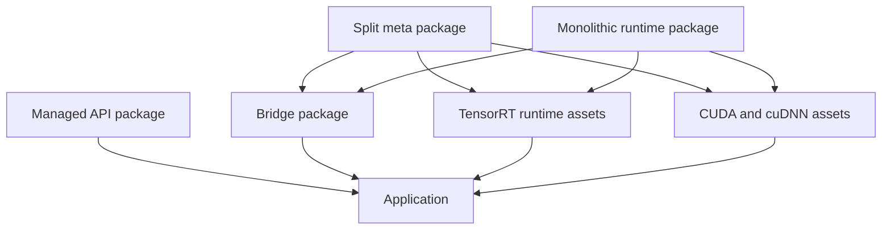
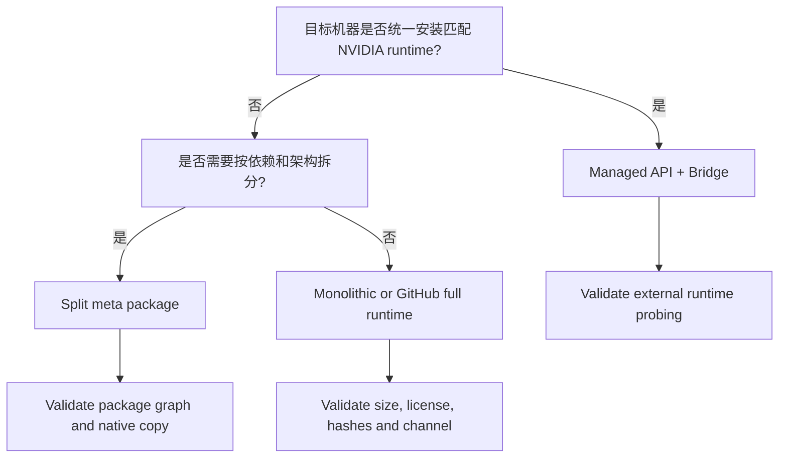

# Runtime Package 和 Split Package 怎么选

TensorRtSharp4.0 将托管 API 与 native runtime 资产分开。托管主包提供 C# wrapper；runtime package 则把
某个 OS、TensorRT、CUDA、cuDNN 组合需要的 bridge 和 vendor DLL 放进应用输出。Windows 用户还可以在
monolithic runtime、split meta package、单独 bridge 之间选择。

真正的选择题不是“哪个包更小”，而是“谁负责提供 TensorRT/CUDA/cuDNN，以及怎样证明版本组合一致”。

## 适用读者

- 需要为 Windows/Linux 应用选择 runtime key 的用户。
- 已安装 NVIDIA SDK，只想使用托管 API 和小 bridge 包的团队。
- 希望用完整依赖包降低安装门槛的应用发布者。
- 负责 package consumer、native-copy 和发布证据的维护者。

## 先理解四个层次



| 层 | 示例身份 | 内容 |
| --- | --- | --- |
| Managed API | `JYPPX.TensorRT.CSharp.API` | `JYPPX.TensorRtSharp.dll`、`JYPPX.CudaSharp.dll`、共享程序集 |
| Bridge | runtime key + `.Bridge` | 本项目 C ABI bridge，不应包含全部 NVIDIA 大资产 |
| Vendor split | `.TensorRt`、`.CudaCudnn` | TensorRT 与 CUDA/cuDNN runtime files |
| Meta/full | runtime key 主 package ID | 引用 split shards 或直接承载完整 runtime assets |

仓库权威定义位于 `pack/runtime/runtime-packages.manifest.json`。具体 package project 位于
`pack/runtime` 和 `pack/runtime-split`，不要根据文章手工推导文件列表。

## Runtime Key 是第一选择条件

key 形如：

```text
<os>-<arch>-<distro>-trt<version>-cuda<version>-cudnn<version>
```

Windows 示例：

```text
win-x64-trt8.6-cuda11.8-cudnn8.9
win-x64-trt10.11-cuda12.9-cudnn9.22
win-x64-trt11.0-cuda13.2-cudnn9.22
```

Linux 示例还包含发行版：

```text
linux-x64-ubuntu22.04-trt11.0-cuda12.9-cudnn9.22
linux-x64-ubuntu24.04-trt11.0-cuda13.2-cudnn9.22
```

当前 manifest 共 18 个 key：6 个 Windows、12 个 Linux。key 的存在说明项目已建模该组合，不表示对应
公开包已经发布，也不表示目标主机有 runtime proof。

Windows 六个 key 的完整集合是：

| Runtime key | Native build preset |
| --- | --- |
| `win-x64-trt8.6-cuda11.8-cudnn8.9` | `win-x64-trt8-cuda11-release` |
| `win-x64-trt8.6-cuda12.1-cudnn8.9` | `win-x64-trt8-cuda12-release` |
| `win-x64-trt10.11-cuda11.8-cudnn8.9` | `win-x64-trt10-cuda11-release` |
| `win-x64-trt10.11-cuda12.9-cudnn9.22` | `win-x64-trt10-cuda12-release` |
| `win-x64-trt11.0-cuda12.9-cudnn9.22` | `win-x64-trt11-cuda12-release` |
| `win-x64-trt11.0-cuda13.2-cudnn9.22` | `win-x64-trt11-cuda13-release` |

## 三条消费路线

### 路线 A：托管 API + Bridge，用户自备 NVIDIA Runtime

适合已经统一安装 TensorRT、CUDA、cuDNN 的开发机、服务器或企业镜像。应用只消费 managed API 和
目标 key 的 bridge shard，NVIDIA DLL 由机器安装目录或应用部署系统提供。

优点：

- 包体小，适合常规 NuGet 分发。
- NVIDIA SDK 升级和安全补丁可由运维统一管理。
- 不需要在每个应用包里重复大 DLL。

代价：

- 用户必须精确安装匹配版本。
- PATH/probing 和多 SDK 并存需要治理。
- clean consumer 必须验证 bridge 能找到外部 vendor runtime。

适合“NuGet 小包路线”，但不能只安装 bridge 就宣称运行环境完整。

### 路线 B：Split Meta Package

Windows split 目录通常按一个 runtime key拆为：

- `Bridge`
- `TensorRt`
- `CudaCudnn`
- meta package

meta package 使用同一个 runtime key 主身份，并依赖这些 shard。对用户而言安装一个 meta package；对
发布者而言大资产可以拆分、复用或单独维护。TRT11/CUDA12.9 还存在更细的 TensorRT runtime/builder
架构 shard，具体以 `pack/runtime-split` 中的项目为准。

优点：

- 依赖职责清楚，重复资产更少。
- bridge 可独立迭代，不必总是重发所有 vendor DLL。
- 大 TensorRT builder 资源可按 GPU architecture 细分。

代价：

- package graph 更复杂。
- 所有 shard 版本必须一致。
- 漏发一个 transitive package 会导致 restore 或 native-copy 不完整。

### 路线 C：Monolithic/Full Runtime

`pack/runtime` 下以 runtime key 命名的项目按 manifest 收集 bridge、TensorRT、CUDA 和 cuDNN 资产，形成单一
完整 runtime 包或 GitHub full bundle 的基础。

优点：

- 用户安装路径最直接。
- 输出目录需要的 native assets 集中。
- 对离线部署和固定 appliance 友好。

代价：

- 包体很大，不适合普通 NuGet 限制和频繁更新。
- vendor redistributable/license、hash 与渠道审计更严格。
- 一个 bridge 小改动可能导致大包重新生成。

这条路线更适合 GitHub Release 完整依赖包，但仍需真实下载、clean consumer、runtime smoke 和
post-publish verification。

## 选择决策树



任何分支都必须先选 runtime key。不能用“最新版本”代替明确的 TensorRT/CUDA/cuDNN 组合。

## 查看当前 Manifest

```powershell
$manifest = Get-Content -Raw .\pack\runtime\runtime-packages.manifest.json |
  ConvertFrom-Json

$manifest.packages |
  Select-Object key,platform,tensorRtVersion,cudaVersion,cudnnVersion,packageId,buildPreset |
  Format-Table -AutoSize
```

检查单个 key：

```powershell
$key = 'win-x64-trt11.0-cuda12.9-cudnn9.22'
$entry = $manifest.packages | Where-Object key -eq $key
if ($null -eq $entry) { throw "Unknown runtime key: $key" }
$entry | ConvertTo-Json -Depth 8
```

重点字段：

| 字段 | 用途 |
| --- | --- |
| `packageId` | monolithic/meta 主 package identity |
| `rid`、`platform` | 目标 OS 和 architecture |
| `tensorRtLine`/`tensorRtVersion` | bridge API line 与 vendor version |
| `cudaLine`/`cudaVersion` | CUDA bridge target 与 runtime |
| `cudnnMajor`/`cudnnVersion` | cuDNN 资产版本 |
| `buildPreset` | native bridge CMake preset |
| `bridgeFile` | 本项目 bridge 产物 |
| `tensorRtFiles`/`cudaFiles`/`cudnnFiles` | 预期 native asset patterns |

## 应用引用示例

以下只展示 package identity 结构，`<version>` 与 package source 必须由实际发布记录提供。

```xml
<ItemGroup>
  <PackageReference Include="JYPPX.TensorRT.CSharp.API" Version="<version>" />
  <PackageReference
    Include="JYPPX.TensorRT.CSharp.API.Runtime.win-x64.trt10.11.cuda12.9.cudnn9.22"
    Version="<version>" />
</ItemGroup>
```

若选择自备 NVIDIA runtime，只引用与该 key 对应的 Bridge shard；不要同时安装 monolithic runtime，
否则输出目录可能出现重复资产来源。

## Full 与 Split 不能混装验证

同一 consumer 中同时引用 full package、split meta、单独 TensorRT/CudaCudnn shard，会让 native-copy 的来源
难以判断。验证时每个项目只走一条路线：

| Consumer | 引用 | 目标 |
| --- | --- | --- |
| bridge-only | managed + Bridge | 用户自备 vendor runtime 的小包路线 |
| split-meta | managed + meta | transitive shards 和 native-copy |
| monolithic | managed + full/runtime | 完整资产单包路径 |

三个项目输出要隔离，不能共享 `bin/obj` 或手工复制相同 DLL。

## Native Asset 清单怎么核对

对 Windows 输出目录先列出关键文件：

```powershell
$output = 'E:\TensorRtSharpAssets\consumer\bin\Debug\net8.0'
Get-ChildItem -LiteralPath $output -File |
  Where-Object Name -Match 'jyppx|nvinfer|nvonnxparser|cudart|cublas|cudnn' |
  Select-Object Name,Length,@{n='Sha256';e={(Get-FileHash $_.FullName -Algorithm SHA256).Hash}}
```

文件存在不代表版本正确。还要运行 dependency probe，读取 bridge build info、TensorRT/CUDA/cuDNN version。
全局 PATH 中的 DLL 不应掩盖 package 缺失；clean consumer scan 要记录实际来源。

## 本地验证命令

### Runtime root 和输入

```powershell
$key = 'win-x64-trt10.11-cuda12.9-cudnn9.22'
$roots = pwsh -NoProfile -File .\eng\Resolve-RuntimeRoots.ps1 `
  -RuntimePackageKey $key | ConvertFrom-Json

pwsh -NoProfile -File .\eng\Validate-WindowsRuntimeInputs.ps1 `
  -RuntimePackageKey $key `
  -TensorRtRoot $roots.tensorRtRoot `
  -CudaRoot $roots.cudaRoot `
  -CudnnRoot $roots.cudnnRoot
```

### Managed/Bridge Consumer

```powershell
pwsh -NoProfile -File .\eng\Test-BridgePackageConsumer.ps1
```

### Runtime Package Consumer

```powershell
pwsh -NoProfile -File .\eng\Test-PackageConsumer.ps1 `
  -RuntimePackageKey $key
```

实际参数以脚本 help 和当前 package artifacts 为准。不要为了让命令运行而把 ProjectReference 加回 clean
consumer；这会改变证据类型。

## 验证结果分层

| 结果 | 能证明 | 不能证明 |
| --- | --- | --- |
| manifest key found | 组合已建模 | package 已生成/发布 |
| pack success | nupkg 可创建 | package graph 可 restore |
| restore success | package identity 可解析 | native assets 完整 |
| build success | managed/native targets 能生成输出 | vendor runtime 可执行 |
| native asset patterns matched | 预期文件被复制 | 文件版本/依赖正确 |
| dependency probe passed | bridge/vendor DLL 可加载并报告版本 | 推理路径通过 |
| runtime smoke passed | 指定 key/host 的测试路径通过 | public channel 可下载 |
| post-publish validator passed | 真实渠道消费和记录满足规则 | 其它 key 自动通过 |

## 常见错误

### 安装了 TRT10 Runtime，却加载 TRT11 DLL

检查 package lock、应用输出和 PATH。runtime key、bridge target 和实际 vendor probe 必须一致。清空隔离
consumer 输出后重新 restore/build，不要覆盖单个 DLL。

### Split Meta Restore 后少 DLL

查看 meta csproj 的 transitive references，以及各 shard 的 package version。不要手工把缺失文件复制到
输出后宣称 split graph 正确；应修 package project/targets 并重新 pack。

### Bridge-only 在开发机通过，干净机器失败

开发机全局安装的 TensorRT/CUDA/cuDNN 隐式满足了依赖。bridge-only 路线要求文档明确 NVIDIA runtime
前置条件，并在干净主机上验证 resolver/loader 诊断。

### Full Package 太大

考虑 split shards 或 GitHub full bundle。不能通过删除被 bridge 真实依赖的 DLL 缩小包；使用 manifest
asset list、dependency inspection 和 runtime smoke决定裁剪。

### CUDA error 35

记录为 driver/runtime compatibility blocker。它不能被 package layout success 覆盖，也不等于 runtime passed。

### Local Feed 是否等于 NuGet 发布验证

不等于。local feed、direct nupkg 和 ProjectReference 适合 source/package engineering，但不证明公开渠道的
URL、hash、重新下载和 post-publish consumer。

## 发布前需要额外补什么

无论 full 或 split，公开证据至少需要：

1. 真实 package source/channel URL。
2. managed/runtime package ID、version、runtime key。
3. 从该渠道下载后的 nupkg SHA256。
4. 仓库外 clean consumer，无 ProjectReference/local feed/direct nupkg。
5. restore/build/native-copy/dependency-probe/runtime-smoke 日志与 SHA256。
6. host OS/architecture/GPU/driver/CUDA/TensorRT/cuDNN metadata。
7. strict validator 与 owner review。

这些步骤在 `docs/articles/zh-cn/package-consumer-runtime-proof-playbook.md` 和
`docs/articles/zh-cn/post-publish-verification-proof-playbook.md` 中展开。

## 边界说明

本文是选择和本地验证指南，不执行 package push，不证明任何 package 当前已在 NuGet/GitHub Release 可用。
18 个 runtime key 是建模范围，不是 18 个公开 runtime proof。

状态保持 `performsPublish=false`、`canPublishPublicly=false`、`canCloseReleaseIssue=false`。

## 选择清单

- [ ] OS、architecture、发行版和 runtime key 已确定。
- [ ] TensorRT、CUDA、cuDNN version 与 key 完全匹配。
- [ ] 只选择 bridge-only、split-meta 或 monolithic 中的一条路线。
- [ ] managed package 与所有 runtime shard version 一致。
- [ ] consumer 输出目录不混入其它 key 的 DLL。
- [ ] native asset patterns、SHA256 和实际 probe version 已记录。
- [ ] build、dependency probe、runtime smoke 状态分开记录。
- [ ] driver blocker/skip 没有写成 passed。
- [ ] local feed/direct nupkg 没有写成 public package proof。
- [ ] 大包、cache 和日志位于 E 盘受控目录。

## 下一步

- [Runtime 版本矩阵阅读指南](runtime-package-matrix-reading-guide.md)
- [Windows 本地开发环境准备](windows-local-dev-environment.md)
- [NuGet Package Consumer 验证流程](nuget-package-consumer-validation-flow.md)
- [Package Consumer Runtime Proof Playbook](package-consumer-runtime-proof-playbook.md)
