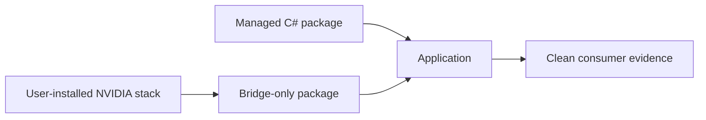

# Runtime 包说明

TensorRtSharp4.0 的当前 native package 只承载项目自行编译的 C ABI bridge。CUDA、cuDNN、TensorRT、parser、plugin、builder resource、NVRTC 和 NVRTC builtins 都是用户机器依赖，不再放入 NuGet package、GitHub Package 或 GitHub Release asset。

权威策略是 `pack/external-vendor-runtime-policy.json`。允许发布的内容只有 C# managed package、`.Bridge` package 和排除第三方二进制的 Git 跟踪源码归档。

## 适用读者

本文适合准备安装 TensorRtSharp 的用户，也适合维护 Windows/Linux bridge 矩阵、GitHub Release assets、NuGet-compatible source 和 package consumer 证据的负责人。

## 解决问题

TensorRT/CUDA/cuDNN 版本组合多、体积大、许可证和安全更新边界复杂。现在的目标不是复用或拆分 vendor 包，而是让 package ownership 足够清楚：项目只交付自己拥有的 managed/bridge 二进制，用户负责安装 NVIDIA runtime，consumer 证据记录两者在真实主机上的组合。

## 核心思路



runtime key 继续记录 bridge 的编译目标和主机兼容范围。例如：

```text
win-x64-trt10.11-cuda11.8-cudnn8.9
win-x64-trt11.0-cuda13.2-cudnn9.22
linux-x64-ubuntu22.04-trt11.0-cuda12.9-cudnn9.22
```

对应 bridge package id 形如：

```text
JYPPX.TensorRT.CSharp.API.Runtime.win-x64.trt10.11.cuda11.8.cudnn8.9.Bridge
```

package id 中保留 TensorRT/CUDA/cuDNN line，是为了明确 ABI 和主机依赖，不表示这些 NVIDIA 文件在包内。

## 包内容

每个 `.Bridge` nupkg 只能包含 NuGet metadata 和一个项目自有 native bridge：

- Windows：`runtimes/win-x64/native/jyppxtrtbridge.dll`。
- Linux：`runtimes/<rid>/native/libjyppxtrtbridge.so`。

以下文件模式被策略明确禁止：`nvinfer*`、`nvonnxparser*`、`nvparsers*`、`cudart*`、`cublas*`、`cudnn*`、`nvrtc*`。`eng/Test-ExternalVendorRuntimePackagePolicy.ps1` 会检查候选 nupkg 并 fail closed。

## 兼容矩阵

`pack/runtime/runtime-packages.manifest.json` 仍是 runtime key、精确 NVIDIA 版本、CMake preset、bridge file 和主机依赖诊断 pattern 的权威矩阵。vendor file lists 是本机 build/probe 输入，不是 package assets。

`pack/runtime-split/split-runtime-packages.manifest.json` 的 `publicationPolicy.state=bridge-only`，当前只允许 `role=bridge`。非 bridge 条目作为历史 identity 暂时保留，用于识别并删除此前发布的无效包；它们不可 pack。

## Windows 组合

当前 Windows 维护六个 bridge 目标：

- `win-x64-trt8.6-cuda11.8-cudnn8.9`
- `win-x64-trt8.6-cuda12.1-cudnn8.9`
- `win-x64-trt10.11-cuda11.8-cudnn8.9`
- `win-x64-trt10.11-cuda12.9-cudnn9.22`
- `win-x64-trt11.0-cuda12.9-cudnn9.22`
- `win-x64-trt11.0-cuda13.2-cudnn9.22`

用户必须安装对应 TensorRT、CUDA、cuDNN 和所需插件。CUDA 13.2 路线还要求兼容驱动；若主机返回 CUDA error 35，应记录 `blocked-by-cuda-driver`，不能把 build/restore 通过写成 runtime proof。

## Linux 组合

Linux key 显式包含 Ubuntu 版本。Ubuntu 20.04、22.04、24.04 的 NVIDIA 仓库和系统 ABI 不同；x64、SBSA arm64 和 Jetson/L4T 也不是同一 package target。

Linux bridge 包不包含 `.so` vendor bundle。runner 或容器镜像负责安装 NVIDIA stack，并在证据中记录 `ldd`、resolved path、版本、GPU 和 driver metadata。

## 本机 roots

机器实际 NVIDIA roots 写入被 Git 忽略的 `pack/runtime/runtime-packages.local.json`，可从 `runtime-packages.local.example.json` 开始配置。公开 manifest、README 和 package metadata 不得泄漏本机绝对路径，也不得把本机 root 伪装为 public package source。

root 解析和输入验证仍服务于 bridge 编译：

```powershell
$roots = pwsh -NoProfile -File .\eng\Resolve-RuntimeRoots.ps1 `
  -RuntimePackageKey win-x64-trt11.0-cuda12.9-cudnn9.22 | ConvertFrom-Json

pwsh -NoProfile -File .\eng\Validate-WindowsRuntimeInputs.ps1 `
  -RuntimePackageKey win-x64-trt11.0-cuda12.9-cudnn9.22 `
  -TensorRtRoot $roots.tensorRtRoot `
  -CudaRoot $roots.cudaRoot `
  -CudnnRoot $roots.cudnnRoot
```

这些命令验证 headers、libraries 和本机依赖，不授权收集或再分发 NVIDIA binary。

## 操作路径

构建单个 bridge package：

```powershell
pwsh -NoProfile -ExecutionPolicy Bypass -File .\eng\Invoke-LocalSplitRuntimePackage.ps1 `
  -SourceRuntimeKey win-x64-trt11.0-cuda12.9-cudnn9.22 `
  -Version <candidate-version> `
  -SplitPackageRole bridge
```

随后执行内容策略检查：

```powershell
pwsh -NoProfile -ExecutionPolicy Bypass -File .\eng\Test-ExternalVendorRuntimePackagePolicy.ps1 `
  -PackagePath .\artifacts\runtime-split-nupkg\win-x64-trt11.0-cuda12.9-cudnn9.22
```

`eng/Invoke-LocalRuntimePackage.ps1` 与 `eng/Collect-RuntimeAssets.ps1` 已 fail closed；请求非 bridge role、collection、meta 或 all roles 也必须在资产收集前失败。

## 用户安装

用户只添加两个 PackageReference：

```powershell
dotnet add package JYPPX.TensorRT.CSharp.API --version <version> --source <approved-source>
dotnet add package JYPPX.TensorRT.CSharp.API.Runtime.win-x64.trt11.0.cuda12.9.cudnn9.22.Bridge --version <version> --source <approved-source>
dotnet restore --force-evaluate
dotnet build -c Release
```

在运行前，应按 NVIDIA 官方方式安装 matching host dependencies。bridge-only 不等于 dependency-free；它只是把第三方安装和项目包发布的责任拆开。

## 两条发布通道

- GitHub Release assets：只上传 managed、`.Bridge` nupkg 和源码归档；consumer 下载后验证 immutable URL、digest、SHA256、nuspec 和 source commit，再建立 verified staging。
- NuGet-compatible source：只提供 managed + bridge packages；consumer 按公开 source URL、package id/version restore。

两条通道必须执行同提交 provenance 校验。跨提交配对只能输出 diagnostic-only，不得晋级 package/public/post-publish proof。验证账号 `grape-yan` 只执行 Actions 检查，不具有正式发布权限；正式发布 owner 是 `guojin-yan`。

## 远端清理

以前发布的 NVIDIA vendor package versions 和 Release assets 已按 owner 确认指纹执行清理。清理工具只删除明确匹配 review fingerprint 的退休项，并保留 managed、`.Bridge` 与 GitHub 自动生成的源码归档。

历史 identity 留在 manifest 中不是恢复发布路线的授权。任何旧 vendor package 命中都应进入 cleanup 或 forbidden candidate，而不是进入 release plan。

## 发布证据

候选 package inventory 只接受 managed + bridge。公开 consumer 记录至少包含两份 nupkg 的 URL、digest、SHA256、大小、package id/version、repository URL/commit、restore/build/runtime JSON、stdout/stderr hash、主机 NVIDIA asset listing 和 strict validator 结果。

真实 runtime proof 必须来自兼容 GPU host。bridge content gate、native-copy、dependency probe 或本地 package consumer 都不能替代 TensorRT 实际执行。

## 边界说明

runtime package 存在不等于 runtime proof。build-only、dry-run、template、local feed、ProjectReference、direct `.nupkg`、TensorRtExec report、YoloVision matrix、OnnxToEngine report、readonly diagnostics 都不是 runtime proof。

public package proof 和 post-publish proof 还必须绑定真实公开来源、版本、hash、同提交 provenance、host metadata、runtime logs 和 validator 结果。文档、截图或 candidate readiness 不能授权发布。

## 常见误区

- 看到 runtime manifest 的 vendor file list，就以为这些文件会进入 nupkg。
- 看到历史 split identity，就尝试重新 pack 非 bridge role。
- 只验证 restore/build，就宣称主机 runtime 可用。
- 从旧 Release 下载 NVIDIA DLL，绕过用户安装责任。
- 把验证账号 Actions 通过当成正式账号已发布。

这些路径都违反当前边界。应回到 `external-vendor-runtime-policy.json`、bridge-only package 和真实主机验证。

## 下一步

继续用 `Invoke-PublicReleaseBridgePackageConsumer.ps1` 验证 GitHub Release managed + bridge assets，并在 NuGet-compatible source 发布后执行第二条 clean consumer 路线。只有 strict validator 接受真实 package-consumer-runtime 和 post-publish input，才能推进 release close。
