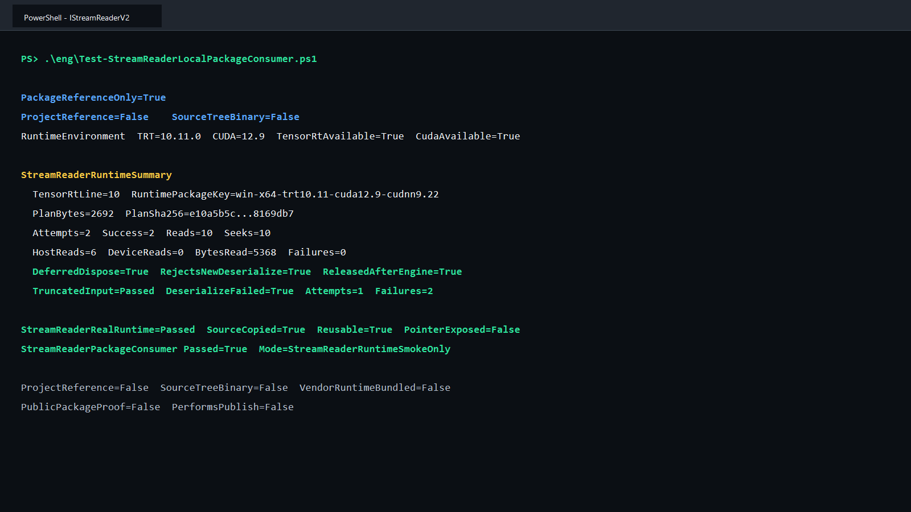

# 通过公开 NuGet 包使用 TensorRT IStreamReaderV2：安全所有权、真实读取与失败闭环

> 项目：TensorRtSharp4.0
>
> 主要库：`JYPPX.TensorRtSharp`、`JYPPX.CudaSharp`、`jyppxtrtbridge`
>
> 示例：`tests/fixtures/package-consumers/StreamReader.PackageConsumer`
>
> 本机结果：TensorRT 10.11、CUDA 12.9、NVIDIA GeForce RTX 3060 Laptop GPU
>
> 安装边界：用户流程使用公开 NuGet 包；文中的既有截图和 JSON 仍是发布前 local-feed 历史证据，不代表 post-publish 验证。

## 1. 项目与功能背景

TensorRtSharp4.0 为 NVIDIA TensorRT 和 CUDA 提供 C# 托管接口。TensorRT 公开类型统一位于 `JYPPX.TensorRtSharp` 及其子命名空间，CUDA 公开类型位于 `JYPPX.CudaSharp` 及其子命名空间；native bridge 以稳定 C ABI 调用 NVIDIA C++ API。

普通的 `TensorRtRuntime.Deserialize(byte[])` 会把完整 plan 缓冲交给 TensorRT。TensorRT 10 和 11 还提供 `IStreamReaderV2`：runtime 可以按需读取、跳转，并可要求将数据写到 host 或 device 目标。这个接口的困难不在于把 `Stream.Read` 接上去，而在于跨 ABI 的所有权和异常边界：

- TensorRT 回调目标指针和 `cudaStream_t` 不能暴露到 public C# API；
- 回调不能让 C++ 或 C# 异常穿过 TensorRT ABI；
- 输入字节必须在 reader 生命周期内稳定，不能依赖调用者继续保留原数组；
- `Dispose()` 不能提前释放仍被反序列化过程或返回 engine 借用的 owner；
- 同一 reader 不能并发服务两个反序列化过程，但应支持顺序复用。

本轮新增 `TensorRtStreamReader`、`TensorRtStreamReaderRuntimeSnapshot` 和 `TensorRtRuntime.Deserialize(TensorRtStreamReader)`，并通过真实 TensorRT 10.11 外部双包消费者验证这些合同。

## 2. 依赖与包职责

运行者需要自行安装 .NET 8 SDK、NVIDIA 驱动、CUDA Toolkit 和匹配的 TensorRT SDK。项目不打包 CUDA、cuDNN、TensorRT 或 NVRTC。

仓库外消费者需要两个公开包：

| 包 | 职责 | 内容边界 |
| --- | --- | --- |
| `JYPPX.TensorRT.CSharp.API` | `JYPPX.TensorRtSharp` 与 `JYPPX.CudaSharp` 托管 API | 不含 NVIDIA DLL |
| `...Runtime.win-x64.trt10.11.cuda12.9.cudnn9.22.Bridge` | 与版本矩阵匹配的 native bridge | 只含 `jyppxtrtbridge.dll` |

程序启动后调用 `TensorRtEnvironmentProbe.GetCurrent()`，核对 bridge 编译版本、TensorRT/CUDA 可用状态和目标 TensorRT 主版本。版本不匹配时直接失败，不继续生成看似成功的结果。

## 3. 模型获取与转换说明

本案例验证流式反序列化接口，不依赖训练模型、ONNX 或输入图片：

- 模型名称：程序内创建的 `[1,4]` FP32 identity network；
- 官方获取方式：不适用，没有模型下载地址；
- 权重许可证与 SHA256：不适用，网络没有外部权重；
- ONNX 转换方式：不适用，直接调用 TensorRT network API；
- 外层模型目录：不读写 `<workspace-root>/models`；
- 图像识别结果：不适用，本例不是视觉识别任务；
- 识别框、分割 mask 或关键点叠加图：不适用；
- 可视化结果：使用真实程序运行终端截图；
- serialized plan：只存在于当前进程内，不作为模型文件提交。

涉及视觉模型的其他文章仍必须写清官方权重来源、固定 revision、许可证、转换命令、ONNX SHA256 和外层 `models` 暂存位置，并提供原图叠加结果与程序运行截图。本案例不能替代这类证据。

## 4. native owner 与 ABI 设计

bridge 为 TensorRT 10 和 11 分别导出三个入口：

```text
stream_reader_v2_owner_create
stream_reader_v2_owner_get_info
runtime_deserialize_stream_reader_v2
```

创建入口立即把 managed 字节复制到 native `std::vector<uint8_t>`。原数组随后可以清零或回收，reader 仍应读到原始 plan。public API 不返回 native owner 地址、回调目标地址、CUDA stream 地址或 device pointer，只返回复制后的标量和诊断字符串。

native `StreamReaderCallbackOwner` 直接实现 `nvinfer1::IStreamReaderV2`：

- `read` 检查长度和目标地址，识别 host/device/managed 目标；
- host 目标使用 `memcpy`；
- device 目标使用 `cudaMemcpy`，有 CUDA stream 时使用 `cudaMemcpyAsync` 并在返回前同步；
- `seek` 对 begin/current/end 和上下界做严格校验；
- `read` 与 `seek` 均为 `noexcept`；
- 每次回调记录 read、seek、字节数、host/device 次数、失败数和 in-flight 计数；
- TensorRT vendor 调用外层还有 C++ 异常与 Windows SEH 防护。

对象种类枚举只在末尾追加 `STREAM_READER_CALLBACK_OWNER=29`，没有重排已有 ABI 数值。TRT10 导出只在实际主版本等于 10 时启用，TRT11 同理，防止错误 bridge 静默调用不匹配 vtable。

## 5. C# 所有权与公开接口

从字节数组创建 reader：

```csharp
byte[] plan = hostMemory.ToArray();
using TensorRtStreamReader reader = new(TensorRtApiLine.TensorRt10, plan);
Array.Clear(plan, 0, plan.Length);

using TensorRtRuntime runtime = new(logger);
using TensorRtEngine engine = runtime.Deserialize(reader);
```

也可以从可读流的当前位置复制到末尾：

```csharp
using MemoryStream source = new(serializedPlan, writable: false);
using TensorRtStreamReader reader = new(TensorRtApiLine.TensorRt10, source);
```

`TensorRtRuntime.Deserialize(reader)` 在进入 native 前登记 deserialize borrower。返回的 `TensorRtEngine` 再登记 engine borrower，因此调用者提前请求 reader 释放时，native owner 仍保持存活。最后一个 engine 释放后才真正释放 SafeHandle。已请求释放的 reader 拒绝新的反序列化，避免对象复活。

`GetRuntimeSnapshot()` 返回 pointer-free 快照，包括 plan 长度、位置、deserialize/read/seek 计数、host/device 读取次数、字节数、失败数和最后诊断。该快照用于诊断和测试，不允许调用者接管 native 指针。

## 6. 安装公开包

在仓库外创建项目，并从公开 NuGet 源引用 managed 包和匹配本机矩阵的 bridge-only 包：

~~~powershell
dotnet new console --framework net8.0
dotnet add package JYPPX.TensorRT.CSharp.API --version "4.0.0-*"
dotnet add package JYPPX.TensorRT.CSharp.API.Runtime.win-x64.trt10.11.cuda12.9.cudnn9.22.Bridge --version "4.0.0-*"
~~~

`4.0.0-*` 只跟随当前 4.0.0 预览线，避免 NuGet 选择 API 不兼容的历史 `4.0.6170`。Bridge 包 ID 必须按目标机器环境替换；NVIDIA runtime 继续由用户安装。

### 发布前 local-feed 证据复核

先构建与主机版本匹配的 bridge：

```powershell
cmake --preset win-x64-trt10-cuda12-release
cmake --build --preset win-x64-trt10-cuda12-release --parallel
```

再生成 managed 和 bridge-only 本地候选包：

```powershell
powershell -NoProfile -ExecutionPolicy Bypass `
  -File .\eng\Invoke-LocalSplitRuntimePackage.ps1 `
  -SourceRuntimeKey win-x64-trt10.11-cuda12.9-cudnn9.22 `
  -Version 4.0.0 `
  -SkipConsumerValidation `
  -TensorRtRoot <TensorRT-root> `
  -CudaRoot <CUDA-root>
```

该流程只生成本地候选物，不创建 tag、不创建 GitHub Release、不发布新包。包内容审计要求 managed/bridge 包中的 NVIDIA vendor runtime 数量为 0。

## 7. 仓库外消费者如何隔离

`Test-StreamReaderLocalPackageConsumer.ps1` 在 Git 仓库外创建一次性项目，并执行以下检查：

1. `NuGet.config` 先 `<clear />`，只加入本地 managed 与 bridge-only 候选包目录；
2. 使用独立 package cache；
3. 项目只有两个 `PackageReference`，没有 `ProjectReference`、`HintPath`；
4. 清除 `JYPPX_NATIVE_BRIDGE_PATH` 和开发探测开关；
5. 校验消费者输出中的 bridge 与 nupkg native entry SHA256 完全一致；
6. 扫描候选包和消费者输出，要求 NVIDIA vendor runtime 数量为 0；
7. 严格解析真实运行 marker，任一关键字段不满足即非零退出。

消费者项目的依赖形状如下：

```xml
<ItemGroup>
  <PackageReference Include="JYPPX.TensorRT.CSharp.API" Version="4.0.0" />
  <PackageReference
    Include="JYPPX.TensorRT.CSharp.API.Runtime.win-x64.trt10.11.cuda12.9.cudnn9.22.Bridge"
    Version="4.0.0" />
</ItemGroup>
```

## 8. 正例：真实 read、seek 与顺序复用

示例先通过普通 byte-buffer 反序列化得到基准 engine 元数据，再从同一个 `TensorRtStreamReader` 顺序反序列化两次。每个返回 engine 都比较名称、I/O tensor 数和 layer 数，并创建 execution context、绑定 CUDA 内存、执行 `EnqueueAsync` 和 stream 同步。

稳定断言不是固定某台机器的 callback 次数，而是：

- 两次 deserialize attempt 都成功；
- read 数、读取字节数和 host/device 读取总数均大于 0；
- engine 元数据与 buffer 基准一致；
- 原 managed 数组清零后仍成功，证明 native owner 已复制来源；
- 同一 reader 可顺序复用；
- callback failure 为 0，完成后 in-flight 为 0；
- public snapshot 没有 `IntPtr`、`UIntPtr` 或 `SafeHandle` 属性。

本机 TensorRT 10.11 最终验证观察到 2 次成功反序列化、10 次 read、10 次 seek、5,368 个累计读取字节。host/device 读取分布和内存 plan 内容允许随 TensorRT 实现及构建过程变化，因此不能把 plan SHA256、`HostReads=6` 或具体字节数当成跨主机固定值。

## 9. 生命周期负例：提前 Dispose

生命周期用例在 engine 仍存活时调用 `reader.Dispose()`：

```csharp
TensorRtStreamReader reader = new(line, plan);
TensorRtEngine engine = runtime.Deserialize(reader);
reader.Dispose();

// owner 仍由 engine 借用，engine 继续可执行
ExecuteOnce(engine);
engine.Dispose();
```

验证要求 `Dispose` 请求被延迟、已释放 reader 拒绝新的 deserialize、现有 engine 仍能执行，并在 engine 释放后让 `GetRuntimeSnapshot()` 抛出 `ObjectDisposedException`。这证明释放顺序由 borrower ledger 决定，而不是依赖调用者碰巧保持对象引用。

## 10. 数据负例：截断 plan 必须失败

示例只保留正常 plan 的八分之一，再通过新 reader 调用 TensorRT。稳定合同是：

- `Deserialize` 抛出 `TensorRtException`；
- native attempt 为 1、success 为 0、failed 为 1；
- failure count 大于 0；
- 回调完成后 in-flight 为 0。

本机最终验证观察到 failure count 为 2，它包含读/seek 失败和 deserialize 失败的累计记录。不同 TensorRT 构建可能改变具体次数，所以门禁只要求它大于 0。

## 11. 执行完整验证

在仓库根目录执行：

```powershell
powershell -NoProfile -ExecutionPolicy Bypass `
  -File .\eng\Test-StreamReaderLocalPackageConsumer.ps1 `
  -TensorRtRoot <TensorRT-root> `
  -CudaRoot <CUDA-root>
```

脚本依次完成包审计、仓库外 restore、Release build、真实 TensorRT build/deserialize/inference、严格 marker 解析、bridge 哈希比对、vendor DLL 扫描、证据报告写入和一次性目录清理。`-KeepWorkspace` 只用于本地诊断，保留的目录仍在仓库外。

## 12. 本机执行结果

```text
PackageReferenceOnly=True
ProjectReference=False
SourceTreeBinary=False
RuntimeEnvironment TRT=10.11.0 CUDA=12.9 TensorRtAvailable=True CudaAvailable=True
StreamReaderRuntimeSummary
  TensorRtLine=10 RuntimePackageKey=win-x64-trt10.11-cuda12.9-cudnn9.22
  PlanBytes=2692 PlanSha256=e10a5b5cbac5d1a882067cbcfcb4b5d86dd641e60bd4e0fb12313642d8169db7
  Attempts=2 Success=2 Reads=10 Seeks=10
  HostReads=6 DeviceReads=0 BytesRead=5368 Failures=0
  DeferredDispose=True RejectsNewDeserialize=True ReleasedAfterEngine=True
  TruncatedInput=Passed DeserializeFailed=True Attempts=1 Failures=2
StreamReaderPackageConsumer Passed=True Mode=StreamReaderRuntimeSmokeOnly
```



截图由同一次真实 stdout 去路径化排版，结果值未改写。完整 marker 位于 `samples/assets/stream-reader-local-package-consumer-tensorrt10.11.txt`，源码、transcript 与截图 SHA256 记录在 `samples/assets/stream-reader-local-package-consumer-tensorrt10.11-evidence.json`。

| 检查项 | 本机结果 | 结论 |
| --- | ---: | --- |
| `PackageReferenceOnly` | True | 只消费两个本地候选包 |
| deserialize | 2/2 成功 | reader 可顺序复用 |
| read / seek | 10 / 10 | TensorRT 真实调用 vtable |
| bytes read | 5,368 | plan 通过 reader 提供 |
| source copied | True | 原 managed 数组可清零 |
| metadata matched | True | 与 buffer 基准 engine 一致 |
| deferred dispose | True | engine 借用期间不提前释放 |
| truncated plan | 失败 | 无效输入 fail closed |
| pointer exposed | False | public snapshot 不暴露 native 地址 |
| vendor binary count | 0 | NVIDIA runtime 由用户安装 |

## 13. 版本边界、常见问题与发布边界

### TensorRT 8 为什么不支持

`IStreamReaderV2` 本轮只面向 TensorRT 10 和 11。`TensorRtStreamReader` 对 TRT8 立即抛出 `NotSupportedException`。旧 `IStreamReader::read` 仍保持 deferred，不用 v2 结果冒充旧接口完成。

### TensorRT 11 是否已经实机通过

TRT11 的 header、manifest、生成绑定和 line-specific native 实现已完成，但本机只有 TensorRT 10.11，因此没有 TRT11 实机运行结论。发布说明必须明确这一点，不能从编译成功外推为 TRT11 runtime proof。

### 为什么没有 IStreamWriter

当前 TensorRT 10.11 验证环境没有可闭环的 `IStreamWriter` runtime 使用路径。本轮 `StreamWriterVerified=False`，没有创建未经验证的 public writer API。

### 为什么 host/device 次数不能固定

TensorRT 可以按实现和版本选择目标内存及读取策略。门禁要求至少发生真实复制、字节数非零且最终无失败，不要求所有机器得到相同 host/device 分布。

### 证据究竟证明什么

本次结果证明：在当前 Windows、TensorRT 10.11 和 CUDA 12.9 主机上，仓库外双包消费者可以通过 public `TensorRtStreamReader` 完成真实 `IStreamReaderV2` read/seek、两次反序列化和 inference；来源复制、延迟释放、截断输入失败与 pointer-free 合同成立。

它不证明 TensorRT 11 或 Linux 已实机通过，也不证明包已从公开源下载。项目仍处于开发收口阶段：不创建 tag、不创建 GitHub Release、不发布新包；NuGet 上已有包不在本文处理范围内。
