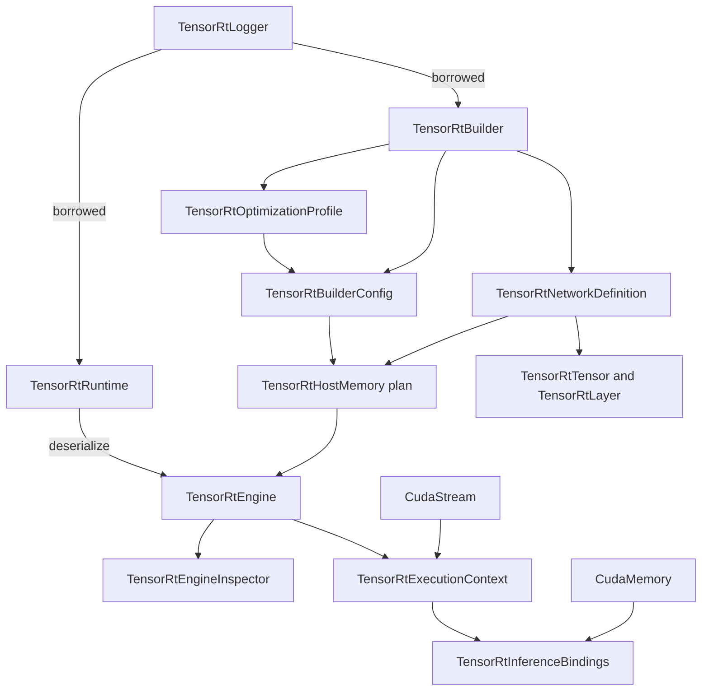
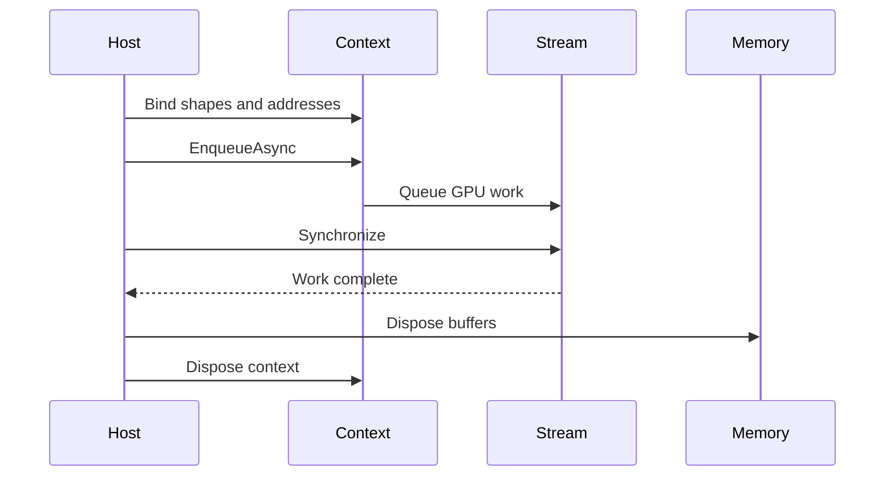

# TensorRT Builder、Runtime、Engine 对象模型

TensorRT 推理不是“加载 DLL，传入数组，得到数组”的单函数调用。构建阶段有 logger、builder、network、
config、profile 和 serialized host memory；运行阶段有 runtime、engine、execution context、CUDA stream 和
device buffers。每个对象都有 owner、API line 和释放顺序。

TensorRtSharp4.0 用 C# wrapper 表达这张对象图，让用户在 public API 中操作有语义的对象，而不是拼接
`IntPtr`。本文以一个动态 batch identity network 为例，从构建到 enqueue 完整解释生命周期。

## 适用读者

- 第一次使用 TensorRT Builder API 的 C# 开发者。
- 需要区分 build phase 与 runtime phase 的应用维护者。
- 正在排查 object line mismatch、过早 Dispose 或 tensor address 缺失的问题的用户。
- 为 TensorRT wrapper 添加新对象或方法的贡献者。

## 对象总览



logger 是被 builder/runtime 借用的回调对象，其余创建结果通常由调用方持有并 `Dispose`。wrapper 内部
使用 safe handle，但 public API 不暴露它。

## 两条主线：Build 与 Runtime

### Build Phase

```text
logger -> builder -> network + config + profile -> serialized host memory
```

build phase 决定 network topology、dynamic shape profile、workspace、optimization、precision 和可序列化
plugin path。它需要 TensorRT builder 组件，通常比纯 runtime 部署占用更多资产。

### Runtime Phase

```text
logger -> runtime -> deserialize plan -> engine -> execution context -> enqueue
```

runtime phase 使用已生成的 plan，枚举 I/O tensor、设置实际 shape、分配 device buffer、绑定 address 并在
CUDA stream 上执行。plan 与构建它的 TensorRT/hardware/compatibility policy 有约束，不能当通用模型格式。

## Logger：Borrowed，但必须活得足够久

`TensorRtLogger` 创建 native logger。`TensorRtBuilder` 和 `TensorRtRuntime` 构造时会登记 borrower，并将
logger 保存在 `_loggerKeepAlive`。释放 builder/runtime 后再解除借用。

```csharp
using var logger = new TensorRtLogger(TensorRtApiLine.TensorRt10);
using var runtime = new TensorRtRuntime(logger);
using var builder = new TensorRtBuilder(logger);
```

logger 必须比这两个 borrower 活得久。把临时 logger 直接包装为裸 native pointer 会产生回调时悬空风险，
这正是 wrapper keep-alive 的作用。

实现锚点：

- `src/JYPPX.TensorRtSharp/TensorRtLogger.cs`
- `src/JYPPX.TensorRtSharp/TensorRtBuilder.cs`
- `src/JYPPX.TensorRtSharp/TensorRtRuntime.cs`

## Builder：创建构建期对象

builder 暴露平台能力查询并创建：

- `TensorRtNetworkDefinition`
- `TensorRtBuilderConfig`
- `TensorRtOptimizationProfile`
- `TensorRtHostMemory`（通过 `BuildSerializedNetwork`）

这些返回对象由调用方拥有。builder 不替你释放 network/config/profile。构建时还会检查它们与 builder
属于同一 `TensorRtApiLine`，避免混用 TRT8/TRT10/TRT11 handle。

```csharp
using var config = builder.CreateBuilderConfig();
using var network = builder.CreateNetwork(
    TensorRtNetworkDefinitionCreationFlags.ExplicitBatch);
using var profile = builder.CreateOptimizationProfile();
```

TRT10/11 的 strongly typed policy 有版本差异，使用 `CreateNetwork(bool stronglyTyped)` 时 wrapper 会按 line
映射或明确 NotSupported，而不是复用错误 flag。

## Network：Tensor 与 Layer 的 Owner Scope

network 创建 input tensor 和 layer，layer 再返回 output tensor。用户以 wrapper 操作名称、shape、data type
和连接关系：

```csharp
using var input = network.AddInput(
    "input",
    TensorRtDataType.Float,
    new TensorRtDims(new[] { -1, 4 }));
using var identity = network.AddIdentity(input);
using var output = identity.GetOutput(0);
output.Name = "output";
network.MarkOutput(output);
```

这些 wrapper 仍受 network 的 vendor object graph 约束。不要保存内部 handle 后先释放 network；正常代码
用嵌套作用域或 using declaration，让 tensor/layer 在 network 之前释放。

## BuilderConfig：策略，不是 Engine

config 保存 build policy，例如 workspace memory pool、optimization level、profiling verbosity、aux streams、
hardware compatibility 和 optimization profiles：

```csharp
config.SetMemoryPoolLimit(
    TensorRtMemoryPoolType.Workspace,
    64UL * 1024UL * 1024UL);
config.SetOptimizationLevel(3);
config.SetMaxAuxStreams(0);
```

setter 成功不表示最终 engine 一定采用所有期望 tactic。需要 readback、build report、engine metadata 或
runtime behavior 分层验证。config 也不能跨 line 交给另一 builder。

## OptimizationProfile：动态 Shape 的合法区间

动态维度 `-1` 需要 profile 定义 min/opt/max：

```csharp
profile.SetShape(
    "input",
    new TensorRtDims(new[] { 1, 4 }),
    new TensorRtDims(new[] { 2, 4 }),
    new TensorRtDims(new[] { 4, 4 }));

int profileIndex = config.AddOptimizationProfile(profile);
```

运行时 batch 必须在 `[1,4]`。`opt` 是优化参考，不是唯一可运行 shape。profile 被 config 使用期间应保持
生命周期清晰，不要把其它 builder line 创建的 profile 加入当前 config。

## HostMemory：Plan 的 Owner

```csharp
using var plan = builder.BuildSerializedNetwork(network, config);
```

`TensorRtHostMemory` 持有 TensorRT 产生的序列化 bytes。它不是 engine，不能 enqueue。可以复制到托管
byte[] 或文件用于受控持久化，也可以直接交给同 line runtime 反序列化。

构建结果要记录 TensorRT version、runtime key、model/network identity、builder config 和 plan SHA256。
单独一个 `.engine` 文件不能解释其兼容性来源。

## Runtime：只负责运行期反序列化

`TensorRtRuntime` 提供多种安全输入：

- `TensorRtHostMemory`
- `byte[]`
- `ArraySegment<byte>`
- `ReadOnlySpan<byte>`
- `Stream`
- file path

span/segment/stream 会在 native 调用前复制为精确托管 buffer，TensorRT 不会在调用返回后保留调用方 span。
这不是 `IStreamReader` callback bridge。

```csharp
using var engine = runtime.Deserialize(plan);
```

runtime 与 plan 必须属于同一 line。文件反序列化成功也不自动证明 engine 的输入 shape、plugin、GPU
architecture 或执行路径满足当前应用。

## Engine：不可变执行计划与元数据

engine 提供：

- `IOTensorCount`、`GetIOTensors()`
- tensor name、data type、shape、I/O mode 和 format
- optimization profile count
- device memory size
- capability、tactic sources、profiling verbosity
- `CreateExecutionContext()`
- `CreateInspector()`

```csharp
using var context = engine.CreateExecutionContext();
TensorRtEngineBindingReport report = engine.GetBindingReport(profileIndex);
```

engine 是 context 的来源。context wrapper 不拥有 engine，但二者必须属于同一 line，且使用期间 engine 不应
过早释放。`TensorRtInferenceBindings` 会显式保存 owner/lease，减少业务代码自行维持 handle 的机会。

## ExecutionContext：每次执行的可变状态

context 保存 active profile、runtime shape、tensor address、aux streams、profiler/debug controls 和 enqueue 状态。
同一个 engine 可以创建多个 context，每个 context 有独立执行状态；并发时不要在多个线程无同步地修改
同一个 context 的 shape/address。

直接路径：

```csharp
context.SetInputShape("input", new TensorRtDims(new[] { batch, 4 }));
context.SetInputTensorAddress("input", inputMemory);
context.SetOutputTensorAddress("output", outputMemory);

TensorRtExecutionContextReadiness readiness =
    context.GetReadiness(engine, runShapeInference: true);
if (!readiness.IsReadyForEnqueue)
{
    throw new InvalidOperationException(readiness.ToString());
}

context.EnqueueAsync(stream);
stream.Synchronize();
```

readiness 是调用前诊断，不是 runtime proof。真正的行为证据还需要 enqueue 成功、同步完成、输出读取和
业务校验。

## InferenceBindings：推荐的高层绑定对象

手工分配每个 tensor 的 device memory 容易漏 shape 或 address。`TensorRtInferenceBindings` 将 engine、context、
profile 和 buffer 组织在一起：

```csharp
using var bindings = new TensorRtInferenceBindings(engine, context, profileIndex);
var runtimeShape = new TensorRtDims(new[] { batch, 4 });

bindings.SetInputShape("input", runtimeShape)
        .CopyInputFromHost("input", inputValues, runtimeShape);
bindings.AllocateDeviceBuffer("output", runtimeShape);
bindings.BindAll();

TensorRtExecutionContextReadiness readiness = bindings.GetReadiness();
TensorRtInferenceExecutionSummary summary =
    bindings.EnqueueAsync(stream, synchronize: true);
float[] outputValues = bindings.ReadOutputSingles("output", inputValues.Length);
```

完整可运行案例位于 `samples/InferenceBindings/Program.cs`。它构建 identity network，验证动态 batch、
readiness、enqueue 和 output equality，适合学习对象模型而不依赖外部 ONNX。

## 释放顺序

C# using declaration 在作用域结束时逆序释放。建议按创建顺序声明 parent，再声明 child：

```text
logger
runtime
builder
config
network/tensor/layer/profile
plan
engine
context
bindings/buffers/stream
```

作用域结束时后创建的执行对象先释放，logger 最后释放。异步 enqueue 后必须先同步 stream，再释放 buffer、
context 或 engine。



## 同一 Line 约束

对象组合时 wrapper 会检查 line：

- builder + network + config
- runtime + host memory
- engine + execution context
- owner-scoped snapshots 与 owner object

line mismatch 是参数/状态错误，不是可通过强制转换修复的问题。选择正确 runtime package，重新创建整条
对象链。

## Build 与 Runtime 证据不能混写

| 操作 | 证明 | 不证明 |
| --- | --- | --- |
| network/config 创建 | wrapper 与 vendor builder 可创建对象 | plan 可构建 |
| `BuildSerializedNetwork` 成功 | 当前 network/config 产生 plan | 反序列化和执行成功 |
| `Deserialize` 成功 | 当前 runtime 接受 plan | tensor address/shape 完整 |
| readiness true | context 调用前条件满足 | GPU kernel 已完成 |
| enqueue + synchronize | 指定执行路径完成 | 输出业务正确 |
| output equality | 本案例结果正确 | 其它模型或 package consumer 正确 |

## 运行仓库案例

构建后使用目标 line：

```powershell
dotnet run --project .\samples\InferenceBindings\InferenceBindings.csproj `
  -c Debug --no-build -- --tensor-rt-line 10 --batch 2
```

或运行更宽的 network builder smoke：

```powershell
dotnet run --project .\smoke\NetworkBuilderSmokeRunner\NetworkBuilderSmokeRunner.csproj `
  -c Debug --no-build -- --tensor-rt-line 10 --batch 2
```

输出至少关注：

- `TensorRtLine`、TRT/CUDA version
- network input/output metadata
- profile min/opt/max
- readiness/binding report
- enqueue 标记
- `OutputMatch=True`

`Skipped=True` 说明环境受控跳过，不是通过。

## 常见问题

### Builder 和 Runtime 是否必须同时存在

只运行已有 plan 的部署应用只需要 runtime 路径；构建 ONNX/network plan 才需要 builder。包拆分时要根据
真实用途保留依赖，不能删除 runtime 执行必需的 plugin/vendor assets。

### 可以释放 Builder 后继续用 Engine 吗

可以，engine 来自序列化 plan/runtime 或直接 build result，拥有独立 wrapper。但构建中的 network/config/
profile 必须在 build 调用期间有效。

### 可以释放 Engine 后继续用 Context 吗

不应这样做。context 源自 engine，执行期保持 engine 存活是明确、安全的 owner scope。

### 为什么 address 绑定使用 CudaMemory 而不是 IntPtr

`CudaMemory` 表达分配大小、owner、disposed state 和复制方法。内部 interop 可以取 handle，业务代码不需要
承担裸 device pointer 生命周期。

### Readiness=True 为什么输出仍可能错

readiness 只检查 shape/address/profile 等前置条件，不理解模型业务语义。输出还需 dtype/layout、数值范围、
后处理和参考结果校验。

### TRT8/10/11 能共用一个 Engine 吗

不能。plan 与构建时 TensorRT 和 compatibility policy 绑定。每个 runtime key 使用对应 plan/evidence。

## 边界说明

本文的 identity network 和 source-tree smoke 是对象模型教程，不是 real-model runtime、clean package
consumer 或 post-publish proof。engine inspector/readiness/capability query 也不是 enqueue evidence。

本阶段不发布，保持 `performsPublish=false`、`canPublishPublicly=false`、`canCloseReleaseIssue=false`。

## 使用清单

- [ ] 先选择正确 `TensorRtApiLine` 与 runtime key。
- [ ] logger 生命周期覆盖 builder/runtime borrower。
- [ ] network/config/profile 与 builder 属于同一 line。
- [ ] 动态 input 有合法 min/opt/max profile。
- [ ] plan build 与 runtime deserialize 分开记录。
- [ ] engine 在 context 和 bindings 使用期间存活。
- [ ] 每个 input shape 与 tensor address 已绑定。
- [ ] readiness 通过后仍执行 enqueue、synchronize 和 output validation。
- [ ] CUDA buffers 在 stream 完成后才释放。
- [ ] skip/blocked 不写成 passed。

## 下一步

- [Inference Bindings 样例](../../../samples/InferenceBindings/README.md)
- [Dynamic Shape 教程](dynamic-shape-optimization-profile-tutorial.md)
- [Engine Inspector 只读边界](publishing/engine-inspector-public-article.md)
- [C# Wrapper 生命周期设计](csharp-wrapper-lifetime-design.md)
