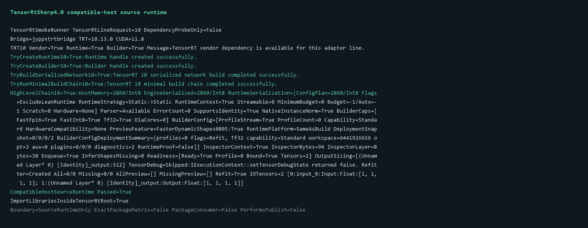

# 使用 TensorRtSharp4.0 验证 TensorRT 10 同主版本兼容宿主

> 项目：TensorRtSharp4.0
>
> 主要库：`JYPPX.TensorRtSharp`、`JYPPX.CudaSharp`、`jyppxtrtbridge`
>
> 验证程序：`smoke/TensorRtSmokeRunner`
>
> 本机结果：TensorRT 10.13、CUDA 11.8、NVIDIA GeForce RTX 3060 Laptop GPU
>
> 证据边界：本文验证当前源码编译出的 bridge 在一个 TensorRT 10 兼容宿主上真实运行，不是 10.11 精确发布矩阵、NuGet 包消费者或发布证明。

## 1. 项目与验证目标

TensorRtSharp4.0 用 C# 封装 NVIDIA TensorRT 与 CUDA。TensorRT 公开 API 归入 `JYPPX.TensorRtSharp` 及其子命名空间，CUDA 公开 API 归入 `JYPPX.CudaSharp` 及其子命名空间；`jyppxtrtbridge` 负责在托管层和 NVIDIA C++ API 之间提供稳定 C ABI。

第一版发布矩阵需要区分两类结论：

1. **精确发布矩阵验证**：例如 `win-x64-trt10.11-cuda12.9-cudnn9.22`，要求 SDK、bridge-only 包键和运行时版本全部精确匹配。
2. **同主版本兼容宿主验证**：用另一个 TensorRT 10.x SDK重新编译当前源码，并真实创建 runtime、builder、engine 和 execution context，用于发现同主版本内的源码或 ABI 退化。

本机同时安装了 TensorRT 10.13 与 CUDA 11.8，因此本文完成第二类验证。它能回答“当前源码能否在另一个 TensorRT 10 小版本上编译并执行”，但不能替代 10.11 精确包键的发布验证。

## 2. 使用到的库与职责

| 组件 | 本文用途 | 由谁安装 |
| --- | --- | --- |
| `JYPPX.TensorRtSharp` | runtime、builder、network、engine、context 和环境探测 | 项目源码 |
| `JYPPX.CudaSharp` | CUDA stream 与 device memory | 项目源码 |
| `jyppxtrtbridge` | 调用 TensorRT 10 与 CUDA 11.8 native API | 从当前源码编译 |
| TensorRT 10.x SDK | headers、import libraries 和运行 DLL | 用户从 NVIDIA 获取并安装 |
| CUDA Toolkit 11.8 | CUDA headers、libraries、runtime 与 `nvcc` | 用户从 NVIDIA 获取并安装 |
| .NET 8 SDK | 编译和运行 C# smoke runner | 用户安装 |

项目不会把 CUDA、cuDNN、TensorRT 或 NVRTC DLL 打进仓库或候选包。NVIDIA 依赖始终由使用者按自己的驱动、GPU 和 TensorRT 版本安装。

## 3. 模型获取与转换说明

本案例不使用外部深度学习模型：

- 模型名称：程序内创建的 FP32 identity network；
- 权重获取方式：不适用，没有权重下载；
- 权重许可证和 revision：不适用；
- ONNX 获取方式：不适用；
- ONNX 转换命令：不适用，网络通过 TensorRT Network API 直接创建；
- 外层 `models` 目录：不读写；
- 输入图片、检测框、分割 mask、OBB 或关键点：不适用；
- 可视化结果：使用真实程序终端截图。

因此本文没有伪造一个 ONNX 文件放入模型目录。视觉案例仍必须分别写明模型官方来源、固定 revision、许可证、转换命令、输入输出合同、SHA256 和外层 `models` 暂存位置，并展示原图叠加推理结果。

## 4. 环境准备

先从 NVIDIA 官方渠道安装 TensorRT 10.x 和兼容的 CUDA Toolkit，再定义只在当前终端有效的环境变量：

```powershell
$env:TENSORRT_SDK_ROOT = '<TensorRT-10.x-SDK-root>'
$env:CUDA_SDK_ROOT = '<CUDA-11.8-toolkit-root>'
```

SDK 根目录至少应包含：

```text
TensorRT SDK
|- include/NvInfer.h
`- lib/nvinfer_10.lib

CUDA Toolkit
|- include/cuda_runtime.h
`- bin/nvcc.exe
```

验证脚本不猜测任意下载目录。缺少 `NvInfer.h` 或 `nvcc.exe` 时立即失败，避免拿旧环境继续运行。

## 5. 为什么要校验 CMake 缓存

CMake 的 `find_library` 会把 `TensorRT_NVINFER_LIBRARY`、`TensorRT_NVINFER_PLUGIN_LIBRARY` 和 `TensorRT_NVONNXPARSER_LIBRARY` 写入构建目录缓存。如果只修改 `JYPPX_TENSORRT_ROOT`，旧缓存可能仍指向另一个 TensorRT SDK：配置摘要显示新版本，链接器却读取旧目录。

`CMakeLists.txt` 现在会在 `find_package(TensorRT)` 前检查这些缓存项。只要 import library 不位于当前选择的 `TensorRT_ROOT` 下，就清除缓存并重新发现。验证脚本在配置后再次读取 `CMakeCache.txt`，要求三个库都存在且都位于所选 SDK 内；任何一个不满足都会终止，不进入 runtime。

这个检查解决的是构建真实性问题：输出中的 `TensorRT_VERSION=10.13.0` 必须和实际链接的 `nvinfer_10.lib` 来源一致。

## 6. 一键执行源码兼容宿主验证

在仓库根目录执行：

```powershell
powershell.exe -NoProfile -ExecutionPolicy Bypass `
  -File .\eng\Test-CompatibleHostSourceRuntime.ps1 `
  -TensorRtLine 10 `
  -TensorRtRoot $env:TENSORRT_SDK_ROOT `
  -CudaRoot $env:CUDA_SDK_ROOT
```

脚本依次完成：

1. 校验 SDK 目录和必要文件；
2. 用 `win-x64-trt10-cuda11-release` preset 配置当前源码；
3. 检查三个 TensorRT import library 都来自当前 SDK；
4. 编译 `jyppxtrtbridge.dll`；
5. 设置仅对当前子进程有效的 bridge 与 vendor runtime 搜索路径；
6. 运行 `TensorRtSmokeRunner --tensor-rt-line 10`；
7. 检查 runtime、builder、serialized network、最小构建链和 high-level enqueue；
8. 输出去路径化 transcript、JSON、Markdown 与真实终端截图。

脚本没有 `dotnet pack`、`dotnet nuget push`、`git tag` 或 `gh release create`。它只验证当前源码，不创建或发布任何包。

## 7. 程序内部执行流程

`TensorRtSmokeRunner` 首先调用 `TensorRtEnvironmentProbe.GetCurrent()`，确认 bridge 报告的 TensorRT/CUDA 编译版本和可用 adapter line。随后对 TensorRT 10 执行两层验证。

底层 smoke 链依次创建 runtime 和 builder，再生成最小 serialized network。任一步骤返回空 handle、错误码或异常，最终 marker 都不会是 `True`。

高层链使用 public C# API：

```csharp
using TensorRtLogger logger = new(TensorRtApiLine.TensorRt10);
using TensorRtRuntime runtime = new(logger);
using TensorRtBuilder builder = new(logger);
using TensorRtBuilderConfig config = builder.CreateBuilderConfig();
using TensorRtNetworkDefinition network = builder.CreateNetwork();
using TensorRtHostMemory plan = builder.BuildSerializedNetwork(network, config);
using TensorRtEngine engine = runtime.Deserialize(plan);
using TensorRtExecutionContext context = engine.CreateExecutionContext();
using CudaStream stream = new();

context.EnqueueAsync(stream);
stream.Synchronize();
```

真实程序还会绑定 input/output tensor 地址、执行 shape inference、查询 readiness、序列化 engine、创建 inspector 和 refitter。文章代码只保留主干，完整实现以 `smoke/TensorRtSmokeRunner/Program.cs` 为准。

## 8. 通过条件与失败条件

脚本要求以下真实 stdout marker 全部存在：

```text
TryCreateRuntime10=True:
TryCreateBuilder10=True:
TryBuildSerializedNetwork10=True:
TryRunMinimalBuildChain10=True:
HighLevelChain10=True:
```

最后一行还必须包含 `Enqueue=True`。仅完成依赖探测、仅生成 DLL、仅创建 runtime 或只看到构建命令退出码为零，都不能判定通过。

以下情况会 fail closed：

- TensorRT/CUDA 根目录不存在；
- 必需 header 或 `nvcc` 缺失；
- import library 仍指向另一个 TensorRT root；
- bridge 没有生成；
- bridge 报告的 adapter line 与请求不一致；
- runtime、builder、serialized network 或 enqueue 任一步失败；
- transcript 中缺少任一必需 marker。

## 9. 本机真实执行结果

本次实际输出的关键行如下：

```text
TensorRtSmokeRunner TensorRtLineRequest=10 DependencyProbeOnly=False
Bridge=jyppxtrtbridge TRT=10.13.0 CUDA=11.8
TRT10 Vendor=True Runtime=True Builder=True Message=TensorRT vendor dependency is available for this adapter line.
TryCreateRuntime10=True:Runtime handle created successfully.
TryCreateBuilder10=True:Builder handle created successfully.
TryBuildSerializedNetwork10=True:TensorRT 10 serialized network build completed successfully.
TryRunMinimalBuildChain10=True:TensorRT 10 minimal build chain completed successfully.
HighLevelChain10=True:HostMemory=2860/Int8 ... Enqueue=True ...
CompatibleHostSourceRuntime Passed=True
ImportLibrariesInsideTensorRtRoot=True
Boundary=SourceRuntimeOnly ExactPackageMatrix=False PackageConsumer=False PerformsPublish=False
```



截图来自同一次真实 smoke transcript，长的 high-level 行只做等宽换行，没有更改成功值。完整输出保存在 `artifacts/real-case/tensorrt10-compatible-host-source-runtime/tensorrt-smoke-transcript.txt`，截图和 transcript 的长度、SHA256 位于同目录 JSON 证据中。

| 检查项 | 本机结果 |
| --- | ---: |
| bridge 编译版本 | TensorRT 10.13.0 / CUDA 11.8 |
| runtime 创建 | True |
| builder 创建 | True |
| serialized network | True |
| minimal build chain | True |
| high-level chain | True |
| enqueue 与同步 | True |
| import libraries 位于所选 SDK | True |
| NVIDIA DLL 写入仓库或包 | False |
| 创建 tag、Release 或发布包 | False |

## 10. 如何复查证据

结构化证据记录以下信息：

- 当前 source commit；
- preset 与 SDK 标签；
- TensorRT、CUDA、GPU 和驱动版本；
- 三个 import library 文件名与 SHA256；
- bridge SHA256；
- 五个 runtime 成功状态和 enqueue 状态；
- transcript 与截图的相对路径、长度和 SHA256；
- `isExactPackageMatrixEvidence=false`、`isPackageConsumerRuntimeProof=false` 和 `performsPublish=false`。

复查时先比较 transcript 与截图哈希，再确认 JSON 没有本地绝对路径。SDK 本体不进入仓库，import library 只记录哈希，不复制文件。

## 11. 10.13 结果不能证明什么

TensorRT 10 的 ABI 与 API 会随小版本演进。本次通过说明当前源码能针对 10.13 headers/import libraries 编译，并在同一 10.13 runtime 上完成真实链路。它不允许推出以下结论：

- 10.11 精确 bridge-only 候选包已经验证；
- TRT8、TRT11 或 Linux 已由本次运行覆盖；
- 本地源码引用等同于仓库外 NuGet PackageReference 消费；
- GitHub Packages、NuGet 或 GitHub Release 已准备好发布；
- Owner 已批准 tag、Release 或版本发布。

第一版发布前仍要在每个正式 runtime key 的兼容主机上执行精确 bridge-only 包和干净消费者验证。本机缺少的 SDK/操作系统组合必须在发布说明中明确列为未实机验证，而不是用本文结果替代。

## 12. 结论

当前 TensorRtSharp4.0 源码已在 TensorRT 10.13、CUDA 11.8 和 RTX 3060 Laptop GPU 上重新编译并完成真实 runtime、builder、serialized network、engine、execution context 与 enqueue 链路。CMake 的 TensorRT root 切换缓存也已改为自动失效并由脚本二次核验。

这是一条可重复的同主版本兼容性证据。项目仍处于开发收口阶段，不创建 tag、不创建 GitHub Release、不发布新包；正式发布矩阵继续要求精确版本和独立包消费者证明。
