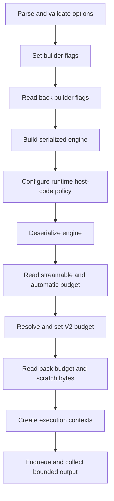

# TensorRtExec Engine Packaging、Refit 与 Weight Streaming 实战

TensorRtExec 和 OnnxToEngine 已把官方 `trtexec` 中一组容易被误写成“解析完成”的参数推进到真实 TensorRT 行为：version-compatible plan、lean runtime 排除、refit、weight stripping，以及 weight streaming budget。

本文说明参数约束、跨版本差异、运行顺序和一组基于官方 YOLOX-S 的真实权重测试。这里证明的是 builder/engine policy 能正确 set/readback，并完成本地模型 enqueue；它不是跨版本部署、模型精度、公开包消费或发布批准。

## 1. 参数与实际作用

| 参数 | 实际 API | 当前行为 |
| --- | --- | --- |
| `--versionCompatible` | `BuilderFlag::kVERSION_COMPATIBLE` | TRT8/10/11 set/readback |
| `--excludeLeanRuntime` | `BuilderFlag::kEXCLUDE_LEAN_RUNTIME` | 要求同时指定 version compatible；TRT8/10/11 set/readback |
| `--refit` | `BuilderFlag::kREFIT`、`ICudaEngine::isRefittable` | config readback；可反序列化时再检查 engine readback |
| `--stripWeights` | `kSTRIP_PLAN` + refit mode | TRT10/11；默认 `kREFIT_IDENTICAL`，同时指定 `--refit` 时改用 `kREFIT` |
| `--allowWeightStreaming` | `BuilderFlag::kWEIGHT_STREAMING` | TRT10/11；构建时要求 strongly typed |
| `--weightStreamingBudget` | `ICudaEngine::setWeightStreamingBudgetV2` | TRT10/11；context 创建前 set/get，并读取 streamable/scratch 大小 |

`--dumpRefit`、`--markDebug` 和 `--dumpDebugTensors` 没有被连带提升。它们仍需要模型相关的 refit inventory、debug tensor 生命周期和输出证据，因此继续保留在 `ParseOnlyOptions`。

## 2. 为什么应用顺序重要

Weight streaming budget 不能在 execution context 活跃时修改。TensorRtExec 固定使用以下顺序：



报告只有在日志同时包含 `Applied=True` 和 `ReadbackMatch=True` 时，才把参数加入 `OptionImplementationStatus.AppliedOptions`。dry-run、依赖不可用、版本不支持或 readback 不一致都会留在 `ParseOnlyOptions`。

## 3. Weight streaming budget 语法

支持官方四类值：

| 输入 | 含义 | V2 budget 解析 |
| --- | --- | --- |
| `-2` | 禁用运行期 weight streaming | 使用全部 streamable weights 大小 |
| `-1` | TensorRT 自动预算 | 调用 `getWeightStreamingAutomaticBudget()` |
| `50%` | 50% 可流式权重驻留 GPU | `streamableWeights * 50 / 100` |
| `512MiB`、`768K`、`1048576B` | 精确 GPU 权重预算 | 解析为精确字节数 |

百分比范围必须是 `0..100`。精确预算不能超过 `Int64.MaxValue`，且必须解析成完整字节。为了兼容项目已有命令，无后缀数字仍按 MiB 处理；需要官方字节语义时应显式写 `B`、`K`、`M` 或 `G`。

构建新 engine 时还有两个约束：

```text
--allowWeightStreaming requires --stronglyTyped
--weightStreamingBudget requires --allowWeightStreaming
```

`--loadEngine` 例外：engine 已经在别处按 weight-streaming flag 构建，因此只需要提供 budget，不应再次伪造 builder flag。

## 4. Version-compatible plan 与 lean runtime

包含 lean runtime 的 version-compatible plan 带有可执行 host code。反序列化前，TensorRtExec 会通过 typed runtime property 设置：

```csharp
runtime.EngineHostCodeAllowed = true;
bool readback = runtime.EngineHostCodeAllowed;
```

日志必须出现：

```text
TrtexecRuntimePolicy Name=EngineHostCodeAllowed Applied=True Requested=True Readback=True ReadbackMatch=True
```

`--excludeLeanRuntime` 会生成不嵌入 lean runtime 的 plan。当前应用尚未接入外部 `leanDLLPath` 生命周期，所以该选项要求 `--buildOnly` 或 `--skipInference`。这不是功能缺失被静默忽略，而是避免生成后立即用错误 runtime 路径加载。

## 5. Strip weights 与 refit mode

官方 `trtexec` 对 `--stripWeights` 的默认语义不是“只设一个 strip bit”：

- 只指定 `--stripWeights`：`StripPlan + RefitIdentical`。
- 同时指定 `--stripWeights --refit`：`StripPlan + Refit`。

TensorRtExec 对两个 flag 都执行 readback。默认模式的关键日志为：

```text
TrtexecDeploymentControl Name=StripWeights Applied=True Requested=True Readback=True RefitMode=RefitIdentical RefitReadback=True ReadbackMatch=True
```

stripped plan 在推理前必须重新提供权重。当前批次只实现 build policy，不把“原始 ONNX 权重仍在进程中”冒充完整 refit lifecycle，因此 `--stripWeights` 也要求 build-only/skip-inference。后续完整实现必须单独证明权重来源、名称映射、缺失权重、refit 结果和 engine hash。

## 6. TRT10 version-compatible + refit 命令

以下命令使用内置 dynamic identity model，验证 config flag、host-code runtime policy、engine refittable readback、deserialize、enqueue 和 output match：

```powershell
dotnet .\samples\OnnxToEngine\bin\Debug\net8.0\OnnxToEngine.dll `
  --tensor-rt-line 10 `
  --versionCompatible `
  --refit `
  --iterations 1 `
  --warmUp 0 `
  --duration 0 `
  --exportReport .\artifacts\real-case\trtexec-engine-packaging-policy\trt10-version-compatible-refit.json
```

本次结果：

```text
VersionCompatible Applied=True ReadbackMatch=True
Refit Applied=True ReadbackMatch=True
EngineHostCodeAllowed Readback=True ReadbackMatch=True
TrtexecEnginePolicy Name=Refit Readback=True ReadbackMatch=True
EngineFileRoundTrip=True
OutputMatch=True
```

## 7. 用官方 YOLOX-S 验证非零权重预算

先按仓库的固定来源和 SHA256 获取资产：

```powershell
pwsh -NoProfile -ExecutionPolicy Bypass `
  -File .\eng\Acquire-YoloXOfficialAssets.ps1
```

默认输出位于 E 盘：

```text
..\downloads\yolox-apache
```

本次固定资产：

| 资产 | 长度 | SHA256 |
| --- | ---: | --- |
| `yolox_s.onnx` | 35,858,002 | `c5c2d13e59ae883e6af3b45daea64af4833a4951c92d116ec270d9ddbe998063` |
| YOLOX 输入 tensor | 4,915,200 | `ca4e22bc6d8ebfe70f5aefeae8957d9ad15eb8d3bf99b6a42e016436dcbf1528` |

执行 50% 预算：

```powershell
$onnx = '..\downloads\yolox-apache\source\yolox_s.onnx'
$input = '..\downloads\yolox-apache\derived\dog-yolox-s-1x3x640x640-bgr-top-left.fp32.bin'

dotnet .\samples\OnnxToEngine\bin\Debug\net8.0\OnnxToEngine.dll `
  --tensor-rt-line 10 `
  --onnx $onnx `
  --saveEngine .\artifacts\real-case\trtexec-engine-packaging-policy\yolox-weight-streaming.plan `
  --stronglyTyped `
  --allowWeightStreaming `
  --weightStreamingBudget 50% `
  --loadInputs "images:$input" `
  --iterations 1 `
  --warmUp 0 `
  --duration 0 `
  --exportReport .\artifacts\real-case\trtexec-engine-packaging-policy\trt10-yolox-weight-streaming-50-percent.json
```

真实 readback：

| 字段 | 值 |
| --- | ---: |
| streamable weights | 35,829,504 bytes |
| automatic budget | 35,829,504 bytes |
| 50% resolved budget | 17,914,752 bytes |
| budget readback | 17,914,752 bytes |
| scratch memory | 5,901,824 bytes |
| input | `images [1,3,640,640]` |
| output | `output [1,8400,85]` |

非零 scratch bytes 和小于 streamable weights 的 readback 说明本次不是零权重 identity 上的形式验证。bounded runtime 完成一次 enqueue 和 output capture；由于 OnnxToEngine 的通用 runner 不执行 YOLOX decode/NMS，这条输出仍分类为 `captured-unverified`。真正的检测正确性由 YoloVision 教程和 output validator 负责。

## 8. Load-engine 自动预算

对已经按 weight-streaming flag 构建的 engine，可直接使用：

```powershell
dotnet .\samples\OnnxToEngine\bin\Debug\net8.0\OnnxToEngine.dll `
  --tensor-rt-line 10 `
  --loadEngine .\artifacts\real-case\trtexec-engine-packaging-policy\yolox-weight-streaming.plan `
  --weightStreamingBudget -1 `
  --loadInputs "images:$input" `
  --iterations 1 `
  --warmUp 0 `
  --duration 0
```

本次 readonly diagnostics 复制到 2 个 I/O tensor、206 层和 1 个 profile；automatic budget/readback 都是 35,829,504 bytes，scratch 为 0，随后 bounded enqueue 成功。

## 9. 跨版本差异

| 行为 | TRT8 | TRT10 | TRT11 |
| --- | --- | --- | --- |
| version compatible | applied/readback | applied/readback | vendor API 存在；本机 runtime blocker 前未到达 build |
| exclude lean runtime | applied/readback | applied/readback | vendor API 存在；本机 runtime blocker 前未到达 build |
| refit 单独使用 | applied/readback | applied/readback + engine readback | vendor API 存在 |
| version compatible + refit | vendor readback conflict，refit parse-only | applied/readback | 本机 dependency-probe-only |
| strip weights | parse-only | `StripPlan + RefitIdentical/Refit` | vendor API 存在 |
| weight streaming | parse-only | builder + engine budget readback | vendor API 存在 |

TRT11 当前主机在 runtime creation 遇到已知 structured exception `3228369022`，所以报告保持 `dependency-probe-only`。不能用 header、enum mapping 或 capability probe 代替真实 builder/runtime 结果。

## 10. 证据生成与严格验证

原始报告收敛为 compact evidence：

```powershell
pwsh -NoProfile -ExecutionPolicy Bypass `
  -File .\eng\Export-TrtexecEnginePackagingRuntimeEvidence.ps1

pwsh -NoProfile -ExecutionPolicy Bypass `
  -File .\eng\Test-TrtexecEnginePackagingRuntimeEvidence.ps1 `
  -Strict
```

输出：

```text
artifacts/interface-coverage/trtexec-engine-packaging-runtime-evidence.json
artifacts/interface-coverage/trtexec-engine-packaging-runtime-evidence.md
artifacts/interface-coverage/trtexec-engine-packaging-runtime-evidence-validation.json
artifacts/interface-coverage/trtexec-engine-packaging-runtime-evidence-validation.md
```

本次 strict 结果为 `20 checks / 0 failures`。

## 11. 常见错误

`--excludeLeanRuntime requires --versionCompatible`：exclude bit 在没有 version-compatible 时会被 vendor 忽略，因此 parser 直接拒绝无效组合。

`--allowWeightStreaming requires --stronglyTyped`：weight-streaming engine 必须用 strongly typed network 构建。

`--stripWeights requires --buildOnly or --skipInference`：当前命令没有完整 refit input，不能对缺权重 plan 直接推理。

`ReadbackMatch=False`：请求没有真实进入目标 TensorRT line。该选项不会进入 `AppliedOptions`，应先查看 `VersionGuard` 和 `Reason`，不能只看 `ParsedOptions`。

## 12. 证据边界与清理

本批证明：

- 官方预算 grammar 能规范化并 fail closed。
- builder flag 使用稳定 logical enum 到 TRT8/10/11 raw index 的映射。
- TRT10 version-compatible/refit plan 可 round-trip 并输出匹配。
- TRT10 对真实 YOLOX-S 权重得到非零 budget/scratch readback并完成 enqueue。
- TRT8 和 TRT11 不支持或环境阻塞的路径没有被伪装成 applied。

本批没有证明：

- plan 在更新 TensorRT 版本或外部 lean runtime 中成功运行。
- stripped plan 已通过完整 refit lifecycle 恢复权重。
- YOLOX 通用 output capture 已完成 decode、NMS 和精度验证。
- 公开 NuGet/GitHub 包已被仓库外 consumer 使用。
- 已执行包发布、GitHub Release 上传或 issue close。

未显式指定 `--saveEngine` 时，临时 plan 使用系统 temp，并由 `finally` 删除。本文命令显式生成的 40 MB 级 YOLOX plan 位于 E 盘 ignored evidence 目录，生成 compact evidence 后应删除；模型和输入资产是否保留由后续 YoloVision 文章需要决定，不应删除 CUDA、TensorRT、NuGet、Codex 或系统缓存。
