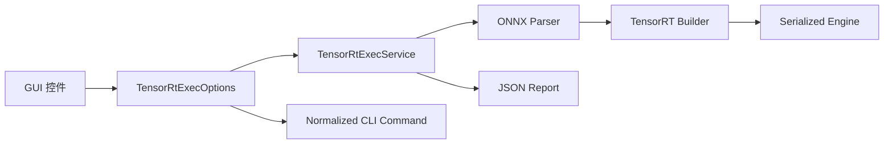

# 使用 TensorRtExec GUI 将 ONNX 构建为 TensorRT Engine

`applications/TensorRtExec` 是 TensorRtSharp4.0 提供的 Windows 桌面构建工具。它把 ONNX 路径、Engine 输出、TensorRT 版本线、精度、动态 Shape、Workspace 和报告参数集中在一个 WinForms 页面中，适合需要人工检查模型构建配置的 Windows 用户。

本文不只罗列控件，而是使用 NVIDIA TensorRT sample data 中的 MNIST ONNX 完成一次真实 GUI 构建：启动 Release 程序、填写模型和输出、点击 `Run`、确认 ONNX Parser 与 Builder 可用、生成 Engine 和 JSON 报告，并展示同一次运行的真实软件窗口。

## 适用读者

- 第一次在 Windows 上使用 TensorRtSharp4.0 构建 TensorRT Engine 的开发者。
- 希望把 GUI 配置还原为 CLI 命令并保留可审计报告的模型部署工程师。
- 需要区分 Engine 构建证据与模型推理证据的项目维护者。

## 解决问题

本文解决以下具体问题：

1. TensorRtExec GUI 依赖项目中的哪些库。
2. 演示模型从哪里获取、是否需要再次转换、为什么不提交 Git。
3. 如何配置 GUI 并执行一次真实的 ONNX Parser/Builder 流程。
4. 如何根据软件页面和 JSON 报告判断 Engine 是否成功生成。
5. 为什么 `build-only` 成功仍不能写成任意模型的 runtime proof。

## 项目与依赖库

| 组件 | 本文中的职责 |
| --- | --- |
| `applications/TensorRtExec` | WinForms 页面、CLI 入口、options 与报告组织。 |
| `JYPPX.TensorRtSharp.Tools` | 共享 `TrtexecLikeOptions`、ONNX 构建服务和诊断报告。 |
| `JYPPX.TensorRtSharp` | TensorRT Runtime、Builder、Network、Parser 和 Engine 的 C# 包装。 |
| `JYPPX.CudaSharp` | CUDA 设备与运行环境探测。 |
| `jyppxtrtbridge` | 项目自有 C++ bridge；按 TensorRT/CUDA 版本编译。 |
| NVIDIA TensorRT | 解析 ONNX 并构建 serialized Engine。 |
| Windows Forms | 提供实际桌面操作页面。 |

CUDA、cuDNN、TensorRT 和 NVRTC 由用户自行安装。项目只构建自己的 bridge，不把 NVIDIA 运行库打进源码包、NuGet 包或 GitHub Release。

## 背景与场景

TensorRtExec 的 GUI 和 CLI 共用 `TensorRtExecOptions`、`TensorRtExecService` 与同一份报告 schema。GUI 中点击 `Preview` 生成的命令可以交给 CLI 或 CI 复现；点击 `Run` 则调用相同的 ONNX build 服务。这样可以避免桌面页面拥有一套无法自动化的隐藏行为。

外部 ONNX 的输入预处理、输出 tensor 语义和后处理并不统一，所以 GUI 默认勾选 `Build only` 与 `Skip inference`。这次运行验证的是模型可以被解析并生成 Engine；MNIST 的真实输入、GPU 推理、预测结果和 ONNX Runtime 对照由 [MNIST ONNX 到 Engine 完整推理教程](onnx-to-engine-quickstart.md) 单独证明。

## 模型获取、许可证与转换

本文使用 TensorRT 10.11 sample data 的 `data/mnist/mnist.onnx`。同目录 README 将该模型归因于 ONNX Model Zoo。它已经是 opset 8 ONNX 文件，因此本例的转换方式是：**直接使用上游 ONNX，不再执行 PyTorch 或 TensorFlow 到 ONNX 的二次导出**。

本项目没有取得模型文件的独立再分发授权，因此只把它暂存在 Git 仓库外层的统一 `models` 目录，不上传当前 GitHub 仓库。可从仓库根目录执行：

```powershell
$RepositoryRoot = (Get-Location).Path
$WorkspaceRoot = Split-Path $RepositoryRoot -Parent
$ModelDirectory = Join-Path $WorkspaceRoot 'models\OnnxToEngine\MNIST\nvidia-tensorrt-10.11'
$TensorRtModel = Join-Path $env:JYPPX_TENSORRT_ROOT 'data\mnist\mnist.onnx'
$ModelPath = Join-Path $ModelDirectory 'mnist.onnx'

New-Item -ItemType Directory -Path $ModelDirectory -Force | Out-Null
Copy-Item -LiteralPath $TensorRtModel -Destination $ModelPath -Force
Get-Item -LiteralPath $ModelPath | Select-Object Name, Length
Get-FileHash -LiteralPath $ModelPath -Algorithm SHA256
```

固定模型信息：

| 字段 | 值 |
| --- | --- |
| 文件 | `mnist.onnx` |
| 长度 | `26,454` bytes |
| SHA256 | `2f06e72de813a8635c9bc0397ac447a601bdbfa7df4bebc278723b958831c9bf` |
| Opset | `8` |
| 来源 | TensorRT 10.11 sample data，README 归因于 ONNX Model Zoo |
| ONNX 转换 | 上游已经提供 ONNX，不做二次转换 |
| 暂存 | `<workspace>/models/OnnxToEngine/MNIST/nvidia-tensorrt-10.11/mnist.onnx` |
| Git 跟踪 | 否 |

如果哈希不同，应先确认 TensorRT sample data 版本，不要用同名文件覆盖固定案例。后续 Model Zoo 建立后再迁移模型分发；当前仓库仍只保存获取方式、转换说明和哈希。

## 代码与文件入口

- `applications/TensorRtExec/Program.cs`：选择 CLI 或 WinForms 入口。
- `applications/TensorRtExec/WinForms/MainForm.cs`：页面控件、命令预览和运行日志。
- `applications/TensorRtExec/Core/TensorRtExecOptions.cs`：GUI/CLI 共用参数模型。
- `applications/TensorRtExec/Core/TensorRtExecService.cs`：调用 ONNX Engine 构建服务。
- `src/JYPPX.TensorRtSharp.Tools/Build`：Parser、Builder、Engine 与报告实现。
- `applications/TensorRtExec/tensor-rt-exec-gui-cli-field-map.json`：GUI 到 CLI 字段合同。
- `samples/assets/tensorrtexec-gui-article-runtime-evidence.json`：本文运行的机器可读摘要。

## 执行流程



GUI 只负责收集输入和展示结果。Parser、Builder 与报告逻辑位于可复用工具层，CLI 不需要复制另一套实现。

## 环境准备

本次实测环境为 Windows 11、NVIDIA GeForce RTX 3060 Laptop GPU、驱动 576.02、CUDA 12.9、TensorRT 10.11.0.33 和 .NET SDK 10.0.301。

构建应用：

```powershell
dotnet build .\applications\TensorRtExec\TensorRtExec.csproj `
  -c Release `
  /m:1 `
  /p:UseSharedCompilation=false `
  /nr:false
```

在启动进程前配置本机依赖位置：

```powershell
$env:JYPPX_TENSORRT_ROOT = '<TensorRT-root>'
$env:JYPPX_NATIVE_BRIDGE_PATH = '<repo>\build-out\win-x64-trt10-cuda12-release\bin\Release\jyppxtrtbridge.dll'
$env:JYPPX_ENABLE_DEVELOPMENT_PROBING = 'true'

dotnet run --project .\applications\TensorRtExec\TensorRtExec.csproj `
  -c Release `
  --no-build `
  -- --ui
```

不传参数启动时同样进入 GUI。要进入 CLI，需传入 `--onnx`、`--saveEngine` 等构建参数。

## 页面配置

下图是本文真实运行前的 TensorRtExec 窗口。ONNX 与 Engine 使用相对路径显示；模型实际位于外层 `models` 暂存目录。


图片来源：由本文同一次 Release WinForms 运行通过 Windows `PrintWindow` 直接捕获。截图展示真实应用控件，不含作者机器绝对路径，也不是设计稿。

关键字段：

| GUI 字段 | 本例值 | CLI 参数 | 作用 |
| --- | --- | --- | --- |
| ONNX | `../models/.../mnist.onnx` | `--onnx` | 输入 ONNX。 |
| Save Engine | `artifacts/tensorrtexec-gui/mnist-gui.plan` | `--saveEngine` | Engine 输出。 |
| TensorRT | `10` | `--tensor-rt-line 10` | 选择 TensorRT 10 adapter。 |
| TF32 | 开启 | 默认 TF32 | Builder flag 设置并 read back。 |
| Workspace MiB | `64` | `--workspace 64` | Workspace 上限为 67,108,864 bytes。 |
| Profiling | `layer_names_only` | `--profilingVerbosity` | Builder profiling verbosity。 |
| Opt Level | `3` | `--builderOptimizationLevel 3` | Builder optimization level。 |
| Report | `artifacts/.../mnist-gui-report.json` | `--exportReport` | 结构化构建报告。 |
| Build only | 开启 | `--buildOnly` | 构建 Engine，不执行模型推理。 |
| Skip inference | 开启 | `--skipInference` | 明确禁止猜测外部模型语义。 |

动态模型还应填写 `Min Shapes`、`Opt Shapes` 和 `Max Shapes`，格式为 `tensor:dimxdim...`。MNIST 模型是固定输入，本例不设置 Optimization Profile。

## 操作路径

1. 选择或填写外层 `models` 目录中的 `mnist.onnx`。
2. 将 `Save Engine` 指向 Git 忽略的 `artifacts` 目录。
3. 选择与本机安装一致的 TensorRT 版本线。
4. 确认 Workspace、精度和 Builder 优化级别。
5. 将报告保存为 JSON。
6. 保持 `Build only` 与 `Skip inference` 开启。
7. 点击 `Preview`，确认命令中没有错误的 Shape、版本线或输出位置。
8. 点击 `Run`，等待日志区显示 Parser、Engine 与环境状态。
9. 检查 `.plan` 和 JSON 报告均已生成。

本例脱敏后的等价命令为：

```text
--tensor-rt-line 10 --onnx <models>\mnist.onnx --saveEngine <artifacts>\mnist-gui.plan --workspace 64 --buildOnly --skipInference
```

程序内部的 `NormalizedCommandLine` 会记录规范化后的绝对路径，便于本机审计；文章和截图只展示可移植路径。

## 真实运行结果

修复 GUI 日志行高度后，同一次真实构建的结果页如下。日志区域由应用真实控件显示，状态值来自本次 JSON 报告；截图前只把路径替换成文件名，Parser、Engine、TensorRT/CUDA 版本和可用性布尔值没有改动。


图片来源：由同一次 TensorRT 10.11 GUI 运行通过 Windows `PrintWindow` 直接捕获。命令和日志执行后做了路径脱敏，原始 JSON 报告、Engine 与哈希保存在 Git 外的本地 artifacts 中。

本次报告结果：

| 字段 | 结果 |
| --- | --- |
| `Success` | `true` |
| `State` | `external-onnx-build-only` |
| `Parsed` | `true` |
| `EngineSaved` | `true` |
| TensorRT | `10.11.0` |
| CUDA Toolkit | `12.9` |
| Runtime / Builder | `true / true` |
| Workspace | `67,108,864` bytes |
| TF32 requested/applied/readback | `true / true / true` |
| Parser diagnostics | `0` errors |
| Engine 长度 | `436,540` bytes |
| Engine SHA256 | `60a6d188956242b6b5c7d8f3ff65bb030902be0909139fba2f97369a3b4b7148` |
| Report 长度 | `19,569` bytes |
| Report SHA256 | `a4377624f7c3e0577434f09c7bcc89de195c5af1facc4e3fc06299dbeba3b2ef` |
| `ProofClassification` | `build-only` |
| `IsRuntimeExecutionProof` | `false` |

TensorRT Engine 与 GPU、TensorRT/CUDA 版本和 Builder 策略相关；重复构建的二进制哈希不保证相同，不能把本文哈希当作跨机器 golden。本文哈希只绑定这一次窗口截图与报告。

## 报告解读

文章运行产生的报告包含以下关键结构：

```json
{
  "Success": true,
  "State": "external-onnx-build-only",
  "TensorRtLine": 10,
  "Parsed": true,
  "EngineSaved": true,
  "InferenceRan": false,
  "ProofClassification": "build-only",
  "BuildEvidenceOnly": true,
  "IsRuntimeExecutionProof": false,
  "CapabilityProbe": {
    "TensorRtVersion": "10.11.0",
    "CudaToolkitVersion": "12.9",
    "RuntimeAvailable": true,
    "BuilderAvailable": true
  }
}
```

`Parsed=true` 说明 ONNX Parser 接受了模型；`EngineSaved=true` 说明 serialized Engine 已落盘。`InferenceRan=false` 是本例选择 `Build only` 的预期结果，不是构建失败。

## 模型推理与图像结果边界

TensorRtExec 无法替任意外部模型猜测输入预处理、tensor 名称、输出 layout、标签或后处理，因此本例不伪造 MNIST 识别结果图。需要验证数字 7 的真实预测时，应继续执行 [MNIST ONNX 到 Engine 完整推理教程](onnx-to-engine-quickstart.md)，其中包含真实 GPU 输出、输入 tensor 哈希、预测 `7`、置信度 `0.999993`、ONNX Runtime 对照与受控负例。

对于分类、检测、实例分割、Pose、OBB 和语义分割，项目的完整文章会把识别结果绘制到输入图像上，并同时提供程序运行窗口；入口见 [中文技术文章目录](README.md)。

## 常见问题

### 点击 Run 后没有日志

确认使用包含 GUI 日志行高度修复的版本。命令预览行固定为 38px，运行日志行固定为 180px；窗口底部可以滚动查看完整日志。

### ONNX model file was not found

GUI 会按进程工作目录解析相对路径。建议从仓库根目录启动，并先用 `Test-Path` 与 `Get-FileHash` 检查模型。不要为了消除错误把模型复制进 Git 仓库。

### Parser 成功但 Engine 构建失败

检查 TensorRT 版本线、动态 Shape、插件、Workspace 与模型算子支持。报告中的 copied parser diagnostics 用于定位问题，但属于 readonly diagnostics，不是 runtime proof。

### 为什么默认不推理

Engine 构建只需要网络与 Builder 配置；推理还需要模型专用输入、输出和验收逻辑。分类与视觉模型应进入对应 sample，而不是关闭校验强行让 GUI 猜测。

## 边界说明

本文证明源码树中的 WinForms 页面可以在兼容 Windows/GPU 主机上真实解析固定 MNIST ONNX 并保存 Engine 与报告。它不是任意外部模型的 runtime proof，也不是 package-consumer-runtime、public package 或 post-publish proof。

`dry-run`、template、local feed、ProjectReference、direct `.nupkg`、TensorRtExec report、YoloVision matrix、OnnxToEngine report 和 readonly diagnostics 都不能替代发布后真实消费者验证。本次工作没有执行包推送、创建 Tag、创建 Release 或上传模型。

## 验证与证据

- 机器可读摘要：`samples/assets/tensorrtexec-gui-article-runtime-evidence.json`。
- GUI 配置截图：`docs/images/tensorrtexec-gui-runtime-config.png`。
- GUI 结果截图：`docs/images/tensorrtexec-gui-runtime-result.png`。
- 完整原始报告与 Engine：保存在 Git 忽略的本地 `artifacts/tensorrtexec-gui`。
- 产品合同测试：`TensorRtExecApplicationTests`。

## 下一步

构建自己的模型时，下一步是根据任务类型进入 `samples/Classification`、`samples/YoloVision` 或基于 `TensorRtInferenceBindings` 编写模型专用推理代码，并为输入、输出、参考结果和失败条件建立明确合同。首版开发完成前仍保持所有发布门禁关闭。
