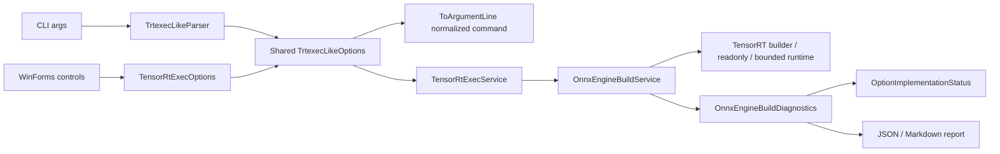

# TensorRtExec 参数分层与证据深挖

`applications/TensorRtExec` 不是只把官方 `trtexec` 参数名搬进 C#。它需要同时回答三个问题：参数是否能被 CLI/WinForms 接收、是否真的进入 TensorRT builder/runtime、以及现有证据最多能支持什么结论。把这三件事混在一起，就会把 parse-only 写成 implemented，或把 build report 写成模型运行证明。

本文绑定当前共享 parser、CLI/WinForms option model、machine-readable capability surface、GUI/CLI field map、parity matrix、gap list、report schema 和 validator，给出从离线审计到真实 owner handoff 的完整操作路径。

## 先读四种事实来源

| 来源 | 当前规模 | 回答的问题 | 不能证明 |
| --- | ---: | --- | --- |
| `TrtexecLikeOptionCapabilities` / `--help-json` | 33 entries | option group、alias、status、implementation class | 某次真实 build/runtime 已执行 |
| `tensor-rt-exec-gui-cli-field-map.json` | 90 fields | CLI token 与 WinForms control 是否进入同一 command surface | GUI 行为等于 native TensorRT 行为 |
| `tensor-rt-exec-trtexec-parity-matrix.json` | 分组 parity rows | 官方功能与当前 implementation/evidence gap | full trtexec parity 已完成 |
| `tensor-rt-exec-release-candidate-gap-list.json` | 20 items | 剩余实现/owner proof 动作 | release 已批准 |

当前 capability JSON 汇总为 33 entries、28 implemented/bounded、4 parse-or-diagnostic-only、1 blocked。数字描述 source-quality capability surface，不是 28 项 runtime proof。GUI/CLI field map 为 90 fields；gap list 同样记录 0 runtime proof items、0 package-consumer runtime proof items。

## 数据流



WinForms 的 command preview 来自同一 `ToArgumentLine()`，这能防止 CLI 和 GUI 的拼写/默认值漂移；它不能让一个 parse-only option 自动变成 applied。

## 状态词典

### Parsed

参数被 parser 接收并进入 normalized command/report。`ParsedOptions` 是入口证据，不表示 vendor API 被调用。

### Applied

参数通过本次实际路径的 gate：可能是 builder setter/readback、timing cache import/export、runtime scheduler control、engine refit/persist/reload，或其他明确实现。具体强度必须继续看 `implementationClass` 和 report snapshot。

### Parse-only

参数保留官方兼容入口和报告意图，但当前没有等价、owner-safe、跨版本可维护的 TensorRT 行为。它会进入 `ParseOnlyOptions`，不能用 CPU 近似或无关 setter 冒充。

### Blocked

实现依赖尚未建立安全生命周期。例如 `--int8/--calib` 当前是 `blocked-calibrator-lifecycle`：CLI/GUI 可以记录 intent，但 calibrator callback/cache ownership 与真实精度证据仍受设计门控制。

### Bounded runtime

兼容 float engine 可以创建 context/bindings/streams 并 enqueue/readback，scheduler 也可以应用 iterations、warmUp、duration、streams 等控制。没有 reference output、真实模型语义和 owner review 时，结果是 bounded infrastructure evidence 或 `runtime-output-captured-unverified`，不是 real-model runtime。

## 离线能力审计

无需模型、TensorRT、CUDA、plugin 或 engine：

```powershell
dotnet run --project .\applications\TensorRtExec -- --help-json
dotnet run --project .\applications\TensorRtExec -- --capabilities-json
```

输出 schema 是 `trtexec-like-option-capabilities.v1`，关键顶层字段包括：

```text
matrixState=source-quality-capability-surface
entryCount=33
implementedCount=28
parseOrDiagnosticOnlyCount=4
blockedCount=1
releaseFrozen=true
canPromoteRuntimeProof=false
```

每个 entry 都有 `option`、`aliases`、`group`、`status`、`implementationClass`、`proofBoundary`、`requiresOwnerEvidence=true`、`canPromoteRuntimeProof=false` 和 `canPromotePackageConsumerRuntime=false`。

`--help-json` 本身是请求 capability document 的 meta switch，不在 32 个 trtexec-like option entries 中；测试会防止它被误计为官方 parity option。

## E 盘工作区

```text
..\downloads\cases\tensorrtexec-option-audit
  models
  inputs
  engines
  caches
  reports
  outputs
  logs
  consumer
```

将 `NUGET_PACKAGES`、临时 consumer 和大模型产物也定向到 E 盘。本文所有命令都不要求把 ONNX、engine、plan、NuGet 包或 runtime 依赖下载到 C 盘。

## 第一层：Dry Run / Precheck

```powershell
dotnet run --project .\applications\TensorRtExec -- `
  --onnx ..\downloads\cases\tensorrtexec-option-audit\models\model.onnx `
  --saveEngine ..\downloads\cases\tensorrtexec-option-audit\engines\model.plan `
  --minShapes images:1x3x640x640 `
  --optShapes images:1x3x640x640 `
  --maxShapes images:4x3x640x640 `
  --fp16 --workspace 1GiB `
  --dryRun `
  --exportReport ..\downloads\cases\tensorrtexec-option-audit\reports\precheck.json
```

dry run 证明参数能解析、归一化和写报告，不读取 ONNX、不创建 builder、不构建 engine。检查 `DryRun=true`、`ProofClassification=precheck`、normalized command/hash 和 `BuildEvidenceOnly` 边界。

## 第二层：Build-Only

```powershell
dotnet run --project .\applications\TensorRtExec -- `
  --onnx ..\downloads\cases\tensorrtexec-option-audit\models\model.onnx `
  --saveEngine ..\downloads\cases\tensorrtexec-option-audit\engines\model.plan `
  --minShapes images:1x3x640x640 `
  --optShapes images:1x3x640x640 `
  --maxShapes images:4x3x640x640 `
  --fp16 `
  --workspace 1GiB `
  --memPoolSize workspace:512MiB,tacticDram:1GiB `
  --builderOptimizationLevel 4 `
  --maxAuxStreams 2 `
  --timingCacheFile ..\downloads\cases\tensorrtexec-option-audit\caches\input.cache `
  --exportTimingCache ..\downloads\cases\tensorrtexec-option-audit\caches\output.cache `
  --buildOnly `
  --exportReport ..\downloads\cases\tensorrtexec-option-audit\reports\build.json
```

build-only 可以形成 parser snapshot、builder config readback、timing cache artifact 和 serialized engine hash。它不运行用户输入，也不验证输出准确性。

## 第三层：Readonly Engine Diagnostics

```powershell
dotnet run --project .\applications\TensorRtExec -- `
  --loadEngine ..\downloads\cases\tensorrtexec-option-audit\engines\model.plan `
  --dumpLayerInfo `
  --exportLayerInfo ..\downloads\cases\tensorrtexec-option-audit\reports\layers.txt `
  --exportReport ..\downloads\cases\tensorrtexec-option-audit\reports\engine-readback.json
```

当 runtime 可用时，报告复制 engine/tensor/profile/inspector metadata、`ReadbackFingerprint` 和 `ReadbackSha256`。这是 pointer-free readonly diagnostics；没有 enqueue/output validation 时不是 runtime execution proof。

## 第四层：Bounded Runtime

```powershell
dotnet run --project .\applications\TensorRtExec -- `
  --loadEngine ..\downloads\cases\tensorrtexec-option-audit\engines\model.plan `
  --loadInputs images:..\downloads\cases\tensorrtexec-option-audit\inputs\input.bin `
  --iterations 10 --warmUp 200 --duration 3 `
  --streams 1 --avgRuns 10 --percentile 95 `
  --dumpOutput `
  --exportOutput ..\downloads\cases\tensorrtexec-option-audit\outputs\output.json `
  --exportTimes ..\downloads\cases\tensorrtexec-option-audit\outputs\times.json `
  --dumpRawBindingsToFile ..\downloads\cases\tensorrtexec-option-audit\outputs\bindings.bin `
  --exportReport ..\downloads\cases\tensorrtexec-option-audit\reports\runtime.json
```

bounded runtime 只在 engine/input/output 类型和 concrete shape 满足受控条件时执行。外部模型没有 expected output 时必须保留 `runtime-output-captured-unverified`。`--noDataTransfers`、CUDA graph fallback 或缺失 output readback 也会降低证据强度。

## 参数组判定表

| 参数组 | 代表 option | 当前实现分类 | 审查重点 |
| --- | --- | --- | --- |
| model | `--onnx --saveEngine --loadEngine` | build input/artifact + readonly/bounded runtime | 不把 engine existence 写成 output proof |
| profiles | `--minShapes --optShapes --maxShapes --shapes` | applied build option/alias | tensor name 和 dynamic range 必须来自模型 |
| memory | `--workspace --memPoolSize` | applied/readback | readback 只是 builder config acceptance |
| precision | `--fp16 --bf16 --noTF32` | applied/conditional | host support与数值准确性另行证明 |
| blocked precision | `--int8 --calib` | blocked calibrator lifecycle | callback/cache provenance/accuracy 未完成 |
| parse-only precision | `--fp8 --best` | parse/report-only | 不写成 builder 已应用 |
| IO/layer policy | `--inputIOFormats --precisionConstraints --layerPrecisions` | version-guarded readback | TRT11 移除项保持 guard |
| plugins | `--plugins --dynamicPlugins` | diagnostic-only | 不声明 load/register/execute |
| timing cache | `--timingCacheFile --exportTimingCache` | cache lifecycle | hash 是 build cache evidence |
| scheduler | `--iterations --warmUp --streams --infStreams` | bounded runtime control | 不等于模型正确性或性能结论 |
| wait controls | `--idleTime --sleepTime` | idle applied / sleep parse-only | 不用 CPU sleep 冒充 device launch gap |
| packaging/refit | `--stripWeights --refitFromOnnx --saveRefittedEngine` | version-guarded local lifecycle | local persist/reload 不是 public package proof |
| reports | `--exportReport --report` | structured report | alias 归一化，不提高 proof 等级 |

## OptionImplementationStatus

报告中的 `OptionImplementationStatus` 有三组数组：

- `ParsedOptions`：本次输入被接收。
- `AppliedOptions`：本次实际路径满足实现 gate。
- `ParseOnlyOptions`：保留 intent，但未应用等价 TensorRT 行为。

同一个 option 的分类会随执行路径和 TensorRT line 变化。例如 `--minTiming` 在 TRT8 可以走 legacy setter/readback，在 TRT10/11 仍保持 parse-only；`--l2LimitForTiling` 可能因 vendor setter 拒绝具体值而从 requested 进入 parse-only，同时报告实际 readback。

判定 applied 时应同时审查：

1. normalized command 是否包含请求。
2. 对应 native/managed route 是否在该 TRT line 可用。
3. report snapshot 是否记录 requested/readback/applied。
4. diagnostics 是否有 rejection/fallback/skipped reason。
5. 是否错误地用 capability probe 代替实际 setter/readback。

## Report Schema

`applications/TensorRtExec/tensor-rt-exec-report.schema.json` 与 `OnnxEngineBuildDiagnostics.ToJson` 对齐。高价值字段包括：

```text
ProofClassification
BuildEvidenceOnly
DryRun
NormalizedCommandLine
NormalizedCommandSha256
DeploymentOptions
BuilderConfigDeploymentSnapshot
ParserPreflightSnapshot
RuntimeOptions
InferenceRan
OutputMatch
PreflightMetadata
LoadedEngineDiagnostics
CapabilityProbe
OptionImplementationStatus
ReportBoundary
```

`CapabilityProbe` 只说明 API/host capability 可见；`BuilderConfigDeploymentSnapshot` 是 copied readback；`ParserPreflightSnapshot` 是 copied parser diagnostics。三者都不能单独晋级 runtime proof。

## Report Validator

```powershell
pwsh -NoProfile -ExecutionPolicy Bypass -File .\eng\Test-TensorRtExecReport.ps1 `
  -InputPath ..\downloads\cases\tensorrtexec-option-audit\reports\build.json `
  -OutputPath ..\downloads\cases\tensorrtexec-option-audit\reports\build-validation.json `
  -Strict
```

validator 检查 required fields、normalized command SHA256、option status、preflight/readback/capability boundary、forbidden substitutes 和 copied diagnostics boundary。通过说明报告结构可审计，不说明模型正确或包可发布。

## GUI/CLI 一致性

WinForms 用 `TensorRtExecOptions` 从控件创建同一套 `TrtexecLikeOptions`，command preview 调用 `ToArgumentLine()`。85 项 field map 记录 GUI control、CLI option、alias、status、implementation class 和 proof boundary。

生成并严格校验 field map：

```powershell
pwsh -NoProfile -ExecutionPolicy Bypass -File .\eng\Export-TensorRtExecGuiCliParityChecklist.ps1
pwsh -NoProfile -ExecutionPolicy Bypass -File .\eng\Test-TensorRtExecGuiCliParityChecklist.ps1 -Strict
```

启动 UI：

```powershell
dotnet run --project .\applications\TensorRtExec -- --ui
```

GUI 截图、command preview 和 field-map pass 都是 surface parity，不是 native behavior 或 runtime proof。

## 跨版本审查

每个 applied/readback 声明都应核对 TRT8/TRT10/TRT11：

- vendor header/symbol 是否存在。
- native manifest 和 version guard 是否一致。
- native bridge 是否返回 copied scalar/string/snapshot，而不是 borrowed pointer。
- managed wrapper 是否只暴露有语义的类型。
- unsupported/removed API 是否显式进入 parse-only/skipped diagnostic。
- smoke 和 test 是否覆盖对应 line，而不是只检查字符串存在。

TRT11 已移除的 layer precision setter、TRT8 不支持的现代 packaging/refit、calibrator/callback ownership 等不能通过统一 parser 掩盖版本差异。

## Gap List 怎么用

当前 gap list 的 20 items 分为 17 implemented-or-report-ready、2 partial-or-diagnostic、1 release-proof-record-only，runtime/package-consumer proof items 均为 0。它是下一步安排，不是失败清单，也不是 release pass。

对每个 item 依次问：

1. 缺口是 source implementation、compatible host proof 还是 owner evidence？
2. 是否能用 pointer-free copied/readback API安全提升？
3. 是否需要 callback、allocator、plugin 或 calibrator lifetime 设计？
4. 提升后应该进入 AppliedOptions，还是仍只能保留诊断？
5. 哪个 model/smoke/consumer 能证明实际用户价值？

## 常见误区

| 误区 | 正确判定 |
| --- | --- |
| normalized command 有参数，所以已实现 | 只证明 parsed；继续看 applied/readback |
| capability probe 看见 API，所以已应用 | probe 只证明可见性 |
| engine 文件存在，所以 runtime 通过 | 仅 build artifact，需 enqueue/output validation |
| `--loadEngine` 成功，所以模型正确 | 可能只有 readonly diagnostics |
| bounded output 已捕获，所以 real model passed | 没有 expected output/owner review 时仍 unverified |
| GUI 有控件，所以 CLI/GUI/full parity 完成 | 控件只证明 surface；field map 也不证明 native behavior |
| `--plugins` 已接受，所以 plugin 已加载 | 当前是 diagnostic path normalization |
| `--sleepTime` 可解析，所以 device delay 已实现 | 当前明确 parse-only |
| build report/sidecar 能关闭发布 issue | 必须由真实 release proof records 决定 |
| `blocked-by-cuda-driver` 等于 API 缺失 | 它是 compatible host owner action |

## 证据阶梯

| 等级 | 可证明 | 不可证明 |
| --- | --- | --- |
| capability JSON | source option surface | build/runtime execution |
| GUI/CLI field map | 两入口字段映射 | native behavior |
| dry-run/precheck | parse/normalize/report | ONNX parse/engine build |
| build-only | parser/builder/engine artifact | inference correctness |
| readonly diagnostics | engine metadata/readback | enqueue/output correctness |
| bounded runtime | 受控 enqueue/readback | 外部模型语义正确 |
| real-model-runtime | 特定模型、输入、expected output、log/hash/review | package consumption |
| package-consumer-runtime | clean external consumer 从目标包运行 | post-publish verification，除非另有记录 |

## Proof Boundary

`TrtexecAlignmentStatus=parse-only`、build-only、parse-only、dependency-probe-only、capability-probe-only、synthetic-input-runtime、runtime-output-captured-unverified、sidecar-only、GUI screenshot、command preview、local feed、ProjectReference、direct `.nupkg` 和 `blocked-by-cuda-driver` 都不能替代 `real-model-runtime`、`package-consumer-runtime` 或 post-publish verification。

公开发布仍需要 owner authorization、目标 package source、clean consumer restore/build/run、真实模型记录和发布后下载/hash 验证。本教程与工具报告均不执行发布。

## 收尾检查清单

- [ ] 先读取 `--help-json`，没有凭记忆判断 option 状态。
- [ ] normalized command 与 requested option 一致。
- [ ] `ParsedOptions`、`AppliedOptions`、`ParseOnlyOptions` 没有互相冒充。
- [ ] builder/runtime readback 与 TRT8/TRT10/TRT11 guard 一致。
- [ ] report schema 和 strict validator 通过。
- [ ] GUI/CLI field map 已重新生成并严格验证。
- [ ] model/input/engine/report/output/log SHA256 已保存在 E 盘证据目录。
- [ ] plugin/calibrator/callback ownership 没有被 diagnostic path 伪装完成。
- [ ] bounded runtime 有清楚的 expected-output/owner-review 边界。
- [ ] 没有触发 Actions、push、发布或把本地证据写成公开 release pass。
