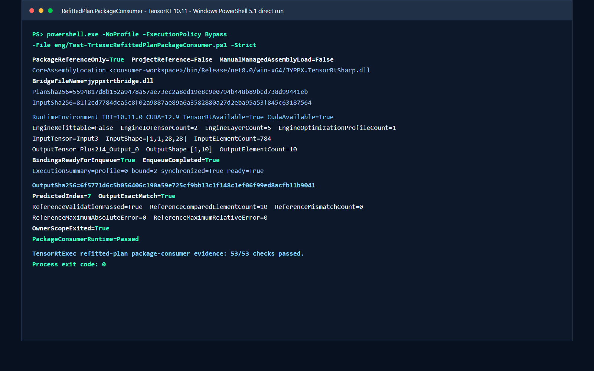

# 使用 TensorRtSharp4.0 公开 NuGet 包加载 Refitted Plan 并完成 MNIST 推理

在源码树里完成一次 TensorRT 推理，只能证明当前项目引用和开发探测路径可用。真正准备给使用者安装时，还要验证一个仓库外项目能否只通过 `PackageReference` 恢复 managed API 与 bridge-only 包，并使用用户自行安装的 TensorRT/CUDA 加载 Engine、绑定显存、执行 enqueue 和读回结果。

本文使用 TensorRtSharp4.0 的 `tests/fixtures/package-consumers/RefittedPlan.PackageConsumer`，运行一个由 TensorRT MNIST ONNX 生成并持久化的 full-weight refitted plan。验证器会创建隔离项目、关闭 nuget.org、清除源码开发探测变量、执行数字 7 推理、逐元素比较 10 个输出，并在结束后删除消费者工作区。

## 目标读者

- 准备从项目源码切换到 NuGet `PackageReference` 的 .NET 开发者。
- 需要部署 stripped/refitted TensorRT Engine 的推理工程师。
- 希望检查 managed 包、bridge-only 包和本机 NVIDIA 运行库边界的维护者。

## 本文使用的项目与库

| 组件 | 本文中的职责 |
| --- | --- |
| TensorRtSharp4.0 | 提供 managed API、bridge-only 打包脚本、证据验证器和示例。 |
| `tests/fixtures/package-consumers/RefittedPlan.PackageConsumer` | 仓库外消费者的 `Program.cs` 与项目模板。 |
| `applications/TensorRtExec` | 从 ONNX 构建 stripped plan、refit 权重并持久化 full-weight plan。 |
| `JYPPX.TensorRtSharp` | 管理 Runtime、Engine、ExecutionContext 和推理绑定。 |
| `JYPPX.CudaSharp` | 管理 CUDA stream 与 GPU buffer 生命周期。 |
| NVIDIA TensorRT | 解析 ONNX、提交 refit 权重并执行 Engine。 |
| NVIDIA CUDA | 提供 GPU memory、stream 和 kernel runtime。 |

实测宿主为 Windows 11、NVIDIA GeForce RTX 3060 Laptop GPU、驱动 576.02、CUDA 12.9、TensorRT 10.11.0.33 和 .NET SDK 10.0.301。CUDA、cuDNN、TensorRT 与 NVRTC 均由用户自行安装，仓库和 NuGet 包不携带这些 NVIDIA 运行库。

## 模型获取与许可证

本文模型是 TensorRT 10.11 sample data 中的 `data/mnist/mnist.onnx`。该目录 README 将它归因于 [ONNX Model Zoo MNIST](https://github.com/onnx/models/tree/main/validated/vision/classification/mnist)，项目固定 revision 为 `TensorRT-10.11.0.33-sample-data`，按 NVIDIA TensorRT sample-data 条款使用。

项目没有单独获得模型和 `7.pgm` 输入图的公开再分发授权，因此两者都不提交到 GitHub。先从用户安装的 TensorRT SDK 复制 ONNX 到工作区外层模型目录：

```powershell
$RepoRoot = (Get-Location).Path
$WorkspaceRoot = Split-Path -Parent $RepoRoot
$ModelRoot = Join-Path $WorkspaceRoot 'models/OnnxToEngine/MNIST/nvidia-tensorrt-10.11'
$ModelPath = Join-Path $ModelRoot 'mnist.onnx'
$TensorRtData = Join-Path $env:JYPPX_TENSORRT_ROOT 'data/mnist'

New-Item -ItemType Directory -Force -Path $ModelRoot | Out-Null
Copy-Item -LiteralPath (Join-Path $TensorRtData 'mnist.onnx') -Destination $ModelPath -Force
Get-FileHash -LiteralPath $ModelPath -Algorithm SHA256
```

固定文件合同：

| 项目 | 值 |
| --- | --- |
| ONNX 长度 | 26,454 bytes |
| ONNX opset | 8 |
| ONNX SHA256 | `2f06e72de813a8635c9bc0397ac447a601bdbfa7df4bebc278723b958831c9bf` |
| ONNX 暂存位置 | `<workspace-root>/models/OnnxToEngine/MNIST/nvidia-tensorrt-10.11/mnist.onnx` |
| 输入图 | `<TensorRT-root>/data/mnist/7.pgm` |
| 输入图 SHA256 | `880e75f93fe00ab6f5c4e8ab00ff695c61e7e30bdf0d967ff8b34de1f5a94634` |
| 上传模型或输入图 | 否 |

## ONNX 转换与暂存

这个上游文件已经是 ONNX，所以**不再执行 PyTorch/TensorFlow 到 ONNX 的转换**。所谓“转换”只包含两件事：复制并核对上游 ONNX；再由 TensorRT 把 ONNX 构建为版本相关的 plan。不能把后者写成 ONNX 导出。

模型输入输出合同如下：

| 角色 | Tensor | 类型 | Shape |
| --- | --- | --- | --- |
| 输入 | `Input3` | `float32` | `[1,1,28,28]` |
| 输出 | `Plus214_Output_0` | `float32` | `[1,10]` |

PGM 预处理公式为 `1 - pixel / 255`。先用 `OnnxToEngine` 导出 784 个 float 的输入文件：

```powershell
$WorkRoot = Join-Path $WorkspaceRoot 'work/refitted-plan-package-consumer'
$InputTensor = Join-Path $WorkRoot 'digit-7-input-f32.bin'
New-Item -ItemType Directory -Force -Path $WorkRoot | Out-Null

dotnet .\applications\OnnxToEngine\bin\Release\net8.0\OnnxToEngine.dll `
  --mnist --tensor-rt-line 10 `
  --onnx $ModelPath `
  --mnistInput (Join-Path $TensorRtData '7.pgm') `
  --expectedDigit 7 --minimumConfidence 0.9 `
  --saveEngine (Join-Path $WorkRoot 'mnist-full.plan') `
  --exportReport (Join-Path $WorkRoot 'mnist-report.json') `
  --exportOutput (Join-Path $WorkRoot 'mnist-output.json') `
  --exportPreprocessedInput $InputTensor
```

输入 tensor 固定为 3,136 bytes，SHA256 为 `81f2cd7784dca5c8f02a9887ae89a6a3582880a27d2eba95a53f845c63187564`。

## 生成可部署的 Refitted Plan

`--stripWeights` 生成不含 refittable weights 的 plan；`--refitFromOnnx` 把 ONNX 权重提交到内存 Engine；`--saveRefittedEngine` 再用显式 serialization config 清除 `ExcludeWeights`，生成可以独立加载的 full-weight plan：

```powershell
$StrippedPlan = Join-Path $WorkRoot 'mnist-stripped.plan'
$RefittedPlan = Join-Path $WorkRoot 'mnist-refitted.plan'

dotnet .\applications\TensorRtExec\bin\Release\net8.0-windows\TensorRtExec.dll `
  --tensor-rt-line 10 `
  --onnx $ModelPath `
  --saveEngine $StrippedPlan `
  --stripWeights --refit `
  --refitFromOnnx $ModelPath `
  --saveRefittedEngine $RefittedPlan `
  --loadInputs "Input3:$InputTensor" `
  --iterations 1 --warmUp 0 --duration 0 `
  --exportOutput (Join-Path $WorkRoot 'refitted-output.json') `
  --exportReport (Join-Path $WorkRoot 'refitted-report.json')
```

持久化顺序不能省略：提交 refit、清除并回读 `ExcludeWeights`、序列化、释放原 Engine、重新反序列化、检查 metadata，最后才允许创建 ExecutionContext。本项目固定验证 plan 为 408,876 bytes，SHA256 为 `5594817d8b152a9478a57ae73ec2a8ed19e8c9e0794b448b89bcd738d99441eb`。

## 创建公开包消费项目

在仓库外创建项目，并从公开 NuGet 源引用 managed 包和匹配本机矩阵的 bridge-only 包：

~~~powershell
dotnet new console --framework net8.0
dotnet add package JYPPX.TensorRT.CSharp.API --version "4.0.0"
dotnet add package JYPPX.TensorRT.CSharp.API.Runtime.win-x64.trt10.11.cuda12.9.cudnn9.22.Bridge --version "4.0.0"
~~~

精确 `4.0.0` 固定正式版本，避免 NuGet 选择 API 不兼容的历史 `4.0.6170`。Bridge 包 ID 必须按目标机器环境替换，并且只包含项目自有 bridge。

### 发布前 local-feed 证据复核

第一版尚未发布公共包，所以这里只从当前源码生成本地 managed 包和 bridge-only 包。不要使用历史 `FullRuntime` 包，也不要把 CUDA、cuDNN 或 TensorRT DLL 打进 feed。

```powershell
$PackageVersion = '4.0.0-local'
$ManagedFeed = Join-Path $WorkspaceRoot 'local-feed/refitted-plan/managed'
New-Item -ItemType Directory -Force -Path $ManagedFeed | Out-Null

dotnet pack .\pack\JYPPX.TensorRT.CSharp.API\JYPPX.TensorRT.CSharp.API.csproj `
  -c Release -o $ManagedFeed `
  -p:JYPPXPackageVersion=$PackageVersion

pwsh -NoProfile -ExecutionPolicy Bypass `
  -File .\eng\Invoke-LocalSplitRuntimePackage.ps1 `
  -SourceRuntimeKey win-x64-trt10.11-cuda12.9-cudnn9.22 `
  -Version $PackageVersion `
  -SplitPackageRole bridge `
  -SkipManagedPack `
  -SkipConsumerValidation
```

验证器会把 `tests/fixtures/package-consumers/RefittedPlan.PackageConsumer` 复制到仓库外，只声明两个本地 source，并生成如下项目：

```xml
<PackageReference Include="JYPPX.TensorRT.CSharp.API" Version="4.0.0-local" />
<PackageReference Include="JYPPX.TensorRT.CSharp.API.Runtime.win-x64.trt10.11.cuda12.9.cudnn9.22.Bridge"
                  Version="4.0.0-local" />
```

项目中不能出现 `ProjectReference`、手工 DLL 引用、`Assembly.LoadFrom` 或源码目录探测。

## 编写程序入口

消费者使用公开 owner-safe wrapper。对象释放顺序由 `using` 保证，不暴露裸 `IntPtr`：

```csharp
using JYPPX.CudaSharp;
using JYPPX.TensorRtSharp;

using TensorRtLogger logger = new TensorRtLogger(TensorRtApiLine.TensorRt10);
using TensorRtRuntime runtime = new TensorRtRuntime(logger);
using TensorRtEngine engine = runtime.DeserializeFromFile(planPath);
using TensorRtExecutionContext context = engine.CreateExecutionContext();
using TensorRtInferenceBindings bindings =
    new TensorRtInferenceBindings(engine, context, profileIndex: 0);
using CudaStream stream = new CudaStream(CudaStreamCreationFlags.NonBlocking);
```

完整入口还会完成以下检查：

1. 校验 plan、input 和 reference SHA256。
2. 从 Engine metadata 读取唯一输入输出及 concrete shape。
3. 复制 784 个 float 到 `Input3`，为 10 个输出分配 device buffer。
4. `BindAll()` 后要求 `IsReadyForEnqueue=True`。
5. 同步 enqueue 并读取 `Plus214_Output_0`。
6. 同时要求 raw output SHA256 完全一致、10 个 reference 值在容差内、argmax 为 7。
7. 离开所有 owner scope 后才输出 `OwnerScopeExited=True`。

## 编译并运行

准备好本机 TensorRT/CUDA 后，从仓库根目录执行。参数省略时脚本使用仓库内固定 plan、输入和 reference；需要验证新生成文件时显式传入三个路径。

```powershell
$BridgeFeed = Join-Path $RepoRoot 'artifacts/runtime-split-nupkg/win-x64-trt10.11-cuda12.9-cudnn9.22'
$ConsumerWork = Join-Path $WorkspaceRoot 'work/refitted-plan-clean-consumer'

$PowerShellExe = if (Get-Command pwsh -ErrorAction SilentlyContinue) { 'pwsh' } else { 'powershell.exe' }

& $PowerShellExe -NoProfile -ExecutionPolicy Bypass `
  -File .\eng\Test-TrtexecRefittedPlanPackageConsumer.ps1 `
  -ManagedPackageDirectory $ManagedFeed `
  -BridgePackageDirectory $BridgeFeed `
  -OutputRoot $ConsumerWork `
  -SourcePlanPath $RefittedPlan `
  -SourceInputPath $InputTensor `
  -SourceReferencePath .\artifacts\real-case\onnx-to-engine-mnist-trt10-runtime\digit-7\mnist-trt10-7.reference.json `
  -Strict
```

脚本同时支持 PowerShell 7 和 Windows PowerShell 5.1。脚本内部依次执行 isolated restore、Release build、package inventory、runtime search path 配置、推理、native asset hash、path-free compact evidence、53 项严格校验和工作区清理。`JYPPX_NATIVE_BRIDGE_PATH` 与 `JYPPX_ENABLE_DEVELOPMENT_PROBING` 会在推理前清空，bridge 必须来自包的 `runtimes/<rid>/native` 资产。

本次实测使用 Windows PowerShell `5.1.26100.8875`，直接通过 `powershell.exe -NoProfile -ExecutionPolicy Bypass -File ... -Strict` 启动脚本，没有修改脚本源码或在内存中替换 API。

## 已验证结果

下面图片由 2026-08-05 本次 Windows PowerShell 5.1 直接运行的真实 TensorRT stdout 脱敏排版生成。截图命令行折叠了本地 feed、运行库和输出根目录参数，并把 `CoreAssemblyLocation` 的仓库外临时路径替换为 `<consumer-workspace>`；推理值、SHA256、通过状态和 53/53 校验结果均未修改。



关键结果：

| 检查项 | 实测值 |
| --- | --- |
| PackageReference only | `True` |
| ProjectReference / 手工程序集加载 | `False / False` |
| TensorRT / CUDA | `10.11.0 / 12.9` |
| Engine I/O / layer / profile | `2 / 5 / 1` |
| 输入 / 输出 | `Input3 [1,1,28,28]` / `Plus214_Output_0 [1,10]` |
| binding / enqueue | `True / True` |
| 输出 SHA256 | `6f5771d6c5b056406c190a59e725cf9bb13c1f148c1ef06f99ed8acfb11b9041` |
| 预测索引 | `7` |
| reference 比较 | `10` 值、mismatch `0`、最大绝对/相对误差 `0 / 0` |
| owner scope / 工作区清理 | `True / True` |
| 严格验证 | `53/53` |
| 进程退出码 | `0` |

本次使用的 managed 包为开发期版本 `4.0.0-refit-article.20260804`，SHA256 `9401f9cbd2c513ea5c3954e0b0895ed55e6151662e2d83488ab4b4ff58ca369f`；bridge-only 包 SHA256 为 `0a4cb23b0175abdde7ff7b6fe16c9094829d0b17304cc5822baf477064e9e032`。这两个包只用于本地验证，没有推送到 NuGet.org 或 GitHub Packages。

机器可读结果位于：

```text
samples/assets/tensorrtexec-refitted-plan-package-consumer-article-runtime-evidence.json
artifacts/interface-coverage/trtexec-refitted-plan-package-consumer-evidence.json
artifacts/interface-coverage/trtexec-refitted-plan-package-consumer-validation.json
```

## 常见失败与定位

- `Persisted plan SHA256 mismatch`：输入不是预期的 full-weight refitted plan，或文件已被覆盖。
- `Restore did not resolve both target packages`：本地 feed 缺包、版本不一致，或 restore 没有使用隔离 cache。
- `Bridge asset was not copied`：bridge-only 包 RID 或 `runtimes/<rid>/native` 布局错误。
- `Bindings are not ready`：Engine tensor、shape 或 buffer binding 不满足 enqueue 条件。
- `Output SHA256 mismatch`：权重、输入、TensorRT 版本或执行输出与固定回归基线不同，不能降级为成功。
- `workspaceRemovedAfterValidation=False`：仓库外消费者目录未完成精确清理，证据保持失败。
- 本机只有 Windows PowerShell 5.1 而没有 `pwsh`：直接使用 `powershell.exe -NoProfile -ExecutionPolicy Bypass -File ... -Strict`。若旧系统仍受 `MAX_PATH` 影响，将 `OutputRoot` 指向仓库外较短的非系统盘目录；脚本会在安全边界校验后清理该目录。

## 复查与边界

本次结果证明：当前源码构建的 managed 包和 bridge-only 包，可以在一个仓库外、无 `ProjectReference` 的本地 feed 消费者中，使用用户安装的 TensorRT 10.11/CUDA 12.9 加载 persisted refitted plan，完成 GPU enqueue、输出读回、结构化 reference 比较和 owner 清理。

它不证明以下事项：

- 包已从公共 NuGet 或 GitHub Packages 下载；
- 另一个操作系统、GPU、TensorRT/CUDA 组合也兼容；
- MNIST reference 已经过 Owner 审定为模型准确率 golden output；
- 模型或输入图允许公开再分发；
- 已完成 post-publish 验证、Release 发布或版本授权。

因此证据分类保持 `local-package-consumer-refitted-plan-runtime`，`packagesDownloadedFromPublicFeed=false`、`performsPublish=false`、`canPublishPublicly=false`、`canCloseReleaseIssue=false`。文章完整不等于项目已经发布。
