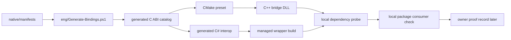
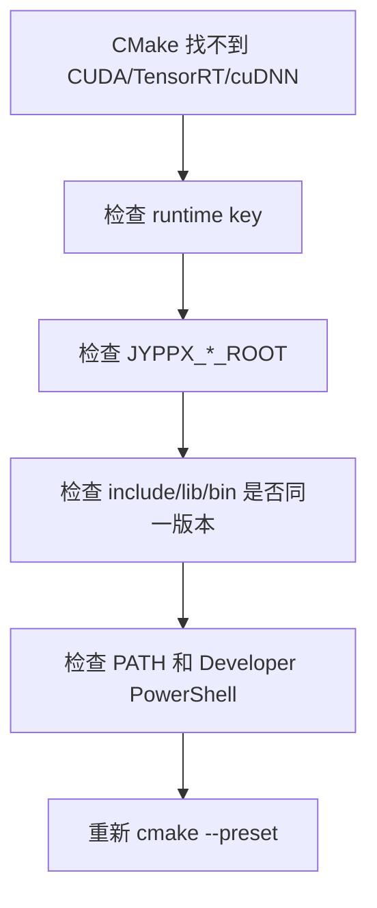

# TensorRtSharp C++ 原生桥接源码编译总教程

本文面向希望自己从源码编译 TensorRtSharp4.0 原生 C++ bridge 的用户。它把环境准备、CMake preset、绑定生成、包验证和发布边界放在同一条路径里，适合作为公众号、博客和仓库文档的“从源码构建”入口。

> 证据边界：本文是源码编译教程，不是 release proof、post-publish proof 或 package-consumer-runtime proof。local build、local feed、ProjectReference、direct `.nupkg`、dependency probe、build-only report 和截图都不能替代真实 Owner proof。

如果你只是想在业务项目里使用 TensorRtSharp，可以直接看 NuGet-compatible source 或 GitHub Release managed + bridge assets 的安装教程。只有在以下场景里，才建议从源码编译 C++ bridge：

- 你要确认某个 TensorRT/CUDA/cuDNN 版本组合能被本机 toolchain 编译。
- 你要修改 `native/manifests`、`native/src`、binding generator 或 ABI entrypoint。
- 你要给公司内部分发一套自签名、自审计的 bridge DLL。
- 你要排查 `jyppxtrtbridge.dll`、`nvinfer*.dll`、`nvonnxparser*.dll` 或 `cudart64_*.dll` 的加载问题。

## 构建全景图

下面这张图可以直接放进公众号或博客。它表达的是“源码构建证据链”，不是发布证明链：



读图时要记住两条边界：

- `A -> I` 是本地可复核工程链路，能证明源码、ABI、生成器和本地包布局没有明显断裂。
- `J` 必须由真实 owner 在干净外部 consumer、公开或候选包、真实 runtime smoke、日志 SHA256、host metadata 和 review 下补齐；本教程不会自动生成它。

## 你会编译出什么

TensorRtSharp4.0 的运行时由三层组成：

| 层级 | 产物 | 说明 |
| --- | --- | --- |
| C# managed API | `JYPPX.TensorRtSharp.dll`、`JYPPX.CudaSharp.dll`、`JYPPX.Shared.dll` | 面向 .NET 用户的高层 wrapper |
| C++ bridge | `jyppxtrtbridge.dll` 或对应平台共享库 | no-throw C ABI，隔离 TensorRT/CUDA C++ ABI 与托管 P/Invoke |
| NVIDIA runtime | TensorRT、CUDA、cuDNN DLL/shared objects | 始终由用户机器安装，不进入 managed/bridge nupkg |

源码编译主要验证第二层：C++ bridge 是否能按目标 TensorRT/CUDA/cuDNN 组合构建，并和托管绑定保持一致。

建议把本地工作目录分成四块，避免把大依赖和临时包散落到 C 盘：

```text
E:\TensorRtSharpAssets\
  nvidia\
    TensorRT-10.11\
    cuda-12.9\
    cudnn-9.22\
  build-logs\
  package-feed\
  proof-inputs\
```

仓库仍放在 `E:\GitSpace\TensorRT-CSharp-API-4.0\TensorRtSharp4.0`。模型、ONNX、engine、plan、nupkg、CUDA/TensorRT/cuDNN archive 和大日志不要放进 `C:\Users\<you>\Downloads` 或系统 Temp；这样后续 C 盘审计会很干净。

## 环境需求

Windows x64 开发机建议准备：

- Windows 10/11 x64。
- Visual Studio 2022，安装 “Desktop development with C++”。
- CMake 3.27 或更高版本。
- .NET SDK，版本以 `global.json` 为准。
- Git。
- NVIDIA CUDA Toolkit，与目标 runtime key 匹配。
- NVIDIA TensorRT SDK，与目标 TensorRT line 匹配。
- NVIDIA cuDNN，与目标 runtime key 匹配。

常见本机路径示例：

```powershell
$env:JYPPX_TENSORRT_ROOT = "E:\TensorRtSharpAssets\nvidia\TensorRT-10.11"
$env:JYPPX_CUDA_ROOT = "C:\Program Files\NVIDIA GPU Computing Toolkit\CUDA\v12.x"
$env:JYPPX_CUDNN_ROOT = "E:\TensorRtSharpAssets\nvidia\cudnn-windows-x86_64-9.x"
$env:JYPPX_ENABLE_DEVELOPMENT_PROBING = "1"
```

如果使用仓库内 `third_party\nvidia` 或 runtime manifest 解析路径，可以先不设置 override 变量，让脚本按默认规则探测。只有当你明确要指定某一套本机 SDK 时，再设置这些变量。

执行前先保存环境快照，后面写文章、发博客或提交 issue 时会用到：

```powershell
dotnet --info | Tee-Object -FilePath E:\TensorRtSharpAssets\build-logs\dotnet-info.txt
cmake --version | Tee-Object -FilePath E:\TensorRtSharpAssets\build-logs\cmake-version.txt
$PSVersionTable | Out-File E:\TensorRtSharpAssets\build-logs\powershell-version.txt
```

## 先确认 runtime key

源码编译前先明确目标组合。Windows 典型 key 包括：

- `win-x64-trt8.6-cuda11.8-cudnn8.9`
- `win-x64-trt8.6-cuda12.1-cudnn8.9`
- `win-x64-trt10.11-cuda12.9-cudnn9.22`
- `win-x64-trt11.0-cuda12.9-cudnn9.22`
- `win-x64-trt11.0-cuda13.2-cudnn9.22`

查看当前仓库建模的 runtime 包：

```powershell
Get-Content .\pack\runtime\runtime-packages.manifest.json
Get-Content .\CMakePresets.json
```

不要用“机器上有 CUDA 目录”代替 runtime key。TensorRT、CUDA、cuDNN、Visual Studio toolset 和 CMake preset 必须一起匹配。

可以用下面的表做快速判断：

| 你的目标 | 推荐路线 | 应检查 |
| --- | --- | --- |
| 只验证 C# wrapper 编译 | managed build | `dotnet build`、ProjectQuality tests |
| 修改 manifest 或 native source | source build | binding generator、CMake preset、ABI tests |
| 从 NuGet-compatible source 使用 | managed + `.Bridge` 包 | 公开 source、解析版本、包 hash + 本机 TensorRT/CUDA/cuDNN |
| 从 GitHub Release 使用 | managed + `.Bridge` 资产 | immutable URL、digest、同提交 provenance + 本机 TensorRT/CUDA/cuDNN |
| 准备正式发布 | owner release proof | clean consumer、runtime smoke、post-publish verification |

## 生成绑定

修改 manifest、native header、native source 或 generated interop 前后，都应重新生成绑定并验证输出：

```powershell
pwsh -NoProfile -ExecutionPolicy Bypass -File .\eng\Generate-Bindings.ps1
pwsh -NoProfile -ExecutionPolicy Bypass -File .\eng\Test-BindingGeneratorOutputs.ps1
pwsh -NoProfile -ExecutionPolicy Bypass -File .\eng\Export-InterfaceCoverageMatrix.ps1
```

如果你只改文档、sample README 或 C# wrapper，不一定需要重新生成绑定；但涉及 C ABI shape、manifest 参数、entrypoint 名称、version guard 时必须执行。

生成器成功时，重点看三类输出：

| 输出 | 作用 |
| --- | --- |
| `native/generated/bridge_api_catalog.g.h` | native bridge 的 API catalog，确认 entrypoint 和 feature line 被生成。 |
| `src/JYPPX.Shared/Generated/GeneratedEntryPointNames.g.cs` | 托管侧 entrypoint 名称常量，避免字符串漂移。 |
| `src/JYPPX.TensorRtSharp/Internal/Interop/Generated/NativeMethodsTensorRt.Generated.g.cs` | P/Invoke 签名，确认参数方向、整数宽度和 status code 约定。 |

如果 `Test-BindingGeneratorOutputs.ps1` 失败，不要手改 generated 文件。正确顺序是修 manifest 或 generator，再重新生成。手改 generated 文件会让下一次生成覆盖掉你的修复。

## 编译 C++ bridge

以 TensorRT 11 + CUDA 13.2 为例：

```powershell
cmake --preset win-x64-trt11-cuda13-release
cmake --build --preset win-x64-trt11-cuda13-release --parallel
```

常用 preset 还包括：

```powershell
cmake --preset win-x64-trt10-cuda12-release
cmake --build --preset win-x64-trt10-cuda12-release --parallel

cmake --preset win-x64-trt8-cuda12-release
cmake --build --preset win-x64-trt8-cuda12-release --parallel
```

实际 preset 名称以 `CMakePresets.json` 为准。构建输出通常位于：

```text
build-out/<preset>/bin/<Configuration>/
build-out/<preset>/lib/<Configuration>/
```

保存 configure/build 日志，便于定位环境问题：

```powershell
cmake --preset win-x64-trt11-cuda13-release `
  *> E:\TensorRtSharpAssets\build-logs\cmake-configure-trt11-cuda13.log

cmake --build --preset win-x64-trt11-cuda13-release --parallel `
  *> E:\TensorRtSharpAssets\build-logs\cmake-build-trt11-cuda13.log
```

构建结束后至少检查这些文件或等价 Linux `.so`：

```text
build-out/win-x64-trt11-cuda13-release/bin/Release/jyppxtrtbridge.dll
build-out/win-x64-trt11-cuda13-release/bin/Release/jyppxcudabridge.dll
native/generated/bridge_api_catalog.g.h
native/generated/bridge_entrypoints.g.h
```

Windows 上可用 `dumpbin /dependents` 检查依赖：

```powershell
dumpbin /dependents build-out\win-x64-trt11-cuda13-release\bin\Release\jyppxtrtbridge.dll
```

如果输出里出现 `nvinfer_10.dll`、`nvonnxparser_10.dll`、`nvinfer_plugin_10.dll`、`cudart64_12.dll`、`cudnn64_9.dll` 这类依赖，要确认它们来自同一个 runtime key，而不是 PATH 中另一套 NVIDIA SDK。

## 编译托管层与质量测试

C++ bridge 成功后，继续验证托管层：

```powershell
dotnet build .\TensorRtSharp.sln -c Debug --no-restore /p:UseSharedCompilation=false
dotnet build .\tests\JYPPX.ProjectQuality.Tests\JYPPX.ProjectQuality.Tests.csproj -c Debug --no-restore /p:UseSharedCompilation=false
dotnet test .\tests\JYPPX.ProjectQuality.Tests\JYPPX.ProjectQuality.Tests.csproj -c Debug --no-build
```

如果只是做某个小批次，可先跑 focused tests，但合入前仍建议跑完整质量门。

修改 native bridge 时推荐的 focused tests：

```powershell
dotnet test .\tests\JYPPX.ProjectQuality.Tests\JYPPX.ProjectQuality.Tests.csproj `
  -c Debug --no-build `
  --filter "FullyQualifiedName~TensorRtNativeAbiSurfaceParityTests|FullyQualifiedName~PublicApiHandleExposureAuditTests|FullyQualifiedName~NativeVendorBoundaryGuardTests|FullyQualifiedName~NativeBridgePathResolverTests"
```

如果只是扩写本文或相关宣传文章，至少跑：

```powershell
dotnet test .\tests\JYPPX.ProjectQuality.Tests\JYPPX.ProjectQuality.Tests.csproj `
  -c Debug --no-build `
  --filter "FullyQualifiedName~TechnicalArticleRoadmapTests|FullyQualifiedName~PublishingPublicArticleTests|FullyQualifiedName~SourceBuildCmakeWindowsGuideTests"
```

## 本地打包与消费验证

源码编译不是发布。要验证本地包消费路径，可以先生成 managed 包：

```powershell
dotnet pack .\pack\JYPPX.TensorRT.CSharp.API\JYPPX.TensorRT.CSharp.API.csproj `
  -c Debug `
  -o .\artifacts\managed `
  -p:JYPPXPackageVersion=4.0.0 `
  /p:UseSharedCompilation=false
```

然后运行 bridge package consumer：

```powershell
pwsh -NoProfile -ExecutionPolicy Bypass -File .\eng\Test-BridgePackageConsumer.ps1
```

这个验证证明 package layout、managed API surface、bridge asset copy 和 dependency diagnostics 可用；它默认仍是 `compile-surface-proof` 或 bridge-only consumer proof，不是 clean public package runtime proof。

本地验证报告里建议保留这些字段：

```text
PackageId
PackageVersion
RuntimePackageKey
BridgeAssetPresent
NativeAssetsCopied
UsesProjectReference
UsesLocalFeed
UsesDirectNupkg
DependencyProbeOnly
RuntimeSmokeAttempted
PackageConsumerRuntimeProof
BlockedReason
```

只要 `UsesProjectReference=true`、`UsesLocalFeed=true` 或 `UsesDirectNupkg=true`，这条记录就不能写成 clean public package runtime proof。

## 两个公开通道如何衔接

源码编译完成后，可以通过两个通道交付相同的 managed + bridge-only 内容：

| 路线 | 包含内容 | 适合用户 | 边界 |
| --- | --- | --- | --- |
| GitHub Release assets | managed `.nupkg`、匹配 `.Bridge` `.nupkg`、源码归档 | 希望按 tag 固定下载资产的用户 | Release 不是 NuGet feed；需验证 URL/digest/nuspec commit 后进入隔离 restore staging |
| NuGet-compatible source | managed 与匹配 `.Bridge` 包 | 希望使用标准 `PackageReference` 的用户 | 需记录公开 source、解析版本与下载 hash |

具体策略见 `docs/articles/zh-cn/nuget-github-dual-package-strategy.md` 和 `docs/articles/zh-cn/tensorrtsharp-nuget-runtime-package-guide.md`。

### NuGet-compatible source

NuGet managed + bridge-only 包适合常规 .NET 消费：

```xml
<PackageReference Include="JYPPX.TensorRT.CSharp.API" Version="4.0.0" />
<PackageReference Include="JYPPX.TensorRT.CSharp.API.Runtime.win-x64.trt10.11.cuda12.9.cudnn9.22.Bridge" Version="4.0.0" />
```

用户自己安装 TensorRT、CUDA 和 cuDNN，并通过 PATH、应用目录或 `NativeBridgePathResolver` 可发现路径提供 NVIDIA runtime。这个路线包体小，适合 NuGet.org；缺点是用户必须自己处理 NVIDIA SDK 版本。

### GitHub Release assets

GitHub Release 可以固定 managed、bridge 与源码资产：

```text
JYPPX.TensorRT.CSharp.API.4.0.x.nupkg
JYPPX.TensorRT.CSharp.API.Runtime.win-x64.trt10.11.cuda12.9.cudnn9.22.Bridge.4.0.x.nupkg
TensorRT-CSharp-API-4.0.x-source.zip
```

这条路线不得包含 TensorRT、CUDA、cuDNN 或 NVRTC runtime assets。managed 与 bridge nuspec 必须来自同一源码提交，还要记录 hash、下载 URL、rollback plan 和 post-publish verification。不能因为 Release 中存在资产，就跳过 clean consumer proof。

## 常见错误

### 找不到 TensorRT / CUDA / cuDNN

先确认路径变量和 SDK 版本：

```powershell
$env:JYPPX_TENSORRT_ROOT
$env:JYPPX_CUDA_ROOT
$env:JYPPX_CUDNN_ROOT
```

再确认 runtime key 对应的 SDK 是否真的存在。不要混用 TensorRT 8 的 lib 与 TensorRT 11 的 headers。

建议按这个顺序排查：



### CMake configure 通过但 build 失败

通常是 include/lib 组合不一致、Visual Studio C++ workload 缺失、CUDA toolkit 版本不匹配，或 preset 指向了错误 runtime line。先用一个明确 preset 复现，再检查 `CMakePresets.json` 和 `pack/runtime/runtime-packages.manifest.json`。

常见日志关键词：

| 关键词 | 可能原因 | 下一步 |
| --- | --- | --- |
| `NvInfer.h not found` | TensorRT include root 不对 | 检查 `JYPPX_TENSORRT_ROOT` 和 preset |
| `nvonnxparser.lib not found` | TensorRT lib/bin 不完整或版本线不匹配 | 换同一 SDK 的 lib/bin |
| `cudart64_*.dll not found` | CUDA runtime 不在 PATH | 检查 CUDA Toolkit bin |
| `cudnn64_*.dll not found` | cuDNN bin 不在 PATH 或 major 不匹配 | 检查 cuDNN 8/9 |
| `CUDA error 35` | driver/runtime mismatch | 更新驱动或换低版本 CUDA runtime key |

### 托管测试通过但 native 运行失败

托管 build/test 只能证明 C# 编译和质量门。native runtime 还需要 bridge DLL、NVIDIA DLL、PATH/probing、GPU driver 与 runtime 兼容。`blocked-by-cuda-driver` 是环境兼容阻塞，不是 API 完成证明。

这类问题优先收集：

```text
dotnet --info
cmake configure/build log
dumpbin /dependents output
NativeBridgePathResolver candidate paths
dependency probe stdout/stderr
GPU / driver / CUDA runtime version
TensorRT / cuDNN version
```

### 想把本地包当作发布证明

不可以。local feed、direct `.nupkg`、ProjectReference、build-only report、dependency probe、GUI screenshot 和 readonly diagnostics 都不是 public release proof。public proof 必须来自真实公开包源、仓库外 clean consumer、runtime smoke、hash、stdout/stderr、host metadata 和 Owner review。

## 推荐阅读顺序

1. `docs/articles/zh-cn/source-build-windows-cpp-bridge.md`
2. `docs/articles/zh-cn/source-build-cmake-presets-and-bindings.md`
3. `docs/articles/zh-cn/tensorrtsharp-source-build-cpp-guide.md`
4. `docs/articles/zh-cn/nuget-github-dual-package-strategy.md`
5. `docs/articles/zh-cn/tensorrtsharp-nuget-runtime-package-guide.md`
6. `docs/articles/zh-cn/runtime-package-installation-deep-dive.md`

这条路径适合写成一组连续技术文章：先让用户理解为什么需要 C++ bridge，再让用户按 preset 编译，最后解释 GitHub Release 与 NuGet-compatible source 的获取差异。

## 配图建议

发布到公众号或博客时，建议至少配四张图：

1. 源码构建全景图：本文的 Mermaid flowchart，可导出为 PNG。
2. CMake preset 与 runtime key 对照图：展示 TRT8/TRT10/TRT11、CUDA 11/12/13、cuDNN 8/9。
3. 终端截图：`Generate-Bindings.ps1`、`cmake --preset`、`cmake --build`、`dotnet build` 连续通过。
4. proof ladder：local source build -> local package consumer -> clean external consumer -> public package -> post-publish verification。

截图里不要出现私有 license key、内网包源 token、GitHub token 或用户真实下载 URL。大文件下载路径建议统一指向 E 盘工作区。

## 下一步

如果你是普通用户，下一步是选择 NuGet-compatible source 或 GitHub Release managed + bridge assets，并准备一个最小 `OnnxToEngine` 或 `YoloVision --preflight` 命令。

如果你是维护者，下一步是把本地 C++ bridge 构建日志、binding generator 日志和 focused tests 写入阶段 diary；若修改了 ABI 或 deferred uplift，还要同步 native manifest、C# wrapper、smoke、ProjectQuality tests 和 proof boundary 文档。

如果你是 release owner，下一步不是直接发布，而是补齐 clean external consumer、runtime smoke、真实模型样例、包 SHA256、host metadata、owner review 和 post-publish verification。只有这些证据齐全，才能把本地源码构建结果推进到公开发布闭环。
